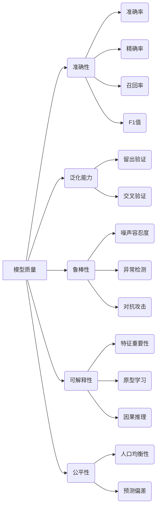

# 模型质量评估：指标体系与自动化

## 1. 背景介绍
### 1.1 模型质量评估的重要性
随着人工智能和机器学习技术的快速发展,越来越多的企业和组织开始将机器学习模型应用到实际业务场景中。然而,训练出一个性能优异的模型只是第一步,如何评估和保证模型的质量,进而为业务带来真正的价值,是一个更加关键和具有挑战性的问题。模型质量评估在整个机器学习生命周期中扮演着至关重要的角色。
### 1.2 模型质量评估面临的挑战
尽管模型质量评估如此重要,但在实践中却面临着诸多挑战:
1. 评估维度多样:模型质量是一个多维度的概念,涉及准确性、鲁棒性、可解释性、公平性等多个方面,难以用单一指标衡量。
2. 评估数据不足:离线评估常常受限于标注数据的数量和质量,而上线后的在线评估又难以获得及时反馈。
3. 评估效率低下:人工评估耗时耗力,且难以规模化;而自动化的评估方法覆盖面不足,缺乏统一的工具和平台支持。
### 1.3 本文的主要内容
本文将围绕模型质量评估的核心问题展开讨论,主要内容包括:
1. 模型质量的核心概念和内在联系
2. 模型评估的关键指标体系
3. 自动化评估的核心算法原理和实现步骤
4. 模型评估的数学理论基础和公式推导
5. 自动化评估工具和平台的代码实践
6. 模型评估在实际应用场景中的案例分析
7. 业界主流的评估工具和学习资源推荐
8. 模型评估未来的发展趋势和面临的挑战
9. 常见问题解答和专家洞见分享

## 2. 核心概念与联系
### 2.1 模型质量的定义与内涵
模型质量是指机器学习模型在满足特定任务需求的同时,所具备的一系列可衡量的品质属性,如准确性、泛化能力、鲁棒性、可解释性、公平性等。它反映了模型对真实业务问题的求解能力,是模型能否产生商业价值的决定性因素。
### 2.2 影响模型质量的关键因素
- 数据质量:数据是模型的原材料,数据的质量直接决定了模型的上限。数据质量评估需要考虑数据量、标注质量、类别/特征分布等因素。
- 算法选择:不同的算法在不同任务上的性能差异较大,选择合适的算法是提升模型性能的关键。
- 超参数调优:超参数对模型性能有显著影响,寻找最优超参数组合是模型调优的重点。
- 模型复杂度:模型复杂度需要在拟合能力和泛化能力间权衡,太简单的模型欠拟合,太复杂的模型又容易过拟合。
### 2.3 模型质量评估的主要维度
- 准确性:模型预测结果与真实标签的吻合程度,通常用准确率、精确率、召回率、F1等指标衡量。
- 泛化能力:模型在新数据上的预测效果,反映了模型的外推能力,通过留出验证、交叉验证等方法评估。
- 鲁棒性:模型面对噪声、异常、攻击等扰动时的稳定性,鲁棒性强的模型对扰动有较强的容忍度。
- 可解释性:人类对模型决策逻辑的可理解程度,可通过特征重要性、类别原型、因果关系等方式来解释模型。
- 公平性:模型对不同人群是否存在偏见和歧视,需评估模型在各敏感属性上的预测性能差异。

## 3. 核心算法原理具体操作步骤
本章节重点介绍几种常用的模型评估算法的原理和操作步骤。
### 3.1 留出验证(Hold-out Validation)
留出验证是最基础的模型评估方法,具体步骤如下:
1. 将原始数据集按一定比例(如7:3)划分为训练集和测试集,保证测试集数据不参与模型训练。
2. 用训练集数据训练模型,用测试集数据评估模型性能。
3. 为减少数据划分的随机性,可重复多次实验取平均值。
### 3.2 交叉验证(Cross Validation,CV)
交叉验证通过多次不同的数据划分来评估模型,减少了评估结果的波动性,具体步骤如下:
1. 将数据集等分为k份(如k=5),每次选其中1份作为测试集,其余k-1份作为训练集。
2. 训练k个模型,在对应的测试集上评估性能。
3. 对k次实验结果取平均,得到模型的泛化性能估计。
4. 若计算资源充足,可使用留一法(Leave-one-out),即k等于样本数。
### 3.3 Bootstrap抽样
Bootstrap抽样通过自助采样来构造不同的训练集和测试集,评估模型性能分布,具体步骤如下:
1. 从原始数据集中重复采样N次得到训练集(每次采样可重复选择同一样本),N等于原始数据集大小。
2. 未在训练集中出现的样本自动进入测试集。
3. 训练模型并在测试集上评估性能。
4. 重复以上三步M次(如M=100),得到M个性能估计值。
5. 对M个估计值计算均值和置信区间,刻画性能分布。
### 3.4 McNemar检验
McNemar检验用于比较两个模型的性能差异是否显著,适用于二分类任务,具体步骤如下:
1. 对测试集中的每个样本,比较两个模型A和B的预测结果。
2. 统计两个模型预测结果不一致的样本数:b(A对B错)和c(B对A错)。
3. 计算统计量:$\chi^2=\frac{(b-c)^2}{b+c}$
4. 查表得到p值,若p值小于显著性水平(如0.05),则认为两模型性能有显著差异。
### 3.5 多模型比较
若要比较多个模型的性能,可采用Friedman检验和Nemenyi后续检验,具体步骤如下:
1. 将k个模型在n个数据集上进行评估,得到k*n的性能矩阵。
2. 对每个数据集上的k个性能值编秩,得到k*n的秩矩阵。
3. 计算每个模型的平均秩,构造Friedman统计量:
$$\chi_F^2=\frac{12n}{k(k+1)}[\sum_{j=1}^k \bar{r}_j^2 - \frac{k(k+1)^2}{4}]$$
其中$\bar{r}_j$为模型j的平均秩。
4. 查表得到p值,若p值小于显著性水平,则认为至少有一对模型性能显著不同。
5. 进行Nemenyi后续检验,计算任意两模型平均秩差的临界值:
$$CD=q_{\alpha}\sqrt{\frac{k(k+1)}{6n}}$$
其中$q_{\alpha}$为Tukey分布的临界值。
6. 若两模型平均秩之差超过临界值,则认为这两个模型性能显著不同。

## 4. 数学模型和公式详细讲解举例说明
本章节详细讲解模型评估中常用的数学模型和公式,并给出具体的举例说明。
### 4.1 分类模型评估指标
#### 4.1.1 混淆矩阵
对于二分类问题,模型在测试集上的预测结果可用一个二维矩阵来表示,称为混淆矩阵(Confusion Matrix):
|      | 预测为正例  | 预测为负例 |
|:----:|:----------:|:---------:|
| 实际为正例 |     TP     |    FN     |
| 实际为负例 |     FP     |    TN     |

其中TP、FN、FP、TN分别代表真正例、假负例、假正例、真负例的数量。
#### 4.1.2 准确率
准确率(Accuracy)衡量了分类器预测正确的样本占总样本的比例,定义为:
$$Accuracy = \frac{TP+TN}{TP+FN+FP+TN}$$
#### 4.1.3 精确率和召回率
精确率(Precision)衡量了分类器预测为正例的样本中实际为正例的比例,定义为:
$$Precision=\frac{TP}{TP+FP}$$
召回率(Recall)衡量了实际为正例的样本中被分类器预测为正例的比例,定义为:
$$Recall=\frac{TP}{TP+FN}$$
#### 4.1.4 F1值
F1值是精确率和召回率的调和平均,兼顾了两者,定义为:
$$F1=\frac{2}{\frac{1}{Precision}+\frac{1}{Recall}}=\frac{2TP}{2TP+FP+FN}$$
F1值越高,说明分类器在精确率和召回率上的表现越平衡。
#### 4.1.5 ROC曲线和AUC
ROC曲线描绘了在不同阈值下,分类器的真正例率(TPR)和假正例率(FPR)的变化情况。
- 真正例率:$TPR=\frac{TP}{TP+FN}$,即召回率
- 假正例率:$FPR=\frac{FP}{FP+TN}$

AUC(Area Under Curve)是ROC曲线下的面积,取值在0到1之间。AUC越大,说明分类器的性能越好。
### 4.2 回归模型评估指标
#### 4.2.1 平均绝对误差
平均绝对误差(Mean Absolute Error,MAE)衡量了预测值与真实值之差的绝对值的平均大小,定义为:
$$MAE=\frac{1}{n}\sum_{i=1}^n |y_i-\hat{y}_i|$$
其中$y_i$为第$i$个样本的真实值,$\hat{y}_i$为预测值,n为样本数。
#### 4.2.2 均方误差
均方误差(Mean Squared Error,MSE)衡量了预测值与真实值之差的平方的均值,定义为:
$$MSE=\frac{1}{n}\sum_{i=1}^n (y_i-\hat{y}_i)^2$$
MSE相比MAE对离群点更敏感。
#### 4.2.3 均方根误差
均方根误差(Root Mean Squared Error,RMSE)是MSE的平方根,与真实值的量纲一致,定义为:
$$RMSE=\sqrt{\frac{1}{n}\sum_{i=1}^n (y_i-\hat{y}_i)^2}$$
#### 4.2.4 决定系数
决定系数(Coefficient of Determination,$R^2$)衡量了回归模型对数据的拟合程度,定义为:
$$R^2=1-\frac{\sum_{i=1}^n (y_i-\hat{y}_i)^2}{\sum_{i=1}^n (y_i-\bar{y})^2}$$
其中$\bar{y}$为真实值的均值。$R^2$的取值范围为$(-\infty,1]$,越接近1说明模型拟合得越好,越大于0说明模型不如简单的平均值预测。
### 4.3 统计假设检验
#### 4.3.1 McNemar检验
McNemar检验的原假设是两个模型性能没有显著差异,备择假设是两者性能有显著差异。根据3.4节中的统计量计算公式,构造如下的列联表:
|  模型B预测错误  | 模型B预测正确 |       |
|:-------------:|:-----------:|:-----:|
| 模型A预测错误   |      a      |   b   |
| 模型A预测正确   |      c      |   d   |

统计量为:$\