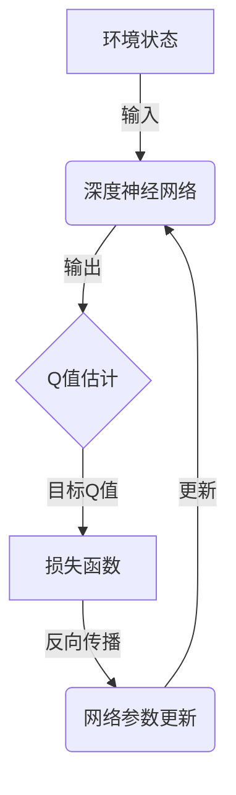

# 深度 Q-learning：在智慧农业中的应用

## 1.背景介绍

### 1.1 智慧农业的兴起

随着世界人口不断增长和气候变化的影响,确保粮食安全和可持续农业发展已成为全球性挑战。传统农业生产方式已难以满足未来需求,因此智慧农业应运而生。智慧农业是一种利用现代信息技术和智能系统优化农业生产的新型农业模式。它通过物联网、大数据分析、人工智能等技术的应用,实现对农业生产全过程的精细化管理和决策,从而提高农业生产效率、节约资源并减少环境影响。

### 1.2 智慧农业中的决策挑战

在智慧农业系统中,需要根据多种环境因素(如气候、土壤、作物生长状态等)做出适当的管理决策,例如确定最佳的施肥时机和用量、选择合适的农药防治方案等。这些决策问题往往存在高度的复杂性和不确定性,需要综合考虑多个变量之间的相互影响,传统的基于经验或简单规则的决策方法很难取得理想效果。

### 1.3 强化学习在智慧农业中的应用

强化学习作为机器学习的一个重要分支,具有从环境中学习并优化决策策略的能力,非常适合应用于智慧农业中的复杂决策问题。其中,Q-learning是强化学习中最成熟和广泛使用的算法之一。近年来,随着深度学习技术的发展,深度Q-learning(Deep Q-Learning)算法应运而生,将深度神经网络引入Q-learning,显著提高了处理高维数据和复杂决策问题的能力,为智慧农业决策系统带来了新的解决方案。

## 2.核心概念与联系  

### 2.1 Q-learning算法

Q-learning算法是一种基于价值迭代的无模型强化学习算法,它试图直接估计最优行为策略的行为价值函数(Action-Value Function)。行为价值函数Q(s,a)表示在状态s下执行动作a,之后能获得的期望累积奖励。Q-learning通过不断更新Q(s,a)的估计值,最终收敛到最优策略。

Q-learning算法的核心是基于Bellman方程的迭代更新:

$$Q(s_t,a_t) \leftarrow Q(s_t,a_t) + \alpha[r_t + \gamma\max_aQ(s_{t+1},a) - Q(s_t,a_t)]$$

其中:
- $s_t$是当前状态
- $a_t$是在$s_t$状态下执行的动作
- $r_t$是执行$a_t$动作后获得的即时奖励
- $\alpha$是学习率
- $\gamma$是折现因子
- $\max_aQ(s_{t+1},a)$是在下一状态$s_{t+1}$下可获得的最大行为价值

通过不断探索和利用环境反馈,Q-learning算法可以逐步更新Q值估计,最终收敛到最优策略。

### 2.2 深度Q-learning (DQN)

传统的Q-learning算法使用表格或简单的函数逼近器来估计Q值,在处理高维观测数据和连续动作空间时存在瓶颈。深度Q-learning(Deep Q-Network, DQN)算法通过使用深度神经网络来逼近Q函数,显著提高了处理复杂环境的能力。

DQN算法的核心思想是使用一个深度神经网络(通常是卷积神经网络)作为Q函数的逼近器,将环境状态作为输入,输出对应所有可能动作的Q值估计。在训练过程中,通过与Q-learning类似的迭代方式不断调整网络参数,使得Q值估计逐渐收敛。



DQN算法还引入了经验回放(Experience Replay)和目标网络(Target Network)等技术来提高训练稳定性和效率。

### 2.3 深度Q-learning在智慧农业中的应用

将深度Q-learning应用于智慧农业决策,可以将复杂的农业生产环境建模为马尔可夫决策过程(MDP),其中:

- 状态(State)包括气象条件、土壤数据、作物生长状况等环境观测
- 动作(Action)是可执行的农业管理操作,如施肥、施药、灌溉等
- 奖励(Reward)与管理目标相关,如最大化产量、最小化成本等

通过与环境交互并不断优化Q网络,深度Q-learning算法可以学习到最优的农业管理策略,从而实现精细化的智能决策。

## 3.核心算法原理具体操作步骤

以下是深度Q-learning算法在智慧农业决策中的具体操作步骤:

1. **建模农业生产环境为MDP**
   - 定义状态空间S:包括气象、土壤、作物等环境观测数据
   - 定义动作空间A:可执行的农业管理操作
   - 设计即时奖励函数R:根据管理目标量化奖励
   - 构建环境模拟器:模拟作物生长和环境变化

2. **初始化深度Q网络**
   - 选择合适的网络结构(如卷积网络)
   - 初始化网络参数

3. **构建经验回放池和目标网络**
   - 创建经验回放池D存储探索过程中的(s,a,r,s')转换
   - 创建目标网络,初始化参数与Q网络相同

4. **开始训练循环**
   - 对于每个训练episode:
     - 初始化环境状态s
     - 重复以下步骤直到终止:
       - 根据当前Q网络选择动作a(exploration/exploitation)
       - 在环境中执行a,观测下一状态s'和奖励r
       - 将(s,a,r,s')存入经验回放池D
       - 从D中采样批次数据进行训练:
         - 计算目标Q值y = r + γ * max(Q'(s', a'))
         - 计算Q(s,a)与y的均方误差损失
         - 反向传播,更新Q网络参数
         - 定期更新目标网络参数
       - s = s'
     - 记录episode结果(累积奖励等)

5. **评估和部署**
   - 在测试环境中评估最终策略性能
   - 将训练好的Q网络部署到实际智慧农业决策系统中

## 4.数学模型和公式详细讲解举例说明

### 4.1 马尔可夫决策过程(MDP)

马尔可夫决策过程(Markov Decision Process, MDP)是强化学习中最常用的形式化框架,用于描述一个完全可观测的、随机的序贯决策过程。一个MDP可以用元组(S, A, P, R, γ)来表示,其中:

- S是有限的状态集合
- A是有限的动作集合
- P是状态转移概率,P(s'|s,a)表示在状态s执行动作a后,转移到状态s'的概率
- R是奖励函数,R(s,a)表示在状态s执行动作a后获得的即时奖励
- γ∈[0,1]是折现因子,用于权衡未来奖励的重要性

在智慧农业场景中,我们可以将农业生产环境建模为一个MDP:

- 状态S包括气象条件、土壤数据、作物生长状况等观测数据
- 动作A是可执行的农业管理操作,如施肥、施药、灌溉等
- 状态转移概率P描述了作物生长和环境变化的动态过程
- 奖励函数R与管理目标相关,如最大化产量、最小化成本等

通过与MDP环境交互并学习最优策略π*,我们可以获得在任意状态下执行最佳动作的决策方案。

### 4.2 Q-learning算法

Q-learning算法旨在直接学习最优行为策略π*对应的行为价值函数(Action-Value Function)Q*(s,a),它表示在状态s下执行动作a,之后能获得的期望累积奖励。

Q-learning算法基于Bellman最优方程:

$$Q^*(s,a) = \mathbb{E}[r + \gamma\max_{a'}Q^*(s',a')|s,a]$$

其中:

- r是执行动作a后获得的即时奖励
- γ是折现因子
- s'是执行a后转移到的下一状态
- $\max_{a'}Q^*(s',a')$是在s'状态下可获得的最大行为价值

Q-learning通过不断更新Q(s,a)的估计值,使其逐渐收敛到Q*(s,a)。更新规则如下:

$$Q(s_t,a_t) \leftarrow Q(s_t,a_t) + \alpha[r_t + \gamma\max_aQ(s_{t+1},a) - Q(s_t,a_t)]$$

其中α是学习率,控制更新幅度。

通过不断探索和利用环境反馈,Q-learning算法可以逐步更新Q值估计,最终收敛到最优策略π*。

### 4.3 深度Q网络(DQN)

传统的Q-learning算法使用表格或简单的函数逼近器来估计Q值,在处理高维观测数据和连续动作空间时存在瓶颈。深度Q网络(Deep Q-Network, DQN)算法通过使用深度神经网络来逼近Q函数,显著提高了处理复杂环境的能力。

DQN算法的核心思想是使用一个深度神经网络(通常是卷积神经网络)作为Q函数的逼近器,将环境状态作为输入,输出对应所有可能动作的Q值估计。在训练过程中,通过与Q-learning类似的迭代方式不断调整网络参数,使得Q值估计逐渐收敛。

具体来说,DQN算法使用以下损失函数进行训练:

$$L_i(\theta_i) = \mathbb{E}_{(s,a,r,s')\sim U(D)}\left[(y_i - Q(s,a;\theta_i))^2\right]$$

其中:

- $(s,a,r,s')$是从经验回放池D中均匀采样的转换
- $y_i = r + \gamma\max_{a'}Q(s',a';\theta_i^-)$是目标Q值,使用了一个独立的目标网络参数$\theta_i^-$进行估计
- $Q(s,a;\theta_i)$是当前Q网络对(s,a)的Q值估计
- $\theta_i$是当前Q网络的参数

通过最小化损失函数,我们可以不断更新Q网络参数$\theta_i$,使得Q值估计逐渐收敛。同时,DQN算法还引入了经验回放和目标网络等技术来提高训练稳定性和效率。

以下是一个简单的DQN网络结构示例,用于处理图像状态输入:

```python
import torch.nn as nn

class DQN(nn.Module):
    def __init__(self, input_shape, n_actions):
        super(DQN, self).__init__()
        self.conv = nn.Sequential(
            nn.Conv2d(input_shape[0], 32, kernel_size=8, stride=4),
            nn.ReLU(),
            nn.Conv2d(32, 64, kernel_size=4, stride=2),
            nn.ReLU(),
            nn.Conv2d(64, 64, kernel_size=3, stride=1),
            nn.ReLU()
        )
        
        conv_out_size = self._get_conv_out(input_shape)
        self.fc = nn.Sequential(
            nn.Linear(conv_out_size, 512),
            nn.ReLU(),
            nn.Linear(512, n_actions)
        )
        
    def _get_conv_out(self, shape):
        o = self.conv(torch.zeros(1, *shape))
        return int(np.prod(o.size()))

    def forward(self, x):
        conv_out = self.conv(x).view(x.size()[0], -1)
        return self.fc(conv_out)
```

这个网络将图像状态输入经过三层卷积层和两层全连接层,最终输出对应所有动作的Q值估计。在训练过程中,我们可以使用上述损失函数和优化算法(如RMSProp或Adam)来更新网络参数。

## 5.项目实践：代码实例和详细解释说明

为了更好地理解深度Q-learning在智慧农业中的应用,我们将通过一个简化的农场环境模拟示例来演示算法的实现细节。

### 5.1 环境设置

我们将构建一个简化的农场环境模拟器,包括以下要素: