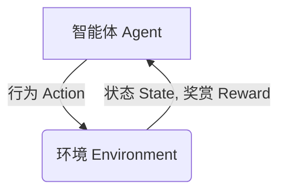

# 深度 Q-learning：在智慧农业中的应用

## 1.背景介绍

### 1.1 智慧农业的兴起

随着人口的不断增长和气候变化的影响,农业生产面临着前所未有的挑战。传统的农业生产方式已经难以满足日益增长的食品需求和可持续发展的要求。在这种背景下,智慧农业应运而生,它利用先进的信息技术、物联网、大数据分析等技术,实现农业生产的精准化、自动化和智能化,从而提高农业生产效率、降低资源消耗、减少环境污染。

### 1.2 智慧农业中的决策问题

在智慧农业中,需要根据农作物的生长状况、环境条件、资源供给等多种因素做出一系列决策,例如:

- 何时浇水、施肥?
- 何时采收?
- 如何调节温室环境?
- 如何优化资源配置?

这些决策往往涉及复杂的状态转移和长期回报,需要在不确定的环境中做出最优决策,传统的规则系统或机器学习方法难以很好地解决这一问题。

### 1.3 强化学习在智慧农业中的应用

强化学习是一种基于环境交互的机器学习方法,它可以通过试错和奖惩机制,自主学习如何在不确定环境中做出最优决策。深度 Q-learning 作为强化学习的一种重要算法,已经在很多领域取得了卓越的成绩,例如游戏AI、机器人控制等。

在智慧农业中,深度 Q-learning 可以被用于解决上述决策问题,通过建模农场环境,学习最优的农业生产策略,从而实现农业生产的自动化和智能化。

## 2.核心概念与联系

### 2.1 强化学习概念

强化学习是一种基于环境交互的机器学习范式,它由**智能体(Agent)**、**环境(Environment)**和**奖赏(Reward)**三个核心要素组成。

- 智能体:指能够感知环境并做出行为的决策实体。
- 环境:指智能体所处的外部世界,智能体通过与环境交互获取状态和奖赏信号。
- 奖赏:指环境对智能体行为的反馈,用于指导智能体学习过程。

强化学习的目标是通过与环境的持续交互,学习一个策略(Policy),使得在该策略指导下的行为序列能够最大化预期的累积奖赏。



### 2.2 Q-learning 算法

Q-learning 是强化学习中一种基于价值函数的算法,它试图学习一个行为价值函数 Q(s,a),表示在状态 s 下执行行为 a 后可获得的预期累积奖赏。通过不断更新 Q 值,智能体可以逐步学习到最优策略。

Q-learning 算法的核心更新规则为:

$$Q(s_t, a_t) \leftarrow Q(s_t, a_t) + \alpha \left( r_t + \gamma \max_{a} Q(s_{t+1}, a) - Q(s_t, a_t) \right)$$

其中:
- $\alpha$ 为学习率
- $\gamma$ 为折现因子
- $r_t$ 为时刻 t 获得的即时奖赏
- $\max_{a} Q(s_{t+1}, a)$ 为下一状态下可获得的最大 Q 值

### 2.3 深度 Q-learning (DQN)

传统的 Q-learning 算法需要维护一个巨大的 Q 表来存储所有状态-行为对应的 Q 值,这在状态空间和行为空间很大时会遇到维数灾难的问题。深度 Q-learning 通过使用深度神经网络来拟合 Q 函数,可以有效解决这一问题。

DQN 的核心思想是使用一个深度神经网络 $Q(s, a; \theta)$ 来近似 Q 函数,其中 $\theta$ 为网络参数。在训练过程中,通过最小化损失函数:

$$L(\theta) = \mathbb{E}_{(s, a, r, s')} \left[ \left( r + \gamma \max_{a'} Q(s', a'; \theta^-) - Q(s, a; \theta) \right)^2 \right]$$

来更新网络参数 $\theta$,其中 $\theta^-$ 为目标网络参数。

DQN 算法的流程如下:

```mermaid
graph TD
    A[初始化主网络 Q 和目标网络 Q']
    B[初始化经验回放池 D]
    C[对于每个episode]
    D[观察初始状态 s]
    E[执行 epsilon-greedy 策略选择行为 a]
    F[观察奖赏 r 和新状态 s']
    G[将 (s, a, r, s') 存入经验回放池 D]
    H[从 D 中采样小批量数据]
    I[计算损失函数 L]
    J[通过梯度下降优化主网络参数 theta]
    K[每隔一定步骤将主网络参数复制到目标网络]
    L[episode 结束]
    A --> B
    B --> C
    C --> D
    D --> E
    E --> F
    F --> G
    G --> H
    H --> I
    I --> J
    J --> K
    K --> C
    L --> C
```

通过上述流程,DQN 算法可以逐步学习到最优的 Q 函数,从而得到最优策略。

## 3.核心算法原理具体操作步骤

### 3.1 DQN 算法流程

DQN 算法的具体流程如下:

1. **初始化**
   - 初始化主网络 $Q(s, a; \theta)$ 和目标网络 $Q'(s, a; \theta^-)$,两个网络参数相同
   - 初始化经验回放池 $D$
   - 初始化 epsilon-greedy 策略的超参数 $\epsilon$

2. **训练循环**
   - 对于每个episode:
     - 初始化环境,获取初始状态 $s_0$
     - 对于每个时间步 $t$:
       - 根据 epsilon-greedy 策略选择行为 $a_t$
       - 执行行为 $a_t$,观察奖赏 $r_t$ 和新状态 $s_{t+1}$
       - 将 $(s_t, a_t, r_t, s_{t+1})$ 存入经验回放池 $D$
       - 从 $D$ 中采样一个小批量数据 $(s_j, a_j, r_j, s_{j+1})$
       - 计算目标值 $y_j = r_j + \gamma \max_{a'} Q'(s_{j+1}, a'; \theta^-)$
       - 计算损失函数 $L(\theta) = \frac{1}{N} \sum_{j} \left( y_j - Q(s_j, a_j; \theta) \right)^2$
       - 通过梯度下降优化主网络参数 $\theta$
       - 每隔一定步骤将主网络参数复制到目标网络 $\theta^- \leftarrow \theta$
     - episode 结束

3. **测试**
   - 使用训练好的主网络 $Q(s, a; \theta)$ 进行测试,根据贪婪策略选择行为

### 3.2 关键技术点

#### 3.2.1 经验回放池

在强化学习中,连续的状态-行为对之间存在强烈的相关性,直接使用这些相关数据进行训练会导致算法收敛缓慢、甚至无法收敛。为了解决这一问题,DQN 算法引入了经验回放池(Experience Replay)的技术。

经验回放池是一个固定大小的缓冲区,用于存储智能体与环境交互过程中产生的经验 $(s_t, a_t, r_t, s_{t+1})$。在训练时,我们从经验回放池中随机采样一个小批量数据进行训练,这样可以打破经验数据之间的相关性,提高数据的利用效率,加快算法的收敛速度。

#### 3.2.2 目标网络

另一个关键技术是引入目标网络(Target Network)。在 DQN 算法中,我们维护两个神经网络:主网络 $Q(s, a; \theta)$ 和目标网络 $Q'(s, a; \theta^-)$。主网络用于选择行为和更新参数,目标网络用于计算目标值 $y_j$。

目标网络的参数 $\theta^-$ 是主网络参数 $\theta$ 的复制,但是只在一定步骤后才会被更新。这种延迟更新的机制可以提高算法的稳定性,避免目标值的频繁变化导致训练过程发散。

#### 3.2.3 epsilon-greedy 策略

在训练过程中,我们需要在探索(exploration)和利用(exploitation)之间寻求平衡。探索是指尝试新的行为,以发现潜在的更优策略;利用是指根据当前已学习的知识选择最优行为。

DQN 算法采用 epsilon-greedy 策略来实现探索和利用的权衡。具体来说,在选择行为时,有 $\epsilon$ 的概率随机选择一个行为(探索),有 $1-\epsilon$ 的概率选择当前 Q 值最大的行为(利用)。随着训练的进行,我们会逐渐减小 $\epsilon$ 的值,从而增加利用的比例。

## 4.数学模型和公式详细讲解举例说明

在深度 Q-learning 算法中,我们使用一个深度神经网络 $Q(s, a; \theta)$ 来近似 Q 函数,其中 $\theta$ 为网络参数。该网络的输入是当前状态 $s$ 和可选行为 $a$,输出是对应的 Q 值 $Q(s, a)$。

为了训练这个神经网络,我们定义了一个损失函数:

$$L(\theta) = \mathbb{E}_{(s, a, r, s')} \left[ \left( r + \gamma \max_{a'} Q(s', a'; \theta^-) - Q(s, a; \theta) \right)^2 \right]$$

其中:

- $(s, a, r, s')$ 是从经验回放池中采样的一个小批量数据
- $r$ 是执行行为 $a$ 在状态 $s$ 时获得的即时奖赏
- $\gamma$ 是折现因子,用于权衡即时奖赏和未来奖赏的重要性
- $\max_{a'} Q(s', a'; \theta^-)$ 是在下一状态 $s'$ 下可获得的最大 Q 值,由目标网络 $Q'$ 计算得到
- $Q(s, a; \theta)$ 是当前网络对状态-行为对 $(s, a)$ 的 Q 值估计

这个损失函数的目标是使得网络输出的 Q 值 $Q(s, a; \theta)$ 尽可能接近目标值 $r + \gamma \max_{a'} Q(s', a'; \theta^-)$。通过最小化这个损失函数,我们可以逐步优化网络参数 $\theta$,使得网络学习到最优的 Q 函数近似。

为了更好地理解这个损失函数,我们可以用一个具体的例子来说明。假设我们有一个简单的网格世界环境,智能体的目标是从起点移动到终点。在每一步,智能体可以选择上下左右四个行为,每移动一步会获得-1的奖赏,到达终点会获得+100的奖赏。

现在假设智能体处于状态 $s$,执行行为 $a$ 后转移到状态 $s'$,获得即时奖赏 $r=-1$。根据 Q-learning 算法,我们需要更新 $Q(s, a)$ 的值,使其接近目标值 $r + \gamma \max_{a'} Q(s', a')$。

假设在状态 $s'$ 下,目标网络 $Q'$ 预测的最大 Q 值为 $\max_{a'} Q(s', a') = 90$,折现因子 $\gamma = 0.9$,那么目标值就是:

$$r + \gamma \max_{a'} Q(s', a') = -1 + 0.9 \times 90 = 80$$

如果当前网络对 $(s, a)$ 的 Q 值估计为 $Q(s, a; \theta) = 70$,那么损失函数的值就是:

$$L(\theta) = \left( 80 - 70 \right)^2 = 100$$

通过梯度下降,我们可以调整网络参数 $\theta$,使得 $Q(s, a; \theta)$ 逐渐接近 80,从而最小化损失函数。

通过上述过程,深度 Q-learning 算法可以逐步学习到最优的 Q