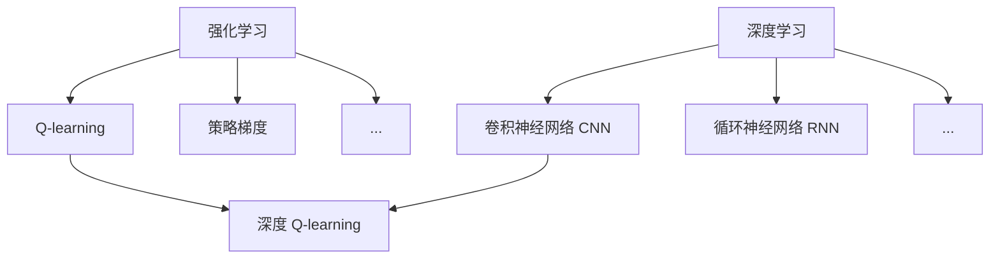

# 深度 Q-learning：在智能医疗诊断中的应用

## 1. 背景介绍

### 1.1 医疗诊断的挑战

医疗诊断是一个复杂且充满挑战的过程。医生需要综合考虑患者的症状、病史、体检结果以及各种医学影像和化验数据,才能做出准确的诊断。然而,面对日益增长的医疗数据和复杂多变的疾病谱,传统的诊断方法已经难以满足现代医疗的需求。

### 1.2 人工智能在医疗领域的应用

近年来,人工智能技术在医疗领域得到了广泛的应用。机器学习算法可以从海量的医疗数据中自动提取有价值的特征,并建立高效准确的诊断模型。其中,强化学习作为一种重要的机器学习范式,在智能医疗诊断中展现出了巨大的潜力。

### 1.3 深度 Q-learning 的优势

深度 Q-learning 是强化学习与深度学习相结合的产物,它继承了强化学习的决策能力和深度学习的特征提取能力。通过引入深度神经网络作为 Q 函数的近似,深度 Q-learning 可以处理高维度的状态空间和动作空间,从而适用于复杂的医疗诊断任务。

## 2. 核心概念与联系

### 2.1 强化学习

强化学习是一种通过与环境交互来学习最优决策的机器学习方法。在强化学习中,智能体(Agent)通过观察环境状态(State),采取行动(Action),并获得奖励(Reward)的反馈,不断调整自身的决策策略,以期获得最大的累积奖励。

### 2.2 Q-learning

Q-learning 是一种经典的强化学习算法,它通过学习状态-动作值函数 Q(s,a) 来评估在状态 s 下采取动作 a 的长期收益。Q 函数的更新遵循贝尔曼方程:

$$Q(s,a) \leftarrow Q(s,a) + \alpha [r + \gamma \max_{a'} Q(s',a') - Q(s,a)]$$

其中,$\alpha$是学习率,$\gamma$是折扣因子,$r$是即时奖励,$s'$是采取动作$a$后转移到的下一个状态。

### 2.3 深度学习

深度学习是一种基于多层神经网络的机器学习方法。通过逐层提取数据的高级特征,深度学习可以自动学习数据的内在表示,并建立复杂的非线性映射关系。常见的深度学习模型包括卷积神经网络(CNN)、循环神经网络(RNN)等。

### 2.4 深度 Q-learning

深度 Q-learning 将深度神经网络引入 Q-learning 算法,用于近似 Q 函数。网络的输入为状态 s,输出为在该状态下采取各个动作的 Q 值。通过最小化下面的损失函数来训练网络参数:

$$L(\theta) = \mathbb{E}_{s,a,r,s'}[(r + \gamma \max_{a'} Q(s',a';\theta^-) - Q(s,a;\theta))^2]$$

其中,$\theta$是网络参数,$\theta^-$是目标网络参数,用于计算 Q 值的目标。

### 2.5 核心概念之间的联系

下图展示了强化学习、Q-learning、深度学习以及深度 Q-learning 之间的关系:



深度 Q-learning 将强化学习中的 Q-learning 算法与深度学习中的神经网络模型结合起来,实现了在复杂环境中的自适应决策学习。

## 3. 核心算法原理与具体操作步骤

### 3.1 深度 Q-learning 的算法流程

深度 Q-learning 的核心思想是通过深度神经网络来近似 Q 函数,并使用经验回放(Experience Replay)和目标网络(Target Network)等技巧来提高算法的稳定性和效率。其基本流程如下:

1. 初始化 Q 网络 $Q(s,a;\theta)$ 和目标网络 $\hat{Q}(s,a;\theta^-)$,其中 $\theta^-=\theta$
2. 初始化经验回放缓冲区 $D$
3. for episode = 1 to M do
   1. 初始化环境状态 $s_1$
   2. for t = 1 to T do
      1. 根据 $\epsilon-greedy$ 策略选择动作 $a_t=\arg\max_a Q(s_t,a;\theta)$ 或随机动作
      2. 执行动作 $a_t$,观察奖励 $r_t$ 和下一状态 $s_{t+1}$
      3. 将转移样本 $(s_t,a_t,r_t,s_{t+1})$ 存入 $D$ 
      4. 从 $D$ 中随机采样一个批次的转移样本 $(s,a,r,s')$
      5. 计算 Q 值的目标: $y=r+\gamma \max_{a'} \hat{Q}(s',a';\theta^-)$
      6. 通过最小化损失函数 $L(\theta)=\mathbb{E}_{s,a,r,s'\sim D}[(y-Q(s,a;\theta))^2]$ 来更新 Q 网络参数 $\theta$
      7. 每隔 C 步,将 Q 网络参数 $\theta$ 复制给目标网络参数 $\theta^-$
   3. end for
4. end for

### 3.2 算法中的关键技术

- 经验回放(Experience Replay):将智能体与环境交互得到的转移样本存储到一个缓冲区中,之后从中随机采样来更新网络参数。这样可以打破样本之间的相关性,提高训练的稳定性。
- 目标网络(Target Network):使用一个独立的目标网络来计算 Q 值的目标,目标网络的参数每隔一定步数从 Q 网络复制一次。这样可以减少目标计算中的偏差,避免训练过程的振荡。
- $\epsilon-greedy$ 探索:在选择动作时,以 $\epsilon$ 的概率随机选择动作,以 $1-\epsilon$ 的概率选择 Q 值最大的动作。这样可以在探索新的可能性和利用已有知识之间取得平衡。

## 4. 数学模型和公式详细讲解举例说明

### 4.1 马尔可夫决策过程(MDP)

强化学习问题通常被建模为马尔可夫决策过程(Markov Decision Process, MDP)。一个 MDP 由以下元素组成:

- 状态空间 $\mathcal{S}$:环境可能处于的所有状态的集合。
- 动作空间 $\mathcal{A}$:智能体可以采取的所有动作的集合。
- 转移概率 $\mathcal{P}(s'|s,a)$:在状态 $s$ 下采取动作 $a$ 后转移到状态 $s'$ 的概率。
- 奖励函数 $\mathcal{R}(s,a)$:在状态 $s$ 下采取动作 $a$ 后获得的即时奖励。
- 折扣因子 $\gamma \in [0,1]$:用于衡量未来奖励的重要性。

MDP 的目标是寻找一个最优策略 $\pi^*$,使得从任意状态 $s$ 开始,采取该策略所获得的期望累积奖励最大化:

$$\pi^* = \arg\max_{\pi} \mathbb{E}[\sum_{t=0}^{\infty} \gamma^t r_t | s_0=s, \pi]$$

### 4.2 贝尔曼方程

Q 函数满足贝尔曼方程:

$$Q^{\pi}(s,a) = \mathbb{E}[r_t + \gamma Q^{\pi}(s_{t+1},\pi(s_{t+1})) | s_t=s, a_t=a]$$

其中,$\pi(s)$ 表示在状态 $s$ 下采取的动作。对于最优策略 $\pi^*$,其 Q 函数满足最优贝尔曼方程:

$$Q^*(s,a) = \mathbb{E}[r_t + \gamma \max_{a'} Q^*(s_{t+1},a') | s_t=s, a_t=a]$$

Q-learning 算法通过不断逼近最优 Q 函数 $Q^*$ 来找到最优策略。

### 4.3 Q 网络的结构设计

在深度 Q-learning 中,我们使用深度神经网络来近似 Q 函数。网络的输入为状态 $s$,输出为在该状态下采取各个动作的 Q 值 $Q(s,\cdot;\theta)$。常见的网络结构包括:

- 多层感知机(MLP):适用于低维度的状态表示。
- 卷积神经网络(CNN):适用于图像等网格型的状态表示。
- 循环神经网络(RNN):适用于序列型的状态表示。

网络的具体结构需要根据问题的特点来设计。例如,在使用 CNN 处理医学影像时,可以采用如下的网络结构:


通过卷积层和池化层逐层提取影像的高级特征,再经过全连接层得到最终的 Q 值输出。

## 5. 项目实践：代码实例和详细解释说明

下面是一个使用 PyTorch 实现深度 Q-learning 的简单示例,以经典的 CartPole 游戏为例:

```python
import gym
import math
import random
import numpy as np
import matplotlib.pyplot as plt
from collections import namedtuple, deque

import torch
import torch.nn as nn
import torch.optim as optim
import torch.nn.functional as F

# 超参数
BATCH_SIZE = 128
GAMMA = 0.99
EPS_START = 0.9
EPS_END = 0.05
EPS_DECAY = 200
TARGET_UPDATE = 10

# 定义转移样本的数据结构
Transition = namedtuple('Transition', ('state', 'action', 'next_state', 'reward'))

# 定义经验回放缓冲区
class ReplayMemory(object):
    def __init__(self, capacity):
        self.memory = deque([], maxlen=capacity)

    def push(self, *args):
        self.memory.append(Transition(*args))

    def sample(self, batch_size):
        return random.sample(self.memory, batch_size)

    def __len__(self):
        return len(self.memory)

# 定义 Q 网络
class DQN(nn.Module):
    def __init__(self, state_size, action_size):
        super(DQN, self).__init__()
        self.fc1 = nn.Linear(state_size, 64)
        self.fc2 = nn.Linear(64, 64)
        self.fc3 = nn.Linear(64, action_size)

    def forward(self, x):
        x = F.relu(self.fc1(x))
        x = F.relu(self.fc2(x))
        return self.fc3(x)

# 定义智能体
class Agent:
    def __init__(self, state_size, action_size):
        self.state_size = state_size
        self.action_size = action_size
        self.memory = ReplayMemory(10000)
        self.batch_size = BATCH_SIZE
        self.gamma = GAMMA
        self.eps_start = EPS_START
        self.eps_end = EPS_END
        self.eps_decay = EPS_DECAY
        self.target_update = TARGET_UPDATE
        self.policy_net = DQN(state_size, action_size)
        self.target_net = DQN(state_size, action_size)
        self.target_net.load_state_dict(self.policy_net.state_dict())
        self.optimizer = optim.Adam(self.policy_net.parameters())
        self.steps_done = 0

    def select_action(self, state):
        sample = random.random()
        eps_threshold = self.eps_end + (self.eps_start - self.eps_end) * \
            math.exp(-1. * self.steps_done / self.eps_decay)
        self.steps_done += 1
        if sample > eps_threshold:
            with torch.no_grad():
                return self.policy_net(state).max(1)[1].view(1, 1)
        else:
            return torch.tensor([[random.randrange(self.action_size)]], dtype=torch.long)

    def optimize_model(self):
        if len(self.memory) < self.batch_size:
            return
        transitions = self.memory.sample(self.batch_size)
        batch = Transition(*zip(*transitions))

        non_final_mask = torch.