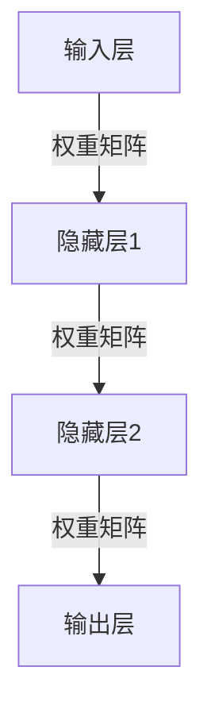
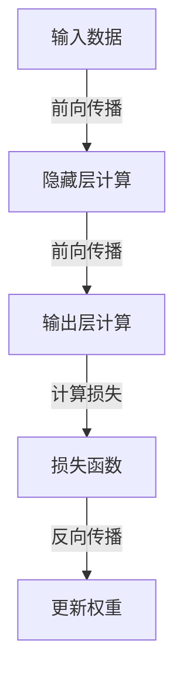
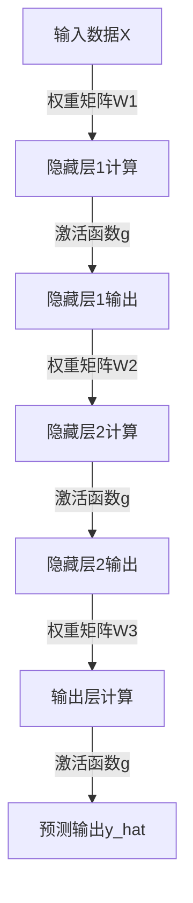
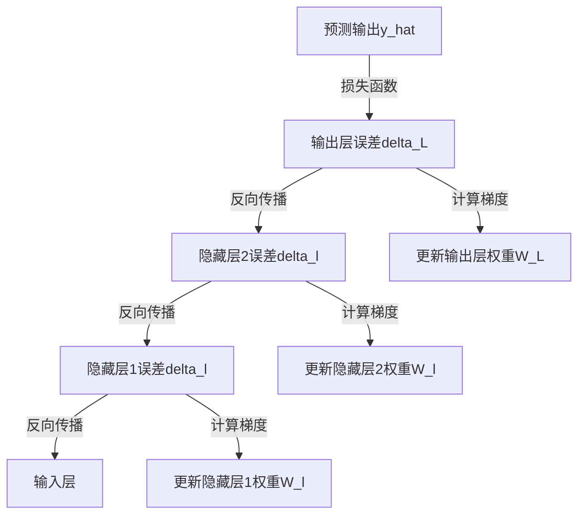

# 深度学习原理与代码实例讲解

## 1. 背景介绍

深度学习是机器学习的一个新兴热门领域,近年来在计算机视觉、自然语言处理、语音识别等众多领域取得了突破性进展。作为一种基于对数据进行表示学习的算法模型,深度学习的本质是通过构建神经网络,对输入数据进行层次化的特征提取和转换,并逐步对数据建模和模式识别。

传统的机器学习算法需要人工设计特征,而深度学习则可以自动学习数据的特征表示,从而更好地解决非线性和高维数据问题。深度学习模型通过对大量数据的训练,逐层捕捉输入数据的低级到高级的模式,从而完成最终的分类或预测任务。

### 1.1 发展历程

深度学习的理论基础可以追溯到20世纪80年代提出的神经网络模型,但由于当时的计算能力和训练数据的限制,神经网络并未取得实质性突破。直到近年来,大数据时代的到来、硬件计算能力的飞速提升以及一些新的训练技术和模型的出现,才使深度学习得以蓬勃发展。

### 1.2 主要模型

深度学习涵盖了多种神经网络模型,其中最著名的有:

- 卷积神经网络(CNN):主要应用于计算机视觉领域
- 循环神经网络(RNN):擅长处理序列数据,如自然语言、语音等
- 长短期记忆网络(LSTM):改进版的RNN,解决了长期依赖问题
- 门控循环单元(GRU):也是改进版的RNN,比LSTM结构更简单
- 生成对抗网络(GAN):可以生成逼真的图像、语音、视频等数据

## 2. 核心概念与联系

深度学习中有一些核心概念,理解这些概念对于掌握深度学习原理至关重要。

### 2.1 神经网络

神经网络是深度学习模型的基础结构,它由多层神经元组成,每层神经元接收上一层的输出作为输入,并通过激活函数进行非线性转换,最终输出预测或分类结果。



### 2.2 前向传播与反向传播

前向传播是神经网络对输入数据的计算过程,将输入数据通过各层神经元进行加权求和和非线性激活,最终得到输出结果。反向传播则是根据输出结果与真实标签的差异,计算误差,并沿着神经网络的反方向,更新每层神经元的权重和偏置参数,使模型逐步优化。



### 2.3 激活函数

激活函数引入了神经网络的非线性,使其能够拟合更加复杂的数据模式。常用的激活函数包括Sigmoid、Tanh、ReLU等。不同的激活函数具有不同的特性,如收敛速度、梯度消失或爆炸等,需要根据具体问题进行选择。

### 2.4 优化算法

为了加快模型训练的收敛速度,通常采用一些优化算法来更新神经网络的权重和偏置参数。常用的优化算法有随机梯度下降(SGD)、动量优化、RMSProp、Adam等。不同的优化算法在计算效率、收敛速度和鲁棒性方面有所差异。

### 2.5 正则化

为了防止深度神经网络过拟合训练数据,需要采用一些正则化技术,如L1/L2正则化、Dropout、BatchNormalization等。这些技术可以提高模型的泛化能力,使其在测试数据上也有良好的表现。

### 2.6 迁移学习

由于训练深度神经网络需要大量的数据和计算资源,因此在数据或计算资源有限的情况下,可以采用迁移学习的方法。将在大型数据集上预训练的模型作为初始模型,然后在目标任务的小型数据集上进行微调,可以显著提高模型的性能。

## 3. 核心算法原理具体操作步骤

在上一节中,我们介绍了深度学习的一些核心概念。接下来,我们将详细探讨深度学习算法的原理和具体操作步骤。

### 3.1 前向传播

前向传播是深度学习模型对输入数据进行计算的过程。具体步骤如下:

1. 输入层接收输入数据 $X$
2. 隐藏层计算:
   - 对上一层的输出 $a^{(l-1)}$ 和权重矩阵 $W^{(l)}$ 进行矩阵乘法: $z^{(l)} = W^{(l)}a^{(l-1)} + b^{(l)}$
   - 通过激活函数 $g$ 获得当前层的输出: $a^{(l)} = g(z^{(l)})$
3. 重复步骤2,直到输出层
4. 输出层给出最终的预测结果 $\hat{y}$



### 3.2 反向传播

反向传播是根据预测结果和真实标签的差异,计算误差,并更新神经网络权重的过程。具体步骤如下:

1. 计算输出层的误差: $\delta^{(L)} = \nabla_a C(y, \hat{y}) \odot g'(z^{(L)})$
2. 计算输出层权重的梯度: $\nabla_{W^{(L)}} C = \delta^{(L)}(a^{(L-1)})^T$
3. 计算输出层偏置的梯度: $\nabla_{b^{(L)}} C = \delta^{(L)}$
4. 反向传播误差至隐藏层: $\delta^{(l)} = (W^{(l+1)})^T \delta^{(l+1)} \odot g'(z^{(l)})$
5. 计算隐藏层权重和偏置的梯度: $\nabla_{W^{(l)}} C = \delta^{(l)}(a^{(l-1)})^T$, $\nabla_{b^{(l)}} C = \delta^{(l)}$
6. 重复步骤4和5,直到输入层
7. 使用优化算法(如SGD)更新权重和偏置: $W^{(l)} \leftarrow W^{(l)} - \alpha \nabla_{W^{(l)}} C$, $b^{(l)} \leftarrow b^{(l)} - \alpha \nabla_{b^{(l)}} C$



通过不断迭代前向传播和反向传播,深度学习模型可以逐步优化权重参数,使预测结果逐渐接近真实标签。

## 4. 数学模型和公式详细讲解举例说明

在上一节中,我们介绍了深度学习算法的原理和操作步骤。现在,我们将详细解释其中涉及的数学模型和公式。

### 4.1 损失函数

损失函数用于衡量模型预测结果与真实标签之间的差异,是反向传播的起点。常用的损失函数包括:

- 均方误差(MSE): $C(y, \hat{y}) = \frac{1}{2n} \sum_{i=1}^n (y_i - \hat{y}_i)^2$
- 交叉熵(Cross Entropy): $C(y, \hat{y}) = -\frac{1}{n} \sum_{i=1}^n [y_i \log(\hat{y}_i) + (1 - y_i) \log(1 - \hat{y}_i)]$

其中, $y$ 表示真实标签, $\hat{y}$ 表示模型预测结果, $n$ 表示样本数量。

### 4.2 激活函数

激活函数引入了神经网络的非线性,使其能够拟合更加复杂的数据模式。常用的激活函数及其导数如下:

- Sigmoid: $g(z) = \frac{1}{1 + e^{-z}}$, $g'(z) = g(z)(1 - g(z))$
- Tanh: $g(z) = \frac{e^z - e^{-z}}{e^z + e^{-z}}$, $g'(z) = 1 - g(z)^2$
- ReLU: $g(z) = \max(0, z)$, $g'(z) = \begin{cases}1, & \text{if } z > 0 \\ 0, & \text{if } z \leq 0\end{cases}$

### 4.3 反向传播公式

在反向传播过程中,我们需要计算每一层的误差项 $\delta^{(l)}$,以及权重和偏置的梯度。具体公式如下:

1. 输出层误差: $\delta^{(L)} = \nabla_a C(y, \hat{y}) \odot g'(z^{(L)})$
2. 输出层权重梯度: $\nabla_{W^{(L)}} C = \delta^{(L)}(a^{(L-1)})^T$
3. 输出层偏置梯度: $\nabla_{b^{(L)}} C = \delta^{(L)}$
4. 隐藏层误差: $\delta^{(l)} = (W^{(l+1)})^T \delta^{(l+1)} \odot g'(z^{(l)})$
5. 隐藏层权重梯度: $\nabla_{W^{(l)}} C = \delta^{(l)}(a^{(l-1)})^T$
6. 隐藏层偏置梯度: $\nabla_{b^{(l)}} C = \delta^{(l)}$

其中, $\odot$ 表示元素wise乘积, $g'(z)$ 表示激活函数的导数。

### 4.4 权重更新

在计算出每层的权重和偏置梯度后,我们需要使用优化算法来更新权重参数。常用的优化算法包括:

- 随机梯度下降(SGD): $W \leftarrow W - \alpha \nabla_W C$
- 动量优化: $v_t = \gamma v_{t-1} + \alpha \nabla_W C$, $W \leftarrow W - v_t$
- RMSProp: $s_t = \beta s_{t-1} + (1 - \beta)(\nabla_W C)^2$, $W \leftarrow W - \frac{\alpha}{\sqrt{s_t + \epsilon}} \nabla_W C$
- Adam: $m_t = \beta_1 m_{t-1} + (1 - \beta_1) \nabla_W C$, $v_t = \beta_2 v_{t-1} + (1 - \beta_2)(\nabla_W C)^2$, $W \leftarrow W - \frac{\alpha}{\sqrt{v_t + \epsilon}} \frac{m_t}{1 - \beta_1^t}$

其中, $\alpha$ 表示学习率, $\gamma$、$\beta$、$\beta_1$、$\beta_2$ 是相应算法的超参数。

通过不断迭代上述过程,神经网络可以逐步优化权重参数,使预测结果逐渐接近真实标签。

## 5. 项目实践: 代码实例和详细解释说明

为了更好地理解深度学习的原理和实现,我们将通过一个实际的代码示例来演示如何构建和训练一个简单的前馈神经网络。

在这个示例中,我们将使用Python和PyTorch框架,在MNIST手写数字识别数据集上训练一个三层神经网络模型。

### 5.1 导入所需库

```python
import torch