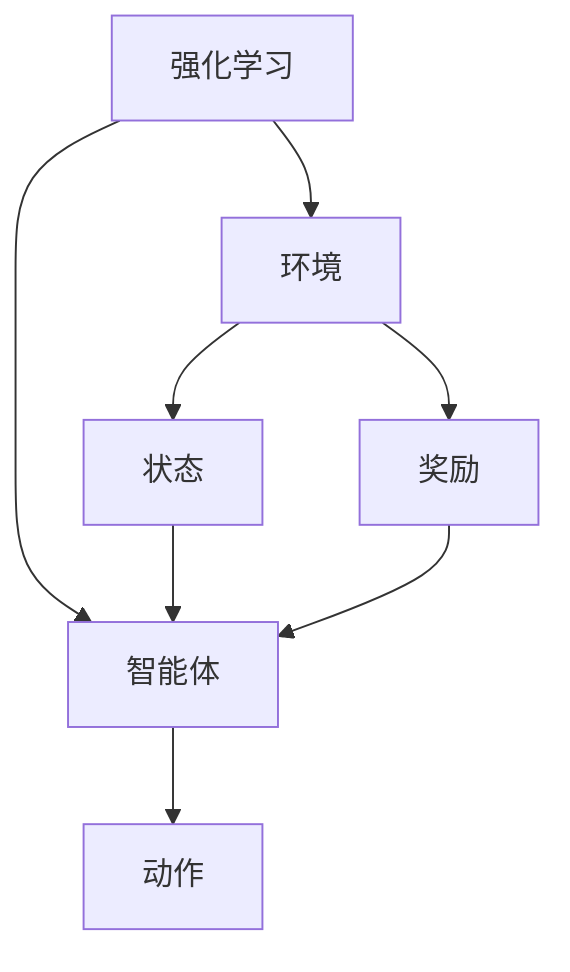

# 深度强化学习在游戏中的应用原理与代码实战案例讲解

## 1. 背景介绍

### 1.1 游戏与人工智能的渊源

游戏一直是人工智能研究的重要驱动力之一。从国际象棋、围棋到最新的电子游戏,游戏提供了一个理想的环境,让人工智能系统可以展示其决策、规划和学习能力。随着计算能力和算法的不断进步,人工智能在游戏领域取得了令人瞩目的成就。

### 1.2 强化学习的崛起

强化学习是机器学习的一个重要分支,它通过与环境的互动来学习如何执行特定任务。与监督学习不同,强化学习没有预先标注的数据集,智能体需要通过试错来探索环境,获取奖励信号,并根据这些信号调整其行为策略。强化学习在许多领域都有广泛的应用,例如机器人控制、自动驾驶和游戏等。

### 1.3 深度强化学习的兴起

随着深度学习技术的发展,深度强化学习应运而生。深度强化学习将深度神经网络与强化学习相结合,利用神经网络的强大功能来近似值函数或策略函数,从而解决传统强化学习算法在处理高维观测数据和连续动作空间时面临的挑战。深度强化学习在游戏领域取得了突破性的成就,例如 DeepMind 的 AlphaGo 战胜了世界顶尖的围棋手。

## 2. 核心概念与联系

深度强化学习的核心概念包括:

### 2.1 环境 (Environment)

环境是指智能体所处的外部世界,它定义了状态空间、动作空间和奖励函数。环境会根据智能体的动作转移到下一个状态,并提供相应的奖励信号。

### 2.2 智能体 (Agent)

智能体是指能够与环境交互并学习最优策略的决策实体。它根据当前状态选择合适的动作,并从环境中获取下一个状态和奖励信号,进而调整其策略。

### 2.3 状态 (State)

状态是对环境的一种数学表示,它描述了环境在某个时间点的情况。状态空间是所有可能状态的集合。

### 2.4 动作 (Action)

动作是智能体在某个状态下可以执行的操作。动作空间是所有可能动作的集合。

### 2.5 奖励 (Reward)

奖励是环境对智能体行为的评价,它是一个标量值,用于指导智能体朝着期望的方向优化其策略。

### 2.6 策略 (Policy)

策略是一个映射函数,它将状态映射到相应的动作,定义了智能体在每个状态下应该采取什么行动。

### 2.7 价值函数 (Value Function)

价值函数估计了在给定状态下执行某个策略所能获得的累积奖励。它为智能体提供了一种评估当前状态的方式,从而指导其选择最优动作。

### 2.8 深度神经网络 (Deep Neural Network)

深度神经网络是一种强大的机器学习模型,它可以从原始输入数据中自动提取特征,并对复杂的非线性函数进行建模。在深度强化学习中,神经网络通常用于近似价值函数或策略函数。

## 3. 核心算法原理具体操作步骤

深度强化学习算法的核心思想是利用深度神经网络来近似价值函数或策略函数,从而解决传统强化学习算法在处理高维观测数据和连续动作空间时面临的挑战。以下是一些常见的深度强化学习算法及其具体操作步骤:

### 3.1 深度Q网络 (Deep Q-Network, DQN)

DQN是深度强化学习领域的里程碑式算法,它使用深度神经网络来近似Q值函数,从而解决了传统Q学习在处理高维观测数据时的困难。DQN的具体操作步骤如下:

1. 初始化深度神经网络,用于近似Q值函数。
2. 初始化经验回放池 (Experience Replay Buffer),用于存储智能体与环境的交互数据。
3. 对于每个时间步:
    a. 从当前状态出发,使用 $\epsilon$-贪婪策略选择一个动作。
    b. 执行选择的动作,观察环境的反馈(下一个状态和奖励)。
    c. 将这个转移 (状态、动作、奖励、下一个状态) 存储到经验回放池中。
    d. 从经验回放池中随机采样一批数据,用于训练神经网络。
    e. 计算目标Q值,使用均方差损失函数优化神经网络的参数。
4. 重复步骤3,直到智能体达到期望的性能水平。

### 3.2 深度确定性策略梯度 (Deep Deterministic Policy Gradient, DDPG)

DDPG是一种用于连续动作空间的深度强化学习算法,它结合了深度Q网络和确定性策略梯度方法。DDPG的具体操作步骤如下:

1. 初始化两个深度神经网络:Actor网络用于近似策略函数,Critic网络用于近似Q值函数。
2. 初始化经验回放池。
3. 对于每个时间步:
    a. 从当前状态出发,使用Actor网络选择一个动作。
    b. 执行选择的动作,观察环境的反馈。
    c. 将这个转移存储到经验回放池中。
    d. 从经验回放池中随机采样一批数据。
    e. 使用采样数据更新Critic网络,最小化均方差损失函数。
    f. 使用更新后的Critic网络计算策略梯度,并用它来更新Actor网络。
4. 重复步骤3,直到智能体达到期望的性能水平。

### 3.3 异步优势Actor-Critic (Asynchronous Advantage Actor-Critic, A3C)

A3C是一种高效的深度强化学习算法,它可以在多个并行环境中进行训练,从而加快学习过程。A3C的具体操作步骤如下:

1. 初始化一个全局网络和多个工作线程,每个线程都有一个本地网络副本。
2. 对于每个工作线程:
    a. 从当前状态出发,使用本地网络选择一个动作。
    b. 执行选择的动作,观察环境的反馈。
    c. 计算优势函数 (Advantage Function),它表示执行当前动作相对于平均行为的优势。
    d. 使用优势函数和折扣累积奖励来更新本地网络。
    e. 定期将本地网络的参数同步到全局网络。
3. 重复步骤2,直到智能体达到期望的性能水平。

### 3.4 深度确定性策略梯度 (Deep Deterministic Policy Gradient, DDPG)

DDPG是一种用于连续动作空间的深度强化学习算法,它结合了深度Q网络和确定性策略梯度方法。DDPG的具体操作步骤如下:

1. 初始化两个深度神经网络:Actor网络用于近似策略函数,Critic网络用于近似Q值函数。
2. 初始化经验回放池。
3. 对于每个时间步:
    a. 从当前状态出发,使用Actor网络选择一个动作。
    b. 执行选择的动作,观察环境的反馈。
    c. 将这个转移存储到经验回放池中。
    d. 从经验回放池中随机采样一批数据。
    e. 使用采样数据更新Critic网络,最小化均方差损失函数。
    f. 使用更新后的Critic网络计算策略梯度,并用它来更新Actor网络。
4. 重复步骤3,直到智能体达到期望的性能水平。

## 4. 数学模型和公式详细讲解举例说明

在深度强化学习中,数学模型和公式扮演着重要的角色,它们为算法提供了理论基础和计算框架。以下是一些常见的数学模型和公式,以及它们在深度强化学习中的应用:

### 4.1 马尔可夫决策过程 (Markov Decision Process, MDP)

马尔可夫决策过程是强化学习的数学基础,它描述了智能体与环境之间的交互过程。MDP可以用一个元组 $(S, A, P, R, \gamma)$ 来表示,其中:

- $S$ 是状态空间
- $A$ 是动作空间
- $P(s'|s,a)$ 是状态转移概率,表示在状态 $s$ 下执行动作 $a$ 后转移到状态 $s'$ 的概率
- $R(s,a)$ 是奖励函数,表示在状态 $s$ 下执行动作 $a$ 所获得的即时奖励
- $\gamma \in [0,1)$ 是折扣因子,用于权衡即时奖励和未来奖励的重要性

在 MDP 中,智能体的目标是找到一个最优策略 $\pi^*(s)$,使得在任何状态 $s$ 下执行该策略所获得的累积折扣奖励最大化:

$$
V^*(s) = \max_\pi \mathbb{E}\left[\sum_{t=0}^\infty \gamma^t R(s_t, a_t) | s_0 = s, \pi\right]
$$

其中 $V^*(s)$ 是在状态 $s$ 下执行最优策略所获得的状态值函数。

### 4.2 Q值函数 (Q-Value Function)

Q值函数 $Q(s,a)$ 表示在状态 $s$ 下执行动作 $a$,然后遵循某个策略 $\pi$ 所获得的累积折扣奖励的期望值:

$$
Q(s,a) = \mathbb{E}_\pi\left[R(s,a) + \gamma \sum_{s'} P(s'|s,a) \max_{a'} Q(s',a')\right]
$$

Q值函数可以通过贝尔曼方程 (Bellman Equation) 进行迭代更新,直到收敛到最优值函数 $Q^*(s,a)$。在深度强化学习中,神经网络被用于近似 Q值函数。

### 4.3 策略梯度 (Policy Gradient)

策略梯度是一种直接优化策略函数的方法,它通过计算策略函数参数的梯度,并沿着梯度方向更新参数,从而最大化期望的累积折扣奖励。

策略梯度的目标是最大化目标函数 $J(\theta)$,其中 $\theta$ 是策略函数参数:

$$
J(\theta) = \mathbb{E}_{\pi_\theta}\left[\sum_{t=0}^\infty \gamma^t R(s_t, a_t)\right]
$$

通过应用链式法则,可以得到策略梯度:

$$
\nabla_\theta J(\theta) = \mathbb{E}_{\pi_\theta}\left[\sum_{t=0}^\infty \nabla_\theta \log \pi_\theta(a_t|s_t) Q^{\pi_\theta}(s_t, a_t)\right]
$$

在深度强化学习中,策略函数通常由神经网络来近似,梯度可以通过反向传播算法进行计算和优化。

### 4.4 优势函数 (Advantage Function)

优势函数 $A(s,a)$ 表示在状态 $s$ 下执行动作 $a$ 相对于执行平均行为所获得的额外奖励:

$$
A(s,a) = Q(s,a) - V(s)
$$

其中 $V(s)$ 是状态值函数,表示在状态 $s$ 下执行某个策略所获得的期望累积奖励。

优势函数在深度强化学习算法中扮演着重要的角色,例如在 A3C 算法中,它被用于更新策略网络和值网络的参数。

### 4.5 经验回放 (Experience Replay)

经验回放是一种在深度强化学习中常用的技术,它可以提高数据利用率,减少相关性,并稳定训练过程。

经验回放的基本思想是将智能体与环境的交互数据 (状态、动作、奖励、下一个状态) 存储在一个回放池中。在训练过程中,我们从回放池中随机采样一批数据,用于更新神经网络的参数。这种方式可以打破数据之间的相关性,提高训练的效率和稳定性。

### 4.6 探索与