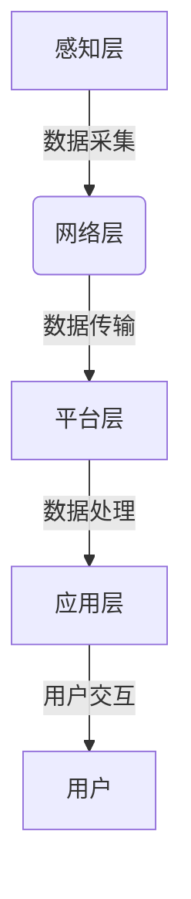
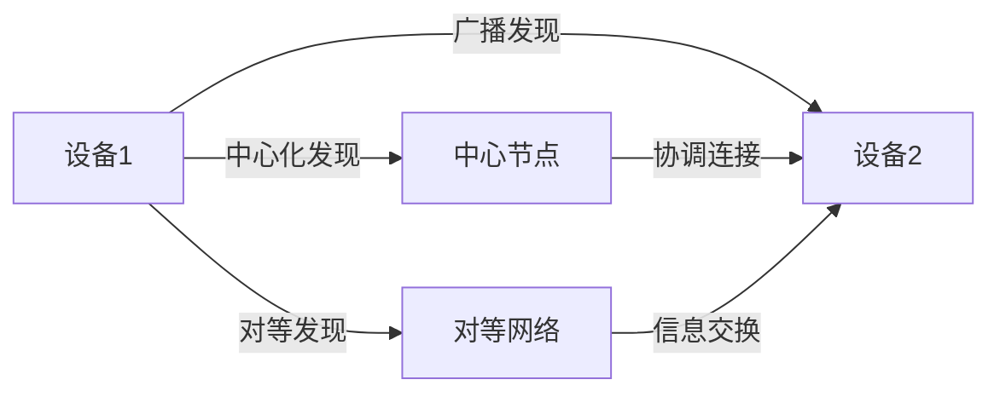
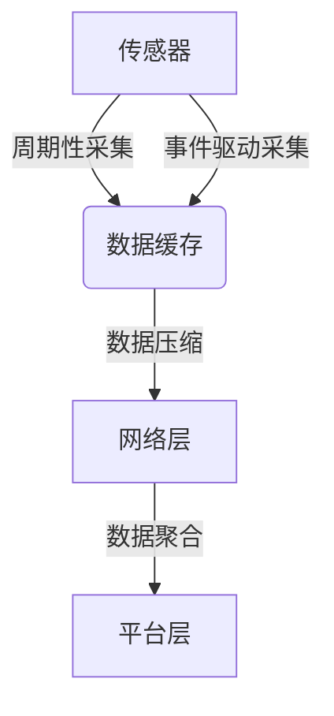
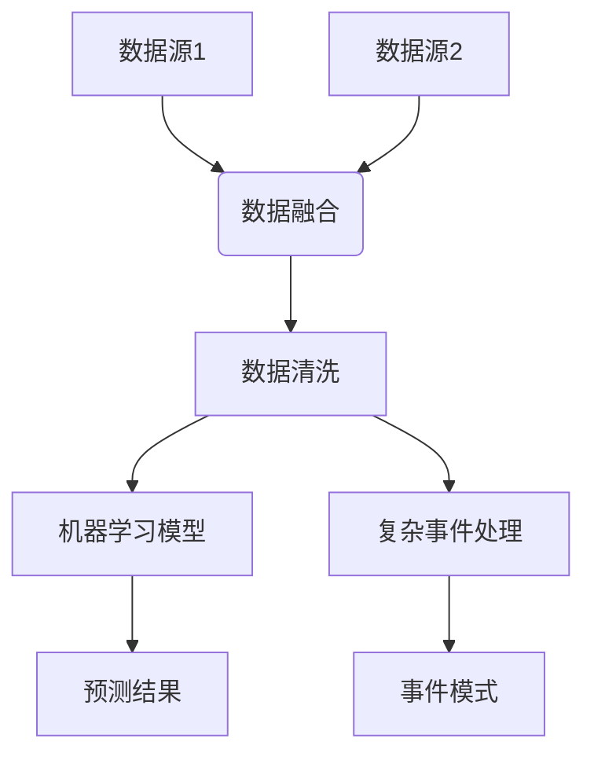
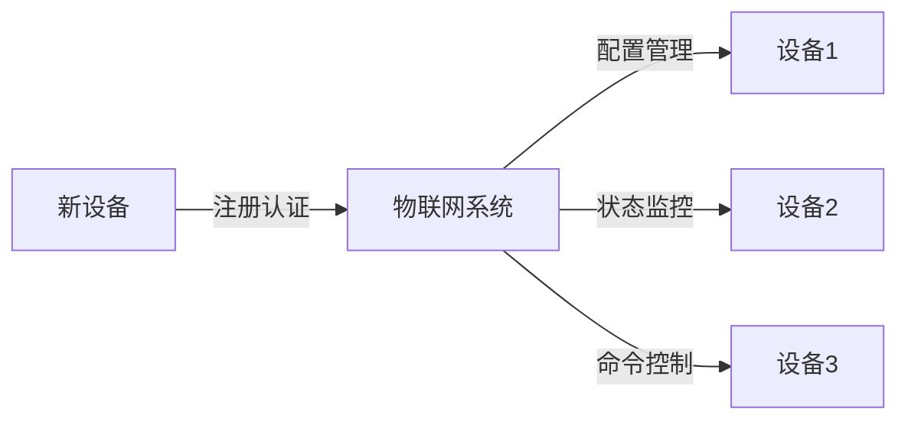

# 物联网(IoT)技术和各种传感器设备的集成：物联网在消费电子的创新

## 1.背景介绍

### 1.1 物联网(IoT)概念

物联网(Internet of Things, IoT)是一种新兴的互联网技术,它将各种物体与互联网相连接,使物体能够相互通信和交换数据。物联网的核心思想是赋予所有物体独特的身份标识,并通过互联网将它们连接起来,实现物与物、物与人之间的智能交互。

### 1.2 消费电子产品中的物联网应用

随着物联网技术的不断发展,消费电子产品已经成为物联网应用的重要领域之一。智能家居、可穿戴设备、智能电视等消费电子产品都已经广泛地应用了物联网技术,为人们的生活带来了更多便利和智能化体验。

### 1.3 传感器技术在物联网中的作用

传感器技术是物联网的关键支撑技术之一。各种传感器能够采集环境数据、设备状态数据等,为物联网系统提供必要的数据输入。传感器技术的发展为物联网应用的创新提供了重要支持。

## 2.核心概念与联系

### 2.1 物联网系统架构

物联网系统通常由以下几个核心部分组成:

1. **感知层**: 包括各种传感器设备,用于采集环境数据和设备状态数据。
2. **网络层**: 负责实现设备之间的数据传输和通信,包括有线网络和无线网络。
3. **平台层**: 提供数据存储、处理和管理功能,实现设备管理和应用支持。
4. **应用层**: 针对不同场景开发各种应用程序,为用户提供智能化服务。



### 2.2 物联网通信协议

物联网系统中的设备需要通过标准化的通信协议进行数据交换,常见的物联网通信协议包括:

- **MQTT**: 一种基于发布/订阅模式的轻量级消息传输协议,适用于低带宽、不可靠网络环境。
- **CoAP**: 一种基于UDP的轻量级应用层协议,用于资源受限的物联网设备。
- **XMPP**: 一种基于XML的开放式实时通信协议,可用于即时消息传递和设备控制。
- **Bluetooth Low Energy(BLE)**: 一种低功耗的短程无线通信技术,常用于可穿戴设备和智能家居设备。

### 2.3 物联网安全与隐私

由于物联网系统涉及大量设备和数据,安全与隐私问题是物联网应用面临的重大挑战之一。常见的安全威胁包括:

- 设备被入侵和控制
- 数据窃取和隐私泄露
- 拒绝服务攻击等

因此,物联网系统需要采取有效的安全措施,如设备身份认证、数据加密、访问控制等,以保护系统和用户的安全。

## 3.核心算法原理具体操作步骤

### 3.1 设备发现和连接

在物联网系统中,设备发现和连接是实现设备互联的基础。常见的设备发现和连接算法包括:

1. **广播发现**: 设备通过广播方式发送自身信息,其他设备接收到广播信息后建立连接。
2. **中心化发现**: 设备向中心节点注册自身信息,中心节点维护设备列表并协调设备连接。
3. **对等发现**: 设备通过对等网络进行信息交换,发现彼此并建立连接。



### 3.2 数据采集和传输

物联网系统需要从各种传感器采集数据,并将数据传输到平台层进行处理。常见的数据采集和传输算法包括:

1. **周期性采集**: 设备按照预设的时间间隔周期性地采集数据。
2. **事件驱动采集**: 设备在特定事件发生时采集数据,如温度超过阈值等。
3. **数据压缩**: 对采集的数据进行压缩,减小传输负载。
4. **数据聚合**: 在网络边缘对数据进行聚合处理,减少传输量。



### 3.3 数据处理和分析

平台层需要对采集的数据进行处理和分析,以提取有价值的信息。常见的数据处理和分析算法包括:

1. **数据清洗**: 去除异常值、缺失值等,提高数据质量。
2. **数据融合**: 将来自不同源的数据进行融合,提高数据的完整性和准确性。
3. **机器学习算法**: 应用机器学习算法(如回归、分类、聚类等)对数据进行建模和预测。
4. **复杂事件处理**: 对数据流进行实时分析,识别复杂事件模式。



### 3.4 设备管理和控制

物联网系统需要对大量设备进行统一管理和控制,以确保系统的正常运行。常见的设备管理和控制算法包括:

1. **设备注册和认证**: 新设备需要向系统注册并进行身份认证,以加入物联网系统。
2. **设备配置管理**: 对设备进行远程配置和升级,确保设备的正常运行。
3. **设备状态监控**: 实时监控设备的运行状态,及时发现和处理异常情况。
4. **设备命令控制**: 向设备下发控制命令,实现对设备的远程操作和控制。



## 4.数学模型和公式详细讲解举例说明

在物联网系统中,数学模型和公式在许多领域都有广泛的应用,如数据压缩、信号处理、机器学习等。以下是一些常见的数学模型和公式:

### 4.1 数据压缩

数据压缩是减小数据传输量的有效方法之一。常见的数据压缩算法包括:

1. **熵编码**: 基于数据的统计特性,为出现频率高的数据分配更短的编码,从而达到压缩的目的。熵编码包括哈夫曼编码、算术编码等。

$$
L(X) = -\sum_{i=1}^{n} p(x_i) \log_2 p(x_i)
$$

其中,$$L(X)$$表示数据序列$$X$$的熵,$$p(x_i)$$表示数据$$x_i$$出现的概率。

2. **字典编码**: 将重复出现的数据模式用一个短码词替换,从而达到压缩的目的。常见的字典编码算法包括LZW算法等。

### 4.2 信号处理

物联网系统中的传感器会采集各种形式的信号数据,需要对这些信号进行处理和分析。常见的信号处理方法包括:

1. **傅里叶变换**: 将时域信号转换到频域,方便对信号的频率成分进行分析和处理。

$$
X(f) = \int_{-\infty}^{\infty} x(t) e^{-j2\pi ft} dt
$$

其中,$$X(f)$$表示信号$$x(t)$$的频域表示,$$f$$表示频率。

2. **小波变换**: 将信号分解为不同尺度的小波基函数的线性组合,适用于处理非平稳信号。

$$
W_{\phi}(j,k) = \int_{-\infty}^{\infty} f(t) \overline{\phi_{j,k}(t)} dt
$$

其中,$$W_{\phi}(j,k)$$表示小波变换系数,$$\phi_{j,k}(t)$$表示小波基函数。

### 4.3 机器学习模型

机器学习模型在物联网数据分析和预测领域有广泛的应用。常见的机器学习模型包括:

1. **线性回归**: 用于建立自变量和因变量之间的线性关系模型。

$$
y = \beta_0 + \beta_1 x_1 + \beta_2 x_2 + ... + \beta_n x_n + \epsilon
$$

其中,$$y$$表示因变量,$$x_1, x_2, ..., x_n$$表示自变量,$$\beta_0, \beta_1, ..., \beta_n$$表示模型参数,$$\epsilon$$表示误差项。

2. **逻辑回归**: 用于建立自变量和二值因变量之间的概率模型,常用于分类问题。

$$
P(Y=1|X) = \frac{1}{1 + e^{-(\beta_0 + \beta_1 x_1 + \beta_2 x_2 + ... + \beta_n x_n)}}
$$

其中,$$P(Y=1|X)$$表示给定自变量$$X$$时,因变量$$Y$$取值为1的概率。

这些数学模型和公式在物联网系统中有着广泛的应用,为数据处理、信号分析和预测建模等提供了理论基础和方法支持。

## 5.项目实践:代码实例和详细解释说明

为了更好地理解物联网系统的实现,我们以一个智能家居系统为例,介绍一些关键代码实现。

### 5.1 设备发现和连接

以下是使用Python实现的基于MQTT协议的设备发现和连接代码示例:

```python
import paho.mqtt.client as mqtt

# MQTT代理服务器地址
broker_address = "broker.example.com"

# 设备信息
device_id = "device_001"
device_type = "temperature_sensor"

# 连接MQTT代理服务器
client = mqtt.Client()
client.connect(broker_address)

# 发布设备信息
client.publish("iot/discovery", f"{device_id},{device_type}")

# 订阅控制主题
client.subscribe("iot/control/#")

# 接收控制消息并处理
def on_message(client, userdata, msg):
    topic = msg.topic
    payload = msg.payload.decode()
    print(f"Received message on {topic}: {payload}")
    # 处理控制命令...

client.on_message = on_message

# 保持连接
client.loop_forever()
```

在上述代码中,设备首先连接到MQTT代理服务器,然后发布自身的设备信息(设备ID和类型)到`iot/discovery`主题。同时,设备订阅`iot/control/#`主题,以接收控制命令。当收到控制命令时,`on_message`函数会被调用,可以在其中处理相应的控制逻辑。

### 5.2 数据采集和传输

以下是使用Python实现的基于MQTT协议的数据采集和传输代码示例:

```python
import paho.mqtt.client as mqtt
import time
import random

# MQTT代理服务器地址
broker_address = "broker.example.com"

# 设备信息
device_id = "device_001"
device_type = "temperature_sensor"

# 连接MQTT代理服务器
client = mqtt.Client()
client.connect(broker_address)

# 发布数据
while True:
    # 模拟采集温度数据
    temperature = random.uniform(20, 30)
    
    # 构造数据payload
    payload = f"{device_id},{temperature}"
    
    # 发布数据
    client.publish(f"iot/data/{device_type}", payload)
    
    # 等待一段时间
    time.sleep(5)
```

在上述代码中,设备每隔5秒模拟采集一次温度数据,并将数据发布到`iot/data/temperature_sensor`主题。数据payload包含设备ID和温度值,以便在平台层进行识别和处理。

### 5.3 数据处理和分析

以下是使用Python实现的基于MQTT协议的数据处理和分析代码示例:

```python
import p