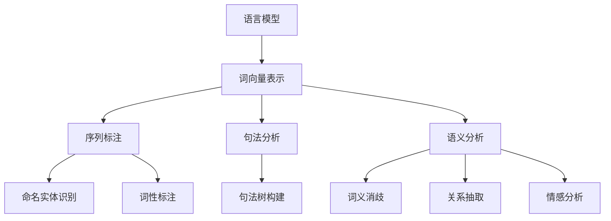

# 现代自然语言处理：从规则到统计

## 1. 背景介绍

自然语言处理(Natural Language Processing, NLP)是人工智能领域的一个重要分支,旨在使计算机能够理解和生成人类语言。在过去几十年中,NLP技术发展迅猛,从早期基于规则的系统,到现在广泛采用的统计机器学习方法。这种从规则到统计的转变,标志着NLP领域的一次重大范式转移。

### 1.1 自然语言处理的重要性

自然语言是人类交流和表达思想的主要工具,因此自然语言处理技术对于人机交互、信息检索、机器翻译等领域都具有重要意义。随着大数据时代的到来,海量的自然语言数据为NLP技术的发展提供了充足的素材。因此,自然语言处理已经成为人工智能领域中最活跃和最具挑战性的研究方向之一。

### 1.2 从规则到统计

早期的自然语言处理系统主要基于人工编写的规则,这种方法需要语言学家和领域专家耗费大量的时间和精力来构建规则库。然而,由于自然语言的复杂性和多样性,基于规则的系统往往难以覆盖所有的情况,且缺乏灵活性和可扩展性。

20世纪90年代,随着计算机硬件性能的提高和大量标注语料库的出现,统计自然语言处理方法开始兴起。这种方法利用机器学习算法从大量语料库中自动学习语言模型,无需人工编写规则。统计方法具有更强的鲁棒性和可扩展性,能够更好地处理自然语言的模糊性和歧义性。

## 2. 核心概念与联系

现代自然语言处理涉及多个核心概念,包括语言模型、词向量表示、序列标注、句法分析、语义分析等,这些概念之间存在着密切的联系。

### 2.1 语言模型

语言模型是自然语言处理的基础,它描述了一种语言中单词序列出现的概率分布。语言模型可以用于多种任务,如机器翻译、语音识别、文本生成等。早期的语言模型主要基于N-gram统计,而现代语言模型通常采用神经网络模型,如LSTM、Transformer等。

### 2.2 词向量表示

词向量表示是将词语映射到连续的向量空间中,使得语义相似的词语在向量空间中距离较近。常见的词向量表示方法包括Word2Vec、GloVe等。词向量表示是深度学习在NLP领域取得突破性进展的关键因素之一。

### 2.3 序列标注

序列标注是指对输入的序列数据(如文本序列)进行标注或标记,是许多NLP任务的基础,如命名实体识别、词性标注等。常见的序列标注模型包括HMM、MEMM、CRF和基于神经网络的序列标注模型。

### 2.4 句法分析

句法分析旨在确定句子的语法结构,构建句法树或依存关系图。准确的句法分析有助于提高语义理解的质量。常见的句法分析方法包括基于规则的方法、基于统计的方法和基于深度学习的方法。

### 2.5 语义分析

语义分析是自然语言处理的最高层次,旨在理解语句的实际含义。语义分析涉及多个子任务,如词义消歧、关系抽取、情感分析等。近年来,基于深度学习的语义表示模型(如BERT)在多种语义分析任务上取得了突破性进展。

## 3. 核心算法原理具体操作步骤

### 3.1 N-gram语言模型

N-gram语言模型是基于统计的经典语言模型,其核心思想是根据历史上N-1个词来预测当前词的概率。具体操作步骤如下:

1. 从大量语料库中统计N-gram的计数
2. 使用加平滑技术估计N-gram的概率
3. 根据链式法则,将句子概率分解为各个词的条件概率的乘积

例如,对于一个三元语言模型(N=3),句子"the dog chases a cat"的概率为:

$$P(w_1,w_2,\dots,w_n)=\prod_{i=1}^{n}P(w_i|w_{i-2},w_{i-1})$$

其中,$P(w_i|w_{i-2},w_{i-1})$是根据前两个词预测第i个词的条件概率。

### 3.2 Word2Vec

Word2Vec是一种高效的词向量表示学习方法,包含两种模型:连续词袋模型(CBOW)和Skip-gram模型。以Skip-gram模型为例,其操作步骤如下:

1. 初始化词向量和背景词向量
2. 对于每个中心词$w_c$及其背景窗口内的词$w_t$,最大化目标函数:
   $$\max\limits_{\theta}\sum_{t=1}^T\sum_{-m\leq j\leq m,j\neq 0}\log P(w_{t+j}|w_t;\theta)$$
   其中,$\theta$表示模型参数,$m$表示背景窗口大小。
3. 使用负采样或层序Softmax等技术加速训练
4. 迭代训练,直至收敛

训练完成后,词向量能够自动捕获语义和语法信息,语义相似的词在向量空间中距离较近。

### 3.3 LSTM序列标注模型

长短期记忆网络(LSTM)是一种广泛应用于序列标注任务的递归神经网络模型。以命名实体识别为例,LSTM模型的操作步骤如下:

1. 将输入序列的每个词映射为词向量表示
2. 将词向量序列输入LSTM网络,产生每个位置的隐藏状态向量
3. 将隐藏状态向量输入全连接层,得到每个位置的标签分数
4. 使用维特比算法或CRF层解码,得到最优标签序列
5. 使用交叉熵损失函数训练模型参数

在训练过程中,LSTM能够有效地捕获长距离依赖关系,从而提高序列标注的性能。

### 3.4 基于Transformer的BERT模型

BERT(Bidirectional Encoder Representations from Transformers)是一种基于Transformer的预训练语言模型,在多项NLP任务上取得了卓越的成绩。BERT的训练过程包括两个阶段:

1. **预训练阶段**
   - 使用大量无标注语料,在两个预训练任务(掩码语言模型和下一句预测)上训练BERT模型
   - 使用Transformer编码器架构,通过自注意力机制捕获长距离依赖关系
2. **微调阶段**
   - 针对特定的NLP任务(如文本分类、问答系统等),使用有标注数据对预训练模型进行微调
   - 在微调过程中,仅需更新BERT顶层的输出层,底层参数保持不变

BERT的关键创新在于使用双向编码器,能够同时捕获上下文信息,以及采用了有效的预训练任务,使得预训练模型能够学习到通用的语言表示。

## 4. 数学模型和公式详细讲解举例说明

### 4.1 N-gram语言模型

N-gram语言模型的核心是估计一个词的条件概率,即给定前面N-1个词,预测当前词的概率。形式化地,我们需要估计:

$$P(w_n|w_1,w_2,\dots,w_{n-1})$$

根据链式法则,上式可以分解为:

$$P(w_1,w_2,\dots,w_n)=\prod_{i=1}^{n}P(w_i|w_1,\dots,w_{i-1})$$

为了简化计算,我们通常使用马尔可夫假设,即只考虑有限个历史词,上式可进一步简化为:

$$P(w_1,w_2,\dots,w_n)=\prod_{i=1}^{n}P(w_i|w_{i-N+1},\dots,w_{i-1})$$

其中,N是N-gram的阶数。例如,当N=3时,我们有:

$$P(w_1,w_2,\dots,w_n)=\prod_{i=1}^{n}P(w_i|w_{i-2},w_{i-1})$$

这就是著名的三元语言模型。

为了估计N-gram概率,我们可以使用最大似然估计,即在训练语料库中统计N-gram的频率:

$$P(w_i|w_{i-N+1},\dots,w_{i-1})=\frac{C(w_{i-N+1},\dots,w_{i-1},w_i)}{C(w_{i-N+1},\dots,w_{i-1})}$$

其中,C(·)表示计数函数。然而,由于数据的稀疏性,一些N-gram在训练语料库中可能从未出现过,导致概率估计为0。为了解决这个问题,我们需要使用平滑技术,如加法平滑、回退平滑等。

### 4.2 Word2Vec

Word2Vec模型的目标是学习词向量表示,使得语义相似的词在向量空间中距离较近。具体地,我们希望最大化目标函数:

$$\max\limits_{\theta}\sum_{t=1}^T\sum_{-m\leq j\leq m,j\neq 0}\log P(w_{t+j}|w_t;\theta)$$

其中,$\theta$表示模型参数,$m$表示背景窗口大小。对于每个中心词$w_t$,我们希望能够正确预测它周围的背景词$w_{t+j}$。

在Skip-gram模型中,我们使用softmax函数来计算条件概率:

$$P(w_o|w_c)=\frac{\exp(v_{w_o}^{\top}v_{w_c})}{\sum_{w=1}^{V}\exp(v_w^{\top}v_{w_c})}$$

其中,$v_w$和$v_{w_c}$分别表示词$w$和中心词$w_c$的词向量,V是词表的大小。然而,当词表较大时,分母项的计算代价很高。为了加速训练,我们可以使用层序Softmax或负采样等技术。

在训练过程中,我们使用随机梯度下降或其变体来更新词向量,使目标函数最大化。训练完成后,语义相似的词在向量空间中距离较近,词向量能够捕获语义和语法信息。

### 4.3 LSTM序列标注模型

在LSTM序列标注模型中,我们使用LSTM网络来捕获输入序列的长距离依赖关系。对于每个时间步t,LSTM单元的计算过程如下:

$$\begin{aligned}
f_t &= \sigma(W_f\cdot[h_{t-1}, x_t] + b_f) \\
i_t &= \sigma(W_i\cdot[h_{t-1}, x_t] + b_i) \\
\tilde{C}_t &= \tanh(W_C\cdot[h_{t-1}, x_t] + b_C) \\
C_t &= f_t \odot C_{t-1} + i_t \odot \tilde{C}_t \\
o_t &= \sigma(W_o\cdot[h_{t-1}, x_t] + b_o) \\
h_t &= o_t \odot \tanh(C_t)
\end{aligned}$$

其中,$\sigma$表示sigmoid函数,$\odot$表示元素wise乘积。$f_t$、$i_t$和$o_t$分别表示遗忘门、输入门和输出门,它们控制着信息的流动。$C_t$是细胞状态,用于捕获长期依赖关系。$h_t$是隐藏状态,作为LSTM单元的输出。

在序列标注任务中,我们将LSTM的隐藏状态$h_t$输入到一个全连接层,得到每个位置的标签分数:

$$y_t = \text{softmax}(W_y h_t + b_y)$$

然后,我们使用维特比算法或CRF层解码,得到最优标签序列。在训练过程中,我们使用交叉熵损失函数来优化模型参数。

### 4.4 BERT模型

BERT模型的核心是Transformer编码器架构,它使用多头自注意力机制来捕获输入序列中的长距离依赖关系。对于一个长度为n的输入序列