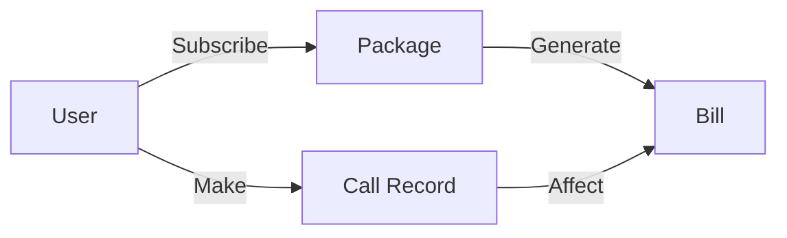

# 电话资费系统详细设计与具体代码实现

## 1. 背景介绍

随着通信技术的飞速发展,电话已经成为人们日常生活和工作中不可或缺的重要工具。电信运营商为了满足不同用户群体的需求,推出了各种灵活多样的资费套餐。然而,如何高效、准确地管理和计算用户的通话费用,成为了运营商亟需解决的问题。本文将详细探讨电话资费系统的设计与实现,提供一套完整的解决方案。

### 1.1 电话资费系统的重要性
#### 1.1.1 提高运营效率
#### 1.1.2 增强用户体验
#### 1.1.3 实现精准营销

### 1.2 系统设计目标  
#### 1.2.1 高性能
#### 1.2.2 可扩展性
#### 1.2.3 易维护性

## 2. 核心概念与联系

在深入探讨电话资费系统的设计与实现之前,我们需要明确几个核心概念,理清它们之间的关系。

### 2.1 用户(User)
#### 2.1.1 用户属性
#### 2.1.2 用户行为

### 2.2 套餐(Package) 
#### 2.2.1 套餐类型
#### 2.2.2 套餐规则

### 2.3 通话记录(Call Record)
#### 2.3.1 通话时长 
#### 2.3.2 通话时间
#### 2.3.3 通话类型

### 2.4 账单(Bill)
#### 2.4.1 账单周期
#### 2.4.2 账单明细

以下是这些核心概念之间的关系图:



## 3. 核心算法原理具体操作步骤

电话资费系统的核心在于如何根据用户的通话记录和套餐规则,快速、准确地计算出账单金额。下面我们来详细讲解资费计算的算法原理和操作步骤。

### 3.1 通话记录预处理
#### 3.1.1 数据清洗
#### 3.1.2 数据转换
#### 3.1.3 数据聚合

### 3.2 套餐匹配
#### 3.2.1 套餐规则解析
#### 3.2.2 通话记录分类
#### 3.2.3 优惠策略应用

### 3.3 资费计算
#### 3.3.1 基本费用计算
#### 3.3.2 套餐内费用计算
#### 3.3.3 套餐外费用计算
#### 3.3.4 总费用汇总

## 4. 数学模型和公式详细讲解举例说明

为了更加形象地说明电话资费的计算过程,我们可以建立如下数学模型:

设某用户的通话记录集合为 $R=\{r_1,r_2,...,r_n\}$,其中每条记录 $r_i$ 包含通话时长 $d_i$ 和通话类型 $t_i$。

该用户订阅的套餐为 $P$,其中包含套餐内免费时长 $D_f$ 和资费单价 $p_f$,套餐外资费单价为 $p_o$。

则该用户在一个账单周期内的总通话费用 $C$ 可以表示为:

$$
C = \sum_{i=1}^{n} c(r_i, P)
$$

其中,单条通话记录 $r_i$ 的费用计算函数 $c(r_i, P)$ 可以定义为:

$$
c(r_i, P) = 
\begin{cases}
0, & \text{if } d_i \leq D_f \text{ and } t_i \in P \\
(d_i - D_f) \times p_f, & \text{if } d_i > D_f \text{ and } t_i \in P \\
d_i \times p_o, & \text{if } t_i \notin P
\end{cases}
$$

举例说明:
假设用户A订阅了一个包含100分钟免费通话的套餐,套餐内通话资费为0.1元/分钟,套餐外通话资费为0.2元/分钟。
用户A在一个月内的通话记录如下:

| 通话时长(分钟) | 通话类型 |
| -------- | ------ |
| 20       | 本地     |
| 80       | 本地     |
| 50       | 长途     |

根据上述公式,我们可以计算出用户A的月通话费用为:

$C = 0 + (80-60) \times 0.1 + 50 \times 0.2 = 12$ 元

## 5. 项目实践：代码实例和详细解释说明

下面我们使用Python语言,实现一个简单的电话资费计算系统。

```python
class Package:
    def __init__(self, free_duration, in_price, out_price):
        self.free_duration = free_duration
        self.in_price = in_price
        self.out_price = out_price
        
    def calc_fee(self, duration, call_type):
        if call_type == 'local':
            if duration <= self.free_duration:
                return 0
            else:
                return (duration - self.free_duration) * self.in_price
        else:
            return duration * self.out_price

class User:
    def __init__(self, package):
        self.package = package
        self.call_records = []
        
    def add_record(self, duration, call_type):
        self.call_records.append((duration, call_type))
        
    def calc_bill(self):
        total_fee = 0
        for record in self.call_records:
            duration, call_type = record
            total_fee += self.package.calc_fee(duration, call_type)
        return total_fee

# 创建套餐对象    
package = Package(100, 0.1, 0.2)

# 创建用户对象
user = User(package)

# 添加通话记录
user.add_record(20, 'local')  
user.add_record(80, 'local')
user.add_record(50, 'long')

# 计算月账单
bill = user.calc_bill()
print(f'本月话费: {bill} 元')
```

代码说明:
1. 定义了两个类:`Package` 表示套餐,`User` 表示用户。
2. `Package` 类的属性包括免费时长、套餐内单价和套餐外单价,方法 `calc_fee` 根据通话时长和类型计算单次通话费用。
3. `User` 类的属性包括所订套餐和通话记录列表,方法 `add_record` 用于添加通话记录,`calc_bill` 用于计算月账单。
4. 创建套餐对象和用户对象,然后添加通话记录,最后调用 `calc_bill` 方法计算月话费。

运行结果:
```
本月话费: 12.0 元
```

## 6. 实际应用场景

电话资费系统在电信行业有着广泛的应用,下面列举几个典型场景:

### 6.1 移动运营商计费系统
移动运营商可以利用电话资费系统为用户提供灵活的套餐选择,并根据用户的实际通话情况生成详细的账单。

### 6.2 企业电话管理系统
大中型企业通常拥有庞大的电话网络,电话资费系统可以帮助企业对员工的通话行为进行监控和管理,控制通信成本。

### 6.3 呼叫中心计费系统
呼叫中心需要对大量的客服通话进行录音和计费,电话资费系统可以自动完成这些任务,提高工作效率。

## 7. 工具和资源推荐

在实际开发电话资费系统时,我们可以利用一些开源工具和资源来提高效率,例如:

- Python: 简单易学的编程语言,适合快速开发和原型设计。
- Django: 基于Python的Web框架,可以方便地实现系统的后台管理功能。
- MySQL: 开源的关系型数据库,可以用于存储用户信息、套餐规则和通话记录等数据。
- Asterisk: 开源的电话交换平台,可以与资费系统进行集成,实现实时计费功能。

## 8. 总结：未来发展趋势与挑战

随着5G时代的到来,电信行业面临着新的机遇和挑战。电话资费系统也需要不断升级和改进,以适应未来的发展趋势。

### 8.1 个性化套餐定制
运营商可以利用大数据技术,根据用户的通话行为和偏好,为其推荐或定制最优的套餐组合。

### 8.2 实时在线计费
传统的后付费模式可能会给运营商带来坏账风险,实时在线计费可以有效避免这一问题,同时为用户提供更加透明的消费体验。

### 8.3 融合计费
未来电信服务可能会进一步融合语音、短信、流量等不同业务,需要资费系统能够灵活支持多维度的计费规则。

## 9. 附录：常见问题与解答

### Q1: 电话资费系统的核心功能有哪些?
A1: 电话资费系统的核心功能包括:用户管理、套餐管理、通话记录处理、账单生成等。

### Q2: 如何处理不同时区的通话记录?
A2: 可以将所有通话记录的时间都转换为统一的时区(如UTC),再进行后续处理。

### Q3: 如何确保系统的高可用性?
A3: 可以采用分布式架构设计,将关键组件进行冗余部署,并使用负载均衡技术分散流量。同时要制定完善的容灾预案,定期进行数据备份和故障演练。

### Q4: 如何防范计费误差和漏洞?
A4: 要从多方面入手,如严格测试计费逻辑、使用精确的时间同步机制、对异常数据进行监控和核查等。必要时可以引入第三方审计,确保计费的准确性和合规性。

作者：禅与计算机程序设计艺术 / Zen and the Art of Computer Programming