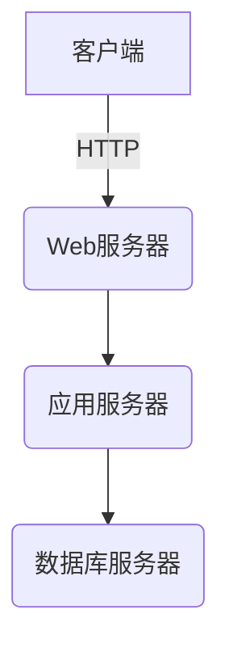

# 病历管理系统设计与实现

## 1. 背景介绍

随着医疗信息化的不断推进,电子病历系统已经成为医院信息化建设的核心应用系统之一。病历管理系统作为医院信息系统的重要组成部分,其设计和实现对于提高医疗质量、减轻医护人员工作压力、降低运营成本等具有重要意义。

传统的纸质病历管理存在诸多问题,如数据丢失、难以存储和检索、医疗差错率高等,这些问题严重影响了医疗服务质量。电子病历系统的出现有效解决了这些问题,实现了病历的电子化管理,提高了医疗服务效率和质量。

## 2. 核心概念与联系

### 2.1 电子病历系统概念

电子病历系统是指利用计算机技术和网络通信技术,将患者的诊疗过程中产生的各种文字、图像、声音等数据进行数字化采集、存储、传输和管理的应用系统。它是医院信息化建设的核心,是实现医疗信息共享和交换的基础。

### 2.2 核心模块

电子病历系统通常包括以下几个核心模块:

1. **病历管理模块**: 用于管理患者的基本信息、就诊记录、检查报告、医嘱等信息。

2. **医嘱管理模块**: 用于处理医生开具的各种医嘱,包括检查、治疗、用药等。

3. **护理管理模块**: 用于记录护士对患者的各种护理操作和病情观察。

4. **药品管理模块**: 用于管理药品的采购、库存、发放等。

5. **报表统计模块**: 用于生成各种统计报表,为医院决策提供数据支持。

这些模块相互关联、相互作用,共同构成了完整的电子病历系统。

### 2.3 系统架构

电子病历系统通常采用分布式架构,包括数据库服务器、应用服务器、Web服务器等。各个模块分布在不同的服务器上,通过网络进行通信和数据交换。这种架构具有高可扩展性、高可用性和负载均衡等优点。



## 3. 核心算法原理具体操作步骤

### 3.1 数据采集和存储

电子病历系统的核心功能之一是采集和存储患者的诊疗数据。这个过程涉及以下几个步骤:

1. **数据采集**: 通过各种输入设备(如键盘、扫描仪、医疗设备等)采集患者的文字、图像、声音等数据。

2. **数据标准化**: 将采集到的数据按照统一的数据标准进行格式化处理,以便于存储和交换。常用的标准有HL7、DICOM等。

3. **数据存储**: 将标准化后的数据存储到数据库中。数据库通常采用关系型数据库或NoSQL数据库。

4. **数据备份**: 定期对数据进行备份,以防数据丢失或损坏。

### 3.2 数据检索和展示

另一个核心功能是检索和展示患者的历史诊疗数据,具体步骤如下:

1. **数据查询**: 根据患者信息、就诊时间等条件,从数据库中查询相关的病历数据。

2. **数据解析**: 将查询到的原始数据进行解析,转换为可读的格式。

3. **数据展示**: 将解析后的数据以文字、图像、表格等形式展示在用户界面上。

4. **数据权限控制**: 根据用户的角色和权限,控制对病历数据的访问权限。

### 3.3 数据共享和交换

为了实现医疗信息的共享和交换,电子病历系统需要支持数据的标准化和互操作性。常用的方法包括:

1. **采用标准数据格式**: 如HL7、DICOM等国际标准,确保数据可以在不同系统之间传输和解析。

2. **建立数据交换中心**: 作为不同医疗机构之间数据交换的中转站,实现数据的集中管理和转发。

3. **实现系统接口**: 开发标准化的系统接口,支持与其他系统进行数据交换。

4. **加密和认证机制**: 采用加密和认证机制,确保数据在传输过程中的安全性和完整性。

## 4. 数学模型和公式详细讲解举例说明

在电子病历系统中,数学模型和公式主要应用于以下几个方面:

### 4.1 数据压缩

由于病历数据量庞大,需要对数据进行压缩存储,以节省存储空间。常用的无损压缩算法包括:

1. **游程编码(Run-Length Encoding, RLE)**: 适用于存在大量相同数据的情况,如医学图像中的背景区域。压缩率取决于数据的冗余程度。

2. **哈夫曼编码(Huffman Coding)**: 根据数据出现的频率,为每个数据分配不同长度的编码,从而达到压缩的目的。压缩率取决于数据的熵值。

3. **LZW编码(Lempel-Ziv-Welch)**: 基于字典的无损压缩算法,适用于文本数据的压缩。压缩率较高,但需要更多的内存空间存储字典。

无损压缩算法的优点是可以完全恢复原始数据,但压缩率有限。对于一些允许少量失真的数据(如医学图像),也可以采用有损压缩算法(如JPEG、JPEG2000等)以获得更高的压缩率。

### 4.2 数据加密

为了保护患者隐私,需要对病历数据进行加密存储和传输。常用的加密算法包括:

1. **对称加密算法**: 如AES、DES等,加密和解密使用同一密钥。优点是运算速度快,适合大量数据的加密。

2. **非对称加密算法**: 如RSA、ECC等,加密和解密使用不同的密钥。优点是密钥管理方便,适合密钥分发和数字签名。

3. **哈希算法**: 如MD5、SHA等,用于生成数据的固定长度的哈希值,可用于数据完整性校验。

加密算法的选择需要综合考虑安全性、性能和实现复杂度等因素。在电子病历系统中,通常采用混合加密策略,对不同类型的数据使用不同的加密算法和密钥长度。

### 4.3 数据匿名化

为了保护患者隐私,在数据共享和发布时,需要对敏感数据进行匿名化处理。常用的匿名化算法包括:

1. **k-anonymity**: 将记录分为多个等价类,每个等价类中至少有k个记录,从而使单个记录在等价类中不可识别。

2. **l-diversity**: 在k-anonymity的基础上,要求每个等价类中至少有l种不同的敏感属性值,从而防止敏感属性值的推断。

3. **t-closeness**: 在l-diversity的基础上,要求每个等价类中的敏感属性值的分布与整个数据集的分布之间的距离不超过t,从而防止基于背景知识的推断攻击。

匿名化算法需要在数据可用性和隐私保护之间进行权衡,选择合适的算法和参数是一个复杂的过程,需要结合具体的应用场景和数据特征。

### 4.4 数据挖掘

电子病历系统中积累了大量的患者数据,通过数据挖掘技术可以发现隐藏其中的知识和规律,为临床决策提供支持。常用的数据挖掘算法包括:

1. **关联规则挖掘**: 发现数据集中存在的频繁项集和关联规则,可用于发现疾病之间的关联关系、药物不良反应等。常用的算法有Apriori算法、FP-Growth算法等。

2. **分类算法**: 根据已知的训练数据,构建分类模型,用于对新的数据进行分类。常用的算法有决策树、支持向量机、朴素贝叶斯等。可用于疾病诊断、预后预测等。

3. **聚类算法**: 根据数据的相似性,将数据划分为多个簇。常用的算法有K-Means、层次聚类等。可用于发现患者的亚型、探索疾病的新分类方法等。

4. **时序模式挖掘**: 发现数据序列中的频繁模式,可用于发现疾病的发展规律、预测疾病的进展趋势等。常用的算法有Apriori-All、Prefix-Span等。

数据挖掘技术在电子病历系统中的应用前景广阔,但也面临着数据质量、隐私保护、模型解释性等挑战,需要进一步的研究和探索。

## 5. 项目实践: 代码实例和详细解释说明

### 5.1 数据库设计

电子病历系统的核心是数据库,下面是一个简化的数据库设计示例(使用MySQL):

```sql
-- 患者信息表
CREATE TABLE patient (
    id INT AUTO_INCREMENT PRIMARY KEY,
    name VARCHAR(50) NOT NULL,
    gender CHAR(1) NOT NULL,
    birth_date DATE NOT NULL,
    ...
);

-- 就诊记录表
CREATE TABLE visit (
    id INT AUTO_INCREMENT PRIMARY KEY,
    patient_id INT NOT NULL,
    visit_date DATE NOT NULL,
    department VARCHAR(50) NOT NULL,
    diagnosis TEXT,
    ...
    FOREIGN KEY (patient_id) REFERENCES patient(id)
);

-- 检查报告表
CREATE TABLE report (
    id INT AUTO_INCREMENT PRIMARY KEY,
    visit_id INT NOT NULL,
    report_type VARCHAR(50) NOT NULL,
    report_data LONGBLOB NOT NULL,
    ...
    FOREIGN KEY (visit_id) REFERENCES visit(id)
);

-- 医嘱表
CREATE TABLE order (
    id INT AUTO_INCREMENT PRIMARY KEY,
    visit_id INT NOT NULL,
    order_type VARCHAR(50) NOT NULL,
    order_detail TEXT NOT NULL,
    ...
    FOREIGN KEY (visit_id) REFERENCES visit(id)
);
```

这个示例包括了患者基本信息、就诊记录、检查报告和医嘱等核心数据表。其中:

- `patient`表存储患者的基本信息,如姓名、性别、出生日期等。
- `visit`表存储每次就诊的相关信息,如就诊日期、就诊科室、诊断结果等,并与`patient`表建立外键关联。
- `report`表存储各种检查报告的数据,如影像报告、化验报告等,并与`visit`表建立外键关联。
- `order`表存储医生开具的各种医嘱,如检查医嘱、治疗医嘱、用药医嘱等,并与`visit`表建立外键关联。

根据实际需求,可以增加更多的表来存储其他类型的数据,如护理记录、手术记录等。

### 5.2 数据采集示例

下面是一个使用Python采集数据的示例,假设需要从DICOM文件中提取患者信息和影像数据:

```python
import pydicom

def extract_patient_info(dicom_file):
    """从DICOM文件中提取患者信息"""
    ds = pydicom.dcmread(dicom_file)
    patient_info = {
        'name': ds.PatientName,
        'id': ds.PatientID,
        'birth_date': ds.PatientBirthDate,
        'gender': ds.PatientSex
    }
    return patient_info

def extract_image_data(dicom_file):
    """从DICOM文件中提取影像数据"""
    ds = pydicom.dcmread(dicom_file)
    image_data = ds.pixel_array
    return image_data

# 示例用法
dicom_file = 'path/to/dicom/file.dcm'
patient_info = extract_patient_info(dicom_file)
image_data = extract_image_data(dicom_file)

# 将数据存储到数据库
# ...
```

在这个示例中,我们使用`pydicom`库读取DICOM文件,并从中提取患者信息和影像数据。`extract_patient_info`函数提取患者的姓名、ID、出生日期和性别等基本信息,而`extract_image_data`函数提取影像数据的像素数组。

提取到的数据可以存储到数据库中,供其他模块使用。在实际应用中,还需要考虑数据标准化、错误处理、并发控制等问题。

### 5.3 数据展示示例

下面是一个使用Python的Flask框架开发Web界面的示例,用于展示患者的就诊记录:

```python
from flask import Flask, render_template
import mysql.connector

app = Flask(__name__)

# 连接数据库
db = mysql.connector.connect(