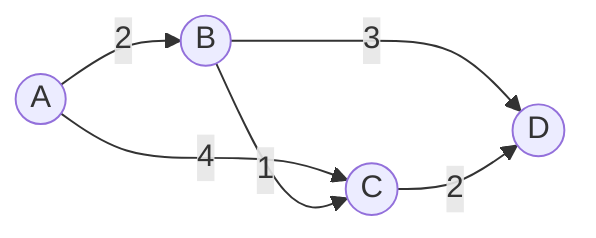

# 社交网络分析:Pregel的典型应用场景

## 1. 背景介绍

### 1.1 社交网络分析的重要性

在当今互联网时代,社交网络已经成为人们生活中不可或缺的一部分。通过社交网络,人们可以与朋友、家人以及陌生人建立联系,分享信息,表达观点。同时,社交网络也为企业和组织提供了一个与目标受众互动的平台。因此,对社交网络进行分析和挖掘,可以帮助我们更好地理解人们的行为模式、兴趣爱好、社交关系等,从而为个性化推荐、精准营销、舆情监测等应用提供支持。

### 1.2 大规模图计算的挑战

社交网络本质上是一个巨大的图(Graph),其中节点(Node)代表用户,边(Edge)代表用户之间的关系。随着社交网络规模的不断扩大,图的节点数和边数呈爆炸式增长,给图计算带来了巨大的挑战。传统的单机算法已经无法满足大规模图计算的需求,因此需要设计新的分布式图计算框架。

### 1.3 Pregel的诞生

Pregel是Google于2010年推出的一个大规模图计算框架,它采用了"Think Like A Vertex"的设计理念,将计算任务分解到图的每个节点上,并通过消息传递的方式在节点之间进行通信和同步。Pregel简化了图算法的设计和实现,使得开发人员可以更加专注于算法本身,而无需过多考虑底层的分布式计算细节。同时,Pregel还具有良好的可扩展性和容错性,可以轻松处理TB级别的海量图数据。

## 2. 核心概念与联系

### 2.1 Pregel编程模型

Pregel采用了基于BSP(Bulk Synchronous Parallel)的编程模型,整个计算过程被划分为一系列的超步(Superstep)。在每个超步中,每个节点都会执行一个用户定义的Compute函数,并且可以向其他节点发送消息。当所有节点都完成了当前超步的计算并且没有待发送的消息时,整个图计算就进入了下一个超步。

### 2.2 消息传递机制

在Pregel中,节点之间通过消息传递的方式进行通信。每个节点可以向其他节点发送消息,发送的消息会在下一个超步中被目标节点接收并处理。Pregel为消息传递提供了灵活的机制,支持点对点(Point-to-Point)和组播(Multicast)两种方式。

### 2.3 Combiner与Aggregator

为了减少网络通信开销,Pregel引入了Combiner和Aggregator两个组件。Combiner用于在本地对发往同一目标节点的消息进行合并,从而减少了发送的消息数量。而Aggregator则用于在全局范围内收集和聚合一些统计信息,例如当前活跃的节点数、消息数等。

### 2.4 容错机制

Pregel采用了Checkpoint容错机制来保证计算的正确性。在计算过程中,Pregel会定期对每个节点的状态进行Checkpoint,并将Checkpoint数据写入到持久化存储中。当某个节点失败时,Pregel可以从最近的一次Checkpoint中恢复该节点的状态,并从该超步重新开始计算,从而避免了整个图计算的失败。

## 3. 核心算法原理具体操作步骤

下面以单源最短路径(Single Source Shortest Path)算法为例,介绍Pregel的核心算法原理和具体操作步骤。

### 3.1 算法原理

单源最短路径问题是指,给定一个带权有向图G和一个源节点s,求从s到图中其他所有节点的最短路径。Pregel中的单源最短路径算法基于Dijkstra算法,每个节点保存一个距离值d,初始时源节点s的d为0,其他节点的d为正无穷。算法按照如下步骤进行:

1. 对于每个节点v,如果v的d值发生了变化,则v向其所有出边的目标节点发送一个(v,d)的消息。

2. 每个节点u接收所有收到的消息,对于每条消息(v,d),如果d+w(v,u)<u.d,则更新u.d为d+w(v,u),其中w(v,u)为边(v,u)的权重。

3. 重复步骤1和2,直到没有节点的d值发生变化为止。

### 3.2 具体操作步骤

1. 初始化阶段:
   - 将源节点s的距离值d设置为0,其他节点的d设置为正无穷。
   - 每个节点都处于活跃(Active)状态。

2. 迭代阶段:
   - 对于每个活跃的节点v:
     - 如果v在上一轮中收到了消息:
       - 对每条消息(u,d)进行处理,如果d+w(u,v)<v.d,则更新v.d为d+w(u,v)。
     - 如果v.d发生了变化:
       - 向v的所有出边的目标节点发送一个(v,v.d)的消息。
       - v保持活跃状态。
     - 否则:
       - v进入非活跃(Inactive)状态。
   - 如果所有节点都处于非活跃状态,则算法结束,否则进入下一轮迭代。

3. 结束阶段:
   - 每个节点的d值即为从源节点s到该节点的最短路径长度。

## 4. 数学模型和公式详细讲解举例说明

### 4.1 图的数学表示

在Pregel中,图用邻接表(Adjacency List)的形式表示。对于一个有向图G=(V,E),其中V表示节点集合,E表示边集合。每个节点v∈V都有一个唯一的标识符id(v),以及一个邻接表Adj(v),存储了所有以v为起点的出边(v,u)∈E。每条边(v,u)都有一个权重w(v,u),表示从节点v到节点u的距离或代价。

### 4.2 单源最短路径的数学定义

给定一个带权有向图G=(V,E)和一个源节点s∈V,对于每个节点v∈V,定义d(s,v)为从s到v的最短路径长度,即:

$$
d(s,v) = \begin{cases}
0, & v=s \\
\min_{(u,v)\in E}(d(s,u)+w(u,v)), & v \neq s
\end{cases}
$$

其中,当v=s时,d(s,s)=0;当v≠s时,d(s,v)等于所有从s到v的路径中,最短路径的长度。

### 4.3 Pregel中的最短路径计算

在Pregel中,每个节点v维护一个距离值d(v),初始时d(s)=0,其他节点的d(v)=∞。在每一轮迭代中,每个节点v按照以下规则更新自己的d(v)值:

$$
d(v) = \min\{d(v), \min_{(u,v)\in E}(d(u)+w(u,v))\}
$$

即,节点v的新距离值等于其当前距离值与所有收到的消息中距离值+边权重的最小值。

例如,考虑下图所示的一个带权有向图,其中节点A为源节点。



初始时,A.d=0,其他节点的d=∞。

在第一轮迭代中,A向B和C发送(A,0)的消息。B收到消息后,更新B.d=min{∞,0+2}=2;C收到消息后,更新C.d=min{∞,0+4}=4。

在第二轮迭代中,B向C和D发送(B,2)的消息,C向D发送(C,4)的消息。C收到B的消息后,更新C.d=min{4,2+1}=3;D收到B和C的消息后,更新D.d=min{∞,2+3,4+2}=5。

在第三轮迭代中,C向D发送(C,3)的消息。D收到消息后,更新D.d=min{5,3+2}=5,D.d没有变化。

此时,所有节点都处于非活跃状态,算法结束。最终每个节点的d值如下:

$$
A.d=0, B.d=2, C.d=3, D.d=5
$$

这就是从源节点A到其他节点的最短路径长度。

## 5. 项目实践：代码实例和详细解释说明

下面给出一个使用Pregel实现单源最短路径算法的示例代码,并对其进行详细解释。

```java
public class ShortestPathVertex extends Vertex<Long, Integer, Integer> {

  @Override
  public void compute(Iterable<Integer> messages) {
    if (getSuperstep() == 0) {
      // 初始化阶段
      if (getId().equals(sourceId)) {
        // 源节点将距离设置为0
        setValue(0);
      } else {
        // 其他节点将距离设置为正无穷
        setValue(Integer.MAX_VALUE);
      }
    } else {
      // 迭代阶段
      int minDist = getValue();
      for (int message : messages) {
        // 更新距离值
        minDist = Math.min(minDist, message);
      }
      if (minDist < getValue()) {
        // 如果距离值发生变化,则更新并发送消息
        setValue(minDist);
        for (Edge<Long, Integer> edge : getEdges()) {
          sendMessage(edge.getTargetVertexId(), minDist + edge.getValue());
        }
      }
    }
    // 如果没有收到消息,则投票结束
    voteToHalt();
  }
}
```

代码说明:

- ShortestPathVertex是一个继承自Vertex的自定义顶点类,其中泛型参数分别表示顶点ID类型、顶点值类型和边权重类型。

- compute方法是Pregel的核心方法,用于定义每个顶点的计算逻辑。它接收一个Iterable<Integer>类型的参数messages,表示当前超步收到的所有消息。

- 在初始化阶段(superstep=0),源节点将自己的距离值设置为0,其他节点设置为正无穷。

- 在迭代阶段(superstep>0),每个节点首先初始化一个minDist变量为当前距离值,然后遍历收到的所有消息,更新minDist为其与消息值中的最小值。

- 如果minDist小于当前距离值,则更新距离值,并向所有邻居节点发送minDist+边权重的消息。

- 如果节点没有收到任何消息,则调用voteToHalt方法投票结束。

- 当所有节点都投票结束时,整个图计算结束,每个节点的getValue方法返回的就是其到源节点的最短路径长度。

以上就是使用Pregel实现单源最短路径算法的示例代码和详细解释。Pregel通过将计算任务分解到每个节点,并通过消息传递进行通信和同步,实现了高效的分布式图计算。

## 6. 实际应用场景

Pregel在社交网络分析中有着广泛的应用,下面列举几个典型的应用场景。

### 6.1 社区发现

在社交网络中,社区(Community)是指一组紧密联系的用户子集。社区发现旨在从社交网络中识别出这些社区结构。Pregel可以用于实现一些经典的社区发现算法,如Label Propagation算法和Girvan-Newman算法。通过在Pregel中将每个用户建模为一个节点,并将用户之间的关系建模为边,可以方便地在分布式环境下进行大规模社区发现。

### 6.2 影响力分析

在社交网络中,影响力(Influence)是指一个用户对其他用户的影响程度。影响力分析旨在识别出网络中的关键意见领袖和影响力节点。Pregel可以用于实现一些经典的影响力分析算法,如PageRank算法和HITS算法。通过将每个用户建模为一个节点,并将用户之间的影响关系建模为有向边,可以方便地在分布式环境下进行大规模影响力分析。

### 6.3 链路预测

在社交网络中,链路预测(Link Prediction)是指预测两个未连接的用户之间是否可能存在潜在的关系。链路预测可以帮助我们发现新的社交关系,扩展用户的社交圈。Pregel可以用于实现一些经典的链路预测算法,如Adamic-Adar指数和Katz指数。通过将每个用户建模为一个节点