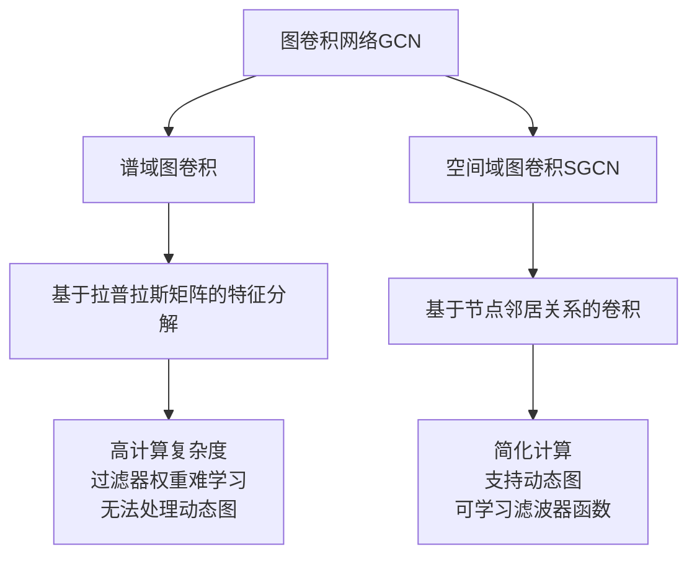

# 第三篇：图卷积网络(GCN)：从谱域到空间域的演进

## 1.背景介绍

在过去几年中,图神经网络(GNNs)在各种任务中取得了卓越的成绩,例如节点分类、链接预测和图分类等。图卷积网络(GCNs)作为GNNs的一种重要变体,在半监督节点分类任务中表现出色,受到了广泛关注。

GCN最初是在谱域(spectral domain)中定义的,其灵感来源于卷积神经网络(CNN)在欧几里德域(Euclidean domain)中的成功应用。在欧几里德域中,CNN利用局部连通特性和平移不变性,通过在空间域上进行卷积操作来高效地提取局部空间模式。然而,对于任意拓扑结构的图数据来说,缺乏这种自然的平移不变性和局部连通特性,因此无法直接应用传统的卷积操作。

为了解决这个问题,GCN通过将图卷积操作从空间域转移到谱域来处理任意拓扑结构的图数据。在谱域中,图卷积操作可以被定义为对图拉普拉斯矩阵的特征向量进行滤波。尽管在谱域中定义图卷积是一种有效的方法,但它存在一些固有的缺陷,如高计算复杂度、过滤器权重难以学习以及无法处理动态图等问题。

## 2.核心概念与联系

为了克服谱域图卷积的局限性,研究人员提出了一种新的思路,即在空间域(spatial domain)中直接定义图卷积操作。这种新的方法被称为空间域图卷积网络(Spatial Graph Convolutional Networks,SGCNs)。

SGCNs的核心思想是利用节点的空间关系来定义卷积操作,而不是依赖于图的拉普拉斯矩阵的特征分解。通过在空间域上直接进行卷积,SGCNs可以避免谱域图卷积的一些缺陷,如高计算复杂度和对动态图的支持有限等。

SGCNs将图卷积操作定义为对每个节点的邻居节点的特征进行加权求和,权重由一个可学习的滤波器函数决定。这种方法不仅简化了计算,而且还可以自然地处理动态图,因为它只依赖于节点的邻居关系,而不需要预先计算图的拉普拉斯矩阵。

## 3.核心算法原理具体操作步骤

### 3.1 谱域图卷积

在谱域中定义图卷积的核心思想是将传统卷积操作从欧几里德域推广到非欧几里德域。具体来说,我们可以将图信号 $\mathbf{x} \in \mathbb{R}^{N}$ 表示为图拉普拉斯矩阵 $\mathbf{L}$ 的特征向量的线性组合,即:

$$\mathbf{x} = \sum_{i=1}^{N} \hat{\mathbf{x}}_i \mathbf{u}_i$$

其中 $\mathbf{u}_i$ 是 $\mathbf{L}$ 的特征向量,而 $\hat{\mathbf{x}}_i$ 是对应的傅里叶系数。

在这种表示下,我们可以定义一个图卷积操作 $g_\theta = \mathrm{diag}(\theta)$,其中 $\theta \in \mathbb{R}^{N}$ 是一个向量,表示对每个特征向量 $\mathbf{u}_i$ 的放大或缩小程度。通过这种方式,我们可以实现对图信号 $\mathbf{x}$ 的滤波操作:

$$g_\theta \star \mathbf{x} = g_\theta \left( \sum_{i=1}^{N} \hat{\mathbf{x}}_i \mathbf{u}_i \right) = \sum_{i=1}^{N} \theta_i \hat{\mathbf{x}}_i \mathbf{u}_i$$

这种谱域图卷积的优点是可以自然地处理任意拓扑结构的图数据,并且具有一定的理论支持。然而,它也存在一些缺陷,例如:

1. 计算复杂度高:需要计算图拉普拉斯矩阵的特征分解,对于大规模图来说,这是一个计算密集型的操作。
2. 过滤器权重难以学习:由于特征向量是固定的,因此过滤器权重 $\theta$ 需要直接学习,这可能会导致优化困难。
3. 无法处理动态图:由于依赖于图拉普拉斯矩阵的特征分解,因此无法自然地处理动态图的情况。

### 3.2 空间域图卷积

为了克服谱域图卷积的缺陷,研究人员提出了在空间域中直接定义图卷积操作的方法。空间域图卷积的核心思想是利用节点的空间关系来定义卷积操作,而不是依赖于图的拉普拉斯矩阵的特征分解。

具体来说,对于一个节点 $v$,我们可以定义其特征向量 $\mathbf{x}_v$ 为其邻居节点特征向量的加权和,即:

$$\mathbf{x}_v^{(l+1)} = \sigma \left( \sum_{u \in \mathcal{N}(v)} \frac{1}{c_{v,u}} \mathbf{W}^{(l)} \mathbf{x}_u^{(l)} \right)$$

其中 $\mathcal{N}(v)$ 表示节点 $v$ 的邻居集合, $c_{v,u}$ 是一个归一化常数(例如,可以取节点 $u$ 的度数), $\mathbf{W}^{(l)}$ 是一个可学习的滤波器权重矩阵,用于对邻居节点的特征进行线性变换, $\sigma(\cdot)$ 是一个非线性激活函数。

这种空间域图卷积操作具有以下优点:

1. 计算简单高效:只需要访问每个节点的邻居节点,计算复杂度与节点度数成线性关系。
2. 支持动态图:由于只依赖于节点的邻居关系,因此可以自然地处理动态图的情况。
3. 滤波器权重可学习:滤波器权重矩阵 $\mathbf{W}^{(l)}$ 可以通过反向传播算法进行端到端的学习,避免了谱域图卷积中直接学习权重的困难。

然而,空间域图卷积也存在一些潜在的缺陷,例如无法自动捕获节点之间的高阶相关性,以及缺乏理论支持等。因此,在实践中,通常需要结合具体的任务和数据特征,权衡选择谱域图卷积或空间域图卷积。

## 4.数学模型和公式详细讲解举例说明

在本节中,我们将详细介绍谱域图卷积和空间域图卷积的数学模型和公式,并通过具体的例子来加深理解。

### 4.1 谱域图卷积

谱域图卷积的核心思想是将传统卷积操作从欧几里德域推广到非欧几里德域。具体来说,我们可以将图信号 $\mathbf{x} \in \mathbb{R}^{N}$ 表示为图拉普拉斯矩阵 $\mathbf{L}$ 的特征向量的线性组合,即:

$$\mathbf{x} = \sum_{i=1}^{N} \hat{\mathbf{x}}_i \mathbf{u}_i$$

其中 $\mathbf{u}_i$ 是 $\mathbf{L}$ 的特征向量,而 $\hat{\mathbf{x}}_i$ 是对应的傅里叶系数。

在这种表示下,我们可以定义一个图卷积操作 $g_\theta = \mathrm{diag}(\theta)$,其中 $\theta \in \mathbb{R}^{N}$ 是一个向量,表示对每个特征向量 $\mathbf{u}_i$ 的放大或缩小程度。通过这种方式,我们可以实现对图信号 $\mathbf{x}$ 的滤波操作:

$$g_\theta \star \mathbf{x} = g_\theta \left( \sum_{i=1}^{N} \hat{\mathbf{x}}_i \mathbf{u}_i \right) = \sum_{i=1}^{N} \theta_i \hat{\mathbf{x}}_i \mathbf{u}_i$$

为了更好地理解这个过程,让我们来看一个具体的例子。假设我们有一个简单的无向图,其拉普拉斯矩阵为:

$$\mathbf{L} = \begin{bmatrix}
2 & -1 & -1 & 0 \\
-1 & 2 & 0 & -1 \\
-1 & 0 & 2 & -1 \\
0 & -1 & -1 & 2
\end{bmatrix}$$

通过对 $\mathbf{L}$ 进行特征分解,我们可以得到其特征值和特征向量如下:

$$
\begin{aligned}
\lambda_1 &= 0, & \mathbf{u}_1 &= \frac{1}{2} \begin{bmatrix} 1 \\ 1 \\ 1 \\ 1 \end{bmatrix} \\
\lambda_2 &= 1, & \mathbf{u}_2 &= \frac{1}{\sqrt{6}} \begin{bmatrix} -1 \\ 1 \\ 1 \\ -1 \end{bmatrix} \\
\lambda_3 &= 3, & \mathbf{u}_3 &= \frac{1}{2} \begin{bmatrix} -1 \\ 1 \\ -1 \\ 1 \end{bmatrix} \\
\lambda_4 &= 3, & \mathbf{u}_4 &= \frac{1}{2} \begin{bmatrix} -1 \\ -1 \\ 1 \\ 1 \end{bmatrix}
\end{aligned}
$$

假设我们有一个图信号 $\mathbf{x} = [1, 2, 3, 4]^\top$,那么它可以表示为:

$$\mathbf{x} = \frac{5}{2} \mathbf{u}_1 + \frac{1}{\sqrt{6}} \mathbf{u}_2 - \frac{1}{2} \mathbf{u}_3 + \frac{1}{2} \mathbf{u}_4$$

现在,如果我们定义一个图卷积操作 $g_\theta = \mathrm{diag}(\theta)$,其中 $\theta = [1, 0.5, 0, 0]^\top$,那么对 $\mathbf{x}$ 进行滤波操作的结果为:

$$
\begin{aligned}
g_\theta \star \mathbf{x} &= \sum_{i=1}^{4} \theta_i \hat{\mathbf{x}}_i \mathbf{u}_i \\
&= 1 \cdot \frac{5}{2} \mathbf{u}_1 + 0.5 \cdot \frac{1}{\sqrt{6}} \mathbf{u}_2 + 0 \cdot \left( -\frac{1}{2} \mathbf{u}_3 \right) + 0 \cdot \frac{1}{2} \mathbf{u}_4 \\
&= \frac{5}{2} \mathbf{u}_1 + \frac{1}{2\sqrt{6}} \mathbf{u}_2 \\
&= \begin{bmatrix} \frac{5}{4} \\ \frac{5}{4} \\ \frac{5}{4} \\ \frac{5}{4} \end{bmatrix} + \frac{1}{2\sqrt{6}} \begin{bmatrix} -\frac{1}{\sqrt{6}} \\ \frac{1}{\sqrt{6}} \\ \frac{1}{\sqrt{6}} \\ -\frac{1}{\sqrt{6}} \end{bmatrix} \\
&= \begin{bmatrix} \frac{19}{12} \\ \frac{23}{12} \\ \frac{23}{12} \\ \frac{19}{12} \end{bmatrix}
\end{aligned}
$$

可以看到,通过对不同的特征向量进行不同程度的放大或缩小,我们实现了对原始图信号 $\mathbf{x}$ 的滤波操作。

### 4.2 空间域图卷积

空间域图卷积的核心思想是利用节点的空间关系来定义卷积操作,而不是依