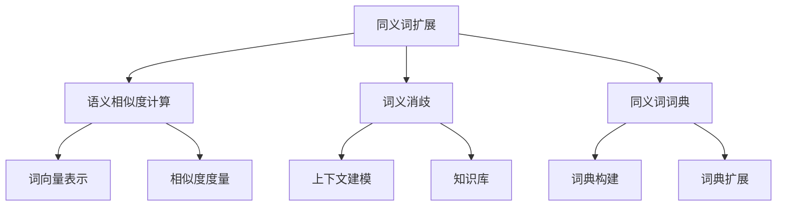
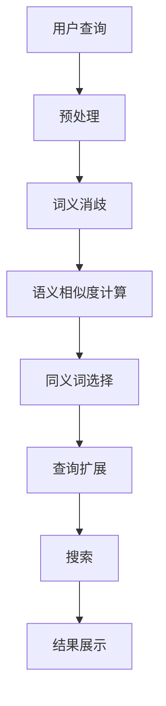

# 第二十篇：同义词扩展：扩大搜索范围，提升搜索召回率

## 1.背景介绍

在现代信息时代,搜索引擎已经成为我们获取信息的重要工具。然而,由于查询词与文档之间存在语义鸿沟,传统的基于关键词匹配的搜索方法往往无法满足用户的实际需求,导致搜索结果的召回率和准确率较低。为了解决这一问题,同义词扩展技术应运而生。

同义词扩展是指在搜索过程中,根据用户输入的查询词,自动扩展与之语义相关的同义词或近义词,从而扩大搜索范围,提高搜索结果的召回率。这项技术可以有效缓解查询词与文档之间的语义差异,提升搜索的整体效果。

### 1.1 语义鸿沟的挑战

在传统的基于关键词匹配的搜索系统中,存在以下几个主要挑战:

1. **词义歧义**:同一个词可能有多种不同的含义,例如"bank"可以指"银行"或"河岸"。
2. **同义表达**:不同的词或短语可能表达相同或相似的意思,例如"购买"和"买"。
3. **上下文依赖**:词义往往依赖于上下文,例如"apple"在"I have an apple"和"Apple Inc."中含义不同。

这些挑战导致了查询词与文档之间存在语义鸿沟,使得搜索系统难以准确理解用户的查询意图,从而影响搜索结果的质量。

### 1.2 同义词扩展的作用

通过同义词扩展技术,可以有效解决上述问题,主要作用包括:

1. **扩大搜索范围**:通过添加同义词或近义词,可以匹配更多相关文档,提高搜索的召回率。
2. **捕获语义信息**:同义词扩展可以捕获查询词和文档之间的语义关联,从而提高搜索的准确性。
3. **缓解词义歧义**:通过上下文信息,可以识别查询词的正确含义,并扩展相应的同义词。
4. **提高用户体验**:同义词扩展可以更好地理解用户的查询意图,返回更加相关的搜索结果,提升用户体验。

## 2.核心概念与联系

同义词扩展技术涉及多个核心概念,包括语义相似度计算、词义消歧、同义词词典等,这些概念相互关联,共同构建了同义词扩展的理论基础。

### 2.1 语义相似度计算

语义相似度计算是同义词扩展的核心环节,它通过计算查询词与候选同义词之间的语义相似度,从而确定应该扩展哪些同义词。常见的语义相似度计算方法包括:

1. **基于词向量的方法**:将词映射到低维连续向量空间,通过计算向量之间的余弦相似度或欧几里得距离来衡量语义相似度。
2. **基于知识库的方法**:利用现有的语义知识库(如WordNet)中定义的同义词关系,计算词与词之间的语义相似度。
3. **基于语料的方法**:从大规模语料库中学习词的上下文分布信息,基于分布式假设计算语义相似度。

### 2.2 词义消歧

由于同一个词可能有多种不同的含义,因此需要进行词义消歧(Word Sense Disambiguation, WSD),以确定查询词在特定上下文中的正确含义,从而扩展相应的同义词。常见的词义消歧方法包括:

1. **基于知识库的方法**:利用现有的语义知识库(如WordNet)中定义的词义信息,结合上下文信息进行词义消歧。
2. **基于语料的方法**:从大规模语料库中学习词义的上下文模式,基于上下文信息进行词义消歧。
3. **基于深度学习的方法**:利用神经网络模型自动学习词义表示,并基于上下文信息进行词义消歧。

### 2.3 同义词词典

同义词词典是同义词扩展的重要资源,它收录了大量同义词或近义词之间的关系。常见的同义词词典包括:

1. **人工构建的词典**:如WordNet、同义词词林等,由专家人工编纂。
2. **自动构建的词典**:从大规模语料库中自动挖掘同义词关系,构建同义词词典。
3. **知识库扩展的词典**:利用现有的知识库(如Wikipedia)中的语义信息,自动扩展同义词词典。

## 3.核心算法原理具体操作步骤

同义词扩展算法的核心步骤如下:

1. **预处理**:对用户查询进行分词、去停用词等预处理操作。
2. **词义消歧**:对查询词进行词义消歧,确定其在当前上下文中的正确含义。
3. **语义相似度计算**:基于查询词的正确含义,从同义词词典中选取候选同义词,计算它们与查询词之间的语义相似度。
4. **同义词选择**:根据语义相似度得分,选择相似度较高的同义词作为扩展词。
5. **查询扩展**:将选定的同义词与原始查询词组合,形成扩展查询。
6. **搜索**:使用扩展查询在文档集合中进行搜索,获取相关文档。
7. **结果展示**:将搜索结果按照相关性排序,展示给用户。

### 3.1 预处理

预处理是同义词扩展算法的第一步,主要包括以下操作:

1. **分词**:将查询语句分割成一个个单词或词组。
2. **去停用词**:去除查询语句中的停用词(如"的"、"了"等),保留有实际意义的词。
3. **词形还原**:将词归并为其原形,如将"running"归并为"run"。
4. **标注词性**:为每个词标注其词性(如名词、动词等),以便后续的词义消歧。

经过预处理后,查询语句被转换为一个由实词组成的序列,为后续的词义消歧和语义相似度计算奠定基础。

### 3.2 词义消歧

词义消歧是同义词扩展算法的关键环节,它旨在确定查询词在当前上下文中的正确含义,从而为后续的同义词选择提供依据。常见的词义消歧方法包括:

1. **基于知识库的方法**:利用现有的语义知识库(如WordNet)中定义的词义信息,结合上下文信息进行词义消歧。例如,对于查询词"bank",根据上下文信息判断其是指"银行"还是"河岸"的含义。
2. **基于语料的方法**:从大规模语料库中学习词义的上下文模式,基于上下文信息进行词义消歧。例如,如果上下文中出现了"存款"、"贷款"等词,则更倾向于将"bank"理解为"银行"的含义。
3. **基于深度学习的方法**:利用神经网络模型自动学习词义表示,并基于上下文信息进行词义消歧。例如,使用BERT等预训练语言模型,根据上下文信息动态计算词义表示,从而实现词义消歧。

经过词义消歧,查询词被赋予了正确的含义,为后续的同义词选择奠定了基础。

### 3.3 语义相似度计算

语义相似度计算是同义词扩展算法的核心环节,它通过计算查询词与候选同义词之间的语义相似度,从而确定应该扩展哪些同义词。常见的语义相似度计算方法包括:

1. **基于词向量的方法**:将词映射到低维连续向量空间,通过计算向量之间的余弦相似度或欧几里得距离来衡量语义相似度。例如,使用Word2Vec或GloVe等词向量模型,计算"购买"和"买"两个词向量之间的余弦相似度。
2. **基于知识库的方法**:利用现有的语义知识库(如WordNet)中定义的同义词关系,计算词与词之间的语义相似度。例如,根据WordNet中的定义,可以直接判断"购买"和"买"是同义词。
3. **基于语料的方法**:从大规模语料库中学习词的上下文分布信息,基于分布式假设计算语义相似度。例如,如果"购买"和"买"在语料库中的上下文分布高度相似,则认为它们具有较高的语义相似度。

经过语义相似度计算,系统可以得到一个候选同义词列表,其中每个同义词都与查询词具有一定的语义相似度分数。

### 3.4 同义词选择

在获得候选同义词列表及其语义相似度分数后,需要进行同义词选择,确定应该扩展哪些同义词。常见的同义词选择策略包括:

1. **阈值过滤**:设置一个语义相似度阈值,只选择相似度分数高于该阈值的同义词进行扩展。
2. **Top-K选择**:选择语义相似度分数最高的K个同义词进行扩展。
3. **加权选择**:根据语义相似度分数为每个同义词赋予不同的权重,在查询扩展时使用加权策略。

同义词选择策略需要根据具体的应用场景和需求进行调整,以达到最佳的扩展效果。

### 3.5 查询扩展

经过同义词选择后,系统获得了一组需要扩展的同义词。接下来,需要将这些同义词与原始查询词组合,形成扩展查询。常见的查询扩展方式包括:

1. **并集扩展**:将同义词与原始查询词进行并集操作,形成扩展查询。例如,原始查询为"购买书籍",扩展同义词为"买"和"购置",则扩展查询为"购买书籍 OR 买书籍 OR 购置书籍"。
2. **加权扩展**:根据同义词的语义相似度分数,为每个同义词赋予不同的权重,在查询扩展时使用加权策略。例如,原始查询为"购买书籍",扩展同义词及其权重为"买(0.9)"和"购置(0.7)",则扩展查询为"购买书籍 OR 0.9*买书籍 OR 0.7*购置书籍"。

查询扩展的目的是通过添加同义词,扩大查询的语义覆盖范围,从而提高搜索结果的召回率。

### 3.6 搜索

获得扩展查询后,系统可以在文档集合中进行搜索,获取相关文档。搜索过程可以采用传统的倒排索引和布尔查询模型,或者使用更加先进的向量空间模型等。

在搜索过程中,系统需要根据扩展查询中每个查询词的权重,计算文档与查询之间的相关性分数,并按照相关性分数对搜索结果进行排序。

### 3.7 结果展示

最后,系统需要将排序后的搜索结果展示给用户。在展示结果时,可以考虑以下几个方面:

1. **高亮显示**:在搜索结果中高亮显示与查询词(包括扩展的同义词)相关的关键词,以便用户快速浏览。
2. **结果聚类**:根据搜索结果的主题或类别,将相似的结果进行聚类展示,提高用户浏览效率。
3. **相关性反馈**:允许用户对搜索结果的相关性进行反馈,以便系统不断优化同义词扩展策略。
4. **查询建议**:根据用户的查询历史和搜索结果,为用户推荐相关的查询建议,以便进一步完善搜索。

通