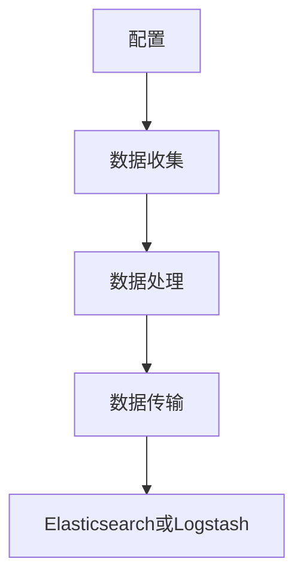

# 第八章 Winlogbeat：Windows事件日志采集

## 1.背景介绍

在现代信息技术环境中，日志数据的采集和分析是确保系统安全性和稳定性的重要手段。Windows事件日志是Windows操作系统中记录系统、应用程序和安全事件的重要数据源。为了有效地收集和分析这些日志数据，Elastic Stack（也称为ELK Stack）提供了一个名为Winlogbeat的轻量级数据采集器。

Winlogbeat是一个开源的、轻量级的代理程序，专门用于从Windows事件日志中收集数据并将其发送到Elasticsearch或Logstash进行进一步处理和分析。通过Winlogbeat，系统管理员和安全专家可以实时监控系统事件，检测异常行为，并采取相应的措施。

## 2.核心概念与联系

### 2.1 Winlogbeat的基本概念

Winlogbeat是Elastic Stack中的一部分，专门用于从Windows事件日志中收集数据。它可以配置为收集不同类型的事件日志，如应用程序日志、安全日志和系统日志。Winlogbeat的主要功能包括：

- **事件日志收集**：从指定的事件日志中收集数据。
- **数据传输**：将收集到的数据发送到Elasticsearch或Logstash。
- **数据过滤和处理**：在发送数据之前，可以对数据进行过滤和处理。

### 2.2 Winlogbeat与Elastic Stack的联系

Winlogbeat是Elastic Stack中的一个组件，其他主要组件包括Elasticsearch、Logstash和Kibana。它们之间的关系如下：

- **Elasticsearch**：一个分布式搜索和分析引擎，用于存储和查询日志数据。
- **Logstash**：一个数据处理管道，用于从多个来源收集、转换和存储数据。
- **Kibana**：一个数据可视化工具，用于在Elasticsearch中创建和分享数据的可视化视图。

Winlogbeat负责从Windows事件日志中收集数据，并将其发送到Elasticsearch或Logstash进行进一步处理和分析。

## 3.核心算法原理具体操作步骤

### 3.1 Winlogbeat的工作原理

Winlogbeat的工作原理可以分为以下几个步骤：

1. **配置**：通过配置文件指定要收集的事件日志类型和数据传输目标。
2. **数据收集**：Winlogbeat从指定的事件日志中收集数据。
3. **数据处理**：对收集到的数据进行过滤和处理。
4. **数据传输**：将处理后的数据发送到Elasticsearch或Logstash。

以下是Winlogbeat的工作流程图：



### 3.2 配置文件详解

Winlogbeat的配置文件通常是一个YAML文件，包含以下几个主要部分：

- **winlogbeat.event_logs**：指定要收集的事件日志类型。
- **output.elasticsearch**：配置Elasticsearch作为数据传输目标。
- **output.logstash**：配置Logstash作为数据传输目标。

以下是一个示例配置文件：

```yaml
winlogbeat:
  event_logs:
    - name: Application
    - name: Security
    - name: System

output.elasticsearch:
  hosts: ["http://localhost:9200"]

output.logstash:
  hosts: ["localhost:5044"]
```

## 4.数学模型和公式详细讲解举例说明

在Winlogbeat的工作过程中，虽然不涉及复杂的数学模型和公式，但理解数据传输和处理的效率是非常重要的。以下是一些关键的性能指标和公式：

### 4.1 数据传输速率

数据传输速率是指Winlogbeat将数据发送到Elasticsearch或Logstash的速度。可以用以下公式表示：

$$
R = \frac{D}{T}
$$

其中，$R$ 是数据传输速率，$D$ 是传输的数据量，$T$ 是传输时间。

### 4.2 数据处理延迟

数据处理延迟是指从数据收集到数据传输完成所需的时间。可以用以下公式表示：

$$
L = T_{collect} + T_{process} + T_{transmit}
$$

其中，$L$ 是数据处理延迟，$T_{collect}$ 是数据收集时间，$T_{process}$ 是数据处理时间，$T_{transmit}$ 是数据传输时间。

### 4.3 示例计算

假设Winlogbeat在一分钟内收集了100MB的数据，并且数据处理和传输分别花费了10秒和20秒，那么数据传输速率和数据处理延迟可以计算如下：

$$
R = \frac{100MB}{60s} \approx 1.67MB/s
$$

$$
L = 10s + 20s = 30s
$$

## 5.项目实践：代码实例和详细解释说明

### 5.1 安装Winlogbeat

首先，从Elastic官网下载安装Winlogbeat。以下是安装步骤：

1. 下载Winlogbeat安装包。
2. 解压安装包到指定目录。
3. 进入Winlogbeat目录，编辑配置文件`winlogbeat.yml`。

### 5.2 配置Winlogbeat

编辑`winlogbeat.yml`文件，配置要收集的事件日志和数据传输目标。以下是一个示例配置：

```yaml
winlogbeat:
  event_logs:
    - name: Application
    - name: Security
    - name: System

output.elasticsearch:
  hosts: ["http://localhost:9200"]
```

### 5.3 启动Winlogbeat

在命令行中进入Winlogbeat目录，运行以下命令启动Winlogbeat：

```bash
./winlogbeat -e
```

### 5.4 验证数据收集

启动Winlogbeat后，可以在Elasticsearch中查询收集到的数据。以下是一个示例查询：

```json
GET /winlogbeat-*/_search
{
  "query": {
    "match_all": {}
  }
}
```

## 6.实际应用场景

Winlogbeat在多个实际应用场景中发挥着重要作用，以下是一些典型的应用场景：

### 6.1 安全监控

通过收集和分析Windows安全日志，Winlogbeat可以帮助安全专家检测和响应安全事件。例如，检测未授权的登录尝试、恶意软件活动和系统配置更改。

### 6.2 系统性能监控

Winlogbeat可以收集系统日志和应用程序日志，帮助系统管理员监控系统性能和诊断问题。例如，检测系统崩溃、应用程序错误和资源使用情况。

### 6.3 合规性审计

在某些行业中，合规性审计是必不可少的。Winlogbeat可以收集和存储事件日志，帮助企业满足合规性要求。例如，记录用户活动、系统访问和数据更改。

## 7.工具和资源推荐

### 7.1 官方文档

- [Winlogbeat官方文档](https://www.elastic.co/guide/en/beats/winlogbeat/current/index.html)

### 7.2 社区资源

- [Elastic社区论坛](https://discuss.elastic.co/)
- [GitHub上的Winlogbeat项目](https://github.com/elastic/beats/tree/main