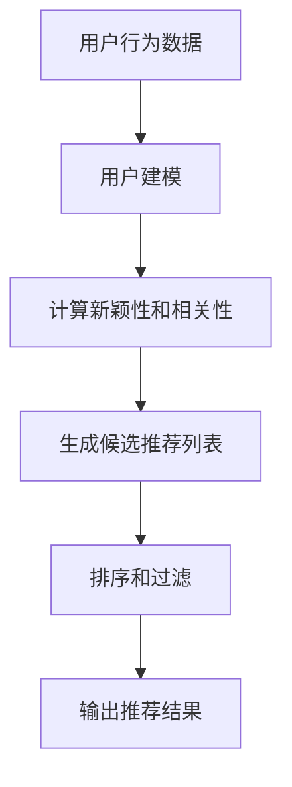

# 第十一篇：探索式推荐：打破信息茧房，发现新世界

## 1.背景介绍

### 1.1 信息过载时代

在当今信息时代,我们被海量的信息所包围。互联网、社交媒体、新闻媒体等渠道每天都在不断地向我们传递大量信息。然而,这种信息过载也带来了一个令人担忧的问题——信息茧房效应。

### 1.2 信息茧房效应

信息茧房效应是指人们倾向于只接收符合自己已有观点和偏好的信息,而忽视或回避与之相矛盾的信息。这种现象会导致人们被困在一个狭隘的信息空间中,无法获取新鲜、多元的观点和见解,从而影响个人的认知发展和决策质量。

### 1.3 探索式推荐系统的重要性

为了打破信息茧房,帮助用户发现新颖、多样化的信息,探索式推荐系统(Exploratory Recommender Systems)应运而生。它们旨在推荐与用户已知兴趣不同但又相关的新颖内容,从而扩展用户的视野,促进个人成长和多元化思维。

## 2.核心概念与联系

### 2.1 探索与利用的平衡

探索式推荐系统需要在"探索"(Exploration)和"利用"(Exploitation)之间寻求平衡。"利用"是指基于用户已知的偏好推荐相似的内容,而"探索"则是推荐新颖、不同于用户偏好的内容。过度"利用"会加剧信息茧房效应,而过度"探索"又可能导致推荐内容与用户兴趣相去甚远。

### 2.2 新颖性与相关性

新颖性(Novelty)和相关性(Relevance)是探索式推荐系统中的两个关键概念。新颖性指推荐内容与用户已知兴趣的不同程度,而相关性则指推荐内容与用户潜在兴趣的相关程度。理想的探索式推荐应该在新颖性和相关性之间达到适当的平衡。

### 2.3 用户建模

为了实现有效的探索式推荐,系统需要对用户的兴趣、偏好和行为进行建模。常见的用户建模方法包括基于内容的方法(Content-based)、协同过滤方法(Collaborative Filtering)和基于知识图谱的方法(Knowledge Graph-based)等。

## 3.核心算法原理具体操作步骤

探索式推荐系统的核心算法通常包括以下几个步骤:



### 3.1 用户建模

根据用户的历史交互数据(如浏览记录、评分等),构建用户兴趣模型。常见的方法包括:

- 基于内容的方法:利用内容特征(如文本主题、图像特征等)建模用户偏好。
- 协同过滤方法:利用用户之间的相似性建模用户偏好。
- 基于知识图谱的方法:将用户偏好映射到结构化的知识图谱上。

### 3.2 计算新颖性和相关性

对于候选推荐项目,计算其与用户已知兴趣的新颖性和相关性。常见的方法包括:

- 基于内容的新颖性:计算候选项目与用户已知兴趣的内容差异。
- 基于图的新颖性:计算候选项目在知识图谱上与用户已知兴趣的路径长度。
- 基于协同过滤的相关性:计算候选项目与用户潜在兴趣的相似度。

### 3.3 生成候选推荐列表

根据新颖性和相关性的计算结果,生成候选推荐列表。常见的策略包括:

- 基于阈值的过滤:设置新颖性和相关性的阈值,只保留满足条件的候选项目。
- 基于排名的选择:对候选项目按新颖性和相关性的综合分数进行排名,选取前N个作为推荐列表。

### 3.4 排序和过滤

对候选推荐列表进行进一步的排序和过滤,以提高推荐质量。常见的策略包括:

- 基于多目标优化:综合考虑新颖性、相关性、多样性等多个目标,对推荐列表进行优化排序。
- 基于上下文信息:根据用户的当前上下文(如时间、地点等)对推荐列表进行过滤和重排。
- 基于反馈机制:利用用户对推荐结果的反馈(如点击、评分等)对模型进行在线优化。

### 3.5 输出推荐结果

将优化后的推荐列表输出给用户,并持续收集用户反馈,用于模型的在线优化和迭代。

## 4.数学模型和公式详细讲解举例说明

探索式推荐系统中常用的数学模型和公式包括:

### 4.1 新颖性度量

#### 4.1.1 基于内容的新颖性

基于内容的新颖性通常使用项目之间内容特征的距离或相似度来衡量。常见的距离函数包括欧几里得距离、余弦相似度等。

对于一个候选推荐项目 $i$ 和用户已知兴趣集合 $R_u$,基于内容的新颖性可以定义为:

$$Novelty_i^{content} = \frac{1}{|R_u|}\sum_{j \in R_u}dist(f_i, f_j)$$

其中 $f_i$ 和 $f_j$ 分别表示项目 $i$ 和 $j$ 的内容特征向量,而 $dist(\cdot)$ 是距离函数。新颖性越大,表示候选项目与用户已知兴趣的内容差异越大。

#### 4.1.2 基于图的新颖性

在基于知识图谱的方法中,新颖性可以通过候选项目与用户已知兴趣在知识图谱上的最短路径长度来衡量。

对于一个候选推荐项目 $i$ 和用户已知兴趣集合 $R_u$,基于图的新颖性可以定义为:

$$Novelty_i^{graph} = \frac{1}{|R_u|}\sum_{j \in R_u}shortestPath(i, j)$$

其中 $shortestPath(i, j)$ 表示项目 $i$ 和 $j$ 在知识图谱上的最短路径长度。新颖性越大,表示候选项目与用户已知兴趣在知识图谱上的距离越远。

### 4.2 相关性度量

相关性度量通常基于项目与用户潜在兴趣的相似度或匹配程度。在协同过滤方法中,常用的相关性度量包括余弦相似度、皮尔逊相关系数等。

对于一个候选推荐项目 $i$ 和用户 $u$,基于协同过滤的相关性可以定义为:

$$Relevance_i^{CF} = \sum_{j \in R_u}sim(i, j)r_{uj}$$

其中 $R_u$ 是用户 $u$ 已知兴趣的项目集合, $r_{uj}$ 是用户 $u$ 对项目 $j$ 的评分或偏好值, $sim(i, j)$ 是项目 $i$ 和 $j$ 之间的相似度。相关性越高,表示候选项目与用户潜在兴趣越匹配。

### 4.3 新颖性和相关性的综合

为了平衡新颖性和相关性,探索式推荐系统通常采用加权线性组合或其他多目标优化方法将两者结合。

$$Score_i = \alpha \cdot Novelty_i + \beta \cdot Relevance_i$$

其中 $\alpha$ 和 $\beta$ 分别是新颖性和相关性的权重系数,可以根据具体场景进行调整。通过优化 $Score_i$,可以获得兼顾新颖性和相关性的推荐列表。

## 5.项目实践:代码实例和详细解释说明

以下是一个基于Python和TensorFlow实现的简单探索式推荐系统示例:

### 5.1 数据准备

假设我们有一个电影数据集,包含电影的元数据(如标题、类型、演员等)和用户的评分数据。我们将使用协同过滤方法进行推荐。

```python
import pandas as pd

# 加载电影元数据
movies = pd.read_csv('movies.csv')

# 加载用户评分数据
ratings = pd.read_csv('ratings.csv')
```

### 5.2 数据预处理

对数据进行必要的预处理,如处理缺失值、编码类别特征等。

```python
# 填充缺失值
movies = movies.fillna('')

# 对类别特征进行编码
from sklearn.preprocessing import LabelEncoder

le = LabelEncoder()
movies['genre'] = le.fit_transform(movies['genre'])
```

### 5.3 构建用户-项目交互矩阵

将用户评分数据转换为用户-项目交互矩阵,作为模型的输入。

```python
import numpy as np

# 构建用户-项目交互矩阵
user_movie_matrix = ratings.pivot(index='userId', columns='movieId', values='rating').fillna(0)
user_movie_matrix = user_movie_matrix.values
```

### 5.4 构建模型

我们使用基于深度学习的矩阵分解模型进行协同过滤推荐。

```python
import tensorflow as tf

# 定义模型参数
num_users = user_movie_matrix.shape[0]
num_movies = user_movie_matrix.shape[1]
embedding_size = 50

# 定义embeddings
user_embeddings = tf.Variable(tf.random.normal([num_users, embedding_size]))
movie_embeddings = tf.Variable(tf.random.normal([num_movies, embedding_size]))

# 定义模型
user_ids = tf.placeholder(tf.int32, shape=[None])
movie_ids = tf.placeholder(tf.int32, shape=[None])

user_embed = tf.nn.embedding_lookup(user_embeddings, user_ids)
movie_embed = tf.nn.embedding_lookup(movie_embeddings, movie_ids)

# 计算用户-项目交互得分
logits = tf.multiply(user_embed, movie_embed)
logits = tf.reduce_sum(logits, axis=1)

# 定义损失函数和优化器
ratings = tf.placeholder(tf.float32, shape=[None])
loss = tf.losses.mean_squared_error(ratings, logits)
optimizer = tf.train.AdamOptimizer().minimize(loss)
```

### 5.5 模型训练

使用训练数据对模型进行训练。

```python
# 训练模型
num_epochs = 10
batch_size = 256

with tf.Session() as sess:
    sess.run(tf.global_variables_initializer())
    
    for epoch in range(num_epochs):
        for batch in range(user_movie_matrix.shape[0] // batch_size):
            start_idx = batch * batch_size
            end_idx = (batch + 1) * batch_size
            
            user_batch = user_movie_matrix[start_idx:end_idx, :]
            movie_batch = user_movie_matrix[start_idx:end_idx, :].T
            
            user_ids_batch = [i for i in range(start_idx, end_idx) for _ in range(num_movies)]
            movie_ids_batch = [j for _ in range(batch_size) for j in range(num_movies)]
            ratings_batch = user_batch.flatten()
            
            _, loss_val = sess.run([optimizer, loss], feed_dict={
                user_ids: user_ids_batch,
                movie_ids: movie_ids_batch,
                ratings: ratings_batch
            })
            
            print(f'Epoch {epoch}, Batch {batch}, Loss: {loss_val}')
```

### 5.6 生成推荐

对于给定的用户,我们可以计算所有未评分电影的得分,并推荐得分最高的电影。

```python
# 生成推荐
user_id = 42

# 获取用户已评分的电影
rated_movies = user_movie_matrix[user_id].nonzero()[0]

# 计算未评分电影的得分
unrated_movies = np.setdiff1d(np.arange(num_movies), rated_movies)
user_embed = user_embeddings[user_id]
movie_embeds = movie_embeddings[unrated_movies]
scores = np.sum(user_embed * movie_embeds, axis=1)

# 推荐得分最高的电影
top_movies = unrated_movies[np.argsort(-scores)][:5]
print(f'Recommended movies for user {user_id}:')
for movie_id in top_movies:
    print(movies.loc[movies['movieId'] == movie_id, 'title'].values[0])
```

在这个示例中,我们使用了基于深度学习的矩阵分解模型进行协同过滤推荐。但是,这只是一个简单的示例,实际的探索式推荐系统需要