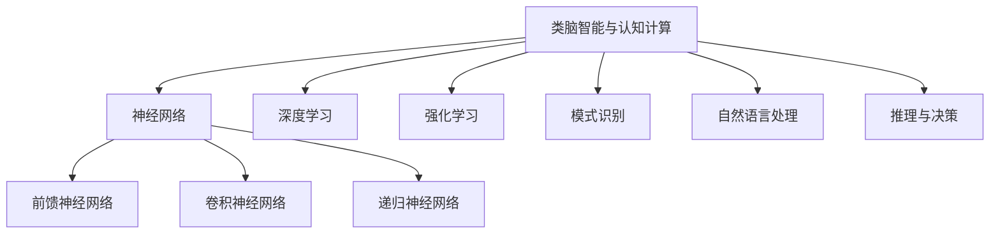

# 类脑智能与认知计算原理与代码实战案例讲解

## 1.背景介绍

### 1.1 人工智能的发展历程

人工智能(Artificial Intelligence, AI)是当代科技发展的重要领域,旨在创建出能够模仿人类智能行为的智能系统。自20世纪50年代AI概念被正式提出以来,经历了起起伏伏的发展历程。

### 1.2 类脑智能与认知计算的兴起 

传统的AI系统主要基于符号主义和机器学习等方法,存在诸多局限性。为了突破瓶颈,类脑智能(Brain-Inspired AI)和认知计算(Cognitive Computing)应运而生,旨在模拟人脑的信息处理机制,构建更加智能、灵活和高效的人工智能系统。

### 1.3 类脑智能与认知计算的重要性

类脑智能与认知计算为人工智能注入了新的活力,开辟了前所未有的发展道路。它们有望解决传统AI系统面临的诸多挑战,如数据驱动、缺乏理解和解释能力等,从而推动AI系统向更高水平发展。

## 2.核心概念与联系

### 2.1 类脑智能

类脑智能是一种新兴的人工智能范式,旨在模拟人脑的结构和功能,构建具有类脑机制的智能系统。它包括以下核心概念:

#### 2.1.1 神经网络

神经网络(Neural Networks)是类脑智能的基础,它模拟了人脑中神经元之间的连接和信息传递过程。常见的神经网络模型包括前馈神经网络、卷积神经网络和递归神经网络等。

#### 2.1.2 深度学习

深度学习(Deep Learning)是一种基于多层神经网络的机器学习方法,能够从大量数据中自动学习特征表示,在计算机视觉、自然语言处理等领域取得了突破性进展。

#### 2.1.3 强化学习

强化学习(Reinforcement Learning)是一种基于奖励机制的学习方法,智能体通过与环境的交互,不断尝试和学习,以获取最大化的累积奖励。它在决策控制、游戏AI等领域有广泛应用。

### 2.2 认知计算

认知计算是一种灵感来自人脑认知过程的计算范式,旨在构建具有类人智能的计算系统。它包括以下核心概念:

#### 2.2.1 模式识别

模式识别(Pattern Recognition)是认知计算的基础,它能够从复杂的数据中识别出有意义的模式和规律,为进一步的决策和推理提供支持。

#### 2.2.2 自然语言处理

自然语言处理(Natural Language Processing, NLP)是认知计算的重要组成部分,它使计算机能够理解和生成人类自然语言,实现人机自然交互。

#### 2.2.3 推理与决策

推理与决策(Reasoning and Decision Making)是认知计算的核心,它模拟人类的思维过程,基于已有知识和证据进行逻辑推理,并作出相应的决策。

### 2.3 类脑智能与认知计算的关系

类脑智能和认知计算虽然有所区别,但二者存在紧密联系。类脑智能侧重于模拟人脑的结构和功能,而认知计算则更注重模拟人类的认知过程。它们相互借鉴和融合,共同推动了人工智能的发展。

## 3.核心算法原理具体操作步骤

### 3.1 神经网络

神经网络是类脑智能和认知计算的基础,其核心算法原理包括前向传播和反向传播。

#### 3.1.1 前向传播

前向传播(Forward Propagation)是神经网络的基本运算过程,它模拟了生物神经元接收输入信号、进行加权求和和激活函数计算的过程。具体步骤如下:

1. 输入层接收输入数据
2. 隐藏层对输入数据进行加权求和计算: $z = \sum_{i=1}^{n}w_ix_i + b$
3. 隐藏层通过激活函数(如Sigmoid、ReLU等)进行非线性变换: $a = f(z)$
4. 输出层根据隐藏层的输出计算最终结果

#### 3.1.2 反向传播

反向传播(Backpropagation)是神经网络的核心学习算法,它通过计算损失函数对网络参数进行调整,使网络能够逐步拟合训练数据。具体步骤如下:

1. 计算输出层与目标值之间的误差
2. 计算输出层误差对权重和偏置的梯度
3. 根据梯度下降法更新输出层权重和偏置
4. 计算隐藏层误差,并反向传播到前一层
5. 重复步骤2-4,更新所有隐藏层权重和偏置
6. 重复以上过程,直至网络收敛或达到最大迭代次数

### 3.2 卷积神经网络

卷积神经网络(Convolutional Neural Network, CNN)是一种专门用于处理图像和视频数据的神经网络,其核心算法包括卷积操作和池化操作。

#### 3.2.1 卷积操作

卷积操作(Convolution)是CNN的核心,它通过在输入数据上滑动卷积核,提取局部特征。具体步骤如下:

1. 初始化卷积核权重
2. 在输入数据上滑动卷积核,进行元素级乘积和求和
3. 对卷积结果应用激活函数(如ReLU)
4. 重复步骤2-3,直至完成整个输入数据的卷积操作

#### 3.2.2 池化操作

池化操作(Pooling)是CNN中的下采样操作,它能够减小特征图的空间维度,提高网络的计算效率和鲁棒性。常见的池化方法包括最大池化和平均池化。

1. 划分池化窗口
2. 在每个窗口内进行最大值或平均值计算
3. 用计算结果代替原窗口数据

通过卷积操作和池化操作的交替使用,CNN能够逐层提取输入数据的高级语义特征,从而实现对图像、视频等数据的高效处理和识别。

### 3.3 递归神经网络

递归神经网络(Recurrent Neural Network, RNN)是一种专门用于处理序列数据(如文本、语音等)的神经网络,它能够捕捉序列数据中的长期依赖关系。

#### 3.3.1 RNN基本原理

RNN的核心思想是在每个时间步都将当前输入与前一状态进行组合,并通过非线性变换得到当前状态。具体计算过程如下:

$$h_t = f(x_t, h_{t-1})$$

其中:
- $h_t$表示当前时间步的隐藏状态
- $x_t$表示当前时间步的输入
- $h_{t-1}$表示前一时间步的隐藏状态
- $f$表示非线性变换函数,通常为tanh或ReLU

#### 3.3.2 长短期记忆网络(LSTM)

由于传统RNN存在梯度消失或梯度爆炸的问题,长短期记忆网络(Long Short-Term Memory, LSTM)应运而生。LSTM通过引入门控机制,能够更好地捕捉长期依赖关系。

LSTM的核心计算过程包括:

1. 忘记门(Forget Gate):决定丢弃上一状态中的哪些信息
2. 输入门(Input Gate):决定保留当前输入和上一状态的哪些信息
3. 更新候选值(Update Candidate):根据当前输入和上一状态计算新的候选值
4. 输出门(Output Gate):决定输出什么信息到最终状态

通过上述门控机制,LSTM能够灵活地控制信息的流动,从而有效解决长期依赖问题。

### 3.4 强化学习

强化学习(Reinforcement Learning)是一种基于奖励机制的学习方式,智能体通过与环境交互,不断尝试和学习,以获取最大化的累积奖励。

#### 3.4.1 强化学习基本框架

强化学习的基本框架包括:

- 环境(Environment):智能体所处的环境
- 状态(State):描述环境的当前状态
- 动作(Action):智能体可执行的操作
- 奖励(Reward):智能体执行动作后获得的反馈
- 策略(Policy):智能体选择动作的策略

强化学习的目标是找到一个最优策略,使得在给定环境下,智能体能够获得最大化的累积奖励。

#### 3.4.2 Q-Learning算法

Q-Learning是强化学习中一种常用的无模型算法,它通过不断更新状态-动作值函数(Q函数)来逼近最优策略。具体步骤如下:

1. 初始化Q函数
2. 对于每个状态-动作对(s, a):
    - 执行动作a,观察到新状态s'和奖励r
    - 更新Q(s, a)值:
        $$Q(s, a) \leftarrow Q(s, a) + \alpha[r + \gamma\max_{a'}Q(s', a') - Q(s, a)]$$
    - 转移到新状态s'
3. 重复步骤2,直至收敛

通过不断探索和利用,Q-Learning算法能够逐步找到最优策略,实现智能决策。

## 4.数学模型和公式详细讲解举例说明

### 4.1 神经网络中的数学模型

#### 4.1.1 前向传播

在神经网络的前向传播过程中,每一层的输出都可以表示为:

$$\mathbf{a}^{(l)} = f(\mathbf{W}^{(l)}\mathbf{a}^{(l-1)} + \mathbf{b}^{(l)})$$

其中:
- $\mathbf{a}^{(l)}$表示第l层的输出
- $\mathbf{W}^{(l)}$表示第l层的权重矩阵
- $\mathbf{b}^{(l)}$表示第l层的偏置向量
- $f$表示激活函数,如Sigmoid、ReLU等

对于输入层,我们有$\mathbf{a}^{(0)} = \mathbf{x}$,其中$\mathbf{x}$是输入数据。

#### 4.1.2 反向传播

在反向传播过程中,我们需要计算每一层的误差,并根据误差更新权重和偏置。

假设我们使用均方误差作为损失函数:

$$J(\mathbf{W}, \mathbf{b}) = \frac{1}{2}\sum_{i=1}^{m}(\mathbf{y}^{(i)} - \hat{\mathbf{y}}^{(i)})^2$$

其中:
- $\mathbf{y}^{(i)}$表示第i个样本的真实标签
- $\hat{\mathbf{y}}^{(i)}$表示第i个样本的预测输出

我们可以使用梯度下降法来更新权重和偏置:

$$\mathbf{W}^{(l)} \leftarrow \mathbf{W}^{(l)} - \alpha\frac{\partial J}{\partial \mathbf{W}^{(l)}}$$
$$\mathbf{b}^{(l)} \leftarrow \mathbf{b}^{(l)} - \alpha\frac{\partial J}{\partial \mathbf{b}^{(l)}}$$

其中$\alpha$是学习率,用于控制更新步长。

通过反向传播算法,我们可以计算出每一层的梯度,从而更新权重和偏置,使网络逐步拟合训练数据。

### 4.2 卷积神经网络中的数学模型

#### 4.2.1 卷积操作

在卷积神经网络中,卷积操作可以表示为:

$$\mathbf{a}_{j}^{(l)} = f\left(\sum_{i=1}^{n}\mathbf{W}_{ij}^{(l)} * \mathbf{a}_{i}^{(l-1)} + \mathbf{b}_{j}^{(l)}\right)$$

其中:
- $\mathbf{a}_{j}^{(l)}$表示第l层第j个特征图的输出
- $\mathbf{W}_{ij}^{(l)}$表示第l层第i个输入特征图与第j个卷