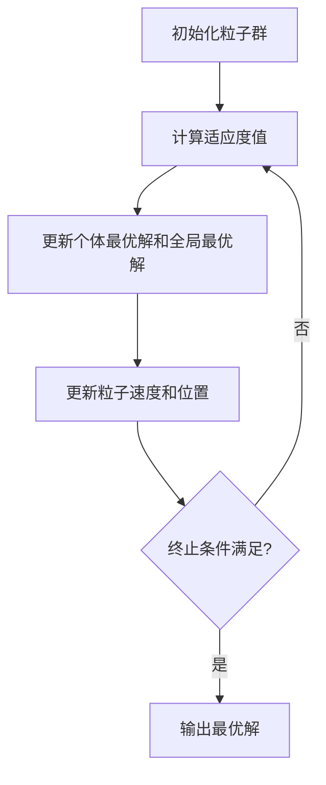

# "粒子群优化算法在物联网中的应用"

## 1. 背景介绍

### 1.1 物联网概述

物联网(Internet of Things, IoT)是一种新兴的网络技术,旨在将各种物理设备连接到互联网,实现设备与设备之间、人与设备之间的智能交互和信息交换。随着物联网技术的不断发展,越来越多的设备被连接到网络中,产生了大量的数据。如何高效地处理和利用这些数据,成为了物联网发展的关键挑战之一。

### 1.2 优化算法在物联网中的作用

在物联网系统中,常常需要解决各种优化问题,例如路由优化、资源分配优化、能耗优化等。传统的优化算法往往受到问题规模、约束条件等因素的限制,难以找到最优解。粒子群优化算法(Particle Swarm Optimization, PSO)作为一种新型的智能优化算法,具有简单高效、易于实现、收敛性好等优点,在物联网领域展现出了广阔的应用前景。

## 2. 核心概念与联系

### 2.1 粒子群优化算法概述

粒子群优化算法是一种基于群体智能的随机搜索算法,它的思想源于对鸟群捕食行为的模拟。算法中的每个粒子代表一个候选解,粒子在解空间中不断移动,通过追踪当前最优解和历史最优解,不断更新自身的位置和速度,最终收敛到全局最优解。

### 2.2 粒子群优化算法核心概念

1. **粒子(Particle)**: 代表一个候选解,包含位置向量和速度向量。
2. **适应度函数(Fitness Function)**: 用于评估粒子的优劣,值越小表示粒子越优秀。
3. **个体最优解(Personal Best, pbest)**: 粒子自身搜索过程中发现的最优解。
4. **全局最优解(Global Best, gbest)**: 整个粒子群中发现的最优解。

### 2.3 粒子群优化算法与物联网的联系

物联网系统中存在许多优化问题,例如路由优化、资源分配优化、能耗优化等,这些问题往往具有高维、非线性、多约束等特点,传统的优化算法难以有效解决。粒子群优化算法作为一种智能优化算法,具有以下优势:

1. **无需梯度信息**: 不需要目标函数的梯度信息,适用于非线性、非凸优化问题。
2. **高并行性**: 算法中的粒子可以同时进行搜索,易于并行计算。
3. **全局搜索能力强**: 算法具有良好的全局搜索能力,不易陷入局部最优。

因此,粒子群优化算法在物联网优化问题中具有广阔的应用前景。

## 3. 核心算法原理具体操作步骤

粒子群优化算法的核心思想是通过模拟鸟群捕食行为,利用群体智能来搜索解空间,找到最优解。算法的具体操作步骤如下:



1. **初始化粒子群**

   - 随机初始化一组粒子的位置和速度,构成初始粒子群。
   - 设置算法参数,如粒子数量、最大迭代次数、惯性权重等。

2. **计算适应度值**

   - 对每个粒子,计算其适应度函数值,评估其优劣程度。

3. **更新个体最优解和全局最优解**

   - 对每个粒子,将当前位置与其个体最优解进行比较,如果更优则更新个体最优解。
   - 在整个粒子群中,选择适应度函数值最小的粒子作为全局最优解。

4. **更新粒子速度和位置**

   - 根据当前粒子的速度、个体最优解和全局最优解,更新粒子的速度和位置。
   - 速度更新公式: $v_{i}^{t+1} = wv_{i}^{t} + c_{1}r_{1}(pbest_{i}^{t} - x_{i}^{t}) + c_{2}r_{2}(gbest^{t} - x_{i}^{t})$
   - 位置更新公式: $x_{i}^{t+1} = x_{i}^{t} + v_{i}^{t+1}$

5. **终止条件判断**

   - 判断是否满足终止条件,如达到最大迭代次数或收敛到最优解。
   - 如果满足终止条件,输出当前的全局最优解作为最终结果。
   - 如果不满足终止条件,返回步骤2,继续迭代。

通过不断迭代,粒子群将逐渐收敛到全局最优解。算法的关键在于通过个体最优解和全局最优解的引导,实现粒子在解空间中的有效搜索。

## 4. 数学模型和公式详细讲解举例说明

### 4.1 粒子群优化算法数学模型

粒子群优化算法的数学模型可以表示为:

$$\begin{aligned}
\min_{x \in \mathbb{R}^{n}} & f(x) \\
\text{s.t.} & g_{j}(x) \leq 0, \quad j = 1, 2, \ldots, m
\end{aligned}$$

其中:

- $f(x)$是待优化的目标函数
- $g_{j}(x)$是约束条件
- $x$是决策变量向量,维度为$n$

粒子群优化算法通过在解空间中不断搜索,试图找到最小化目标函数$f(x)$的最优解$x^{*}$,同时满足约束条件$g_{j}(x) \leq 0$。

### 4.2 速度更新公式

粒子的速度更新公式为:

$$v_{i}^{t+1} = wv_{i}^{t} + c_{1}r_{1}(pbest_{i}^{t} - x_{i}^{t}) + c_{2}r_{2}(gbest^{t} - x_{i}^{t})$$

其中:

- $v_{i}^{t}$是第$i$个粒子在第$t$次迭代时的速度向量
- $w$是惯性权重,用于控制粒子的惯性
- $c_{1}$和$c_{2}$是加速常数,用于控制粒子向个体最优解和全局最优解的收敛程度
- $r_{1}$和$r_{2}$是均匀分布在$[0, 1]$区间内的随机数
- $pbest_{i}^{t}$是第$i$个粒子在第$t$次迭代时的个体最优解
- $gbest^{t}$是在第$t$次迭代时的全局最优解

该公式体现了粒子速度的三个主要影响因素:

1. 惯性项$wv_{i}^{t}$,使粒子保持当前运动惯性。
2. 个体最优解引导项$c_{1}r_{1}(pbest_{i}^{t} - x_{i}^{t})$,使粒子向个体最优解靠拢。
3. 全局最优解引导项$c_{2}r_{2}(gbest^{t} - x_{i}^{t})$,使粒子向全局最优解靠拢。

通过适当设置参数$w$、$c_{1}$和$c_{2}$,可以平衡粒子的全局搜索能力和局部搜索能力,提高算法的性能。

### 4.3 位置更新公式

粒子的位置更新公式为:

$$x_{i}^{t+1} = x_{i}^{t} + v_{i}^{t+1}$$

其中$x_{i}^{t}$是第$i$个粒子在第$t$次迭代时的位置向量,通过加上更新后的速度向量$v_{i}^{t+1}$,得到粒子在下一次迭代时的新位置$x_{i}^{t+1}$。

### 4.4 算法收敛性分析

粒子群优化算法的收敛性是指算法在有限次迭代后能够收敛到最优解或其附近。算法的收敛性主要取决于以下几个因素:

1. **惯性权重$w$的选择**

   通常采用线性递减的惯性权重策略,初始值较大,有利于全局搜索;后期值较小,有利于局部搜索和收敛。

2. **加速常数$c_{1}$和$c_{2}$的选择**

   $c_{1}$和$c_{2}$控制着粒子向个体最优解和全局最优解的收敛程度,通常取值为$c_{1} = c_{2} = 2$。

3. **粒子群规模和最大迭代次数**

   粒子群规模越大,全局搜索能力越强;最大迭代次数越多,收敛性越好。

4. **初始化策略**

   合理的初始化策略可以加快算法收敛速度。

在满足上述条件下,粒子群优化算法具有较好的收敛性,能够在有限次迭代后收敛到最优解或其附近。

### 4.5 算法收敛性举例

考虑以下单峰函数最小化问题:

$$f(x) = x^{2}$$

其最优解为$x^{*} = 0$,函数值为$f(x^{*}) = 0$。

我们使用粒子群优化算法来求解该问题,设置参数如下:

- 粒子数量: 20
- 最大迭代次数: 200
- 惯性权重$w$: 线性递减策略,初始值为0.9,终止值为0.4
- 加速常数$c_{1} = c_{2} = 2$

算法的收敛过程如下图所示:


可以看到,随着迭代次数的增加,粒子群逐渐收敛到最优解$x^{*} = 0$附近。这说明在适当的参数设置下,粒子群优化算法具有良好的收敛性,能够有效求解单峰函数最小化问题。

## 5. 项目实践:代码实例和详细解释说明

为了更好地理解粒子群优化算法的实现,我们将使用Python编程语言,基于开源库PySwarms实现一个粒子群优化算法的示例项目。

### 5.1 项目概述

本项目旨在使用粒子群优化算法求解一个具有约束条件的非线性优化问题。问题描述如下:

$$\begin{aligned}
\min_{x \in \mathbb{R}^{2}} & f(x) = (x_{1} - 2)^{2} + (x_{2} - 1)^{2} \\
\text{s.t.} & x_{1}^{2} + x_{2}^{2} \leq 4 \\
           & x_{1} \geq 0, x_{2} \geq 0
\end{aligned}$$

该问题的最优解为$x^{*} = (2, 1)$,函数值为$f(x^{*}) = 0$。

### 5.2 代码实现

```python
import numpy as np
from pyswarms.utils.functions import single_obj as fx
from pyswarms.single.global_best import GlobalBestPSO

# 定义目标函数
def objective_function(x):
    x1, x2 = x
    return (x1 - 2) ** 2 + (x2 - 1) ** 2

# 定义约束条件
def constraint_function(x):
    x1, x2 = x
    return np.array([x1 ** 2 + x2 ** 2 - 4, -x1, -x2])

# 初始化粒子群优化算法
options = {'c1': 0.5, 'c2': 0.3, 'w': 0.9}
optimizer = GlobalBestPSO(n_particles=50, dimensions=2, options=options)

# 执行优化
cost, pos = optimizer.optimize(objective_function, iters=1000, constraints=constraint_function)

# 输出结果
print(f"最优解: {pos}")
print(f"最小函数值: {cost}")
```

代码解释:

1. 导入所需的库和模块。
2. 定义目标函数`objective_function`和约束条件`constraint_function`。
3. 初始化粒子群优化算法实例`optimizer`。
4. 调用`optimizer.optimize`方法执行优化,传入目标