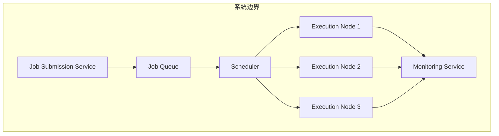

# 网络远程作业处理系统详细设计与具体代码实现

## 1.背景介绍

在当今快节奏的工作环境中,远程工作和灵活的工作安排变得越来越普遍。为了满足这种需求,开发一个高效、可靠的网络远程作业处理系统变得至关重要。该系统旨在提供一个集中式平台,允许用户提交和管理远程作业,同时系统可以自动分发、执行和监控这些作业。

远程作业处理系统的主要目标是:

1. 提高工作效率,减轻手动操作的负担
2. 实现资源的合理分配和利用
3. 提供作业状态的实时监控和报告
4. 确保作业执行的可靠性和容错性
5. 支持多种作业类型和执行环境

该系统可广泛应用于科研计算、大数据处理、媒体渲染、软件构建等领域,为用户提供高性能、可扩展的远程计算能力。

## 2.核心概念与联系

网络远程作业处理系统涉及以下几个核心概念:

### 2.1 作业 (Job)

作业是系统的基本操作单元,表示一个需要执行的任务或计算过程。作业可以是脚本、程序、命令等多种形式,具有特定的输入、输出和执行要求。

### 2.2 作业队列 (Job Queue)

作业队列用于暂存和管理待执行的作业。根据作业的优先级、资源需求等,作业队列可以对作业进行排序和分发。

### 2.3 执行节点 (Execution Node)

执行节点是实际运行作业的计算资源,可以是物理机或虚拟机。执行节点需要具备满足作业要求的硬件、软件环境。

### 2.4 资源管理器 (Resource Manager)

资源管理器负责监控和管理可用的执行节点资源,根据作业需求选择合适的节点执行作业。它还需要处理节点故障和资源过载等异常情况。

### 2.5 调度器 (Scheduler)

调度器根据预定义的调度策略,从作业队列中选取作业,并将其分发到合适的执行节点上运行。调度策略可以考虑作业优先级、资源利用率、公平性等因素。

### 2.6 监控器 (Monitor)

监控器跟踪作业的执行状态,收集运行日志和统计数据,提供实时的作业进度反馈。在发生故障时,它还可以触发相应的故障处理机制。

这些核心概念相互关联、协同工作,构建了远程作业处理系统的基础架构。用户通过提交作业,系统自动对作业进行调度、执行、监控,最终将结果反馈给用户。

## 3.核心算法原理具体操作步骤

### 3.1 作业提交

用户可以通过命令行工具、Web 界面或 API 接口向系统提交作业。作业提交过程包括以下步骤:

1. 用户指定作业的执行脚本或程序,以及相关的输入数据。
2. 系统对作业进行基本的语法和环境检查,确保其可执行性。
3. 如果检查通过,系统将作业存储到作业队列中,等待后续的调度和执行。

```python
def submit_job(job_script, input_data, job_requirements):
    # 检查作业脚本和输入数据的合法性
    validate_job(job_script, input_data)
    
    # 创建作业对象
    job = Job(job_script, input_data, job_requirements)
    
    # 将作业添加到作业队列
    job_queue.enqueue(job)
    
    return job.job_id
```

### 3.2 资源管理

资源管理器持续监控可用的执行节点,维护一个节点池。当有新的节点加入或现有节点退出时,资源管理器会相应地更新节点池。它还会定期检查节点的健康状态,确保节点可用于执行作业。

```python
class ResourceManager:
    def __init__(self):
        self.node_pool = []
        self.monitor_nodes()
    
    def monitor_nodes(self):
        while True:
            # 检查节点状态
            for node in self.node_pool:
                if not node.is_alive():
                    self.node_pool.remove(node)
            
            # 发现新节点
            new_nodes = discover_nodes()
            self.node_pool.extend(new_nodes)
            
            time.sleep(60)  # 每隔一分钟检查一次
```

### 3.3 作业调度

调度器根据预定义的调度策略,从作业队列中选择待执行的作业,并将其分发到合适的执行节点上运行。常用的调度策略包括先到先服务 (FCFS)、短作业优先 (SJF)、基于优先级的调度等。

```python
def schedule_jobs(scheduling_policy):
    while True:
        # 从作业队列中获取待执行作业
        job = job_queue.dequeue()
        
        # 根据调度策略选择合适的执行节点
        node = scheduling_policy.select_node(job, resource_manager.node_pool)
        
        # 将作业分发到执行节点
        node.execute_job(job)
        
        time.sleep(5)  # 每隔5秒检查一次作业队列
```

### 3.4 作业执行

执行节点接收到作业后,会在本地环境中运行作业脚本或程序。作业的输入数据可以来自本地文件系统或远程存储。执行过程中,节点会定期向监控器报告作业状态和进度。

```python
class ExecutionNode:
    def execute_job(self, job):
        # 准备执行环境
        setup_environment(job.requirements)
        
        # 运行作业脚本
        run_job_script(job.script, job.input_data)
        
        # 收集作业输出
        job.output_data = collect_output()
        
        # 报告作业完成
        monitor.report_job_completion(job)
```

### 3.5 监控和故障处理

监控器跟踪作业的执行状态,收集运行日志和统计数据。如果发现作业执行失败或节点故障,监控器会触发相应的故障处理机制,例如重新调度作业、重启节点或发送警报通知。

```python
class Monitor:
    def __init__(self):
        self.job_status = {}
    
    def report_job_completion(self, job):
        self.job_status[job.job_id] = 'completed'
    
    def report_job_failure(self, job, error_message):
        self.job_status[job.job_id] = 'failed'
        # 触发故障处理机制
        handle_job_failure(job, error_message)
    
    def monitor_jobs(self):
        while True:
            # 检查作业状态
            for job_id, status in self.job_status.items():
                if status == 'failed':
                    handle_job_failure(job_id)
            
            time.sleep(60)  # 每隔一分钟检查一次作业状态
```

通过这些核心算法和操作步骤,远程作业处理系统可以高效、可靠地执行用户提交的作业,实现资源的合理分配和利用。

## 4.数学模型和公式详细讲解举例说明

在远程作业处理系统中,合理的作业调度策略对于提高系统性能和资源利用率至关重要。常见的调度策略包括先到先服务 (FCFS)、短作业优先 (SJF)、基于优先级的调度等。这些策略可以使用数学模型和公式进行描述和分析。

### 4.1 先到先服务 (FCFS) 调度

先到先服务 (FCFS) 调度是最简单的调度策略,作业按照到达队列的顺序执行。该策略的优点是公平性好,缺点是可能导致较长作业长时间占用资源,降低整体吞吐量。

假设有 $n$ 个作业 $J_1, J_2, \dots, J_n$,其到达时间分别为 $a_1, a_2, \dots, a_n$,执行时间分别为 $t_1, t_2, \dots, t_n$。在 FCFS 调度下,作业 $J_i$ 的完成时间 $c_i$ 可以按照以下公式计算:

$$c_i = \max\left(a_i, c_{i-1}\right) + t_i$$

其中 $c_0 = 0$。

例如,有三个作业 $J_1, J_2, J_3$,到达时间分别为 $0, 1, 3$,执行时间分别为 $3, 6, 2$。根据上述公式,我们可以计算出各作业的完成时间:

$$
\begin{aligned}
c_1 &= \max(0, 0) + 3 = 3 \\
c_2 &= \max(1, 3) + 6 = 9 \\
c_3 &= \max(3, 9) + 2 = 11
\end{aligned}
$$

因此,在 FCFS 调度下,作业 $J_1$ 的完成时间为 $3$,作业 $J_2$ 的完成时间为 $9$,作业 $J_3$ 的完成时间为 $11$。

### 4.2 短作业优先 (SJF) 调度

短作业优先 (SJF) 调度策略是根据作业的预计执行时间来进行调度,优先执行执行时间较短的作业。该策略可以提高系统的平均响应时间和吞吐量,但可能导致较长作业长时间等待,公平性较差。

假设有 $n$ 个作业 $J_1, J_2, \dots, J_n$,其到达时间分别为 $a_1, a_2, \dots, a_n$,执行时间分别为 $t_1, t_2, \dots, t_n$。在 SJF 调度下,作业 $J_i$ 的完成时间 $c_i$ 可以按照以下公式计算:

$$c_i = \max\left(a_i, c_{j^*}\right) + t_i$$

其中 $j^* = \arg\min_{j \in S_i} t_j$,表示在作业 $J_i$ 到达时,队列中剩余作业中执行时间最短的作业的下标。$S_i$ 是作业 $J_i$ 到达时,队列中剩余作业的集合。

例如,有三个作业 $J_1, J_2, J_3$,到达时间分别为 $0, 1, 3$,执行时间分别为 $6, 2, 3$。根据上述公式,我们可以计算出各作业的完成时间:

$$
\begin{aligned}
c_1 &= \max(0, 0) + 6 = 6 \\
c_2 &= \max(1, 6) + 2 = 8 \\
c_3 &= \max(3, 8) + 3 = 11
\end{aligned}
$$

因此,在 SJF 调度下,作业 $J_1$ 的完成时间为 $6$,作业 $J_2$ 的完成时间为 $8$,作业 $J_3$ 的完成时间为 $11$。

通过上述数学模型和公式,我们可以对不同的调度策略进行分析和比较,选择最适合系统需求的调度算法。

## 5.项目实践: 代码实例和详细解释说明

在本节,我们将提供一个基于 Python 的网络远程作业处理系统的实现示例,并对关键代码进行详细解释。

### 5.1 系统架构

我们采用基于消息队列的分布式架构,主要组件包括:

1. **Job Submission Service**: 接收用户作业提交请求,将作业信息发送到消息队列。
2. **Job Queue**: 基于 RabbitMQ 消息队列,用于存储和管理待执行作业。
3. **Scheduler**: 从作业队列中取出作业,根据调度策略分发给合适的执行节点。
4. **Execution Nodes**: 一组计算节点,用于实际执行作业。
5. **Monitoring Service**: 监控作业执行状态,收集日志和统计数据。

系统架构如下所示:



### 5.2 作业提交服务

作业提交服务提供了一个 RESTful API 接口,允许用户通过 HTTP 请求提交作业。下面是处理作业提交请求的代码:

```python
from flask import Flask, request
import pika

app = Flask(__name__)
rabbitmq_host = 'localhost'

# 连接到 RabbitMQ 消息队列
connection = pika.BlockingConnection(pika.ConnectionParameters(rabbitmq_host))
channel = connection.channel()
channel.queue_declare(queue='job