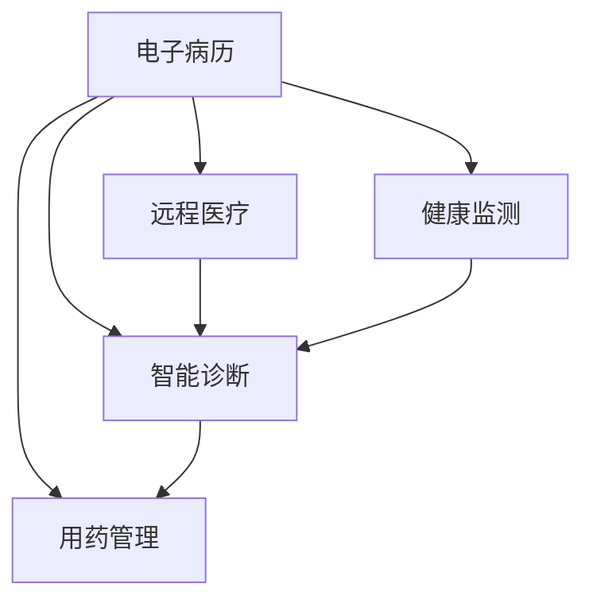
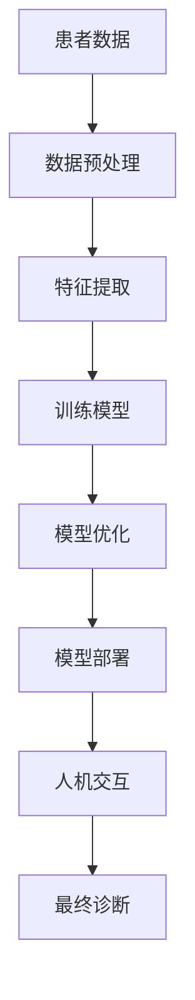
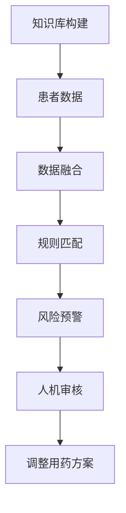
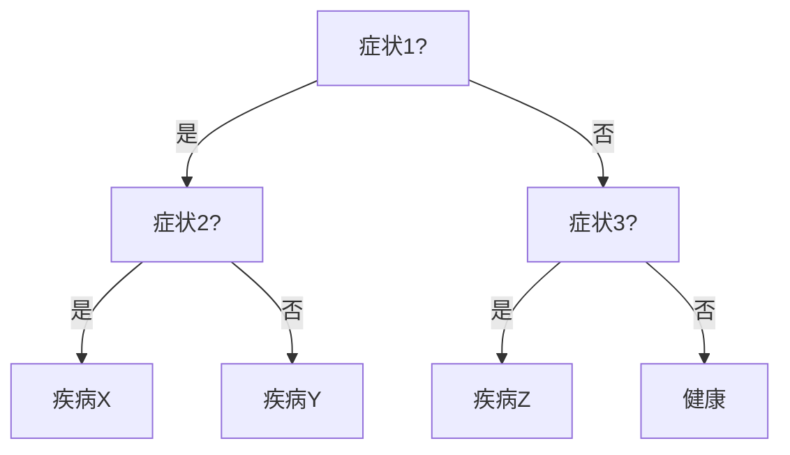

# 老年医疗保健管理系统详细设计与具体代码实现

## 1.背景介绍

随着人口老龄化问题日益严重,老年人的医疗保健问题越来越受到关注。传统的医疗保健系统存在诸多不足,难以满足老年人的特殊需求。因此,构建一个专门针对老年人的医疗保健管理系统势在必行。

### 1.1 老年人医疗保健现状

- 就医不便:老年人行动不便,难以及时就医
- 用药风险高:老年人常伴有多种慢性病,服药种类繁多,存在用药不当风险
- 健康监测缺失:老年人缺乏对健康状况的全面监测和评估
- 医疗资源紧缺:医疗资源向老年人倾斜严重不足

### 1.2 系统建设必要性

- 提高就医便利性:让老年人足不出户即可获得医疗服务
- 减少用药风险:对老年人用药行为进行监控和干预
- 全面健康监测:对老年人的生命体征等健康数据进行收集和分析
- 优化医疗资源:合理分配有限的医疗资源,满足老年人需求

## 2.核心概念与联系

老年医疗保健管理系统的核心概念包括:

### 2.1 电子病历

电子病历是患者所有医疗信息的集中体现,包括病史、检查结果、诊断报告、治疗方案等,是系统的核心数据。

### 2.2 远程医疗

利用现代信息技术,打破时空限制,实现患者与医生的远程诊疗,是系统的主要服务形式。

### 2.3 健康监测

通过可穿戴设备等方式,持续收集老年人的生命体征等健康数据,为制定治疗方案提供依据。

### 2.4 智能诊断

基于人工智能技术,对患者病情数据进行分析,辅助医生作出诊断决策。

### 2.5 用药管理

对老年人的用药行为进行全程监控,发现潜在风险并提供用药指导,确保用药安全。

这些概念相互关联、环环相扣,共同构建了一个完整的老年医疗保健管理体系。



## 3.核心算法原理具体操作步骤

### 3.1 智能诊断算法

智能诊断是系统的核心功能之一,其原理和步骤如下:

1. 数据预处理:对患者的病史、症状、检查结果等数据进行清洗和标准化处理,为后续分析做好准备。

2. 特征提取:从预处理后的数据中提取出对诊断有价值的特征,如症状特征、检查结果特征等。

3. 训练模型:基于大量标注好的病例数据,使用机器学习算法(如决策树、支持向量机等)训练出诊断模型。

4. 模型优化:通过调整算法参数、特征选择等方式,不断优化模型的性能。

5. 模型部署:将训练好的模型部署到系统中,为新的患者病例提供智能诊断服务。

6. 人机交互:医生可以查看模型给出的诊断结果,结合自身经验做出最终判断。



### 3.2 用药风险评估算法

1. 构建知识库:收集老年人常见疾病的用药指南、禁忌等专家知识,建立规则知识库。

2. 数据融合:将患者的电子病历(包括既往病史、目前用药情况等)与知识库进行融合。

3. 规则匹配:基于知识库中的规则,对患者的用药情况进行风险匹配和评估。

4. 风险预警:如发现潜在风险,向医生和患者发出预警,并给出用药建议。

5. 人机审核:医生审核系统给出的风险评估结果,必要时进行人工干预。



## 4.数学模型和公式详细讲解举例说明

### 4.1 智能诊断模型

智能诊断模型的核心是利用机器学习算法从历史病例数据中自动学习出疾病与症状之间的映射关系。常用的算法有决策树、逻辑回归、支持向量机等。以决策树算法为例:

$$
f(x) = \sum_{m=1}^{M}c_m\mathbb{I}(x\in R_m)
$$

其中 $x$ 为患者症状特征向量, $R_m$ 为决策树的第 $m$ 个叶节点对应的区域, $c_m$ 为该区域的类别(即疾病种类)。决策树通过不断对特征空间进行分割,将样本数据划分到不同的叶节点区域,从而实现对疾病的分类。

以下是一个示例决策树:



### 4.2 用药风险评估模型

用药风险评估模型的核心是构建一个知识库,收集疾病与用药之间的关联规则。可以使用经典的关联规则挖掘算法Apriori算法来发现这些规则。

Apriori算法基于这样一个观察:如果一个项集是频繁的,那么它的所有子集也是频繁的。算法分两步完成:

1. 发现所有频繁项集
2. 从频繁项集中导出关联规则

设 $I=\{i_1,i_2,...,i_m\}$ 为项集, $T=\{t_1,t_2,...,t_n\}$ 为交易数据集, 支持度为:

$$
\text{support}(X)=\frac{\sum_{t\in T}\mathbb{I}(X\subseteq t)}{|T|}
$$

置信度为:

$$
\text{confidence}(X\Rightarrow Y) = \frac{\text{support}(X\cup Y)}{\text{support}(X)}
$$

通过设置合理的支持度和置信度阈值,可以发现频繁项集和强关联规则,从而构建用药风险知识库。

## 5.项目实践:代码实例和详细解释说明

### 5.1 智能诊断模块

以下是一个使用Python语言和scikit-learn库实现的简单决策树分类器示例:

```python
from sklearn import tree
from sklearn.datasets import load_iris
from sklearn.model_selection import train_test_split

# 加载iris数据集
iris = load_iris()
X, y = iris.data, iris.target

# 拆分训练集和测试集
X_train, X_test, y_train, y_test = train_test_split(X, y, test_size=0.2)

# 创建决策树分类器
clf = tree.DecisionTreeClassifier()

# 用训练集训练模型
clf.fit(X_train, y_train)

# 在测试集上评估模型
score = clf.score(X_test, y_test)
print(f'Accuracy: {score}')
```

这个示例使用了著名的iris数据集进行训练和测试。`DecisionTreeClassifier`是scikit-learn中的决策树分类器实现。

`fit`函数用于在训练数据上训练模型,`score`函数计算模型在测试集上的准确率。开发人员可以根据实际需求调整决策树的参数,如最大深度、最小样本数等,以获得更好的性能。

### 5.2 用药风险评估模块

以下是一个使用Python语言和mlxtend库实现Apriori算法的示例:

```python
from mlxtend.frequent_patterns import apriori
from mlxtend.frequent_patterns import association_rules

# 加载示例数据
dataset = [
    ['A', 'B', 'C'],
    ['A', 'C', 'D'],
    ['B', 'C', 'E'],
    ['A', 'B', 'C', 'E'],
    ['A', 'B', 'C', 'E']
]

# 发现频繁项集
frequent_itemsets = apriori(dataset, min_support=0.6, use_colnames=True)
print('Frequent Itemsets:')
print(frequent_itemsets)

# 从频繁项集中导出关联规则
rules = association_rules(frequent_itemsets, metric='confidence', min_threshold=0.7)
print('Association Rules:')
print(rules)
```

这个示例使用了mlxtend库中的`apriori`和`association_rules`函数来实现Apriori算法。

`apriori`函数发现给定数据集中的频繁项集,`min_support`参数设置最小支持度阈值。`association_rules`函数从频繁项集中导出关联规则,`metric`参数指定使用置信度作为评估指标,`min_threshold`设置最小置信度阈值。

开发人员可以将真实的疾病和用药数据输入到这个算法中,从而发现疾病与用药之间的关联规则,构建用药风险知识库。

## 6.实际应用场景

老年医疗保健管理系统可以应用于以下场景:

1. 社区医疗:为居家老年人提供远程医疗、健康监测等服务,方便就医。

2. 养老院:养老院可采用该系统,提高医疗服务质量,优化用药管理。

3. 医院:医院可将该系统作为辅助诊疗工具,提高诊断效率和准确性。

4. 家庭医生:家庭医生可借助该系统持续跟踪老年患者的健康状况。

5. 医疗保险:保险公司可利用系统数据评估理赔风险,制定合理的保费策略。

## 7.工具和资源推荐

### 7.1 开发工具

- Python: 主流的数据科学编程语言
- Java/C#: 用于构建系统的Web服务和移动应用
- MySQL/MongoDB: 分别代表关系型和非关系型数据库
- Git: 版本控制工具,方便多人协作开发
- Docker: 容器化部署工具,实现环境一致性

### 7.2 算法库

- Scikit-learn: 机器学习算法库,提供诸多分类、聚类算法
- XGBoost: 高效的梯度提升决策树库
- Pandas: 数据分析处理库
- NLTK: 自然语言处理库,可用于智能问答等

### 7.3 在线资源

- 中华医学会疾病诊疗指南
- UpToDate: 临床决策支持资源库
- 老年医学教科书/期刊文献
- 公开的医疗数据集,如MIMIC-III等

## 8.总结:未来发展趋势与挑战

### 8.1 发展趋势

- 5G/6G通信技术:支持更高质量的远程医疗服务
- 人工智能深度学习:更精准的智能诊断和辅助决策
- 区块链技术:确保电子病历等数据的安全性和可追溯性
- 智能可穿戴设备:实现全方位的健康数据采集

### 8.2 面临挑战

- 数据隐私保护:如何在保护患者隐私的同时利用数据
- 人机协作:人工智能如何与医生高效协作
- 系统安全性:如何防止系统遭到黑客攻击
- 医疗资源不均衡:如何解决不同地区医疗资源分配不均的问题

## 9.附录:常见问题与解答

1. **系统如何保护患者隐私?**

系统采用匿名化和加密技术来保护患者的电子病历和个人信息,只有经过授权的医疗人员才能查阅。同时,系统严格遵守相关的数据保护法规。

2. **远程医疗是否能替代线下就诊?**

远程医疗主要是辅助手段,无法完全替代线下就诊。对于一些疑难杂症,患者仍需要到医院进行全面的检查和会诊。

3. **智能诊断的准确率有多高?**

智能