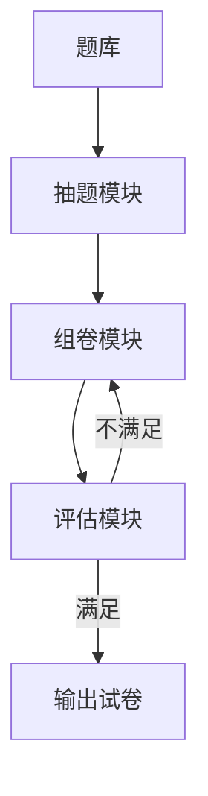
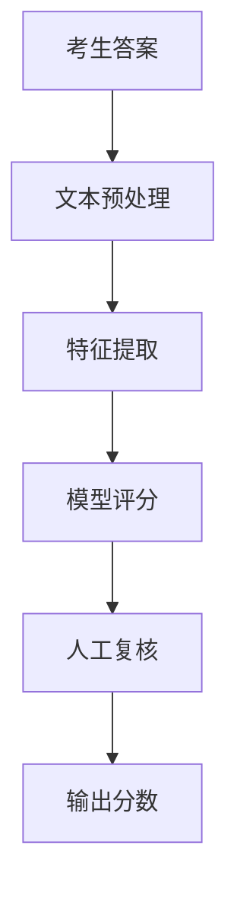
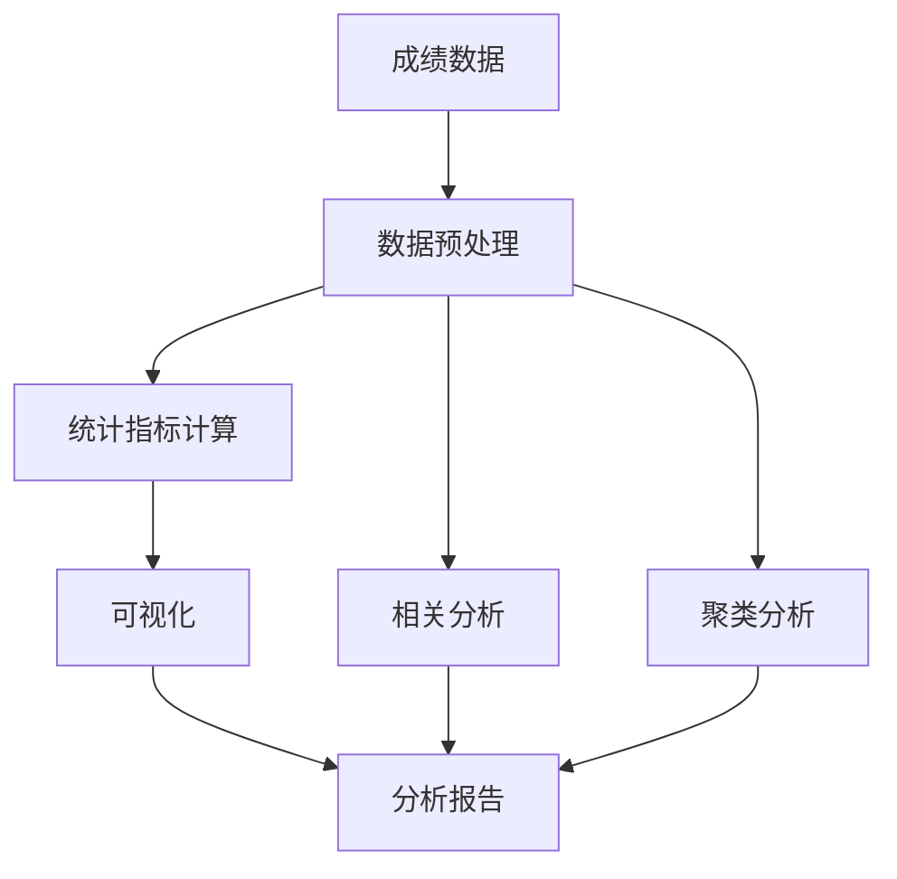
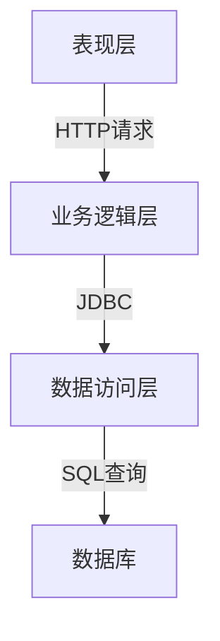

# 考试管理系统详细设计与具体代码实现

## 1.背景介绍

随着教育信息化进程的不断推进,考试管理系统作为教育信息化建设的重要组成部分,越来越受到重视。考试管理系统的建设可以实现考试工作的标准化、规范化和信息化,提高考务管理的效率,确保考试工作的公平、公正,维护考试的权威性和严肃性。

考试管理系统主要包括考试安排、试卷管理、考生管理、阅卷评分、成绩管理等多个模块。通过系统的支持,可以实现考试流程的自动化,减轻人工操作的工作量,降低出错率,提高工作效率。同时,系统还能够对考试数据进行统计分析,为教学决策提供依据。

## 2.核心概念与联系

考试管理系统涉及以下几个核心概念:

1. **考试**: 指为了评价学习者的知识掌握程度而进行的测试活动。考试包括笔试、机考等多种形式。

2. **试卷**: 用于考试的题目集合,可分为主观题和客观题两大类。试卷的设计直接影响考试的质量。

3. **考生**: 参加考试的学习者,需要提供个人信息并获取准考证。

4. **阅卷**: 针对主观题的评分过程,可由人工或机器自动完成。

5. **成绩管理**: 对考生的考试成绩进行录入、统计和分析。

这些概念之间存在紧密联系,构成了考试管理系统的核心业务流程。设计时需要对各模块的数据交互、功能集成等进行综合考虑。

## 3.核心算法原理具体操作步骤

考试管理系统的核心算法主要包括以下几个方面:

### 3.1 试卷组卷算法

试卷组卷算法的目标是从题库中自动选取符合要求的题目,组成一份质量较高的试卷。常用的算法有:

1. **蒙特卡洛算法**: 通过随机过程,从题库中随机抽取题目,并对抽取结果进行评估,重复多次后取最优结果。

2. **遗传算法**: 将题目视为基因,通过选择、交叉、变异等操作,不断进化以获得更优的题目组合。

3. **启发式算法**: 根据预设的评价函数和约束条件,采用规则匹配、优先级队列等策略,逐步构建出满足要求的试卷。

算法的具体步骤如下:



### 3.2 智能阅卷算法

针对主观题的阅卷过程,可以利用自然语言处理和机器学习技术,实现智能化的自动阅卷。常见的算法有:

1. **文本相似度算法**: 计算考生答案与标准答案之间的相似度,包括字符串编辑距离、语义相似度等。

2. **深度学习模型**: 基于循环神经网络、注意力机制等技术,对答案进行语义理解和主旨提取,再与标准答案对比得分。

3. **知识图谱算法**: 构建知识本体,将答案和标准答案映射到知识图谱上,通过语义距离等指标进行评分。

算法流程可概括为:



### 3.3 成绩分析算法

对考生的成绩进行统计分析,可以了解知识点掌握情况,为教学决策提供依据。常用的算法包括:

1. **成绩分布算法**: 计算平均分、标准差等统计量,绘制直方图、箱线图等可视化分析图表。

2. **相关分析算法**: 利用相关系数、回归分析等方法,探究成绩与其他因素(如学习时间)之间的关系。

3. **聚类分析算法**: 通过K-Means、DBSCAN等无监督算法,将考生按成绩水平自动分为若干类别。

算法步骤示例:



以上算法的实现需要数据结构和算法设计的支持,例如链表、树、图等数据结构,动态规划、分治、贪心等算法思想,都是不可或缺的基础。

## 4.数学模型和公式详细讲解举例说明

在考试管理系统中,一些核心算法需要借助数学模型和公式进行描述和求解。

### 4.1 试卷组卷模型

试卷组卷可以建模为一个约束优化问题,目标是在满足一系列约束条件的前提下,最大化试卷的总体质量评分。

设试卷由 $n$ 个题目组成,题库中共有 $m$ 道题目,定义决策变量:

$$
x_i=
\begin{cases}
1, & \text{第 i 道题被选入试卷} \\
0, & \text{第 i 道题未被选入}
\end{cases}
\quad (i=1,2,\cdots,m)
$$

则组卷问题可以表示为:

$$
\max \sum_{i=1}^m q_i x_i \\
\text{s.t.} \quad \sum_{i=1}^m x_i = n \\
\sum_{i \in S_j} x_i \leq 1 \quad (j=1,2,\cdots,k) \\
\sum_{i \in T_l} x_i \geq 1 \quad (l=1,2,\cdots,r) \\
x_i \in \{0,1\} \quad (i=1,2,\cdots,m)
$$

其中:

- $q_i$ 表示第 $i$ 道题的质量分数
- 第一个约束条件保证试卷题目数量为 $n$
- 第二个约束条件避免同源题重复出现($S_j$ 表示第 $j$ 组同源题集合)
- 第三个约束条件保证每个知识点至少有一道题($T_l$ 表示第 $l$ 个知识点题集合)

该模型可以通过整数规划或者启发式算法等方式求解。

### 4.2 智能阅卷评分模型

智能阅卷的核心是计算考生答案与标准答案之间的相似度分数。一种常用的模型是基于语义相似度的评分:

设标准答案为向量 $\boldsymbol{a}=(a_1,a_2,\cdots,a_n)$,考生答案为向量 $\boldsymbol{b}=(b_1,b_2,\cdots,b_m)$,其中 $a_i,b_j$ 表示对应词语的语义向量。则两者的语义相似度可以用余弦相似度公式计算:

$$
\text{sim}(\boldsymbol{a},\boldsymbol{b})=\frac{\boldsymbol{a} \cdot \boldsymbol{b}}{\|\boldsymbol{a}\| \|\boldsymbol{b}\|} = \frac{\sum\limits_{i=1}^n\sum\limits_{j=1}^m a_i b_j}{\sqrt{\sum\limits_{i=1}^n a_i^2} \sqrt{\sum\limits_{j=1}^m b_j^2}}
$$

该相似度分数可以直接作为答案的评分依据。

在实际应用中,通常需要引入多种策略,如词袋模型、序列模型、注意力机制等,以提高评分的准确性。

### 4.3 成绩分析模型

成绩分析常需要利用统计学和数据挖掘中的模型和公式。以考生成绩与学习时间之间的相关分析为例:

假设有 $n$ 名考生,第 $i$ 名考生的成绩为 $y_i$,学习时间为 $x_i$,则可以建立线性回归模型:

$$
y_i = \beta_0 + \beta_1 x_i + \epsilon_i \quad (i=1,2,\cdots,n)
$$

其中 $\beta_0,\beta_1$ 为模型参数, $\epsilon_i$ 为随机误差项。

通过最小二乘法可以估计出参数:

$$
\begin{aligned}
\hat{\beta}_1 &= \frac{\sum\limits_{i=1}^n (x_i - \bar{x})(y_i - \bar{y})}{\sum\limits_{i=1}^n (x_i - \bar{x})^2} \\
\hat{\beta}_0 &= \bar{y} - \hat{\beta}_1 \bar{x}
\end{aligned}
$$

其中 $\bar{x}$、$\bar{y}$ 分别为 $x_i$、$y_i$ 的均值。

模型建立后,可以计算相关系数:

$$
r = \frac{\sum\limits_{i=1}^n (x_i - \bar{x})(y_i - \bar{y})}{\sqrt{\sum\limits_{i=1}^n (x_i - \bar{x})^2\sum\limits_{i=1}^n (y_i - \bar{y})^2}}
$$

相关系数 $r$ 的值域为 $[-1,1]$,绝对值越大表明两变量之间的相关性越强。

通过以上模型和公式,可以定量分析学习时间对成绩的影响程度,为教学决策提供数据支持。

## 5.项目实践:代码实例和详细解释说明

为了更好地理解考试管理系统的实现,我们提供了一个基于 Java 语言的简单项目示例,包括考生信息管理、试卷管理、成绩管理等核心功能模块。

### 5.1 系统架构

整个系统采用经典的三层架构设计,包括表现层(UI界面)、业务逻辑层和数据访问层。



其中:

- 表现层: 基于 JavaFX 技术开发,提供图形化界面供用户操作。
- 业务逻辑层: 使用 Java 编写,实现系统的核心业务功能。
- 数据访问层: 通过 JDBC 连接数据库,执行 SQL 语句进行数据存取。

### 5.2 核心代码示例

以下是系统中一些核心类和方法的代码示例,并附有详细注释说明。

#### 5.2.1 考生信息管理

`Student` 类用于封装考生的个人信息:

```java
public class Student {
    private String id;        // 考生ID
    private String name;      // 姓名
    private String gender;    // 性别
    private Date birthDate;   // 出生日期
    private String school;    // 学校
    
    // 构造方法、Getter/Setter方法...
}
```

`StudentDao` 类提供了对考生信息进行增删改查的方法:

```java
public class StudentDao {
    private Connection conn; // 数据库连接对象
    
    public StudentDao(String url, String user, String pwd) throws Exception {
        // 获取数据库连接
        conn = DriverManager.getConnection(url, user, pwd);
    }
    
    public void addStudent(Student stu) throws Exception {
        // 插入新考生记录
        String sql = "INSERT INTO students VALUES (?, ?, ?, ?, ?)";
        PreparedStatement stmt = conn.prepareStatement(sql);
        stmt.setString(1, stu.getId());
        stmt.setString(2, stu.getName());
        // ... 设置其他字段
        stmt.executeUpdate();
    }
    
    public List<Student> getAllStudents() throws Exception {
        // 查询所有考生记录
        List<Student> students = new ArrayList<>();
        String sql = "SELECT * FROM students";
        Statement stmt = conn.createStatement();
        ResultSet rs = stmt.executeQuery(sql);
        while (rs.next()) {
            Student stu = new Student();
            stu.setId(rs.getString("id"));
            stu.setName(rs.getString("name"));
            // ... 获取其他字段值
            students.add(stu);
        }
        return students;
    }
    
    // 其他更新、删除方法...
}
```

#### 5.2.2 试卷管理

`Question` 类表示一道题目:

```java
public class Question {
    private int id;           // 题目ID
    private String content;   // 题干内容
    private String answer;    // 标准答案
    private double score;      // 分值
    private Set<String> keywords; // 关键词集合
    
    // 构造方法、Getter/Setter方法...