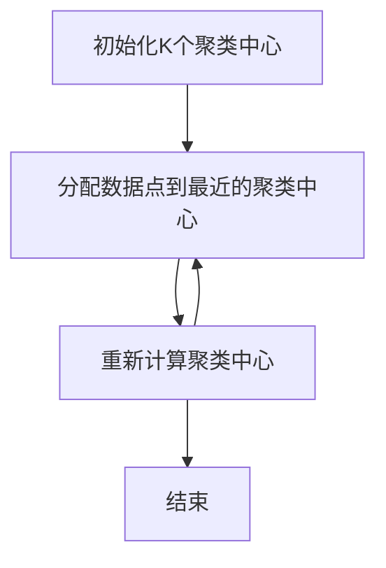
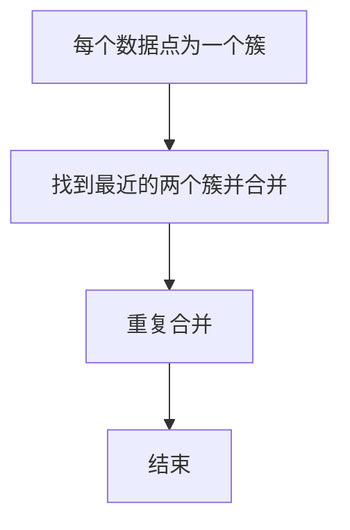
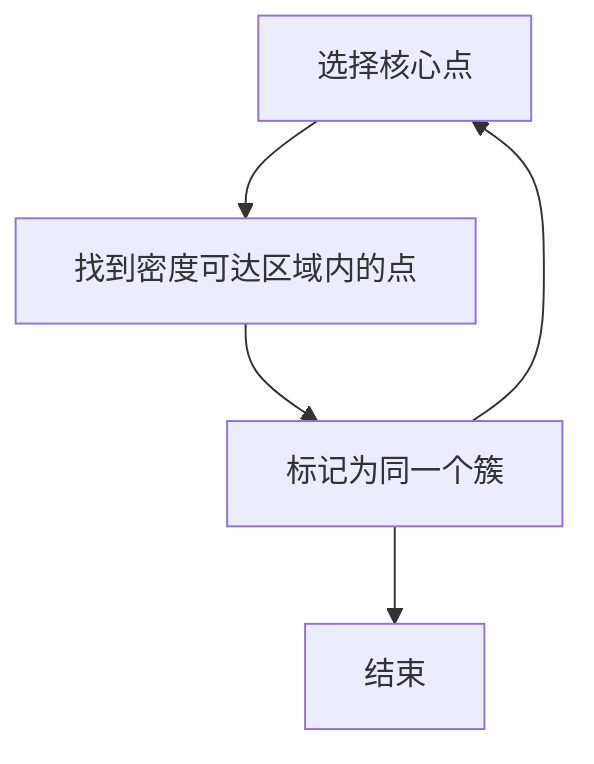

# 聚类分析：发现数据中的隐藏模式，应对数据的不确定性

## 1.背景介绍

在当今数据驱动的世界中，数据分析和挖掘技术变得越来越重要。聚类分析作为一种无监督学习方法，能够帮助我们从大量数据中发现隐藏的模式和结构。无论是在市场营销、图像处理、文本分析还是生物信息学中，聚类分析都扮演着关键角色。本文将深入探讨聚类分析的核心概念、算法原理、数学模型、实际应用以及未来发展趋势。

## 2.核心概念与联系

### 2.1 聚类分析的定义

聚类分析是一种将数据集划分为若干个簇（Cluster）的技术，使得同一簇内的数据点具有较高的相似性，而不同簇之间的数据点具有较大的差异性。其目标是最大化簇内相似性和最小化簇间相似性。

### 2.2 聚类与分类的区别

聚类分析与分类分析的主要区别在于，聚类分析是一种无监督学习方法，不需要预先标注的数据，而分类分析是一种有监督学习方法，需要预先标注的数据集。

### 2.3 聚类分析的应用领域

聚类分析在多个领域有广泛应用，包括但不限于：
- 市场细分：根据消费者行为将市场划分为不同的细分市场。
- 图像分割：将图像划分为不同的区域。
- 文本聚类：将相似的文档聚类在一起。
- 生物信息学：基因表达数据的聚类分析。

## 3.核心算法原理具体操作步骤

### 3.1 K-means算法

K-means算法是最经典的聚类算法之一，其基本步骤如下：

1. 初始化K个聚类中心。
2. 将每个数据点分配到最近的聚类中心。
3. 重新计算每个聚类的中心。
4. 重复步骤2和3，直到聚类中心不再变化或达到最大迭代次数。



### 3.2 层次聚类

层次聚类分为凝聚层次聚类和分裂层次聚类。凝聚层次聚类的基本步骤如下：

1. 将每个数据点看作一个单独的簇。
2. 找到最近的两个簇并合并。
3. 重复步骤2，直到所有数据点被合并到一个簇中。



### 3.3 DBSCAN算法

DBSCAN（Density-Based Spatial Clustering of Applications with Noise）是一种基于密度的聚类算法，其基本步骤如下：

1. 选择一个未访问的数据点作为核心点。
2. 找到核心点的密度可达区域内的所有点。
3. 将这些点标记为同一个簇。
4. 重复步骤1-3，直到所有点都被访问。



## 4.数学模型和公式详细讲解举例说明

### 4.1 K-means算法的数学模型

K-means算法的目标是最小化以下目标函数：

$$
J = \sum_{i=1}^{K} \sum_{x \in C_i} \| x - \mu_i \|^2
$$

其中，$K$ 是簇的数量，$C_i$ 是第 $i$ 个簇，$\mu_i$ 是第 $i$ 个簇的中心，$\| x - \mu_i \|$ 是数据点 $x$ 到簇中心 $\mu_i$ 的欧氏距离。

### 4.2 层次聚类的数学模型

层次聚类的关键在于定义簇间距离。常用的簇间距离包括：

- 最小距离（单链法）：
$$
d(C_i, C_j) = \min_{x \in C_i, y \in C_j} \| x - y \|
$$

- 最大距离（全链法）：
$$
d(C_i, C_j) = \max_{x \in C_i, y \in C_j} \| x - y \|
$$

- 平均距离：
$$
d(C_i, C_j) = \frac{1}{|C_i| |C_j|} \sum_{x \in C_i} \sum_{y \in C_j} \| x - y \|
$$

### 4.3 DBSCAN算法的数学模型

DBSCAN算法的核心概念是密度可达性。给定参数 $\epsilon$ 和最小点数 $MinPts$，定义如下：

- $\epsilon$ 邻域：点 $p$ 的 $\epsilon$ 邻域是指距离 $p$ 不超过 $\epsilon$ 的所有点的集合。
- 核心点：如果一个点的 $\epsilon$ 邻域内包含至少 $MinPts$ 个点，则该点是核心点。
- 密度可达：如果点 $q$ 在点 $p$ 的 $\epsilon$ 邻域内，并且 $p$ 是核心点，则 $q$ 是密度可达的。

## 5.项目实践：代码实例和详细解释说明

### 5.1 K-means算法的Python实现

```python
from sklearn.cluster import KMeans
import numpy as np

# 生成示例数据
X = np.array([[1, 2], [1, 4], [1, 0],
              [4, 2], [4, 4], [4, 0]])

# 初始化K-means模型
kmeans = KMeans(n_clusters=2, random_state=0).fit(X)

# 输出聚类结果
print(kmeans.labels_)
print(kmeans.cluster_centers_)
```

### 5.2 层次聚类的Python实现

```python
from scipy.cluster.hierarchy import dendrogram, linkage
import matplotlib.pyplot as plt

# 生成示例数据
X = np.array([[1, 2], [1, 4], [1, 0],
              [4, 2], [4, 4], [4, 0]])

# 计算层次聚类
Z = linkage(X, 'ward')

# 绘制树状图
dendrogram(Z)
plt.show()
```

### 5.3 DBSCAN算法的Python实现

```python
from sklearn.cluster import DBSCAN
import numpy as np

# 生成示例数据
X = np.array([[1, 2], [1, 4], [1, 0],
              [4, 2], [4, 4], [4, 0]])

# 初始化DBSCAN模型
db = DBSCAN(eps=1.5, min_samples=2).fit(X)

# 输出聚类结果
print(db.labels_)
```

## 6.实际应用场景

### 6.1 市场细分

通过聚类分析，可以将消费者划分为不同的细分市场，从而制定更有针对性的营销策略。例如，K-means算法可以用于将消费者分为不同的群体，根据他们的购买行为和偏好进行分类。

### 6.2 图像分割

在图像处理领域，聚类分析可以