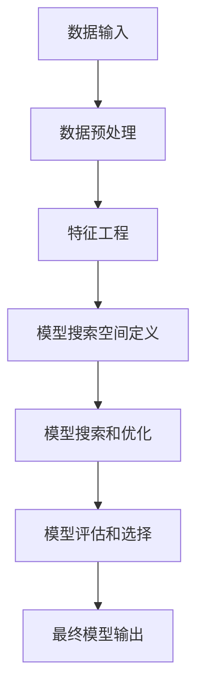

# 自动机器学习AutoML原理与代码实战案例讲解

## 1.背景介绍

### 1.1 机器学习的挑战

在过去的几十年里,机器学习取得了长足的进步,并被广泛应用于各个领域,如计算机视觉、自然语言处理、推荐系统等。然而,构建一个高质量的机器学习模型需要大量的人工努力,包括特征工程、算法选择、超参数调优等。这些步骤通常需要机器学习专家的介入,而且往往是一个反复试验的过程,耗费大量时间和计算资源。

### 1.2 AutoML的兴起

为了降低机器学习模型构建的门槛,提高效率,自动机器学习(Automated Machine Learning, AutoML)应运而生。AutoML旨在自动化机器学习的各个环节,包括数据预处理、特征工程、模型选择、超参数优化等,从而最大限度减少人工参与。通过AutoML,非专业人员也能快速构建出高质量的机器学习模型。

### 1.3 AutoML的重要性

随着数据的快速积累,以及机器学习在各行各业的广泛应用,AutoML变得越来越重要。它不仅能够节省大量的时间和资源,还能确保模型质量,提高生产效率。此外,AutoML有助于将机器学习的能力民主化,使更多的人能够从中受益。

## 2.核心概念与联系  

### 2.1 AutoML流程

AutoML的整体流程可以概括为以下几个关键步骤:

1. **数据输入**: 将原始数据输入到AutoML系统中。
2. **数据预处理**: 对原始数据进行清洗、标准化、缺失值处理等预处理操作。
3. **特征工程**: 从原始数据中提取有意义的特征,以供模型训练使用。
4. **模型搜索空间定义**: 定义模型搜索空间,包括不同的机器学习算法、超参数范围等。
5. **模型搜索和优化**: 在定义的搜索空间中,使用不同的优化算法(如贝叶斯优化、进化算法等)搜索最优模型。
6. **模型评估和选择**: 根据预定的评估指标(如准确率、F1分数等),评估模型性能并选择最优模型。
7. **最终模型输出**: 将选择的最优模型输出,可用于预测或部署。

### 2.2 关键技术

实现AutoML需要多种技术的支持,包括但不限于:

- **数据预处理技术**: 如缺失值插补、异常值处理、数据标准化等。
- **特征工程技术**: 如特征选择、特征构造、特征降维等。
- **机器学习算法**: 如决策树、支持向量机、神经网络等各种监督和无监督学习算法。
- **超参数优化技术**: 如网格搜索、随机搜索、贝叶斯优化、进化算法等。
- **模型集成技术**: 如Bagging、Boosting、Stacking等。
- **迁移学习技术**: 利用在其他领域学习到的知识,加快模型收敛。
- **元学习技术**: 从大量任务中学习,提高AutoML系统的泛化能力。

### 2.3 优缺点分析

AutoML的优点主要包括:

- 降低了机器学习模型构建的门槛,非专业人员也能快速构建模型。
- 节省了大量的时间和计算资源,提高了工作效率。
- 通过自动化流程,减少了人为错误,提高了模型质量。

但AutoML也存在一些局限性:

- 自动化流程的"黑箱"性质,可解释性较差。
- 对于特殊任务,可能无法找到最优解。
- 对计算资源的需求较高,尤其是在大规模数据集和复杂模型搜索空间下。

## 3.核心算法原理具体操作步骤

AutoML涉及多种算法和技术,本节将重点介绍其中几个核心算法的原理和具体操作步骤。

### 3.1 特征工程

特征工程是机器学习的重要环节,对模型性能有着重大影响。AutoML中常用的特征工程技术包括特征选择、特征构造和特征降维等。

#### 3.1.1 特征选择

特征选择的目标是从原始特征集中选择出对预测目标最有意义的一个子集。常用的特征选择算法有Filter方法、Wrapper方法和Embedded方法等。

**Filter方法**通过计算特征与目标变量的相关性评分,选择评分最高的前N个特征。常用的评分函数包括卡方检验、互信息等。算法步骤如下:

1. 计算每个特征与目标变量的评分。
2. 根据评分从高到低排序特征。
3. 选择前N个特征,或者选择评分高于某个阈值的特征。

**Wrapper方法**将特征选择视为一个优化问题,通过训练模型评估特征子集的性能,选择性能最优的特征子集。常用的Wrapper方法有递归特征消除(Recursive Feature Elimination, RFE)等。RFE算法步骤如下:

1. 初始化特征集为全集。
2. 训练模型,计算每个特征的重要性评分。
3. 删除重要性评分最低的特征。
4. 重复步骤2和3,直到达到预设的特征数量或性能不再提升。

**Embedded方法**在模型训练的同时自动进行特征选择,如LASSO回归、决策树等。这些算法通过加入正则化项,使部分特征的权重变为0,从而实现自动特征选择。

#### 3.1.2 特征构造

特征构造的目标是从原始特征集中构造新的、更有意义的特征。常用的特征构造方法包括多项式特征、交互特征等。

**多项式特征**是将原始特征进行多项式运算得到新特征,如$x_1^2$、$x_2^3$、$x_1x_2$等。这种方法常用于处理非线性数据。

**交互特征**是将多个原始特征进行乘积或其他运算得到新特征,如$x_1x_2$、$\frac{x_1}{x_2+1}$等。这种方法常用于捕获特征之间的相互作用。

特征构造的具体步骤如下:

1. 确定需要构造的新特征类型,如多项式特征、交互特征等。
2. 根据新特征类型,从原始特征集中生成新特征。
3. 将新特征与原始特征集合并,形成新的特征集。

#### 3.1.3 特征降维

特征降维的目标是将高维特征映射到低维空间,以减少特征数量、提高计算效率,同时保留原始特征的大部分信息。常用的特征降维算法包括主成分分析(Principal Component Analysis, PCA)、线性判别分析(Linear Discriminant Analysis, LDA)等。

**PCA**是一种无监督降维算法,其核心思想是将原始特征投影到一组正交基向量上,使投影方差最大化。PCA算法步骤如下:

1. 对原始数据进行中心化,使其均值为0。
2. 计算数据的协方差矩阵。
3. 对协方差矩阵进行特征值分解,得到特征向量和特征值。
4. 选择前N个特征值对应的特征向量作为投影基底。
5. 将原始数据投影到选定的基底上,得到降维后的数据。

**LDA**是一种监督降维算法,其目标是投影后的数据在同类别内尽量紧凑,不同类别之间尽量分开。LDA算法步骤如下:

1. 计算类内散布矩阵和类间散布矩阵。
2. 求解广义特征值问题,得到投影矩阵。
3. 将原始数据投影到投影矩阵上,得到降维后的数据。

### 3.2 模型搜索和优化

在AutoML中,模型搜索和优化是一个关键步骤,目标是在给定的搜索空间中找到最优模型及其超参数配置。常用的优化算法包括贝叶斯优化、进化算法、强化学习等。

#### 3.2.1 贝叶斯优化

贝叶斯优化(Bayesian Optimization, BO)是一种有效的黑箱优化算法,常用于解决高开销、多模态、非凸、噪声等复杂优化问题。它通过构建代理模型(如高斯过程)来近似目标函数,并利用采集函数(如预期改善量)来平衡探索和利用,从而高效地搜索全局最优解。

贝叶斯优化的核心步骤如下:

1. 初始化代理模型,通常使用高斯过程。
2. 通过采集函数(如预期改善量)计算下一个最优采样点。
3. 在采样点处评估目标函数,更新代理模型。
4. 重复步骤2和3,直到达到预定的迭代次数或收敛条件。

在AutoML中,贝叶斯优化常用于超参数优化和神经网络结构搜索等任务。

#### 3.2.2 进化算法

进化算法(Evolutionary Algorithms, EA)是一类借鉴生物进化过程的优化算法,包括遗传算法、进化策略、差分进化等。这些算法通过模拟自然选择、交叉变异等过程,在解空间中进行全局搜索,逐步找到最优解。

以遗传算法为例,其核心步骤如下:

1. 初始化一个种群,每个个体对应一个候选解。
2. 计算每个个体的适应度,作为自然选择的依据。
3. 根据适应度,从种群中选择父代个体。
4. 对父代个体进行交叉和变异,产生新的子代个体。
5. 将子代个体加入种群,替换掉适应度较低的个体。
6. 重复步骤2到5,直到达到终止条件。

在AutoML中,进化算法常用于神经网络结构搜索、特征构造等任务。

### 3.3 模型集成

模型集成是将多个基础模型组合起来,形成一个更强大的模型。常用的模型集成技术包括Bagging、Boosting、Stacking等。

#### 3.3.1 Bagging

Bagging(Bootstrap Aggregating)的核心思想是通过自助采样(Bootstrap)产生多个数据子集,在每个子集上训练一个基础模型,然后将这些基础模型进行平均或投票,得到最终的集成模型。

Bagging算法步骤如下:

1. 从原始数据集中,通过有放回抽样产生N个数据子集。
2. 在每个数据子集上,训练一个基础模型。
3. 对于分类任务,将所有基础模型的预测结果进行投票;对于回归任务,将所有基础模型的预测结果进行平均。

Bagging能够有效减小基础模型的方差,提高模型的泛化能力。常用的Bagging算法包括随机森林、Extra Trees等。

#### 3.3.2 Boosting

Boosting的核心思想是通过迭代训练一系列弱模型,并将它们线性组合成一个强模型。每一轮迭代,Boosting会根据前一轮的误差调整样本权重,使得后续的弱模型更关注那些被前面模型错分类的样本。

AdaBoost是最经典的Boosting算法,其步骤如下:

1. 初始化每个样本的权重为$\frac{1}{N}$,其中N为样本数量。
2. 在加权样本上训练一个弱模型。
3. 根据弱模型的误差率,计算其权重。
4. 更新每个样本的权重,将被错分类样本的权重增大。
5. 重复步骤2到4,直到达到预设的迭代次数或精度要求。
6. 将所有弱模型加权组合,得到最终的强模型。

Boosting能够有效减小基础模型的偏差,提高模型的拟合能力。常用的Boosting算法包括XGBoost、LightGBM、CatBoost等。

#### 3.3.3 Stacking

Stacking的核心思想是将多个基础模型的预测结果作为新的特征输入到另一个模型(称为元模型)中,从而获得更好的预测性能。

Stacking算法步