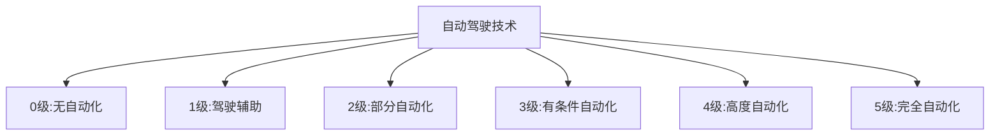
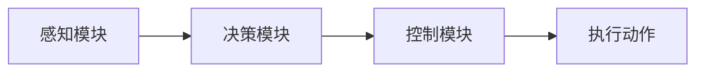

# 自动驾驶技术的法律和伦理问题

## 1. 背景介绍

自动驾驶技术是当前科技领域最热门和具有颠覆性的创新之一。它利用传感器、人工智能算法和控制系统来实现车辆的自主导航和操作,从而减轻人类驾驶员的工作负担,提高交通效率和安全性。自动驾驶技术的发展已经引发了广泛的社会关注和讨论,其中法律和伦理问题就是最受关注的焦点之一。

## 2. 核心概念与联系

### 2.1 自动驾驶技术的分级

自动驾驶技术通常被划分为五个级别,从最低级别的驾驶辅助系统到最高级别的完全自动驾驶系统。不同级别的自动驾驶系统对人工智能和传感器技术的依赖程度不同,也对法律和伦理问题提出了不同的挑战。



### 2.2 法律责任归属

自动驾驶技术的发展带来了法律责任归属的困境。在传统的人工驾驶模式下,驾驶员对车辆的操作负全部责任。但在自动驾驶模式下,责任应该由谁来承担?是车辆制造商、软件开发商还是其他相关方?这需要法律界对现有法律框架进行重新审视和修订。

### 2.3 伦理困境

自动驾驶系统在特殊情况下可能会面临一些棘手的伦理困境,例如在不可避免的事故中,系统应该保护车内乘客还是路人?这种情况下,系统应该如何做出决策?这些问题涉及生命价值的权衡,需要社会各界就相关伦理原则达成共识。

## 3. 核心算法原理具体操作步骤

自动驾驶系统的核心是感知、决策和控制三个模块,它们共同协作来实现车辆的自主导航和操作。



### 3.1 感知模块

感知模块负责从车载传感器(如激光雷达、毫米波雷达、摄像机等)获取环境信息,并将这些信息融合成一个统一的环境模型。常用的感知算法包括:

1. **目标检测**: 使用深度学习模型(如Faster R-CNN、YOLO等)在图像或点云数据中检测出行人、车辆、障碍物等目标。
2. **语义分割**: 将图像像素级别上进行分类,标记出道路、车道线、交通标志等元素。
3. **点云处理**: 对激光雷达获取的点云数据进行滤波、分割和聚类,提取出障碍物和地面平面等信息。

### 3.2 决策模块  

决策模块根据感知模块输出的环境模型,结合高精度地图和交通规则,规划出车辆的行驶路径和速度曲线。常用的决策算法包括:

1. **行为规划**: 根据当前交通情况和目的地,选择合适的驾驶行为,如直行、左转、减速等。
2. **路径规划**: 在满足各种约束条件(如障碍物避让、车道保持等)的前提下,规划出一条安全、高效的路径。
3. **速度规划**: 根据路径信息和交通规则,计算出沿路径的理想速度曲线。

### 3.3 控制模块

控制模块将决策模块输出的期望路径和速度,转化为实际的控制指令,发送给车辆的执行系统(如制动系统、转向系统等)。常用的控制算法包括:

1. **纵向控制**: 根据期望速度曲线,控制车辆的加速和制动。
2. **横向控制**: 根据期望路径,控制车辆的转向角度。
3. **车辆模型**: 建立准确的车辆动力学模型,用于控制算法的设计和仿真测试。

## 4. 数学模型和公式详细讲解举例说明

### 4.1 目标检测算法

目标检测算法通常采用基于深度学习的方法,其中Faster R-CNN是一种流行的两阶段目标检测算法。它的核心思想是先生成候选区域,再对每个候选区域进行目标分类和边界框回归。

候选区域生成过程可以用如下公式表示:

$$
S(r_i) = \frac{1}{1+e^{-x_i}}
$$

其中$x_i$是候选区域$r_i$的置信度分数,通过一个全卷积网络计算得到。$S(r_i)$表示该候选区域被选中的概率。

对于每个候选区域,目标分类和边界框回归可以表示为:

$$
p = \text{softmax}(W_c^Tf_c(r_i) + b_c) \\
t^x, t^y, t^w, t^h = W_r^Tf_r(r_i) + b_r
$$

其中$p$是目标类别概率分布,$t^x, t^y, t^w, t^h$分别表示预测的边界框中心坐标、宽度和高度的偏移量。$W_c, b_c, W_r, b_r$是需要学习的网络参数,$f_c, f_r$是特征提取函数。

### 4.2 路径规划算法

自动驾驶系统中常用的路径规划算法是采样式路径规划算法,例如RRT*(Rapidly-exploring Random Tree Star)算法。它通过在配置空间中随机采样点,并不断扩展一棵树状结构,最终找到从起点到目标点的最优路径。

RRT*算法的核心步骤如下:

1. 初始化:在配置空间中随机采样一个点$x_{\text{init}}$作为树根节点。
2. 循环:
    a) 在配置空间中随机采样一个点$x_{\text{rand}}$。
    b) 找到树上距离$x_{\text{rand}}$最近的节点$x_{\text{nearest}}$。
    c) 从$x_{\text{nearest}}$出发,朝$x_{\text{rand}}$方向扩展一个新节点$x_{\text{new}}$。
    d) 如果$x_{\text{new}}$与树上其他节点的路径代价更小,则将这些节点的父节点重新连接到$x_{\text{new}}$。
    e) 如果到达目标点或满足其他终止条件,则结束循环。
3. 输出:从根节点出发,通过父节点链接找到到达目标点的最优路径。

### 4.3 控制算法

在自动驾驶系统的控制模块中,常用的纵向控制算法是基于模型预测控制(Model Predictive Control, MPC)的方法。它通过建立车辆动力学模型,在一个滚动时域内优化控制量序列,使得车辆能够跟踪期望的速度曲线。

设车辆的状态为$x_t = [v_t, a_t]^T$,其中$v_t$是速度,$a_t$是加速度。控制量为$u_t$,即加速踏板开度。车辆动力学模型可以用如下离散时间状态方程描述:

$$
x_{t+1} = A x_t + B u_t
$$

其中$A$和$B$是系统矩阵,依赖于车辆参数和采样时间。

在时域$[t, t+N]$内,MPC算法需要求解如下优化问题:

$$
\begin{aligned}
\min\limits_{\{u_k\}} & \sum_{k=0}^{N-1} \big( \|x_{t+k|t} - r_{t+k}\|_Q^2 + \|u_{t+k|t}\|_R^2 \big) \\
\text{s.t. } & x_{t+k+1|t} = A x_{t+k|t} + B u_{t+k|t} \\
             & u_{\min} \leq u_{t+k|t} \leq u_{\max}
\end{aligned}
$$

其中$r_{t+k}$是期望的速度曲线,$Q$和$R$是加权矩阵,用于平衡跟踪误差和控制量的大小。求解得到的最优控制序列$\{u_k^*\}$中的第一个控制量$u_0^*$就是当前时刻的最优加速踏板开度。

通过上述数学建模和优化,MPC算法能够实现对车辆的精确控制,使其能够有效跟踪期望的速度曲线。

## 5. 项目实践:代码实例和详细解释说明

为了更好地理解自动驾驶系统的实现,我们以一个基于ROS(Robot Operating System)的自动驾驶模拟器为例,介绍感知、决策和控制三个模块的代码实现。

### 5.1 感知模块

感知模块的主要任务是从传感器数据中检测出障碍物和道路标记。这里我们使用基于深度学习的目标检测和语义分割算法来实现。

```python
# 目标检测
import cv2
import numpy as np
from object_detection.utils import ops

class ObjectDetector:
    def __init__(self, model_path):
        self.model = ops.load_model(model_path)

    def detect(self, image):
        detections = self.model(image)
        boxes = detections['boxes']
        classes = detections['classes']
        scores = detections['scores']
        return boxes, classes, scores

# 语义分割
import tensorflow as tf

class SemanticSegmenter:
    def __init__(self, model_path):
        self.model = tf.keras.models.load_model(model_path)

    def segment(self, image):
        segmentation = self.model.predict(np.expand_dims(image, axis=0))[0]
        return segmentation
```

在ROS中,我们可以创建一个节点来订阅传感器话题(如相机图像),并使用上述代码进行目标检测和语义分割,最终将结果发布到其他模块使用。

### 5.2 决策模块

决策模块需要根据感知模块的输出,结合地图信息和交通规则,规划出车辆的行驶路径和速度曲线。这里我们使用RRT*算法进行路径规划,并采用MPC算法进行速度规划。

```python
# RRT*路径规划
import numpy as np
from shapely.geometry import Point, LineString
from rrt_star import RRTStar

def plan_path(start, goal, obstacles):
    rrt = RRTStar(start, goal, obstacles)
    path = rrt.plan()
    return path

# MPC速度规划
import numpy as np
from cvxpy import Variable, Problem, Minimize, mul_elemwise, sum_squares

def plan_speed(x0, ref_traj, vehicle_params):
    N = ref_traj.shape[0]
    x = Variable((3, N+1))
    u = Variable(N)

    cost = 0
    constr = []
    for t in range(N):
        constr += [x[:,t+1] == vehicle_params.A @ x[:,t] + vehicle_params.B @ u[t],
                   u[t] >= vehicle_params.u_min,
                   u[t] <= vehicle_params.u_max]
        cost += sum_squares(x[:,t] - ref_traj[t,:]) + vehicle_params.r * sum_squares(u[t])

    constr += [x[:,0] == x0]
    prob = Problem(Minimize(cost), constr)
    prob.solve()

    return u.value
```

在ROS中,我们可以创建一个节点来订阅感知模块的输出和地图信息,并使用上述代码进行路径规划和速度规划,最终将结果发布给控制模块使用。

### 5.3 控制模块

控制模块需要根据决策模块的输出,计算出实际的控制指令,并发送给车辆的执行系统。这里我们使用MPC算法进行纵向控制,并采用PID控制器进行横向控制。

```python
# MPC纵向控制
import numpy as np
from cvxpy import Variable, Problem, Minimize, mul_elemwise, sum_squares

def longitudinal_control(x0, ref_speed, vehicle_params):
    N = ref_speed.shape[0]
    x = Variable((2, N+1))
    u = Variable(N)

    cost = 0
    constr = []
    for t in range(N):
        constr += [x[:,t+1] == vehicle_params.A_lon @ x[:,t] + vehicle_params.B_lon @ u[t],
                   u[t] >= vehicle_params.u_min,
                   u[t] <= vehicle_params.u_max]
        cost += sum_squares(x[0,t] - ref_speed[t]) + vehicle_params.r * sum_squares(u[t])

    constr += [x[:,0] == x0]
    prob = Problem