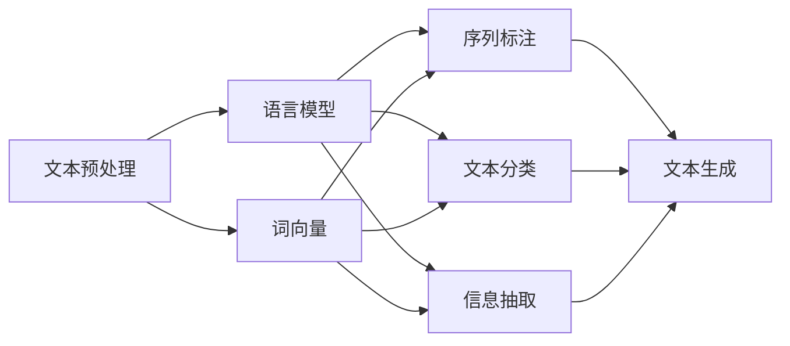

# 自然语言处理 (Natural Language Processing)

## 1. 背景介绍
### 1.1 自然语言处理的定义与发展历程
自然语言处理(Natural Language Processing,缩写NLP)是计算机科学领域与人工智能领域中的一个重要方向。它研究能实现人与计算机之间用自然语言进行有效通信的各种理论和方法。自然语言处理是一门融语言学、计算机科学、数学于一体的科学。因此,自然语言处理属于人工智能的范畴。

自然语言处理的发展可以追溯到20世纪50年代初期,最早出现在美国。自然语言处理的研究历史可以分为以下几个阶段:
- 20世纪50年代,机器翻译成为自然语言处理的主要研究内容。
- 20世纪60年代,自然语言理解成为研究重点,出现了一些经典的自然语言理解系统。
- 20世纪70年代,自然语言处理进入了实用化阶段,在机器翻译、自然语言理解、自然语言生成等方面都取得了很大进展。
- 20世纪80年代,随着个人计算机的普及,自然语言处理开始走向应用,如拼写检查、语法检查、信息检索等。
- 20世纪90年代,随着互联网的兴起,自然语言处理迎来了新的发展机遇,如信息提取、文本分类、信息检索等。
- 21世纪以来,随着大数据和深度学习的发展,自然语言处理进入了新的发展阶段,在机器翻译、情感分析、问答系统、对话系统等方面取得了长足进展。

### 1.2 自然语言处理的重要性
自然语言处理在当今信息时代扮演着越来越重要的角色。随着数字化信息的爆炸式增长,如何从海量的文本数据中获取有价值的信息,已经成为了一个巨大的挑战。自然语言处理技术为解决这一问题提供了有力的工具。

自然语言处理的重要性主要体现在以下几个方面:

1. 信息获取:通过自然语言处理技术,我们可以从海量的文本数据(如网页、文档、书籍等)中快速准确地获取我们需要的信息。

2. 人机交互:自然语言处理技术可以让计算机理解人类的语言,从而实现更加智能、自然的人机交互。

3. 机器翻译:自然语言处理技术是机器翻译的核心,可以帮助我们跨越语言的障碍,实现不同语言之间的信息交流。

4. 舆情分析:自然语言处理技术可以帮助我们从海量的社交媒体数据中提取有价值的信息,分析人们的情感倾向,为决策提供依据。

5. 知识挖掘:通过自然语言处理技术,我们可以从文本数据中挖掘出隐藏的知识和规律,发现新的见解。

### 1.3 自然语言处理的应用场景
自然语言处理技术在许多领域都有广泛的应用,主要包括:

1. 搜索引擎:自然语言处理技术可以帮助搜索引擎更好地理解用户的查询意图,提供更加精准的搜索结果。

2. 智能客服:通过自然语言处理技术,智能客服系统可以自动理解客户的问题,并给出合适的答复,大大提高客服效率。

3. 情感分析:自然语言处理技术可以分析文本中蕴含的情感倾向(如积极、消极、中性等),为企业提供用户反馈分析、舆情监控等服务。

4. 内容推荐:通过对用户浏览、评论等文本数据进行分析,自然语言处理技术可以了解用户的兴趣偏好,从而提供个性化的内容推荐。

5. 智能写作:自然语言处理技术可以帮助我们自动生成文章、摘要、诗歌等,提高写作效率。

6. 医疗健康:自然语言处理技术可以帮助分析医疗文本数据(如病历、医学文献等),辅助医生诊断,提高医疗质量。

## 2. 核心概念与联系
### 2.1 文本预处理
文本预处理是自然语言处理的第一步,其目的是将原始文本转化为结构化的、易于计算机处理的形式。文本预处理通常包括以下步骤:

1. 分词(Tokenization):将文本切分成词、短语等更小的单位。

2. 去除停用词(Stop Word Removal):去除一些高频但没有实际意义的词,如"的"、"了"等。

3. 词性标注(Part-of-Speech Tagging):为每个词标注词性,如名词、动词、形容词等。

4. 命名实体识别(Named Entity Recognition):识别文本中的命名实体,如人名、地名、机构名等。

5. 词干提取(Stemming)和词形还原(Lemmatization):将词还原为其基本形式。

### 2.2 语言模型
语言模型是自然语言处理的重要基础,它描述了语言单位(如字词)的概率分布。常见的语言模型有:

1. N-gram模型:基于一个词出现的概率仅与其前面n-1个词相关的假设,统计n个词共同出现的频率。

2. 神经网络语言模型:使用神经网络学习词的分布式表示(词向量),从而刻画词之间的相似性和语义关系。

### 2.3 词向量
词向量(Word Embedding)是一种将词映射为实数向量的技术。通过词向量,我们可以将词的语义信息表示为数学形式,从而便于计算机处理。常见的词向量模型有:

1. Word2Vec:包括CBOW(Continuous Bag-of-Words)和Skip-Gram两种模型,通过词的上下文学习词的向量表示。

2. GloVe(Global Vectors for Word Representation):基于全局词频统计信息从而学习词向量。

### 2.4 序列标注
序列标注是自然语言处理的一个基本任务,其目的是给定一个输入序列,为其中每个元素分配一个标签。常见的序列标注任务有:

1. 词性标注(Part-of-Speech Tagging):为每个词标注词性。

2. 命名实体识别(Named Entity Recognition):识别文本中的命名实体。

3. 语块划分(Chunking):将文本划分为语法上有意义的片段。

### 2.5 文本分类
文本分类是将文本按照某种标准分门别类的任务。常见的文本分类任务有:

1. 情感分析:判断文本的情感倾向(积极、消极、中性)。

2. 主题分类:判断文本所属的主题类别。

3. 垃圾邮件识别:判断一封邮件是否为垃圾邮件。

### 2.6 信息抽取
信息抽取是从非结构化或半结构化的文本数据中提取结构化信息的任务。常见的信息抽取任务有:

1. 关系抽取:从文本中抽取实体之间的关系。

2. 事件抽取:从文本中抽取事件及其参与者、时间、地点等信息。

3. 观点抽取:从文本中抽取观点持有者、观点对象、观点极性等信息。

### 2.7 文本生成
文本生成是根据给定的主题、关键词、句子等,自动生成自然语言文本的任务。常见的文本生成任务有:

1. 机器翻译:将一种自然语言转化为另一种自然语言。

2. 对话生成:根据上下文自动生成对话回复。

3. 文章生成:根据主题、关键词等自动生成文章。

4. 诗歌生成:自动生成符合韵律、意境的诗歌。

### 2.8 核心概念之间的联系
自然语言处理的各个核心概念之间存在着紧密的联系:

1. 文本预处理是自然语言处理的基础,为后续任务提供了结构化的数据。

2. 语言模型刻画了语言单位的概率分布,是许多自然语言处理任务的重要组成部分。

3. 词向量将词映射为实数向量,使得计算机能够处理语义信息,是深度学习方法的基础。

4. 序列标注、文本分类、信息抽取等任务都可以看作是对文本进行某种结构化表示的过程。

5. 文本生成任务综合运用了语言模型、词向量、序列标注等技术,生成自然、流畅的文本。

下图展示了自然语言处理的核心概念及其之间的联系:

## 3. 核心算法原理具体操作步骤
### 3.1 文本预处理
1. 分词:
   - 基于规则的方法:根据词典和规则进行匹配。
   - 基于统计的方法:通过统计词频、互信息等,构建词图模型进行分词。
   - 基于深度学习的方法:将分词看作序列标注问题,使用BiLSTM-CRF等模型。
2. 去除停用词:
   - 构建停用词表。
   - 对分词结果进行匹配,去除停用词。
3. 词性标注:
   - 基于隐马尔可夫模型(HMM)。
   - 基于条件随机场(CRF)。
   - 基于BiLSTM-CRF等深度学习模型。
4. 命名实体识别:
   - 基于规则的方法:根据命名实体的构成规律制定规则。
   - 基于统计的方法:将命名实体识别看作序列标注问题,使用HMM、CRF等模型。
   - 基于深度学习的方法:使用BiLSTM-CRF、BERT等模型。
5. 词干提取和词形还原:
   - 基于规则的方法:根据词的构成规律制定还原规则。
   - 基于查表的方法:构建词干词典或词形还原词典。

### 3.2 语言模型
1. N-gram模型:
   - 统计训练语料中n个词共同出现的频率。
   - 使用最大似然估计、拉普拉斯平滑等方法估计概率。
   - 使用贝叶斯公式计算条件概率。
2. 神经网络语言模型:
   - 使用词嵌入将词映射为稠密向量。
   - 使用神经网络(如RNN、LSTM、Transformer等)学习上下文信息。
   - 使用softmax函数计算词的条件概率。

### 3.3 词向量
1. Word2Vec:
   - CBOW:根据上下文词预测中心词。
   - Skip-Gram:根据中心词预测上下文词。
   - 使用负采样等技术提高训练效率。
2. GloVe:
   - 构建词共现矩阵。
   - 最小化损失函数,学习词向量。

### 3.4 序列标注
1. HMM:
   - 定义状态集合、观测集合和三组概率(初始概率、转移概率、发射概率)。
   - 使用前向-后向算法计算观测序列概率。
   - 使用维特比算法求最优状态序列。
2. CRF:
   - 定义特征函数,刻画观测序列和状态序列之间的依赖关系。
   - 使用动态规划算法计算配分函数。
   - 使用梯度下降等优化算法估计参数。
3. BiLSTM-CRF:
   - 使用双向LSTM学习观测序列的上下文信息。
   - 在BiLSTM的输出之上添加CRF层,联合学习标注序列。

### 3.5 文本分类
1. 基于规则的方法:
   - 根据先验知识构建规则,如关键词匹配、正则表达式匹配等。
2. 基于机器学习的方法:
   - 特征工程:提取文本特征,如词袋模型、TF-IDF等。
   - 分类器:使用朴素贝叶斯、SVM、逻辑回归等传统机器学习模型。
3. 基于深度学习的方法:
   - 词嵌入:使用预训练的词向量如Word2Vec、GloVe等。
   - 神经网络:使用CNN、RNN、Transformer等模型学习文本表示