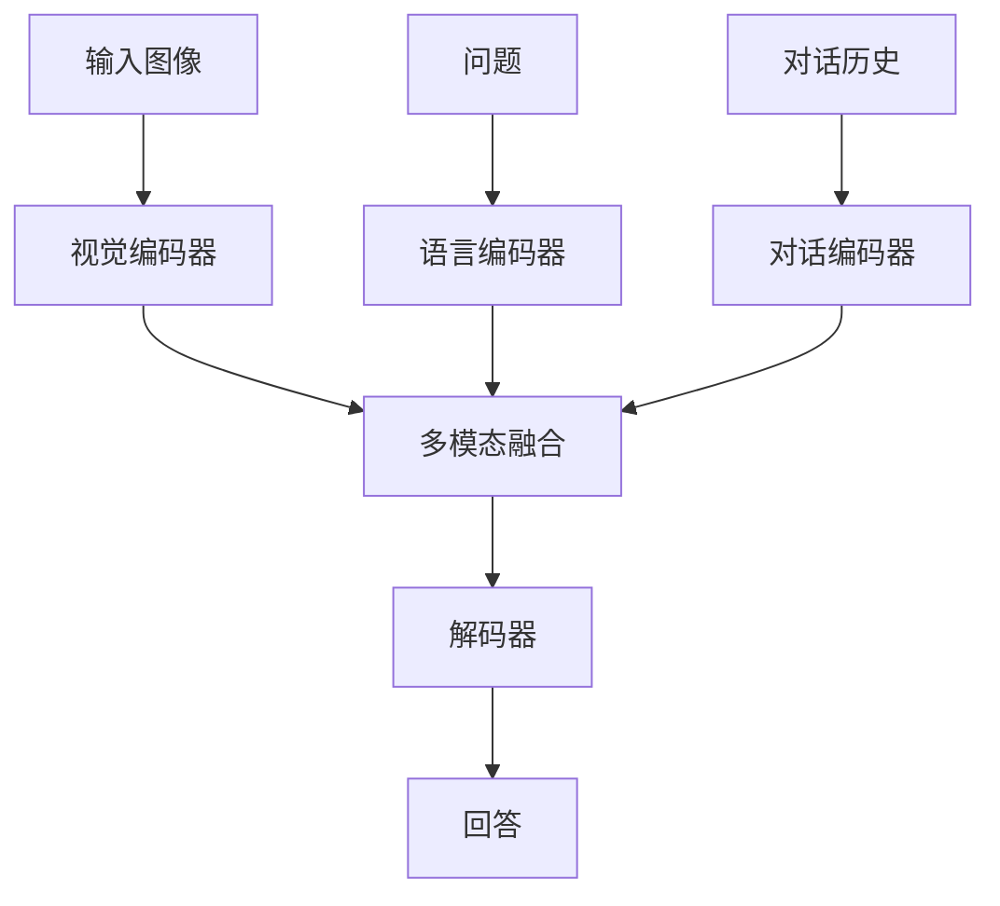

# 视觉对话原理与代码实战案例讲解

## 1.背景介绍

视觉对话(Visual Dialogue)是一种新兴的人工智能任务,旨在让计算机能够基于图像内容与人进行自然语言对话交互。在这个任务中,计算机需要理解图像内容,并根据对话历史和当前问题,给出相关的自然语言回答。视觉对话技术集成了计算机视觉、自然语言处理和对话管理等多个领域的技术,是人工智能领域的一个前沿挑战。

视觉对话任务源于日常生活中人与人之间围绕图像展开对话交流的自然场景。例如,两个人在观看一张图片时,一个人可能会问"这是什么场景?",另一个人根据图像内容作答"这是一个公园"。然后,第一个人可能会继续追问"公园里有什么?"第二个人需要回答"有一些正在玩耍的孩子"。通过这样的多轮对话交互,人们可以更深入地理解和探讨图像内容。

视觉对话技术在多个领域具有广阔的应用前景,如智能助手、虚拟现实、在线教育、医疗诊断等。它有望使人机交互更加自然、高效,提升人工智能系统的实用性和用户体验。

## 2.核心概念与联系

视觉对话技术涉及多个核心概念,包括:

### 2.1 视觉理解(Visual Understanding)

视觉理解是指计算机从图像或视频中识别、理解物体、场景、活动等视觉内容的能力。这是视觉对话的基础,需要利用计算机视觉和深度学习技术对图像进行语义理解。常用的方法包括基于卷积神经网络(CNN)的目标检测和图像分类等。

### 2.2 自然语言处理(Natural Language Processing)

自然语言处理是指计算机处理和理解人类自然语言的能力,包括词法、语法、语义和语用层面的分析。在视觉对话中,需要对问题和回答进行自然语言理解和生成。常用的技术包括序列到序列模型(Seq2Seq)、注意力机制(Attention)等。

### 2.3 对话管理(Dialogue Management)

对话管理是指控制对话流程、跟踪对话状态、决策下一步行为的能力。视觉对话需要根据对话历史和图像内容,合理规划对话策略,生成相关且连贯的回答。对话管理通常基于对话策略学习和对话状态跟踪等技术。

### 2.4 多模态融合(Multimodal Fusion)

视觉对话需要同时处理视觉和语言两种模态信息,并将它们有效融合。多模态融合是指将不同模态的特征表示进行融合,提取更加丰富的语义信息。常用的融合方法有早融合、晚融合、注意力融合等。

上述核心概念相互关联、相辅相成,共同支撑了视觉对话这一复杂的人工智能任务。有效地结合和优化这些技术,是视觉对话研究的重点和难点所在。

## 3.核心算法原理具体操作步骤

视觉对话系统的核心算法通常采用编码器-解码器(Encoder-Decoder)框架,将视觉、语言和对话历史信息编码为向量表示,并生成相应的回答。具体操作步骤如下:



1. **视觉编码器(Visual Encoder)**: 使用卷积神经网络(CNN)等计算机视觉模型对输入图像进行编码,提取视觉特征向量表示。

2. **语言编码器(Language Encoder)**: 使用循环神经网络(RNN)、Transformer等序列模型对当前问题进行编码,获得语义向量表示。

3. **对话编码器(Dialogue Encoder)**: 对之前的对话历史进行编码,捕捉对话上下文信息,生成对话状态向量表示。

4. **多模态融合(Multimodal Fusion)**: 将视觉、语言和对话历史的编码向量进行融合,获得多模态语义表示。常用的融合方法有元素级相加、外积、注意力融合等。

5. **解码器(Decoder)**: 基于多模态融合的语义表示,使用RNN、Transformer等序列生成模型解码生成自然语言回答。

在实际应用中,视觉对话系统还需要进行数据预处理、模型训练、超参数调优等环节。此外,注意力机制、记忆网络等技术也被广泛应用,以提升系统的性能表现。

## 4.数学模型和公式详细讲解举例说明

视觉对话系统中的数学模型主要包括编码器和解码器两个部分。以下将详细介绍其中的关键数学模型和公式。

### 4.1 视觉编码器

视觉编码器通常采用卷积神经网络(CNN)对图像进行编码,提取视觉特征向量表示。常用的CNN模型包括VGGNet、ResNet、Inception等。以ResNet为例,其基本结构单元为残差块(Residual Block),其数学表达式如下:

$$
y = \mathcal{F}(x, \{W_i\}) + x
$$

其中,$ \mathcal{F}(x, \{W_i\}) $表示卷积、批量归一化和激活函数等操作的组合,$ \{W_i\} $为可训练参数集合,$ x $为输入特征图,$ y $为输出特征图。残差连接有助于解决深层网络的梯度消失问题,提高模型性能。

对于输入图像$ I $,通过CNN提取的视觉特征向量表示为$ v = \text{CNN}(I) $。

### 4.2 语言编码器

语言编码器常采用循环神经网络(RNN)或Transformer对问题进行编码。以RNN为例,对于问题$ q = \{q_1, q_2, \dots, q_n\} $,其隐状态更新公式为:

$$
h_t = \text{RNN}(q_t, h_{t-1})
$$

其中,$ h_t $为时间步$ t $的隐状态向量,$ q_t $为对应的词向量。最终的语义向量表示为最后一个隐状态$ u = h_n $。

### 4.3 对话编码器

对话编码器需要捕捉对话历史信息,生成对话状态向量表示。常用的方法是将之前的问答对($ q_i, a_i $)拼接后输入RNN或Transformer,得到对话状态向量$ d $。

### 4.4 多模态融合

多模态融合将视觉、语言和对话历史的编码向量进行融合,获得多模态语义表示$ m $。常用的融合方法包括:

- **元素级相加**:

$$
m = \alpha v + \beta u + \gamma d
$$

其中,$ \alpha,\beta,\gamma $为可学习的权重系数。

- **外积**:

$$
m = v \otimes u \otimes d
$$

- **注意力融合**:

$$
m = \text{Attention}(v, u, d)
$$

### 4.5 解码器

解码器基于多模态语义表示$ m $生成回答$ a $。以RNN解码器为例,隐状态更新和输出概率计算公式为:

$$
s_t = \text{RNN}(y_{t-1}, s_{t-1}, m) \\
P(y_t | y_{1:t-1}, m) = \text{Softmax}(W_o s_t + b_o)
$$

其中,$ s_t $为时间步$ t $的解码器隐状态,$ y_t $为生成的词,$ W_o,b_o $为可训练参数。通过最大化生成回答的条件概率,可以优化整个视觉对话系统的参数。

以上公式和模型揭示了视觉对话系统的数学原理,并体现了视觉、语言和对话信息融合的关键。实际系统中还可能包含注意力机制、记忆网络等更复杂的模块,以提升性能表现。

## 5.项目实践:代码实例和详细解释说明

为了更好地理解视觉对话系统的实现细节,我们将基于PyTorch深度学习框架,提供一个简单的视觉对话系统代码示例,并对关键部分进行详细解释。

### 5.1 数据预处理

首先,我们需要对视觉对话数据集进行预处理,包括图像预处理和文本预处理两个部分。

```python
import torchvision.transforms as transforms

# 图像预处理
image_transform = transforms.Compose([
    transforms.Resize((224, 224)),
    transforms.ToTensor(),
    transforms.Normalize(mean=[0.485, 0.456, 0.406], std=[0.229, 0.224, 0.225])
])

# 文本预处理
word2idx = {'<PAD>': 0, '