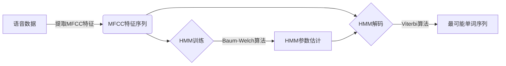
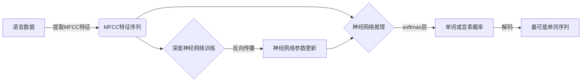
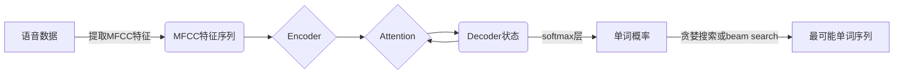

# 语音识别(Speech Recognition) - 原理与代码实例讲解

## 1.背景介绍

语音识别(Speech Recognition)是一种将人类语音转换为相应的文本或命令的技术。它广泛应用于虚拟助手、语音控制系统、听写转录等领域。随着人工智能和深度学习技术的发展,语音识别的准确率和可用性不断提高,成为了人机交互的重要方式。

语音识别系统需要解决三个主要问题:

1. **语音信号处理**:将原始语音信号转换为特征向量序列,以便后续处理。
2. **声学建模**:根据语音特征向量序列,确定可能的单词序列。
3. **语言建模**:利用语言模型,从所有可能的单词序列中选择最可能的序列作为识别结果。

传统的语音识别系统主要采用隐马尔可夫模型(HMM)和高斯混合模型(GMM)等方法进行声学建模。近年来,基于深度神经网络的端到端语音识别方法逐渐成为主流,显著提高了识别准确率。

## 2.核心概念与联系

### 2.1 语音信号处理

语音信号处理的主要步骤包括:

1. **预加重**:增强高频部分,补偿语音信号在传输过程中高频部分的衰减。
2. **分帧**:将连续的语音信号分割成帧,每帧代表一个短时间内的语音特征。
3. **加窗**:减小由于分帧导致的频谱失真,常用的窗函数有汉明窗、汉宁窗等。
4. **傅里叶变换**:将每帧时域信号转换到频域,获得频谱信息。
5. **mel 频率倒谱系数(MFCC)提取**:模拟人耳对声音的感知特性,提取有效的语音特征参数。

### 2.2 声学建模

声学建模的目标是根据语音特征序列,确定可能的单词序列。主要方法有:

1. **隐马尔可夫模型(HMM)**:使用状态转移概率和观测概率对语音进行建模。
2. **高斯混合模型(GMM)**:使用高斯混合模型对声学单元(如音素)的概率分布进行建模。
3. **深度神经网络(DNN)**:使用深层神经网络直接对语音特征序列进行分类,得到单词序列。

### 2.3 语言建模

语言模型的作用是估计单词序列的概率,以帮助选择最可能的单词序列作为识别结果。常用的语言模型有:

1. **N-gram 语言模型**:根据前 N-1 个词来预测第 N 个词的概率。
2. **神经网络语言模型**:使用递归神经网络或者transformer等模型来建模单词序列的概率分布。

### 2.4 端到端语音识别

传统的语音识别系统将声学模型、发音模型和语言模型分开训练和解码。端到端语音识别则是将整个系统统一为一个模型,输入为语音特征序列,输出为对应的文本序列,中间不需要显式建模声学模型和发音模型。常用的端到端模型有:

1. **Listen, Attend and Spell (LAS)**
2. **RNN-Transducer**
3. **Transformer Transducer**

这些模型通过注意力机制和 Encoder-Decoder 架构直接将语音特征映射到文本序列。

## 3.核心算法原理具体操作步骤

### 3.1 隐马尔可夫模型(HMM)

隐马尔可夫模型是传统语音识别中常用的声学模型。它将语音信号看作是由一个隐藏的马尔可夫链随机生成的观测序列。具体步骤如下:

1. **模型训练**:使用带标注的语音数据,通过 Baum-Welch 算法估计 HMM 的参数,包括初始状态概率、状态转移概率和观测概率。
2. **解码**:对于新的语音观测序列,使用 Viterbi 算法求解最可能的隐藏状态序列,将其映射到对应的单词序列。



### 3.2 深度神经网络声学模型

深度神经网络可以直接对语音特征序列进行建模,避免了隐马尔可夫模型的一些假设限制。常用的网络结构包括:

1. **前馈神经网络**:将 MFCC 特征作为输入,通过多层全连接层对单词或音素进行分类。
2. **时延神经网络(TDNN)**:引入时延卷积层,能够更好地捕获语音特征的时间结构。
3. **长短期记忆网络(LSTM)**:使用 LSTM 层对序列进行建模,能够更好地捕获长期依赖关系。



### 3.3 注意力机制和端到端模型

注意力机制能够自适应地关注输入序列的不同部分,对于序列到序列的建模任务非常有效。端到端语音识别模型通常采用 Encoder-Decoder 架构,使用注意力机制直接将语音特征映射到文本序列。

1. **Encoder**:将语音特征序列编码为高级特征表示,常用 TDNN、LSTM 或 Transformer 编码器。
2. **Attention**:计算查询(Decoder 状态)与键(Encoder 输出)之间的相关性分数。
3. **Decoder**:根据注意力权重,对 Encoder 输出进行加权求和,得到上下文向量,并将其与 Decoder 状态结合,预测下一个输出token。



## 4.数学模型和公式详细讲解举例说明

### 4.1 MFCC 特征提取

MFCC(Mel Frequency Cepstral Coefficients)是语音识别中常用的特征参数,能够较好地反映人耳对声音的感知特性。MFCC 的计算过程如下:

1. 对语音信号进行预加重:
   $$y[n] = x[n] - \alpha x[n-1]$$
   其中 $\alpha$ 通常取 0.95~0.97。

2. 分帧并加窗:
   $$x_k[n] = x[n+kR] w[n]$$
   其中 $k$ 为帧索引, $R$ 为帧移, $w[n]$ 为窗函数(如汉明窗)。

3. 对每帧进行傅里叶变换,得到功率谱:
   $$X_k[m] = \left|\sum_{n=0}^{N-1}x_k[n]e^{-j\frac{2\pi mn}{N}}\right|^2$$

4. 将功率谱映射到 Mel 频率,并进行三角滤波器组积分:
   $$S_k[m] = \sum_{i=0}^{N/2}X_k[i]H_m[i]$$
   其中 $H_m[i]$ 为第 $m$ 个三角滤波器的系数。

5. 取对数,并进行离散余弦变换(DCT),得到 MFCC 系数:
   $$c_k[n] = \sum_{m=0}^{M-1}\log S_k[m]\cos\left[\frac{\pi n}{M}(m+0.5)\right]$$

通常取 12~20 个 MFCC 系数作为语音特征。

### 4.2 隐马尔可夫模型

隐马尔可夫模型(HMM)是一种统计模型,可以用来描述由隐藏的马尔可夫链随机生成的观测序列。在语音识别中,HMM 用于对语音单元(如音素)的概率分布进行建模。

HMM 由以下三个概率分布组成:

- 初始状态概率 $\pi_i = P(q_1=i)$
- 状态转移概率 $a_{ij} = P(q_{t+1}=j|q_t=i)$
- 观测概率 $b_j(o_t) = P(o_t|q_t=j)$

其中 $q_t$ 表示第 $t$ 时刻的隐藏状态, $o_t$ 表示第 $t$ 时刻的观测。

给定观测序列 $O = (o_1, o_2, \dots, o_T)$,我们希望找到最可能的隐藏状态序列 $Q = (q_1, q_2, \dots, q_T)$,使得 $P(O|Q)$ 最大。这可以通过 Viterbi 算法求解。

### 4.3 注意力机制

注意力机制是序列到序列模型中的一种重要组件,它允许模型自适应地关注输入序列的不同部分,以获得更好的表示和预测。

假设我们有一个查询向量 $q$,一个键向量序列 $K = (k_1, k_2, \dots, k_n)$,以及一个值向量序列 $V = (v_1, v_2, \dots, v_n)$。注意力机制的计算过程如下:

1. 计算查询与每个键之间的相关性分数:
   $$e_i = \text{score}(q, k_i)$$
   常用的 score 函数有点积、缩放点积等。

2. 对相关性分数进行 softmax 归一化,得到注意力权重:
   $$\alpha_i = \frac{\exp(e_i)}{\sum_{j=1}^n\exp(e_j)}$$

3. 对值向量序列进行加权求和,得到上下文向量:
   $$c = \sum_{i=1}^n\alpha_iv_i$$

4. 将上下文向量 $c$ 与查询向量 $q$ 结合,生成输出或进行下一步预测。

注意力机制使模型能够动态地关注输入序列的不同部分,提高了模型的表达能力和预测精度。

## 5.项目实践:代码实例和详细解释说明

以下是一个使用 PyTorch 实现的简单语音识别系统,包括 MFCC 特征提取、基于 LSTM 的声学模型和 GreedyDecoder。

### 5.1 MFCC 特征提取

```python
import torchaudio

def extract_mfcc(waveform, sample_rate, n_mfcc=13):
    # 计算 MFCC 特征
    mfcc_transform = torchaudio.transforms.MFCC(sample_rate=sample_rate, n_mfcc=n_mfcc)
    mfcc = mfcc_transform(waveform)
    
    # 添加一个通道维度
    mfcc = mfcc.unsqueeze(1)
    
    return mfcc
```

这段代码使用 `torchaudio` 库中的 `MFCC` 类计算语音信号的 MFCC 特征,并添加一个通道维度,以适配神经网络的输入格式。

### 5.2 LSTM 声学模型

```python
import torch.nn as nn

class SpeechRecognitionModel(nn.Module):
    def __init__(self, input_size, hidden_size, num_layers, num_classes):
        super(SpeechRecognitionModel, self).__init__()
        self.lstm = nn.LSTM(input_size, hidden_size, num_layers, batch_first=True)
        self.fc = nn.Linear(hidden_size, num_classes)

    def forward(self, x):
        x, _ = self.lstm(x)
        x = self.fc(x)
        return x
```

这个模型使用一个多层 LSTM 对 MFCC 特征序列进行编码,最后通过一个全连接层输出每个时间步的分类结果。

### 5.3 GreedyDecoder

```python
import torch

class GreedyDecoder:
    def __init__(self, labels):
        self.labels = labels
        self.blank_label = self.labels.index('_')

    def decode(self, logits):
        # 获取每个时间步的最大值及其索引
        