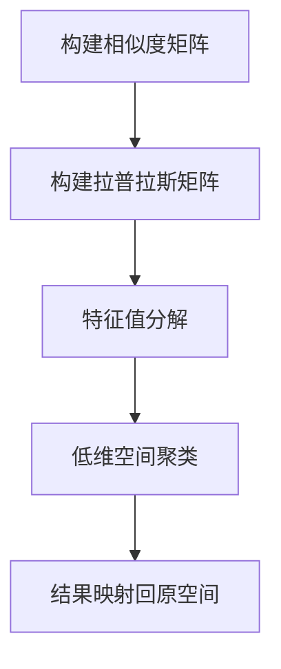

# 谱聚类(Spectral Clustering) - 原理与代码实例讲解

## 1.背景介绍

谱聚类（Spectral Clustering）是一种基于图论的聚类方法，近年来在机器学习和数据挖掘领域得到了广泛的应用。与传统的聚类算法（如K-means）相比，谱聚类在处理非凸形状的数据集和高维数据时表现出色。其核心思想是通过图的拉普拉斯矩阵的特征值分解，将数据映射到一个低维空间中，然后在这个低维空间中进行聚类。

谱聚类的应用范围非常广泛，包括图像分割、社交网络分析、生物信息学等领域。本文将深入探讨谱聚类的核心概念、算法原理、数学模型，并通过代码实例详细讲解其实现过程。

## 2.核心概念与联系

### 2.1 图论基础

谱聚类的基础是图论。一个图由节点和边组成，用于表示数据点及其相互关系。常见的图包括无向图、有向图、加权图等。

### 2.2 拉普拉斯矩阵

拉普拉斯矩阵是谱聚类的核心工具。对于一个无向图 $G = (V, E)$，其拉普拉斯矩阵 $L$ 定义为 $L = D - A$，其中 $D$ 是度矩阵，$A$ 是邻接矩阵。

### 2.3 特征值与特征向量

特征值和特征向量是线性代数中的重要概念。在谱聚类中，通过对拉普拉斯矩阵进行特征值分解，可以得到一组特征向量，这些特征向量用于将数据映射到低维空间。

### 2.4 相似度矩阵

相似度矩阵用于表示数据点之间的相似程度。常见的相似度度量包括欧氏距离、高斯核函数等。

## 3.核心算法原理具体操作步骤

谱聚类的算法步骤如下：

### 3.1 构建相似度矩阵

根据数据点之间的相似度，构建相似度矩阵 $S$。常用的方法是高斯核函数：

$$
S_{ij} = \exp\left(-\frac{\|x_i - x_j\|^2}{2\sigma^2}\right)
$$

### 3.2 构建拉普拉斯矩阵

根据相似度矩阵 $S$，构建度矩阵 $D$ 和拉普拉斯矩阵 $L$：

$$
D_{ii} = \sum_j S_{ij}
$$

$$
L = D - S
$$

### 3.3 特征值分解

对拉普拉斯矩阵 $L$ 进行特征值分解，得到前 $k$ 个最小特征值对应的特征向量，构成特征向量矩阵 $U$。

### 3.4 低维空间聚类

将特征向量矩阵 $U$ 的行归一化，然后在低维空间中使用K-means等传统聚类算法进行聚类。

### 3.5 结果映射回原空间

将低维空间中的聚类结果映射回原空间，得到最终的聚类结果。

以下是谱聚类算法的Mermaid流程图：



## 4.数学模型和公式详细讲解举例说明

### 4.1 相似度矩阵

相似度矩阵 $S$ 的构建是谱聚类的第一步。假设我们有一个数据集 $X = \{x_1, x_2, \ldots, x_n\}$，其中 $x_i \in \mathbb{R}^d$。我们可以使用高斯核函数来计算相似度：

$$
S_{ij} = \exp\left(-\frac{\|x_i - x_j\|^2}{2\sigma^2}\right)
$$

其中，$\sigma$ 是一个参数，控制相似度的衰减速度。

### 4.2 拉普拉斯矩阵

度矩阵 $D$ 是一个对角矩阵，其对角元素 $D_{ii}$ 表示节点 $i$ 的度数：

$$
D_{ii} = \sum_j S_{ij}
$$

拉普拉斯矩阵 $L$ 定义为：

$$
L = D - S
$$

### 4.3 特征值分解

对拉普拉斯矩阵 $L$ 进行特征值分解，得到特征值和特征向量：

$$
L = U \Lambda U^T
$$

其中，$\Lambda$ 是对角矩阵，其对角元素是 $L$ 的特征值，$U$ 是特征向量矩阵。

### 4.4 低维空间聚类

选择前 $k$ 个最小特征值对应的特征向量，构成特征向量矩阵 $U \in \mathbb{R}^{n \times k}$。将 $U$ 的行归一化，然后在低维空间中使用K-means等传统聚类算法进行聚类。

### 4.5 结果映射回原空间

将低维空间中的聚类结果映射回原空间，得到最终的聚类结果。

## 5.项目实践：代码实例和详细解释说明

下面是一个使用Python实现谱聚类的代码实例：

```python
import numpy as np
from sklearn.cluster import KMeans
from sklearn.metrics import pairwise_kernels

def spectral_clustering(X, n_clusters, gamma=1.0):
    # Step 1: 构建相似度矩阵
    S = pairwise_kernels(X, metric='rbf', gamma=gamma)
    
    # Step 2: 构建拉