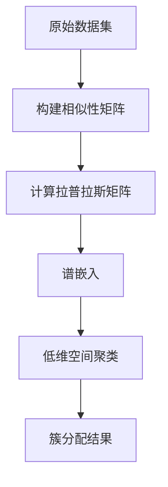

# 谱聚类(Spectral Clustering) - 原理与代码实例讲解

## 1.背景介绍

### 1.1 聚类分析概述

聚类分析是一种无监督学习技术,旨在将未标记的数据集合分组为有意义且内聚的簇或集群。这种分组是基于数据点之间的相似性,使得同一簇内的数据点相似度较高,而不同簇之间的数据点相似度较低。聚类分析在许多领域都有广泛应用,如计算机视觉、自然语言处理、生物信息学等。

### 1.2 传统聚类算法的局限性

传统的聚类算法如K-Means、层次聚类等,通常依赖于数据点之间的距离度量。然而,在高维空间或数据分布不规则的情况下,基于距离度量的聚类算法可能无法有效地发现数据的内在簇结构。这是由于"维数灾难"和"簇形状敏感性"等问题所导致的。

### 1.3 谱聚类的优势

谱聚类(Spectral Clustering)是一种基于谱理论的聚类方法,它通过构建相似性矩阵并对其进行特征分解,将数据投影到低维空间,从而更好地发现数据的簇结构。与传统聚类算法相比,谱聚类具有以下优势:

1. 能够有效处理任意形状和非凸的簇
2. 不受"维数灾难"的影响
3. 可以发现数据的非线性簇结构

因此,谱聚类在处理高维、非线性和任意形状的数据集时表现出色,广泛应用于图像分割、社交网络分析、基因表达数据分析等领域。

## 2.核心概念与联系

### 2.1 相似性矩阵

谱聚类的第一步是构建相似性矩阵(Similarity Matrix),用于度量数据点之间的相似性。常用的相似性度量包括高斯相似核、k近邻相似核等。相似性矩阵是一个对称矩阵,其中$S_{ij}$表示数据点$x_i$和$x_j$之间的相似性。

### 2.2 拉普拉斯矩阵

从相似性矩阵$S$可以得到拉普拉斯矩阵(Laplacian Matrix)$L$,它是谱聚类的核心概念。拉普拉斯矩阵可以通过以下方式构建:

$$L = D - S$$

其中$D$是度矩阵(Degree Matrix),是一个对角矩阵,对角线元素$D_{ii}$等于第$i$行(或列)的所有元素之和。拉普拉斯矩阵编码了数据点之间的局部相似性信息,是一个半正定矩阵。

### 2.3 谱聚类目标

谱聚类的目标是将数据点划分为$k$个互不相交的簇,使得同一簇内的数据点相似性较高,而不同簇之间的数据点相似性较低。这可以通过最小化以下目标函数来实现:

$$\min_{C_1,\ldots,C_k} \sum_{i,j} S_{ij} \|y_i - y_j\|^2 = \min_{C_1,\ldots,C_k} \mathrm{tr}(Y^TLY)$$

其中$C_1,\ldots,C_k$是数据点的簇划分,$y_i$和$y_j$是数据点$x_i$和$x_j$的簇指示向量,矩阵$Y$是所有数据点的簇指示矩阵。最小化目标函数等价于最小化$Y^TLY$,即在保持簇内相似性的同时最大化簇间差异。

### 2.4 谱嵌入

为了解决上述优化问题,谱聚类算法将数据点嵌入到低维空间中,使得簇结构在低维空间中更加明显。这个过程称为谱嵌入(Spectral Embedding),它利用了拉普拉斯矩阵的特征向量和特征值。

具体地,谱嵌入步骤如下:

1. 计算拉普拉斯矩阵$L$的前$k$个最小非零特征值对应的特征向量$u_1,\ldots,u_k$
2. 将每个数据点$x_i$映射到$k$维空间中的一个点$z_i = (u_1(i),\ldots,u_k(i))^T$

这样,原始的高维数据点就被嵌入到了$k$维空间中,使得簇结构更加明显。

### 2.5 簇分配

在谱嵌入后,剩下的工作就是在低维空间中对数据点进行聚类。这可以使用任何传统的聚类算法,如K-Means等。由于簇结构在低维空间中更加明显,传统聚类算法在这种情况下表现良好。

最终,每个数据点都被分配到一个簇中,实现了整个数据集的聚类。



## 3.核心算法原理具体操作步骤

谱聚类算法的核心步骤如下:

1. **构建相似性矩阵**
   - 计算数据点之间的相似性,通常使用高斯相似核或k近邻相似核
   - 得到相似性矩阵$S$,其中$S_{ij}$表示数据点$x_i$和$x_j$之间的相似性

2. **计算拉普拉斯矩阵**
   - 计算度矩阵$D$,其中$D_{ii} = \sum_j S_{ij}$
   - 计算拉普拉斯矩阵$L = D - S$

3. **谱嵌入**
   - 计算拉普拉斯矩阵$L$的前$k$个最小非零特征值对应的特征向量$u_1,\ldots,u_k$
   - 将每个数据点$x_i$映射到$k$维空间中的一个点$z_i = (u_1(i),\ldots,u_k(i))^T$

4. **簇分配**
   - 在低维空间中,使用传统聚类算法(如K-Means)对映射后的数据点进行聚类
   - 将每个数据点分配到对应的簇中

这些步骤可以用以下伪代码总结:

```python
import numpy as np

def spectral_clustering(X, k, similarity_func):
    # 1. 构建相似性矩阵
    S = similarity_func(X)
    
    # 2. 计算拉普拉斯矩阵
    D = np.diag(np.sum(S, axis=1))
    L = D - S
    
    # 3. 谱嵌入
    eigenvalues, eigenvectors = np.linalg.eigh(L)
    idx = eigenvalues.argsort()[:k]
    U = eigenvectors[:, idx]
    Z = U.real
    
    # 4. 簇分配
    cluster_labels = KMeans(n_clusters=k).fit_predict(Z)
    
    return cluster_labels
```

在上述伪代码中,`similarity_func`是用户定义的相似性函数,用于计算数据点之间的相似性。`KMeans`是传统的K-Means聚类算法,用于在低维空间中对映射后的数据点进行聚类。

## 4.数学模型和公式详细讲解举例说明

谱聚类算法的数学模型和公式如下:

### 4.1 相似性矩阵

相似性矩阵$S$是一个$n \times n$的对称矩阵,其中$n$是数据点的个数。$S_{ij}$表示数据点$x_i$和$x_j$之间的相似性,通常使用以下两种相似核函数计算:

1. **高斯相似核**

   $$S_{ij} = \exp\left(-\frac{\|x_i - x_j\|^2}{2\sigma^2}\right)$$

   其中$\sigma$是带宽参数,控制相似性的衰减速度。

2. **k近邻相似核**

   $$S_{ij} = \begin{cases}
   1, & \text{if } x_j \in \mathcal{N}_k(x_i) \text{ or } x_i \in \mathcal{N}_k(x_j)\\
   0, & \text{otherwise}
   \end{cases}$$

   其中$\mathcal{N}_k(x_i)$表示$x_i$的$k$个最近邻点集合。

### 4.2 拉普拉斯矩阵

拉普拉斯矩阵$L$是一个$n \times n$的半正定矩阵,定义如下:

$$L = D - S$$

其中$D$是度矩阵,是一个$n \times n$的对角矩阵,对角线元素$D_{ii}$等于第$i$行(或列)的所有元素之和:

$$D_{ii} = \sum_{j=1}^n S_{ij}$$

拉普拉斯矩阵编码了数据点之间的局部相似性信息,是谱聚类算法的核心。

### 4.3 谱聚类目标函数

谱聚类算法的目标是将数据点划分为$k$个互不相交的簇,使得同一簇内的数据点相似性较高,而不同簇之间的数据点相似性较低。这可以通过最小化以下目标函数来实现:

$$\min_{C_1,\ldots,C_k} \sum_{i,j} S_{ij} \|y_i - y_j\|^2 = \min_{C_1,\ldots,C_k} \mathrm{tr}(Y^TLY)$$

其中$C_1,\ldots,C_k$是数据点的簇划分,$y_i$和$y_j$是数据点$x_i$和$x_j$的簇指示向量,矩阵$Y$是所有数据点的簇指示矩阵。最小化目标函数等价于最小化$Y^TLY$,即在保持簇内相似性的同时最大化簇间差异。

### 4.4 谱嵌入

为了解决上述优化问题,谱聚类算法将数据点嵌入到低维空间中,使得簇结构在低维空间中更加明显。这个过程称为谱嵌入,它利用了拉普拉斯矩阵的特征向量和特征值。

具体地,谱嵌入步骤如下:

1. 计算拉普拉斯矩阵$L$的前$k$个最小非零特征值$\lambda_1,\ldots,\lambda_k$对应的特征向量$u_1,\ldots,u_k$
2. 将每个数据点$x_i$映射到$k$维空间中的一个点$z_i = (u_1(i),\ldots,u_k(i))^T$

这样,原始的高维数据点就被嵌入到了$k$维空间中,使得簇结构更加明显。

### 4.5 簇分配

在谱嵌入后,剩下的工作就是在低维空间中对数据点进行聚类。这可以使用任何传统的聚类算法,如K-Means等。由于簇结构在低维空间中更加明显,传统聚类算法在这种情况下表现良好。

最终,每个数据点都被分配到一个簇中,实现了整个数据集的聚类。

### 4.6 示例

以下是一个简单的示例,说明如何使用谱聚类算法对二维数据集进行聚类。

```python
import numpy as np
import matplotlib.pyplot as plt
from sklearn.datasets import make_moons

# 生成半月形状的数据集
X, y = make_moons(n_samples=1000, noise=0.05)

# 构建相似性矩阵
from sklearn.metrics.pairwise import rbf_kernel
S = rbf_kernel(X, gamma=0.5)

# 计算拉普拉斯矩阵
D = np.diag(np.sum(S, axis=1))
L = D - S

# 谱嵌入
eigenvalues, eigenvectors = np.linalg.eigh(L)
idx = eigenvalues.argsort()[:2]
U = eigenvectors[:, idx]
Z = U.real

# 簇分配
from sklearn.cluster import KMeans
kmeans = KMeans(n_clusters=2)
cluster_labels = kmeans.fit_predict(Z)

# 可视化结果
plt.scatter(X[:, 0], X[:, 1], c=cluster_labels)
plt.show()
```

在这个示例中,我们首先使用`make_moons`函数生成一个半月形状的二维数据集。然后,我们构建相似性矩阵,计算拉普拉斯矩阵,并进行谱嵌入将数据点映射到二维空间中。最后,我们使用K-Means算法在低维空间中对数据点进行聚类,并