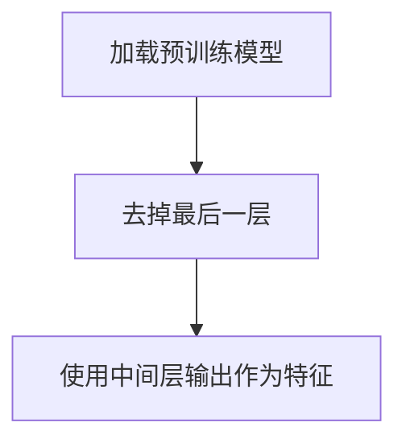
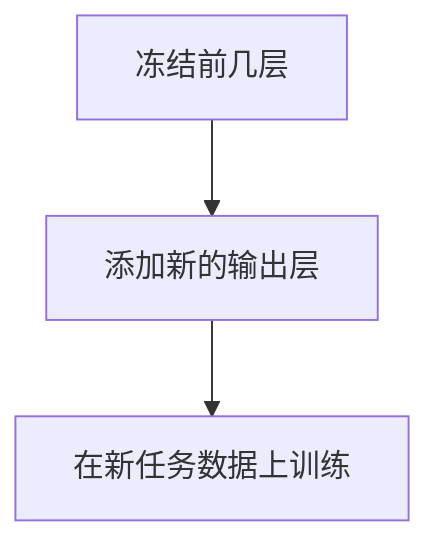

# 迁移学习 原理与代码实例讲解

## 1.背景介绍

迁移学习（Transfer Learning）是机器学习和深度学习领域中的一个重要分支。它的核心思想是将已经在一个任务上训练好的模型应用到另一个相关任务上，从而减少新任务所需的数据和训练时间。迁移学习在计算机视觉、自然语言处理等领域取得了显著的成果，极大地推动了这些领域的发展。

### 1.1 迁移学习的起源与发展

迁移学习的概念最早可以追溯到20世纪90年代，但真正的突破是在深度学习兴起之后。随着深度神经网络在各种任务上的成功，人们发现这些网络在不同任务之间具有一定的通用性，这为迁移学习提供了理论基础。

### 1.2 迁移学习的重要性

在实际应用中，获取大量标注数据往往是昂贵且耗时的。迁移学习通过利用已有的知识，可以显著减少新任务所需的数据量和训练时间，从而提高模型的泛化能力和应用效率。

## 2.核心概念与联系

迁移学习涉及多个核心概念和技术，包括但不限于特征提取、微调、领域适应等。理解这些概念对于掌握迁移学习的原理和应用至关重要。

### 2.1 特征提取

特征提取是迁移学习中最基本的操作之一。通过使用预训练模型的中间层输出作为特征，可以将这些特征输入到新的模型中进行训练。

### 2.2 微调

微调（Fine-tuning）是指在预训练模型的基础上，对其进行进一步训练，以适应新任务的需求。微调通常只调整模型的后几层参数，而保持前几层参数不变。

### 2.3 领域适应

领域适应（Domain Adaptation）是指在源领域和目标领域之间进行知识迁移。它的目标是使模型在目标领域上表现良好，即使源领域和目标领域的数据分布不同。

## 3.核心算法原理具体操作步骤

迁移学习的实现通常包括以下几个步骤：选择预训练模型、特征提取、微调和评估。

### 3.1 选择预训练模型

选择合适的预训练模型是迁移学习的第一步。常用的预训练模型包括VGG、ResNet、BERT等，这些模型在大规模数据集上进行了训练，具有较强的特征提取能力。

### 3.2 特征提取

特征提取的具体操作步骤如下：

1. 加载预训练模型。
2. 去掉预训练模型的最后一层。
3. 使用预训练模型的中间层输出作为特征。



### 3.3 微调

微调的具体操作步骤如下：

1. 冻结预训练模型的前几层。
2. 添加新的输出层。
3. 在新任务数据上进行训练。



### 3.4 评估

评估模型的性能是迁移学习的最后一步。常用的评估指标包括准确率、精确率、召回率等。

## 4.数学模型和公式详细讲解举例说明

迁移学习的数学模型可以通过以下公式进行描述：

### 4.1 特征提取公式

假设 $f(x)$ 是预训练模型的特征提取函数，$x$ 是输入数据，则特征提取的公式为：

$$
z = f(x)
$$

其中，$z$ 是提取的特征。

### 4.2 微调公式

在微调过程中，我们需要对模型的参数进行更新。假设 $\theta$ 是模型的参数，$L$ 是损失函数，则参数更新的公式为：

$$
\theta = \theta - \eta \nabla_{\theta} L
$$

其中，$\eta$ 是学习率，$\nabla_{\theta} L$ 是损失函数关于参数的梯度。

### 4.3 领域适应公式

领域适应的目标是最小化源领域和目标领域之间的分布差异。假设 $P_s(x)$ 和 $P_t(x)$ 分别是源领域和目标领域的数据分布，则领域适应的目标函数为：

$$
\min D(P_s(x), P_t(x))
$$

其中，$D$ 是分布差异的度量函数。

## 5.项目实践：代码实例和详细解释说明

为了更好地理解迁移学习的实际应用，我们将通过一个具体的项目实例来进行讲解。以下是一个使用迁移学习进行图像分类的代码示例。

### 5.1 环境准备

首先，我们需要安装必要的库：

```bash
pip install tensorflow keras
```

### 5.2 加载预训练模型

我们将使用Keras中的VGG16模型作为预训练模型：

```python
from tensorflow.keras.applications import VGG16

# 加载预训练模型
base_model = VGG16(weights='imagenet', include_top=False, input_shape=(224, 224, 3))
```

### 5.3 特征提取

接下来，我们使用预训练模型进行特征提取：

```python
from tensorflow.keras.preprocessing.image import ImageDataGenerator

# 数据预处理
datagen = ImageDataGenerator(rescale=0.1)
train_generator = datagen.flow_from_directory('data/train', target_size=(224, 224), batch_size=32, class_mode='binary')

# 提取特征
features = base_model.predict(train_generator)
```

### 5.4 微调

在特征提取的基础上，我们进行微调：

```python
from tensorflow.keras.models import Sequential
from tensorflow.keras.layers import Dense, Flatten

# 冻结预训练模型的前几层
for layer in base_model.layers:
    layer.trainable = False

# 添加新的输出层
model = Sequential([
    base_model,
    Flatten(),
    Dense(256, activation='relu'),
    Dense(1, activation='sigmoid')
])

# 编译模型
model.compile(optimizer='adam', loss='binary_crossentropy', metrics=['accuracy'])

# 训练模型
model.fit(train_generator, epochs=10)
```

### 5.5 评估

最后，我们评估模型的性能：

```python
# 评估模型
loss, accuracy = model.evaluate(train_generator)
print(f'Loss: {loss}, Accuracy: {accuracy}')
```

## 6.实际应用场景

迁移学习在多个领域都有广泛的应用，以下是几个典型的应用场景。

### 6.1 计算机视觉

在计算机视觉领域，迁移学习被广泛应用于图像分类、目标检测、图像分割等任务。通过使用预训练的卷积神经网络（如VGG、ResNet），可以显著提高模型的性能。

### 6.2 自然语言处理

在自然语言处理领域，迁移学习同样发挥了重要作用。预训练的语言模型（如BERT、GPT）可以用于文本分类、情感分析、机器翻译等任务。

### 6.3 医疗诊断

在医疗诊断领域，迁移学习可以用于医学影像分析、疾病预测等任务。通过使用预训练的模型，可以提高诊断的准确性和效率。

## 7.工具和资源推荐

为了更好地进行迁移学习，以下是一些推荐的工具和资源。

### 7.1 工具

- **TensorFlow**：一个开源的机器学习框架，支持迁移学习。
- **Keras**：一个高层神经网络API，简化了迁移学习的实现。
- **PyTorch**：另一个流行的深度学习框架，支持动态计算图和迁移学习。

### 7.2 资源

- **ImageNet**：一个大规模图像数据集，常用于预训练模型。
- **Hugging Face**：一个提供预训练语言模型的开源平台。
- **Kaggle**：一个数据科学竞赛平台，提供大量的数据集和预训练模型。

## 8.总结：未来发展趋势与挑战

迁移学习在过去几年中取得了显著的进展，但仍然面临一些挑战和发展机遇。

### 8.1 未来发展趋势

- **自监督学习**：通过自监督学习，可以进一步提高预训练模型的性能。
- **跨领域迁移**：研究如何在不同领域之间进行知识迁移，将是未来的重要方向。
- **高效迁移**：开发更加高效的迁移学习算法，以减少计算资源的消耗。

### 8.2 挑战

- **数据分布差异**：源领域和目标领域的数据分布差异可能导致迁移学习效果不佳。
- **模型复杂性**：预训练模型的复杂性可能导致计算资源的消耗过大。
- **领域适应**：如何在不同领域之间进行有效的适应，仍然是一个难题。

## 9.附录：常见问题与解答

### 9.1 迁移学习适用于哪些任务？

迁移学习适用于各种任务，包括图像分类、目标检测、文本分类、情感分析等。

### 9.2 如何选择预训练模型？

选择预训练模型时，应考虑模型的性能、计算资源需求以及与目标任务的相关性。

### 9.3 迁移学习的效果如何评估？

迁移学习的效果可以通过准确率、精确率、召回率等指标进行评估。

### 9.4 迁移学习是否总是有效？

迁移学习并不总是有效，特别是在源领域和目标领域差异较大的情况下，可能需要进行领域适应。

### 9.5 如何进行领域适应？

领域适应可以通过最小化源领域和目标领域之间的分布差异来实现，常用的方法包括对抗训练、领域对齐等。

---

作者：禅与计算机程序设计艺术 / Zen and the Art of Computer Programming