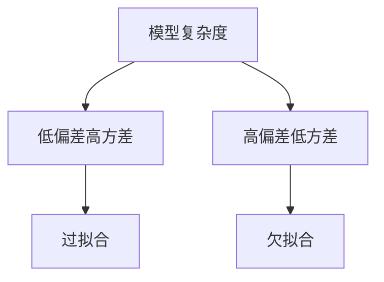

# 过拟合与欠拟合原理与代码实战案例讲解

## 1.背景介绍
### 1.1 机器学习中的模型泛化能力
### 1.2 过拟合与欠拟合的定义
### 1.3 过拟合与欠拟合的危害

## 2.核心概念与联系
### 2.1 偏差与方差的权衡
#### 2.1.1 偏差的概念
#### 2.1.2 方差的概念 
#### 2.1.3 偏差-方差困境
### 2.2 模型复杂度与泛化能力
#### 2.2.1 模型复杂度的度量
#### 2.2.2 模型复杂度与过拟合的关系
#### 2.2.3 奥卡姆剃刀原则
### 2.3 训练集、验证集与测试集
#### 2.3.1 数据集的划分
#### 2.3.2 验证集的作用
#### 2.3.3 测试集的作用



## 3.核心算法原理具体操作步骤
### 3.1 正则化
#### 3.1.1 L1正则化
#### 3.1.2 L2正则化
#### 3.1.3 弹性网络
### 3.2 交叉验证
#### 3.2.1 k折交叉验证
#### 3.2.2 留一交叉验证
#### 3.2.3 分层k折交叉验证
### 3.3 早停法
#### 3.3.1 早停法的原理
#### 3.3.2 早停法的实现
### 3.4 丢弃法
#### 3.4.1 丢弃法的原理
#### 3.4.2 丢弃法的实现

## 4.数学模型和公式详细讲解举例说明
### 4.1 线性回归的过拟合与欠拟合  
#### 4.1.1 线性回归的数学模型
$$h_\theta(x)=\theta_0+\theta_1x_1+\theta_2x_2+...+\theta_nx_n$$
#### 4.1.2 线性回归的代价函数
$$J(\theta)=\frac{1}{2m}\sum_{i=1}^{m}(h_\theta(x^{(i)})-y^{(i)})^2$$
#### 4.1.3 加入正则化项的代价函数
$$J(\theta)=\frac{1}{2m}\left[\sum_{i=1}^{m}(h_\theta(x^{(i)})-y^{(i)})^2+\lambda\sum_{j=1}^{n}\theta_j^2\right]$$
### 4.2 逻辑回归的过拟合与欠拟合
#### 4.2.1 逻辑回归的数学模型
$$h_\theta(x)=\frac{1}{1+e^{-\theta^Tx}}$$  
#### 4.2.2 逻辑回归的代价函数
$$J(\theta)=-\frac{1}{m}\sum_{i=1}^{m}\left[y^{(i)}\log(h_\theta(x^{(i)}))+(1-y^{(i)})\log(1-h_\theta(x^{(i)}))\right]$$
#### 4.2.3 加入正则化项的代价函数  
$$J(\theta)=-\frac{1}{m}\sum_{i=1}^{m}\left[y^{(i)}\log(h_\theta(x^{(i)}))+(1-y^{(i)})\log(1-h_\theta(x^{(i)}))\right]+\frac{\lambda}{2m}\sum_{j=1}^{n}\theta_j^2$$

## 5.项目实践：代码实例和详细解释说明
### 5.1 线性回归的过拟合与欠拟合实例
```python
from sklearn.linear_model import LinearRegression
from sklearn.preprocessing import PolynomialFeatures

# 生成多项式特征
poly_features = PolynomialFeatures(degree=2, include_bias=False)
X_poly = poly_features.fit_transform(X)

# 普通线性回归
lin_reg = LinearRegression()
lin_reg.fit(X, y)

# 多项式回归
poly_reg = LinearRegression()
poly_reg.fit(X_poly, y)
```
普通线性回归容易欠拟合，而多项式回归由于引入了高次项，模型复杂度增加，容易过拟合。我们可以通过正则化来控制模型复杂度，降低过拟合风险。

### 5.2 逻辑回归的过拟合与欠拟合实例
```python
from sklearn.linear_model import LogisticRegression

# 普通逻辑回归
log_reg = LogisticRegression()
log_reg.fit(X_train, y_train) 

# L2正则化的逻辑回归
log_reg_l2 = LogisticRegression(penalty='l2', C=1.0)  
log_reg_l2.fit(X_train, y_train)
```
普通逻辑回归容易过拟合，加入L2正则化可以通过控制模型权重的大小来降低过拟合。超参数C控制正则化强度，C越小，正则化越强。

### 5.3 使用早停法防止过拟合
```python
from sklearn.base import clone
from sklearn.metrics import mean_squared_error

# 早停法
min_val_error = float("inf")
best_epoch = None
best_model = None

for epoch in range(1000):
    model.fit(X_train, y_train)
    y_val_predict = model.predict(X_val)
    val_error = mean_squared_error(y_val, y_val_predict)
    if val_error < min_val_error:
        min_val_error = val_error
        best_epoch = epoch
        best_model = clone(model)
```
在每个epoch后评估模型在验证集上的性能，如果连续几个epoch模型性能没有提升，就及时停止训练。这样可以在模型过拟合之前就停止训练。

## 6.实际应用场景
### 6.1 图像分类中的过拟合与欠拟合
#### 6.1.1 数据增强
#### 6.1.2 迁移学习
### 6.2 推荐系统中的过拟合与欠拟合  
#### 6.2.1 稀疏性问题
#### 6.2.2 冷启动问题
### 6.3 自然语言处理中的过拟合与欠拟合
#### 6.3.1 词向量的过拟合
#### 6.3.2 预训练语言模型

## 7.工具和资源推荐
### 7.1 Scikit-learn
### 7.2 TensorFlow
### 7.3 PyTorch
### 7.4 Keras
### 7.5 在线课程与书籍推荐

## 8.总结：未来发展趋势与挑战
### 8.1 自动机器学习
### 8.2 元学习
### 8.3 终身学习
### 8.4 小样本学习
### 8.5 可解释性

## 9.附录：常见问题与解答
### 9.1 如何判断一个模型是否过拟合/欠拟合？
### 9.2 如何选择正则化参数？
### 9.3 交叉验证的k值如何选择？ 
### 9.4 为什么需要划分训练集、验证集和测试集？
### 9.5 如何权衡偏差和方差？

作者：禅与计算机程序设计艺术 / Zen and the Art of Computer Programming