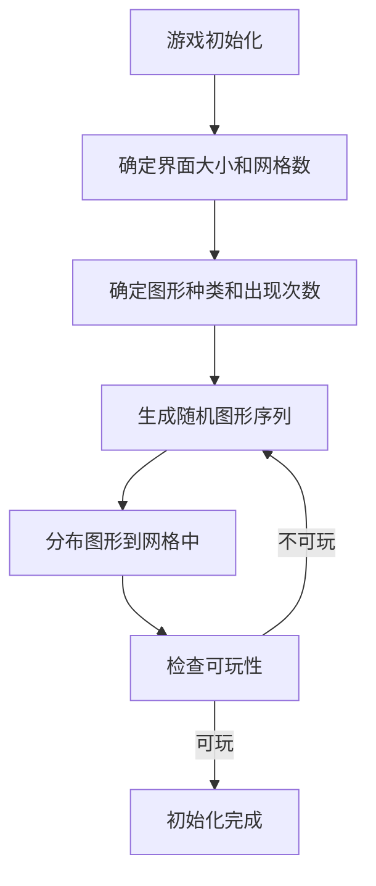
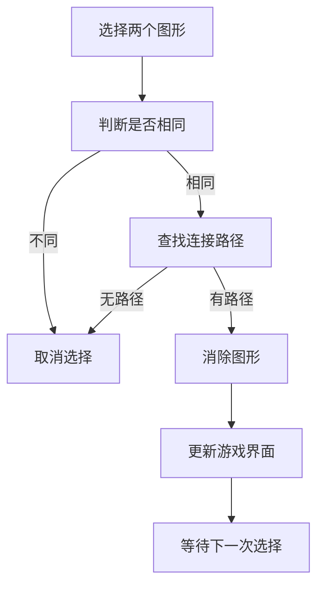
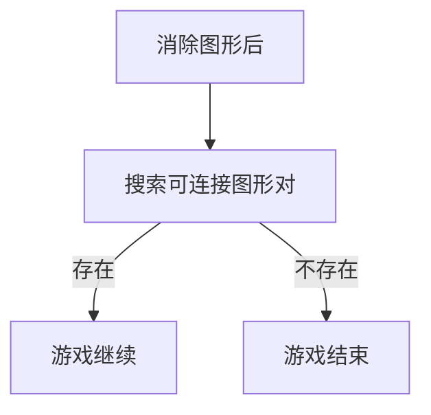

# 连连看游戏的设计与实现

## 1.背景介绍

连连看是一种经典的益智游戏,源于上世纪90年代的俄罗斯游戏"Lines"。游戏的目标是通过连接相同的图形或图案来消除所有图形。这种简单而有趣的游戏设计吸引了无数玩家,并成为了智力游戏的典范之一。

随着移动设备和触控屏幕的普及,连连看游戏获得了新的生命力。无论是在智能手机、平板电脑还是网页上,连连看游戏都能为玩家带来轻松愉悦的体验。游戏的规则简单,但是挑战性却并不低,需要玩家具备良好的观察力、逻辑思维能力和策略规划能力。

在本文中,我们将深入探讨连连看游戏的设计原理和实现方法,包括游戏逻辑、数据结构、算法、图形渲染等多个方面。通过对这款经典游戏的分析和实现,我们可以更好地理解游戏开发的基本流程和常见技术,为将来开发更加复杂的游戏奠定坚实的基础。

## 2.核心概念与联系

### 2.1 游戏逻辑

连连看游戏的核心逻辑非常简单,但是实现起来却有一些细节需要注意。游戏的基本规则是:玩家需要通过连接相同的图形或图案来消除它们,直到游戏界面上不再有可连接的图形为止。

游戏逻辑可以概括为以下几个步骤:

1. 初始化游戏界面,随机生成一定数量的图形
2. 玩家选择第一个图形
3. 玩家选择第二个图形,如果两个图形相同且可以连接,则消除这两个图形
4. 如果还有可连接的图形,则返回步骤2;否则,游戏结束

在实现游戏逻辑时,需要考虑以下几个关键点:

- 图形的生成和随机分布
- 图形的匹配规则(相同图形且可连接)
- 图形的消除机制
- 游戏结束的判断条件

### 2.2 数据结构

为了高效地实现游戏逻辑,我们需要选择合适的数据结构来存储和操作游戏数据。常见的数据结构包括:

- 二维数组:用于存储游戏界面上的图形信息
- 链表或队列:用于存储玩家选择的图形序列
- 字典或集合:用于存储不同图形的类型及其出现次数

根据具体的游戏需求和优化目标,我们可以灵活选择和组合不同的数据结构。

### 2.3 算法

在连连看游戏的实现中,我们需要使用一些常见的算法,例如:

- 随机算法:用于随机生成和分布图形
- 搜索算法:用于查找可连接的图形对
- 路径查找算法:用于确定两个图形是否可以连接

除此之外,我们还可以引入一些高级算法,如启发式搜索算法、图论算法等,以优化游戏性能和提高人工智能玩家的水平。

### 2.4 图形渲染

为了给玩家提供良好的视觉体验,我们需要对游戏界面进行合理的图形渲染。这可能涉及以下几个方面:

- 图形资源的加载和管理
- 图形的缩放、旋转和平移变换
- 图形的动画效果(如连接线的绘制、消除动画等)
- 用户界面的布局和交互

根据目标平台(如移动设备、网页等),我们可以选择不同的图形渲染技术,如OpenGL ES、Canvas、SVG等。

## 3.核心算法原理具体操作步骤

### 3.1 游戏初始化

在游戏开始时,我们需要初始化游戏界面,包括生成一定数量的图形并随机分布在界面上。这个过程可以分为以下几个步骤:

1. 确定游戏界面的大小和网格数量
2. 确定图形的种类数量和每种图形的出现次数
3. 使用随机算法生成图形序列,并将其随机分布在游戏界面的网格中

为了保证游戏的可玩性,我们需要在生成图形序列时进行一些检查和调整,例如:

- 保证至少有一对相同的图形可以连接
- 避免出现"死板"(无法连接任何图形的情况)
- 根据难度级别调整图形种类数量和出现次数



### 3.2 图形匹配和消除

当玩家选择两个图形后,我们需要判断它们是否匹配(相同且可连接),如果匹配,则将它们消除。这个过程可以分为以下几个步骤:

1. 判断两个图形是否相同
2. 使用路径查找算法确定它们是否可以连接
3. 如果可以连接,则消除这两个图形,并更新游戏界面
4. 如果不可以连接,则取消玩家的选择,等待下一次选择

在实现路径查找算法时,我们可以使用广度优先搜索(BFS)或深度优先搜索(DFS)等经典算法。为了提高效率,我们还可以引入一些优化策略,如记忆化搜索、启发式剪枝等。



### 3.3 游戏结束判断

在每次消除图形后,我们需要判断游戏是否应该结束。通常情况下,如果游戏界面上不再有任何可连接的图形对,则游戏结束。

我们可以使用搜索算法遍历整个游戏界面,查找是否还存在可连接的图形对。如果找到,则游戏继续;否则,游戏结束。



### 3.4 算法优化

为了提高游戏的性能和响应速度,我们可以对算法进行一些优化,例如:

- 引入空间换时间的策略,预计算和缓存一些中间结果
- 使用增量更新策略,只更新游戏界面的必要部分
- 采用多线程或异步处理,将一些耗时操作放到后台线程中执行
- 对算法进行剪枝和启发式优化,减少不必要的计算

在实现这些优化策略时,我们需要权衡时间和空间的开销,并根据具体的硬件环境和性能要求进行调整。

## 4.数学模型和公式详细讲解举例说明

在连连看游戏的实现中,我们可以借助一些数学模型和公式来描述和优化游戏逻辑。

### 4.1 图论模型

我们可以将游戏界面抽象为一个无向图 $G=(V,E)$,其中:

- $V$ 表示图形的集合,每个图形对应一个顶点
- $E$ 表示可连接的图形对的集合,每对可连接的图形对应一条边

在这个模型中,判断两个图形是否可以连接,就等价于在图 $G$ 中寻找一条连接它们的路径。我们可以使用广度优先搜索(BFS)或深度优先搜索(DFS)等经典算法来解决这个问题。

对于一个包含 $n$ 个顶点和 $m$ 条边的图,BFS 和 DFS 算法的时间复杂度分别为 $O(n+m)$ 和 $O(n+m)$。在连连看游戏中,由于图形的分布通常比较稀疏,因此 $m$ 远小于 $n^2$,所以这两种算法的时间复杂度都是可以接受的。

### 4.2 概率模型

在游戏初始化阶段,我们需要随机生成一定数量的图形,并将它们随机分布在游戏界面上。这个过程可以使用概率模型来描述和优化。

假设我们有 $k$ 种不同的图形,每种图形出现的次数为 $n_i$ ($i=1,2,\dots,k$),且 $\sum_{i=1}^k n_i = N$,其中 $N$ 表示游戏界面上的总图形数量。我们可以将这个过程看作是在 $N$ 个独立的伯努利试验中,每次试验的成功概率为 $p_i=n_i/N$。

根据伯努利分布的性质,我们可以计算出每种图形出现 $x_i$ 次的概率为:

$$P(X_i=x_i) = C_{N}^{x_i} p_i^{x_i} (1-p_i)^{N-x_i}$$

通过调整 $n_i$ 的值,我们可以控制每种图形出现的概率,从而影响游戏的难度级别。

### 4.3 启发式搜索

在寻找可连接的图形对时,我们可以使用启发式搜索算法来提高搜索效率。常见的启发式搜索算法包括 A* 算法、IDA* 算法等。

以 A* 算法为例,我们可以定义一个评价函数 $f(n) = g(n) + h(n)$,其中:

- $g(n)$ 表示从起点到当前节点 $n$ 的实际代价
- $h(n)$ 表示从当前节点 $n$ 到目标节点的估计代价

通过选择合适的启发式函数 $h(n)$,我们可以引导搜索朝着更有希望的方向前进,从而减少不必要的探索,提高搜索效率。

在连连看游戏中,我们可以将曼哈顿距离作为启发式函数,即:

$$h(n) = |x_1 - x_2| + |y_1 - y_2|$$

其中 $(x_1, y_1)$ 和 $(x_2, y_2)$ 分别表示当前节点和目标节点在游戏界面上的坐标。

使用 A* 算法搜索可连接的图形对,其时间复杂度为 $O(b^{d+1})$,其中 $b$ 表示分支因子(每个节点的平均后继节点数),而 $d$ 表示起点和目标节点之间的最短路径长度。在大多数情况下,A* 算法的效率要高于盲目搜索算法(如 BFS 和 DFS)。

## 5.项目实践:代码实例和详细解释说明

为了更好地理解连连看游戏的实现细节,我们提供了一个基于 JavaScript 和 HTML5 Canvas 的示例项目。这个项目包括以下几个主要模块:

### 5.1 游戏界面模块

该模块负责渲染游戏界面,包括网格、图形和连接线等元素。它使用 HTML5 Canvas 进行绘制,并提供了一些辅助函数,如坐标转换、图形缩放等。

```javascript
// 绘制网格
function drawGrid() {
  ctx.strokeStyle = 'lightgray';
  for (let x = 0; x <= width; x += cellSize) {
    ctx.beginPath();
    ctx.moveTo(x, 0);
    ctx.lineTo(x, height);
    ctx.stroke();
  }
  for (let y = 0; y <= height; y += cellSize) {
    ctx.beginPath();
    ctx.moveTo(0, y);
    ctx.lineTo(width, y);
    ctx.stroke();
  }
}

// 绘制图形
function drawShape(shape, x, y) {
  const img = shapeImages[shape];
  ctx.drawImage(img, x * cellSize, y * cellSize, cellSize, cellSize);
}

// 绘制连接线
function drawLine(x1, y1, x2, y2) {
  ctx.strokeStyle = 'red';
  ctx.lineWidth = 4;
  ctx.beginPath();
  ctx.moveTo((x1 + 0.5) * cellSize, (y1 + 0.5) * cellSize);
  ctx.lineTo((x2 + 0.5) * cellSize, (y2