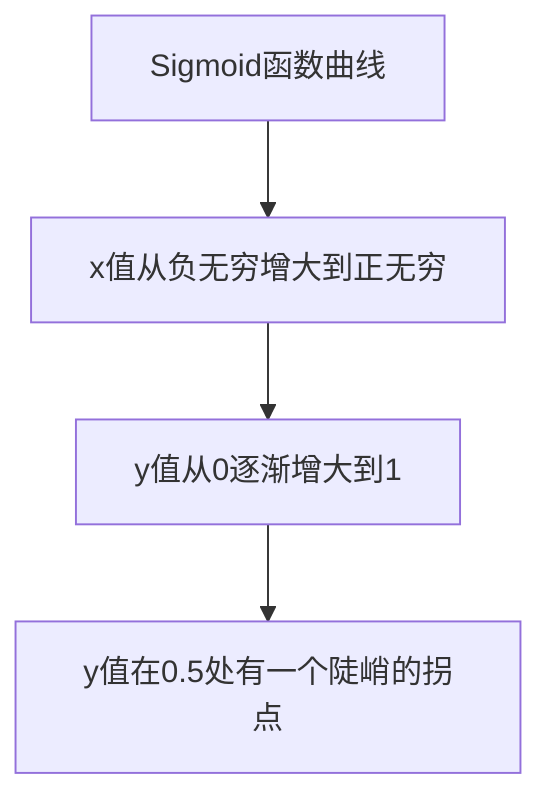
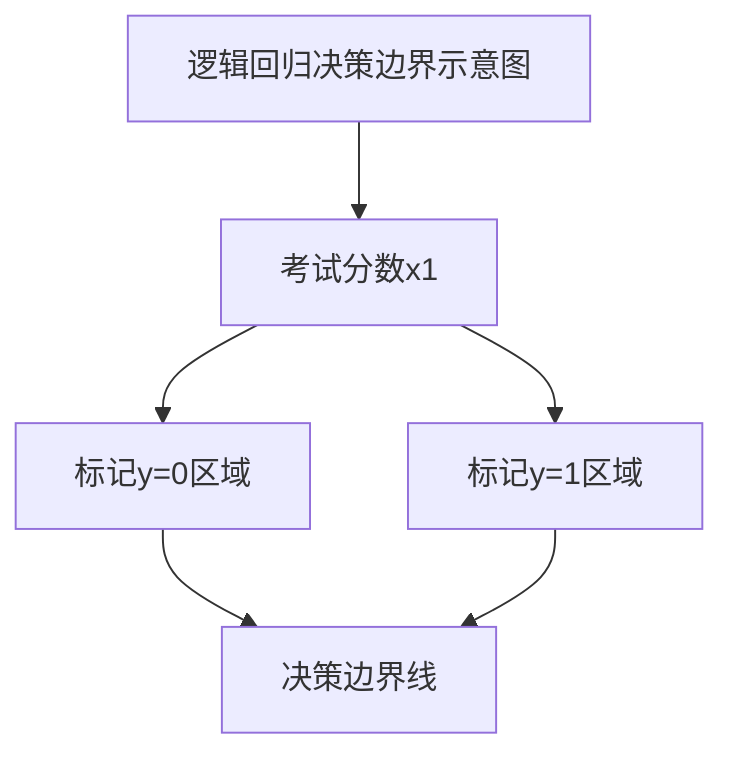

# 逻辑回归：分类问题的利器

## 1.背景介绍

在现代数据分析和机器学习领域中,分类问题是最常见和最基础的任务之一。分类的目标是根据给定的特征数据,将观测值划分到有限的离散类别中。例如,根据客户的年龄、收入和购买历史等特征,将他们划分为潜在客户和非潜在客户;或者根据肿瘤的大小、形状和其他指标,将其诊断为良性或恶性。

逻辑回归(Logistic Regression)作为一种强大而简单的监督学习算法,可以有效地解决二分类问题,并且在解决多分类问题时也有广泛的应用。尽管名字中含有"回归"一词,但逻辑回归实际上是一种分类算法,而不是回归算法。它通过估计输入数据属于某一类别的概率,从而实现分类。

## 2.核心概念与联系

### 2.1 逻辑回归的本质

逻辑回归的核心思想是通过对数据特征做加权求和,得到一个分数值,然后将这个分数值经过逻辑函数(Logistic Function)的转换,得到一个介于0和1之间的概率值,最后根据设定的阈值(通常为0.5)将概率值分类为0或1,即负类或正类。

### 2.2 逻辑函数

逻辑函数(Logistic Function)也被称为Sigmoid函数,它的公式如下:

$$
\sigma(x) = \frac{1}{1 + e^{-x}}
$$

其曲线形状如下图所示:



可以看出,当x值很大时,Sigmoid函数值接近1;当x值很小时,函数值接近0。这种非线性的特性使得逻辑函数非常适合作为分类任务中的判别函数。

### 2.3 假设函数

在逻辑回归中,我们定义了如下的假设函数:

$$
h_\theta(x) = \sigma(\theta^T x) = \frac{1}{1 + e^{-\theta^T x}}
$$

其中$\theta$是待求解的模型参数(权重)向量,$x$是输入的特征向量。假设函数的输出值$h_\theta(x)$就是输入数据$x$属于正类的概率估计值。

## 3.核心算法原理具体操作步骤  

### 3.1 目标函数

逻辑回归的目标是找到最优参数$\theta$,使得对于给定的训练数据集,正类的概率估计值$h_\theta(x)$与真实标记$y$之间的差距最小。我们通常采用最小化损失函数(代价函数)的方式来求解最优参数。

对于单个训练样本$(x,y)$,其损失函数定义为:

$$
\begin{aligned}
\text{Loss}(h_\theta(x),y) &= \begin{cases}
    -\log(h_\theta(x)) & \text{if }y=1\\
    -\log(1-h_\theta(x)) & \text{if }y=0
\end{cases}\\
&=-y\log(h_\theta(x))-(1-y)\log(1-h_\theta(x))
\end{aligned}
$$

对于整个训练数据集,总的损失函数(代价函数)为:

$$
J(\theta) = -\frac{1}{m}\sum_{i=1}^m[y^{(i)}\log(h_\theta(x^{(i)})) + (1-y^{(i)})\log(1-h_\theta(x^{(i)}))]
$$

其中$m$是训练样本的总数。我们的目标是最小化代价函数$J(\theta)$,从而得到最优的参数$\theta$。

### 3.2 参数求解

由于代价函数$J(\theta)$是一个非凸函数,我们无法直接求解其解析解。常用的方法是采用基于梯度的优化算法,如梯度下降法、拟牛顿法等,迭代地更新参数值,使代价函数不断减小,直至收敛得到最优解。

梯度下降法的更新规则为:

$$
\theta := \theta - \alpha \nabla_\theta J(\theta)
$$

其中$\alpha$是学习率,决定了每次迭代的步长;$\nabla_\theta J(\theta)$是代价函数关于$\theta$的梯度,它指示了$J(\theta)$在$\theta$处的变化方向。

对于逻辑回归的代价函数,其梯度为:

$$
\begin{aligned}
\nabla_\theta J(\theta) &= \frac{1}{m}\sum_{i=1}^m(h_\theta(x^{(i)}) - y^{(i)})x^{(i)}\\
&= \frac{1}{m}X^T(h_\theta(X) - y)
\end{aligned}
$$

其中$X$是输入特征矩阵,$y$是标记向量,$h_\theta(X)$是对$X$计算假设函数得到的概率估计值向量。

通过不断迭代更新参数$\theta$,直到代价函数收敛,我们就可以得到最优的模型参数。

### 3.3 正则化

为了防止过拟合,我们通常会在代价函数中加入正则化项,即:

$$
J(\theta) = -\frac{1}{m}\sum_{i=1}^m[y^{(i)}\log(h_\theta(x^{(i)})) + (1-y^{(i)})\log(1-h_\theta(x^{(i)}))] + \frac{\lambda}{2m}\sum_{j=1}^n\theta_j^2
$$

其中$\lambda$是正则化参数,用于控制正则化的强度;$n$是特征的维数。通常我们不对偏置项$\theta_0$进行正则化。

加入正则化项后,梯度更新公式变为:

$$
\nabla_\theta J(\theta) = \frac{1}{m}X^T(h_\theta(X) - y) + \frac{\lambda}{m}\theta
$$

正则化可以减小模型的方差,从而提高其泛化能力。

## 4.数学模型和公式详细讲解举例说明

### 4.1 二分类问题

假设我们有一个二分类问题的训练数据集,其中包含学生的考试分数和是否通过考试的标记(0或1)。我们的目标是根据考试分数,预测学生是否能通过考试。

设$x$为考试分数的特征向量,只有一个特征,即$x = (x_1)$;$y$为标记,取值为0或1。我们的假设函数为:

$$
h_\theta(x) = \sigma(\theta_0 + \theta_1 x_1) = \frac{1}{1 + e^{-(\theta_0 + \theta_1 x_1)}}
$$

其中$\theta_0$是偏置项,$\theta_1$是考试分数特征的权重。假设函数的输出$h_\theta(x)$表示学生通过考试的概率。

我们以一个简单的例子说明参数求解的过程。假设有以下4个训练样本:

| 考试分数 $x_1$ | 是否通过 $y$ |
|-----------------|--------------|
| 70              | 0            |
| 80              | 1            |
| 60              | 0            |
| 90              | 1            |

我们初始化参数为$\theta_0=0,\theta_1=0$,代入代价函数:

$$
\begin{aligned}
J(0,0) &= -\frac{1}{4}[0\log(\frac{1}{2}) + (1-0)\log(\frac{1}{2}) + 0\log(\frac{1}{2}) + (1-1)\log(\frac{1}{2})]\\
&= -\frac{1}{4}[-\log2 - \log2] \\
&= \frac{1}{2}\log2 \approx 0.346
\end{aligned}
$$

我们计算代价函数关于$\theta_0$和$\theta_1$的梯度:

$$
\begin{aligned}
\frac{\partial J(0,0)}{\partial \theta_0} &= \frac{1}{4}[(0.5-0) + (0.5-1) + (0.5-0) + (0.5-1)]\\
&= -0.25\\
\frac{\partial J(0,0)}{\partial \theta_1} &= \frac{1}{4}[(0.5-0)\cdot 70 + (0.5-1)\cdot 80 + (0.5-0)\cdot 60 + (0.5-1)\cdot 90]\\
&= 12.5
\end{aligned}
$$

假设我们取学习率$\alpha=0.1$,则参数的更新为:

$$
\begin{aligned}
\theta_0 &:= 0 - 0.1\cdot(-0.25) = 0.025\\
\theta_1 &:= 0 - 0.1\cdot 12.5 = -1.25
\end{aligned}
$$

我们继续迭代更新参数,直到代价函数收敛,得到最优参数解$\theta_0\approx-2.89,\theta_1\approx0.94$。

利用这组参数,我们可以绘制出逻辑回归模型的决策边界,如下图所示:



可以看出,当考试分数低于约77分时,模型会预测学生无法通过考试;当分数高于77分时,模型会预测学生可以通过考试。这个决策边界很好地拟合了训练数据。

### 4.2 多分类问题

对于多分类问题,我们可以构建多个二分类器,采用一对其余(One-vs-Rest)策略或一对一(One-vs-One)策略。以三分类问题为例,采用一对其余策略,我们需要训练三个二分类器:

- 第一个二分类器用于判断样本是否属于第一类;
- 第二个二分类器用于判断样本是否属于第二类;
- 第三个二分类器用于判断样本是否属于第三类。

对于新的样本$x$,我们将其输入到三个二分类器中,取概率值最大的类别作为预测结果。

设$h_\theta^{(i)}(x)$表示第$i$个二分类器对样本$x$的概率估计值,则最终的分类决策为:

$$
y = \arg\max_i h_\theta^{(i)}(x)
$$

也就是说,将$x$划分到概率值最大的那一类。

## 5.项目实践:代码实例和详细解释说明

下面我们用Python中的Scikit-Learn库,实现一个简单的二分类逻辑回归模型。

```python
from sklearn.linear_model import LogisticRegression
from sklearn.datasets import make_blobs
import matplotlib.pyplot as plt

# 生成模拟二分类数据
X, y = make_blobs(n_samples=1000, centers=2, n_features=2, random_state=1)

# 创建逻辑回归模型实例
log_reg = LogisticRegression()

# 训练模型
log_reg.fit(X, y)

# 绘制决策边界
fig, ax = plt.subplots(figsize=(8, 6))
ax.scatter(X[:, 0], X[:, 1], c=y, cmap='bwr', edgecolor='k')

x1_min, x1_max = X[:, 0].min() - 1, X[:, 0].max() + 1
x2_min, x2_max = X[:, 1].min() - 1, X[:, 1].max() + 1
xx1, xx2 = np.meshgrid(np.arange(x1_min, x1_max, 0.02),
                       np.arange(x2_min, x2_max, 0.02))
Z = log_reg.predict(np.c_[xx1.ravel(), xx2.ravel()])
Z = Z.reshape(xx1.shape)
ax.contourf(xx1, xx2, Z, cmap='bwr', alpha=0.2)

ax.set_xlabel('Feature 1')
ax.set_ylabel('Feature 2')
ax.set_title('Logistic Regression Decision Boundary')
plt.show()
```

上述代码首先使用`make_blobs`函数生成了一个模拟的二分类数据集,包含1000个样本,每个样本有两个特征。然后创建了一个`LogisticRegression`模型实例,并使用`fit`方法在训练数据上训练模型。

接下来,我们绘制了模型的决策边界。首先在图上绘制了训练数据的散点图,不同颜色表示不同类别。然后,我们构建了一个网格,在网格上的每个点计算模型的预测值,并使用`contourf`函数绘制出决策边界。

最终的图形显示了模型在特征空间中将两个类别分开的决策边界。

## 6.实际应用场景

逻辑