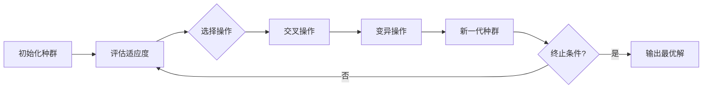

# 遗传算法在游戏AI中的应用实践

## 1.背景介绍

游戏AI是现代游戏不可或缺的一部分,它赋予了游戏智能行为和挑战性。传统的游戏AI通常采用规则库系统或有限状态机,但这些方法存在局限性,难以处理复杂的游戏场景。随着游戏复杂度的不断提高,开发人员需要更加智能和自适应的AI算法。遗传算法(Genetic Algorithm, GA)作为一种基于进化理论的优化算法,在游戏AI领域展现出了巨大的潜力。

### 1.1 游戏AI的挑战

设计一个高质量的游戏AI面临着诸多挑战:

1. **复杂性**: 现代游戏环境通常非常复杂,需要处理大量的输入数据、游戏规则和动态变化的状态。

2. **不确定性**: 游戏中存在许多不确定因素,如玩家行为、随机事件等,使得预测游戏状态变化变得困难。

3. **实时性**: 游戏AI需要在有限的时间内做出决策,以保证游戏的流畅性和响应性。

4. **可扩展性**: 随着游戏复杂度的增加,AI算法需要具有良好的可扩展性,以适应不断变化的需求。

### 1.2 遗传算法的优势

遗传算法是一种启发式搜索算法,它模拟自然界中生物进化的过程,通过选择、交叉和变异等操作来优化问题的解决方案。与传统的AI算法相比,遗传算法具有以下优势:

1. **全局优化能力**: 遗传算法可以有效地探索解空间,避免陷入局部最优解。

2. **适应性强**: 遗传算法可以自适应地调整参数,以适应不同的问题环境。

3. **并行处理**: 遗传算法的操作可以很好地并行化,提高计算效率。

4. **鲁棒性**: 遗传算法对噪声和不完整数据具有较强的鲁棒性。

由于这些优势,遗传算法在游戏AI领域得到了广泛的应用,如游戏策略优化、行为建模、路径规划等。

## 2.核心概念与联系

### 2.1 遗传算法的基本概念

遗传算法借鉴了生物进化的思想,将问题的潜在解决方案编码为一组个体(染色体),然后通过一系列进化操作(如选择、交叉和变异)来产生新的个体,逐渐优化解决方案。

以下是遗传算法中的一些核心概念:

1. **个体(Individual)**: 表示问题的一个潜在解决方案,通常使用二进制串或其他编码方式进行表示。

2. **种群(Population)**: 由多个个体组成的集合,代表了当前的解空间。

3. **适应度函数(Fitness Function)**: 用于评估个体的优劣程度,适应度值高的个体更有可能被选择用于进化。

4. **选择(Selection)**: 根据个体的适应度值,从当前种群中选择一部分个体作为父代,用于产生下一代种群。

5. **交叉(Crossover)**: 将两个父代个体的部分基因组合,产生新的子代个体。

6. **变异(Mutation)**: 在个体的基因中引入少量随机变化,以增加种群的多样性。

通过不断进行选择、交叉和变异操作,种群中的个体质量会逐渐提高,最终收敛到问题的最优解或近似最优解。

### 2.2 遗传算法在游戏AI中的应用

遗传算法在游戏AI领域有着广泛的应用,主要包括以下几个方面:

1. **游戏策略优化**: 使用遗传算法优化游戏AI的决策策略,以提高AI在对抗环境中的表现。

2. **行为建模**: 通过遗传算法对游戏中的角色行为进行建模和优化,使得角色行为更加智能和自然。

3. **路径规划**: 利用遗传算法求解游戏中的路径规划问题,寻找最优路径。

4. **内容生成**: 使用遗传算法生成游戏关卡、地形、音乐等游戏内容,提高游戏的多样性和可玩性。

5. **参数调优**: 利用遗传算法优化游戏AI中的各种参数,以提高AI的整体性能。

在上述应用中,遗传算法的优势得到了充分体现,它可以有效地探索解空间,自适应地调整参数,并具有良好的并行处理能力和鲁棒性。

## 3.核心算法原理具体操作步骤

遗传算法的核心操作步骤如下:

1. **初始化种群**: 随机生成一个初始种群,每个个体代表问题的一个潜在解决方案。

2. **评估适应度**: 对种群中的每个个体计算其适应度值,作为衡量个体优劣的指标。

3. **选择操作**: 根据适应度值,从当前种群中选择一部分个体作为父代,用于产生下一代种群。常用的选择方法包括轮盘赌选择、锦标赛选择等。

4. **交叉操作**: 从选择出的父代个体中随机选择两个个体,并在它们的染色体上随机选择一个或多个交叉点,交换部分基因,产生新的子代个体。

5. **变异操作**: 对新产生的子代个体进行变异操作,以引入新的基因,增加种群的多样性。变异通常是在个体的染色体上随机改变一个或多个基因位。

6. **新一代种群**: 将经过交叉和变异操作产生的新个体与原种群中保留的部分个体合并,形成新一代种群。

7. **终止条件判断**: 检查是否满足算法终止条件,如达到最大进化代数、找到满意解等。如果条件满足,则输出当前最优解并终止算法;否则,返回步骤2,对新一代种群进行适应度评估和进化操作。

上述步骤反复进行,直到满足终止条件。通过不断进化,种群中的个体质量会逐渐提高,最终收敛到问题的最优解或近似最优解。

需要注意的是,在实际应用中,还需要对遗传算法的各个组成部分(如编码方式、选择策略、交叉和变异操作等)进行合理设计和调优,以提高算法的性能和收敛速度。

## 4.数学模型和公式详细讲解举例说明

遗传算法中涉及到一些重要的数学模型和公式,对于理解和实现算法具有重要意义。下面将详细讲解其中的几个关键部分。

### 4.1 适应度函数

适应度函数(Fitness Function)用于评估个体的优劣程度,是遗传算法中的核心部分之一。适应度函数的设计直接影响算法的收敛性能和最终结果。

在游戏AI中,适应度函数通常根据具体的应用场景而定义。例如,在游戏策略优化中,适应度函数可以基于AI在对抗环境中的得分或胜率来定义;在路径规划中,适应度函数可以基于路径长度或能量消耗来定义。

假设我们需要优化一个游戏AI的决策策略,目标是最大化AI在对抗环境中的得分。我们可以将适应度函数定义为:

$$
f(x) = \sum_{i=1}^{n} s_i(x)
$$

其中,$ x $表示决策策略的编码形式(个体),$ s_i(x) $表示在第$ i $场对抗中AI获得的得分,$ n $表示对抗场次的总数。

通过最大化适应度函数$ f(x) $,我们可以找到使AI在对抗环境中获得最高总得分的最优决策策略。

### 4.2 选择操作

选择操作是遗传算法中的一个关键步骤,它决定了哪些个体将被选择用于产生下一代种群。常用的选择方法包括轮盘赌选择(Roulette Wheel Selection)和锦标赛选择(Tournament Selection)。

**轮盘赌选择**是一种基于适应度比例的选择方法。每个个体被选择的概率与其适应度值成正比。具体来说,对于种群中的每个个体$ x_i $,计算其相对适应度:

$$
p(x_i) = \frac{f(x_i)}{\sum_{j=1}^{N} f(x_j)}
$$

其中,$ f(x_i) $是个体$ x_i $的适应度值,$ N $是种群大小。然后,根据相对适应度$ p(x_i) $构建一个轮盘赌,每个个体在轮盘赌上占据一个相应的区域。选择操作相当于在轮盘赌上进行$ N $次抽取,每次抽取的个体将被选中作为父代。

**锦标赛选择**是另一种常用的选择方法。它通过随机选择一组个体(通常是2-7个),并从中选择适应度最高的个体作为父代。这种方法可以避免出现适应度值过于悬殊的情况,提高了选择的压力。

两种选择方法各有优缺点,需要根据具体问题进行选择和调优。

### 4.3 交叉和变异操作

交叉操作和变异操作是遗传算法中产生新个体的两种主要方式,它们分别模拟了生物进化中的重组和突变过程。

**交叉操作**通常采用单点交叉或多点交叉的方式。以单点交叉为例,对于两个父代个体$ x_1 $和$ x_2 $,我们随机选择一个交叉点$ c $,然后交换两个个体在交叉点后面的基因,产生两个新的子代个体$ y_1 $和$ y_2 $:

$$
\begin{aligned}
y_1 &= x_1[1:c] \oplus x_2[c+1:l] \\
y_2 &= x_2[1:c] \oplus x_1[c+1:l]
\end{aligned}
$$

其中,$ \oplus $表示串联操作,$ l $是个体的长度。

**变异操作**通常是在个体的基因上随机改变一个或多个位置的值。对于一个个体$ x $,我们可以定义一个变异概率$ p_m $,然后对每一个基因位进行独立的变异操作:

$$
x_i' = \begin{cases}
1 - x_i & \text{if } \operatorname{rand}() < p_m \\
x_i & \text{otherwise}
\end{cases}
$$

其中,$ x_i $是个体$ x $的第$ i $个基因位,$ x_i' $是变异后的基因位,$ \operatorname{rand}() $是产生$ [0,1] $区间内均匀随机数的函数。

交叉和变异操作的设计对算法的性能有重要影响。在实际应用中,需要根据具体问题进行调优,以找到最佳的交叉和变异策略。

## 5.项目实践:代码实例和详细解释说明

为了更好地理解遗传算法在游戏AI中的应用,我们将通过一个具体的项目实践来演示如何使用遗传算法优化游戏AI的决策策略。

假设我们有一个简单的对抗游戏,游戏AI需要在每一回合中选择一个动作(攻击、防御或逃跑)。我们的目标是使用遗传算法找到一个最优的决策策略,使AI在对抗环境中获得最高的总得分。

### 5.1 问题建模

首先,我们需要将决策策略编码为个体的形式。这里,我们将使用二进制编码,每个个体由一串固定长度的二进制数表示。例如,对于一个长度为9的个体`101010101`,前3位表示在对手处于攻击状态时AI的动作(攻击、防御或逃跑),中间3位表示在对手处于防御状态时AI的动作,最后3位表示在对手逃跑时AI的动作。

接下来,我们定义适应度函数。假设在一场对抗中,AI获得的得分由以下规则决定:

- 攻击对手时,若对手防御则AI得分+1,若对手逃跑