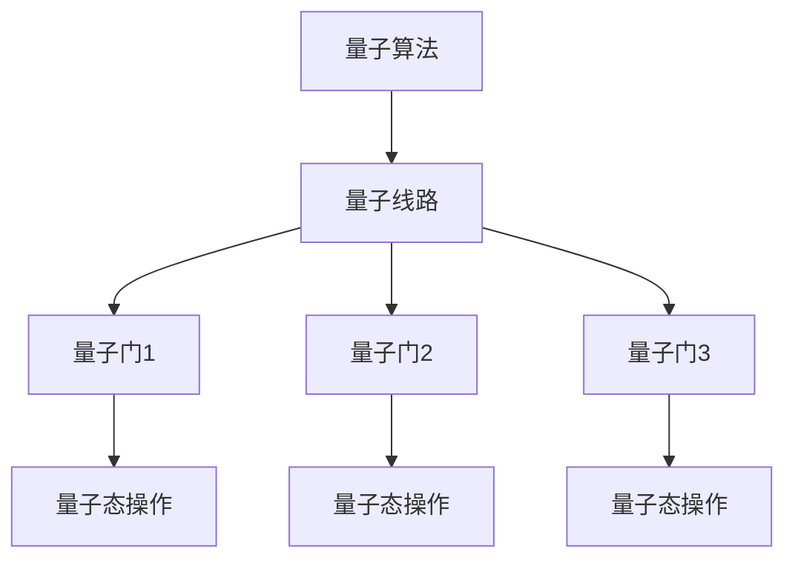
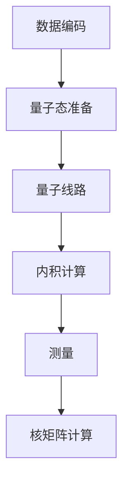

# 量子机器学习原理与代码实战案例讲解

## 1.背景介绍

量子计算是一种利用量子力学原理来执行运算的计算范式。与传统计算机基于二进制位不同,量子计算机使用量子位(qubit)作为基本计算单元。量子位可以处于0和1的叠加态,允许并行计算,从而在某些任务上展现出巨大的计算优势。

近年来,量子机器学习(Quantum Machine Learning, QML)作为量子计算在人工智能领域的应用,受到了广泛关注。QML旨在利用量子计算的独特优势,提高机器学习算法的性能和效率。

### 量子计算的优势

相较于经典计算机,量子计算具有以下独特优势:

1. **量子并行性**: 量子态可以表示多个不同状态的叠加,从而实现并行计算。
2. **量子叠加**: 通过叠加不同的量子态,可以表示更多的信息。
3. **量子纠缠**: 量子纠缠现象使得量子系统中的粒子之间存在着神奇的相关性,可用于高效传输信息。

这些优势使得量子计算在一些特定问题上具有指数级的加速,如求解大整数分解、无约束优化等。

### 机器学习中的挑战

传统的机器学习算法在一些复杂问题上存在以下挑战:

1. **高维数据**: 在处理高维数据时,经典算法的计算复杂度会迅速增加,导致计算效率低下。
2. **非凸优化问题**: 许多机器学习问题涉及非凸优化,经典算法难以找到全局最优解。
3. **数据安全性**: 在涉及敏感数据的场景中,传统算法难以保证数据隐私和安全性。

量子机器学习可以利用量子计算的优势来应对这些挑战,提高机器学习算法的性能和效率。

## 2.核心概念与联系

量子机器学习的核心思想是将经典的机器学习模型和算法移植到量子计算架构上,以利用量子计算的并行性和量子态叠加等特性。

### 量子线路和量子门

在量子计算中,量子线路(Quantum Circuit)是执行量子算法的基本模型。量子线路由一系列量子逻辑门(Quantum Gate)组成,这些量子门对量子态进行操作和变换。

常见的量子门包括:

- 单比特量子门:Pauli-X门、Pauli-Y门、Pauli-Z门、Hadamard门等。
- 多比特量子门:CNOT门、SWAP门、Toffoli门等。

通过组合这些量子门,我们可以构建复杂的量子线路来执行各种量子算法。

### 量子数据编码

在量子机器学习中,经典的数据需要被编码为量子态。常见的量子数据编码方式包括:

1. **基础编码**(Basis Encoding): 将经典数据编码为量子态的基础态。
2. **振幅编码**(Amplitude Encoding): 将经典数据编码为量子态的振幅。
3. **角度编码**(Angle Encoding): 将经典数据编码为量子态的相位。

不同的编码方式适用于不同的量子算法,选择合适的编码方式对算法的性能和效率有重要影响。

### 量子内积和测量

量子内积(Quantum Inner Product)是量子态之间的一种相似度度量,在量子机器学习中扮演着重要角色。通过计算量子态之间的内积,我们可以获取有关量子态的信息。

量子测量(Quantum Measurement)是从量子态中提取经典信息的过程。在量子机器学习中,我们通常需要对量子态进行测量,将量子计算的结果映射回经典空间。

## 3.核心算法原理具体操作步骤

量子机器学习算法的核心步骤通常包括:

1. **数据编码**: 将经典数据编码为量子态。
2. **量子线路设计**: 设计用于执行机器学习任务的量子线路。
3. **量子线路执行**: 在量子硬件或模拟器上执行量子线路。
4. **量子测量**: 对量子态进行测量,获取经典输出。
5. **后处理**: 对测量结果进行后处理,得到最终的机器学习模型或预测结果。

下面以量子支持向量机(Quantum Support Vector Machine, QSVM)为例,介绍其具体操作步骤。

### 1. 数据编码

将训练数据集 $\{(x_i, y_i)\}_{i=1}^N$ 编码为量子态,其中 $x_i$ 为特征向量, $y_i \in \{-1, 1\}$ 为标签。常用的编码方式是振幅编码:

$$
|\psi(x_i)\rangle = \frac{1}{\sqrt{d}}\sum_{j=1}^d x_{ij}|j\rangle
$$

其中 $d$ 为特征向量的维数。

### 2. 量子线路设计

QSVM 算法的核心是求解以下优化问题:

$$
\min_{\alpha} \frac{1}{2}\sum_{i,j=1}^N \alpha_i\alpha_jy_iy_jK(x_i, x_j) - \sum_{i=1}^N\alpha_i
$$

其中 $K(x_i, x_j)$ 是核函数,通常选择高斯核:

$$
K(x_i, x_j) = \exp(-\gamma\|x_i - x_j\|^2)
$$

我们可以设计一个量子线路来计算核矩阵 $K_{ij} = K(x_i, x_j)$ 的元素。这个量子线路包括以下步骤:

1. 准备量子态 $|\psi(x_i)\rangle$ 和 $|\psi(x_j)\rangle$。
2. 应用一系列量子门来计算内积 $\langle\psi(x_i)|\psi(x_j)\rangle$。
3. 通过测量获取内积的值,并根据高斯核函数计算 $K_{ij}$。

### 3. 量子线路执行

将设计好的量子线路部署到量子硬件或模拟器上执行。由于当前的量子硬件存在噪声和其他限制,因此通常需要进行量子错误纠正和其他优化措施。

### 4. 量子测量和后处理

对量子线路的输出进行测量,获取经典的核矩阵元素。然后,利用经典优化算法(如序列最小优化SMO)求解 QSVM 的优化问题,得到支持向量 $\alpha$ 和偏置项 $b$,从而构建 QSVM 模型:

$$
f(x) = \text{sign}\left(\sum_{i=1}^N \alpha_iy_iK(x, x_i) + b\right)
$$

该模型可用于新数据的分类或回归任务。

## 4.数学模型和公式详细讲解举例说明

在量子机器学习中,数学模型和公式扮演着重要角色。下面将详细讲解一些核心的数学概念和公式。

### 4.1 量子态和量子叠加

在量子计算中,信息以量子态的形式存在。一个单比特量子态可以表示为:

$$
|\psi\rangle = \alpha|0\rangle + \beta|1\rangle
$$

其中 $\alpha$ 和 $\beta$ 是复数,满足 $|\alpha|^2 + |\beta|^2 = 1$。这种线性叠加态是量子计算的核心特征之一,使得量子计算能够同时处理多个状态。

对于 $n$ 个量子比特,其量子态可以表示为:

$$
|\psi\rangle = \sum_{i=0}^{2^n-1} c_i|i\rangle
$$

其中 $|i\rangle$ 表示计算基态,是 $n$ 个量子比特的一个可能状态;$c_i$ 是复数振幅,满足 $\sum_{i=0}^{2^n-1} |c_i|^2 = 1$。

这种指数级的态空间大小赋予了量子计算并行处理能力,是其强大计算能力的根源。

### 4.2 量子门和量子线路

量子门是量子计算的基本操作单元,用于对量子态进行变换。常见的单比特量子门包括:

- Pauli-X 门: $X = \begin{pmatrix} 0 & 1 \\ 1 & 0 \end{pmatrix}$
- Pauli-Y 门: $Y = \begin{pmatrix} 0 & -i \\ i & 0 \end{pmatrix}$
- Pauli-Z 门: $Z = \begin{pmatrix} 1 & 0 \\ 0 & -1 \end{pmatrix}$
- Hadamard 门: $H = \frac{1}{\sqrt{2}}\begin{pmatrix} 1 & 1 \\ 1 & -1 \end{pmatrix}$

多比特量子门的一个典型例子是 CNOT 门,它对两个量子比特进行操作:

$$
\text{CNOT} = \begin{pmatrix}
1 & 0 & 0 & 0\\
0 & 1 & 0 & 0\\
0 & 0 & 0 & 1\\
0 & 0 & 1 & 0
\end{pmatrix}
$$

通过组合这些量子门,我们可以构建复杂的量子线路来执行各种量子算法。

### 4.3 量子内积和量子测量

量子内积是量子态之间的一种相似度度量,定义为:

$$
\langle\psi|\phi\rangle = \sum_i \overline{\psi_i}\phi_i
$$

其中 $|\psi\rangle$ 和 $|\phi\rangle$ 分别表示两个量子态,上划线表示复数共轭。量子内积的模平方 $|\langle\psi|\phi\rangle|^2$ 给出了两个量子态之间的相似程度。

在量子机器学习中,我们通常需要对量子态进行测量,将量子计算的结果映射回经典空间。测量的过程是将量子态投影到某个基矢量上,获取对应的经典结果。例如,对于单比特量子态 $|\psi\rangle = \alpha|0\rangle + \beta|1\rangle$,测量在基矢 $|0\rangle$ 上的概率为 $|\alpha|^2$,在基矢 $|1\rangle$ 上的概率为 $|\beta|^2$。

### 4.4 量子并行性和量子加速

量子计算的并行性来源于量子态的叠加特性。一个 $n$ 比特的量子态可以同时表示 $2^n$ 个不同的基态,这使得量子计算能够同时处理指数级数量的输入。

例如,在求解无约束优化问题时,经典算法需要逐一评估每个可能的解,时间复杂度为 $O(N)$,其中 $N$ 为搜索空间的大小。而量子算法可以利用量子并行性,将所有可能的解编码到一个量子态中,通过量子操作来获取最优解,时间复杂度仅为 $O(\log N)$,展现出了指数级的加速。

### 4.5 量子机器学习中的核方法

在经典机器学习中,核方法(如支持向量机)通过将数据映射到高维特征空间,从而线性可分。在量子机器学习中,我们可以利用量子态的叠加性质,直接在量子空间中计算核函数,避免了显式地映射到高维空间。

对于两个量子态 $|\psi(x)\rangle$ 和 $|\psi(x')\rangle$,它们的内积可以表示为:

$$
\langle\psi(x)|\psi(x')\rangle = K(x, x')
$$

其中 $K(x, x')$ 是一个核函数,例如高斯核:

$$
K(x, x') = \exp(-\gamma\|x - x'\|^2)
$$

通过设计量子线路来计算这个内积,我们就可以在量子空间中高效地计算核函数,从而实现量子版本的核方法。

## 5.项目实践:代码实例和详细解释说明

在本节中,我们将使用 Qiskit 量子计算框架,实现一个简单的量子支持向量机 (QSVM