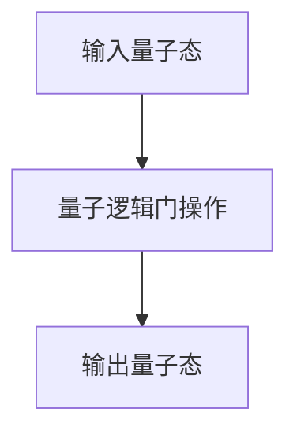
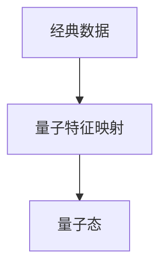
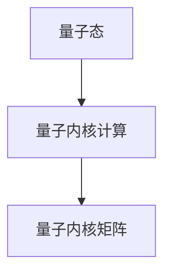
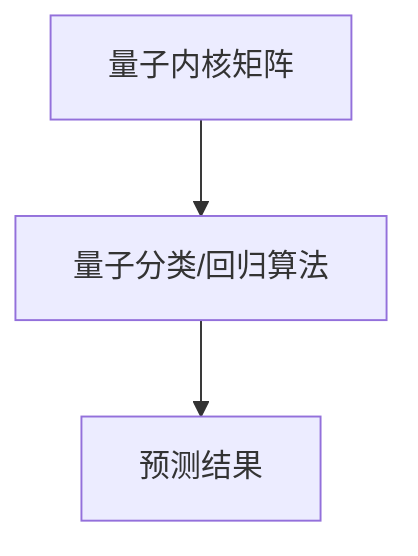
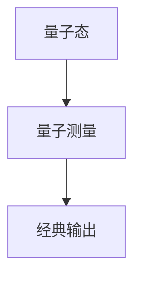

# 量子机器学习原理与代码实战案例讲解

## 1.背景介绍

量子计算机是一种利用量子力学原理来执行计算的新型计算机。与传统计算机基于二进制位的计算不同，量子计算机利用量子比特(qubit)来表示信息。量子比特可以同时存在0和1的叠加态,这使得量子计算机能够同时处理大量数据,从而在某些计算问题上拥有巨大的加速优势。

量子机器学习(Quantum Machine Learning)是将机器学习算法与量子计算相结合的一种新兴研究领域。它旨在利用量子计算机的并行性和量子态的叠加特性,来提高机器学习算法的性能和效率。

### 量子计算机的优势

相比经典计算机,量子计算机具有以下优势:

1. **并行性**: 量子态可以表示多个不同状态的叠加,因此量子计算机可以同时处理大量数据。
2. **量子算力**: 某些问题在量子计算机上可以获得指数级的加速。
3. **量子安全**: 基于量子力学原理的量子密码学可以提供更高的安全性。

### 量子机器学习的应用前景

量子机器学习在以下领域具有广阔的应用前景:

1. **组合优化**: 通过量子并行性加速求解组合优化问题,如旅行商问题、布线布局等。
2. **量子化学模拟**: 利用量子计算机模拟量子化学过程,设计新材料和新药物。 
3. **量子人工智能**: 结合量子计算和人工智能,提高机器学习算法的性能和效率。
4. **量子金融**: 量子算法在金融风险分析、投资组合优化等方面的应用。

虽然量子计算机目前仍处于起步阶段,但量子机器学习已成为人工智能和量子计算交叉领域的一个重要研究方向,吸引了众多科学家和工程师的关注。

## 2.核心概念与联系  

### 量子比特(Qubit)

量子比特是量子计算的基本单位,它可以表示0、1,也可以同时处于0和1的叠加态。一个量子比特的状态可以用一个复数来表示:

$$
|\psi\rangle = \alpha|0\rangle + \beta|1\rangle
$$

其中$\alpha$和$\beta$是复数,并且满足$|\alpha|^2 + |\beta|^2 = 1$。当$|\alpha| = 1$时,量子比特处于$|0\rangle$态;当$|\beta| = 1$时,量子比特处于$|1\rangle$态;当$\alpha\neq0$且$\beta\neq0$时,量子比特处于$|0\rangle$和$|1\rangle$的叠加态。

### 量子线路

量子线路是实现量子算法的基本模型,它由一系列量子逻辑门组成。常见的量子逻辑门包括:

- 单比特门:Pauli-X门、Pauli-Y门、Pauli-Z门、Hadamard门等。
- 双比特门:CNOT门、SWAP门等。
- 受控门:受控-U门。

通过组合这些量子逻辑门,可以构建出各种量子算法电路。



### 量子测量

量子测量是从量子态中获取经典信息的过程。测量会使量子态塌缩到某个特定的基矢量,并以一定的概率获得相应的测量结果。

例如,对于一个处于$|\psi\rangle = \alpha|0\rangle + \beta|1\rangle$态的量子比特进行测量,获得结果0的概率为$|\alpha|^2$,获得结果1的概率为$|\beta|^2$。测量后,量子态将塌缩到相应的$|0\rangle$或$|1\rangle$态。

### 量子并行性

量子并行性是量子计算的一个重要特性。由于量子态可以表示多个不同状态的叠加,因此量子计算机可以同时处理大量数据,从而在某些问题上获得指数级的加速。

例如,对于一个包含$n$个量子比特的量子系统,它的量子态可以表示$2^n$个不同状态的叠加。利用这种并行性,量子算法可以同时对所有可能的输入进行操作,从而大大减少计算时间。

## 3.核心算法原理具体操作步骤

量子机器学习算法通常包括以下几个核心步骤:

### 1) 量子特征映射

将经典数据编码为量子态,这个过程称为量子特征映射。常见的量子特征映射方法包括:

- 振幅编码
-角度编码
-基于量子态制备的编码



### 2) 量子内核计算

在量子态空间中计算内核函数,常见的量子内核包括:

- 量子相位核
- 量子高斯核
- 量子傅里叶核

通过量子内核计算,可以将非线性数据映射到高维特征空间,从而提高机器学习算法的表达能力。



### 3) 量子分类/回归

利用量子内核矩阵,在量子态空间中执行分类或回归任务。常见的量子机器学习算法包括:

- 量子支持向量机
- 量子主成分分析
- 量子核岭回归

这些算法利用量子态的叠加性和并行性,可以加速机器学习过程。



### 4) 量子测量

最后,需要对量子态进行测量,将量子计算结果转换为经典信息。测量结果就是机器学习模型的最终预测输出。



通过上述步骤,量子机器学习算法可以利用量子计算的优势,提高机器学习的性能和效率。

## 4.数学模型和公式详细讲解举例说明

### 量子态表示

量子态是量子计算和量子机器学习的基础。一个包含$n$个量子比特的量子态可以表示为:

$$
|\psi\rangle = \sum_{i=0}^{2^n-1} \alpha_i |i\rangle
$$

其中$\alpha_i$是复数系数,满足归一化条件$\sum_{i=0}^{2^n-1} |\alpha_i|^2 = 1$。$|i\rangle$表示量子比特的基矢量,对应经典计算中的二进制串。

例如,一个两量子比特的量子态可以表示为:

$$
|\psi\rangle = \alpha_{00}|00\rangle + \alpha_{01}|01\rangle + \alpha_{10}|10\rangle + \alpha_{11}|11\rangle
$$

其中$|00\rangle$、$|01\rangle$、$|10\rangle$、$|11\rangle$分别对应经典计算中的00、01、10、11四种二进制状态。

### 量子特征映射

量子特征映射是将经典数据编码为量子态的过程。常见的量子特征映射方法之一是振幅编码,它将经典数据$\vec{x} = (x_1, x_2, \dots, x_n)$编码为量子态:

$$
|\phi(\vec{x})\rangle = \frac{1}{\sqrt{\sum_{i=1}^n x_i^2 + 1}} \left( 1, x_1, x_2, \dots, x_n \right)
$$

例如,对于经典数据$\vec{x} = (1, 2)$,它的量子态表示为:

$$
|\phi(\vec{x})\rangle = \frac{1}{\sqrt{1^2 + 2^2 + 1}} \left( 1, 1, 2 \right) = \left( \frac{1}{\sqrt{6}}, \frac{1}{\sqrt{6}}, \frac{2}{\sqrt{6}} \right)
$$

### 量子内核计算

量子内核是量子机器学习中的一个重要概念,它类似于经典机器学习中的核函数,用于将非线性数据映射到高维特征空间。

常见的量子内核之一是量子相位核,定义为:

$$
k(\vec{x}, \vec{y}) = \frac{1}{2^n} \sum_{\vec{z} \in \{0,1\}^n} e^{2\pi i \phi(\vec{x}, \vec{z})} e^{-2\pi i \phi(\vec{y}, \vec{z})}
$$

其中$\phi(\vec{x}, \vec{z})$是一个相位函数,通常取$\phi(\vec{x}, \vec{z}) = \vec{x} \cdot \vec{z}$。

利用量子内核,可以计算出量子内核矩阵$K$,其中$K_{ij} = k(\vec{x}_i, \vec{x}_j)$。这个矩阵可以用于量子机器学习算法,如量子支持向量机和量子核岭回归。

### 量子支持向量机

量子支持向量机(Quantum Support Vector Machine, QSVM)是一种基于量子内核的监督学习算法,用于解决分类和回归问题。

对于二分类问题,QSVM的目标是找到一个超平面,将两类数据分开,并最大化它们之间的间隔。QSVM的优化目标函数为:

$$
\begin{aligned}
\min_{\vec{w}, b, \vec{\xi}} \quad & \frac{1}{2} \|\vec{w}\|^2 + C \sum_{i=1}^m \xi_i \\
\text{s.t.} \quad & y_i (\vec{w}^\top \phi(\vec{x}_i) + b) \geq 1 - \xi_i, \quad \xi_i \geq 0, \quad i = 1, \dots, m
\end{aligned}
$$

其中$\vec{w}$是超平面的法向量,$b$是偏置项,$\xi_i$是松弛变量,用于处理不可分数据,$C$是惩罚参数,控制模型的复杂度。$\phi(\vec{x}_i)$是量子特征映射函数,将数据映射到量子态空间。

利用量子内核技巧,QSVM的对偶问题可以写为:

$$
\begin{aligned}
\max_{\vec{\alpha}} \quad & \sum_{i=1}^m \alpha_i - \frac{1}{2} \sum_{i,j=1}^m \alpha_i \alpha_j y_i y_j K(\vec{x}_i, \vec{x}_j) \\
\text{s.t.} \quad & \sum_{i=1}^m \alpha_i y_i = 0, \quad 0 \leq \alpha_i \leq C, \quad i = 1, \dots, m
\end{aligned}
$$

其中$\alpha_i$是拉格朗日乘子,$K(\vec{x}_i, \vec{x}_j)$是量子内核函数。

通过求解上述优化问题,可以得到QSVM的模型参数,从而进行分类或回归预测。

## 5.项目实践:代码实例和详细解释说明

在本节中,我们将使用Python和Qiskit量子计算框架,实现一个简单的量子机器学习示例:使用量子支持向量机(QSVM)对线性不可分数据进行分类。

### 导入所需库

```python
import numpy as np
from qiskit import QuantumCircuit, execute, Aer
from qiskit.circuit.library import ZZFeatureMap
from qiskit.utils import QuantumInstance
from qiskit.algorithms import QSVM
```

### 生成线性不可分数据

```python
# 生成线性不可分数据
X = np.array([[1, 1], [1, -1], [-1, 1], [-1, -1]])
y = np.array([-1, 1, 1, -1])
```

### 定义量子特征映射

我们使用ZZFeatureMap作为量子特征映射函数,将经典数据编码为量子态。

```python
# 定义量子特征映射
feature_map = ZZFeatureMap(feature_dimension=2, reps=2)
```

### 定义量子支持向量机模型

```python
# 定义量子支持向量机模型
qsvm = QSVM(feature_map, training_data={'A': X, 'B': y}, quantum_instance=QuantumInstance(Aer.get_backend('statevector_simulator')))
```

### 训练模型

```python
# 训练模型
qsvm.train()
```

### 测试模型

```python
# 测试模型
test_data = [[1, 1], [1, -1], [-1, 1], [-1, -1]]
for x_test in test_data: