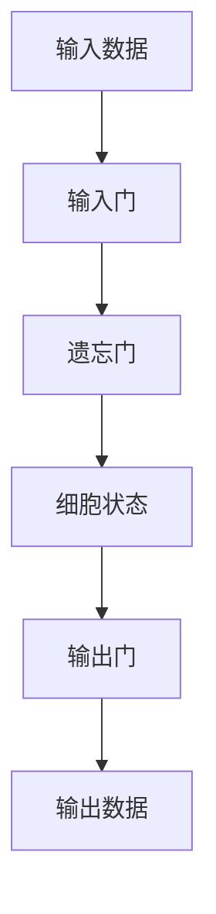

# 长短期记忆网络(Long Short-Term Memory) - 原理与代码实例讲解

## 1.背景介绍

在现代人工智能和深度学习领域，长短期记忆网络（Long Short-Term Memory, LSTM）是一种广泛应用的递归神经网络（Recurrent Neural Network, RNN）架构。LSTM的设计初衷是为了解决传统RNN在处理长序列数据时存在的梯度消失和梯度爆炸问题。自从Hochreiter和Schmidhuber在1997年提出LSTM以来，它已经在自然语言处理、时间序列预测、语音识别等多个领域取得了显著的成功。

## 2.核心概念与联系

### 2.1 递归神经网络（RNN）

递归神经网络是一种用于处理序列数据的神经网络架构。RNN通过循环连接的方式，使得网络能够记住之前的输入信息。然而，传统RNN在处理长序列数据时，容易出现梯度消失或梯度爆炸的问题，导致模型难以捕捉长距离依赖关系。

### 2.2 长短期记忆网络（LSTM）

LSTM是一种特殊的RNN，它通过引入门控机制（gating mechanism）来控制信息的流动，从而有效地解决了梯度消失和梯度爆炸问题。LSTM的核心组件包括输入门、遗忘门和输出门，这些门控单元共同作用，决定了信息在网络中的传递和保留。

### 2.3 门控循环单元（GRU）

门控循环单元（Gated Recurrent Unit, GRU）是LSTM的一种变体，它简化了LSTM的结构，减少了参数数量。GRU通过合并输入门和遗忘门，进一步提高了计算效率。

## 3.核心算法原理具体操作步骤

### 3.1 LSTM单元结构

LSTM单元的结构可以用以下Mermaid流程图表示：



### 3.2 输入门

输入门决定了当前输入信息有多少会被写入到细胞状态中。输入门的计算公式如下：

$$
i_t = \sigma(W_i \cdot [h_{t-1}, x_t] + b_i)
$$

其中，$i_t$ 是输入门的激活值，$\sigma$ 是Sigmoid激活函数，$W_i$ 和 $b_i$ 分别是权重矩阵和偏置向量，$h_{t-1}$ 是前一时刻的隐藏状态，$x_t$ 是当前输入。

### 3.3 遗忘门

遗忘门决定了细胞状态中有多少信息会被保留。遗忘门的计算公式如下：

$$
f_t = \sigma(W_f \cdot [h_{t-1}, x_t] + b_f)
$$

其中，$f_t$ 是遗忘门的激活值，$W_f$ 和 $b_f$ 分别是权重矩阵和偏置向量。

### 3.4 细胞状态更新

细胞状态的更新公式如下：

$$
C_t = f_t \cdot C_{t-1} + i_t \cdot \tilde{C}_t
$$

其中，$C_t$ 是当前细胞状态，$C_{t-1}$ 是前一时刻的细胞状态，$\tilde{C}_t$ 是候选细胞状态，计算公式如下：

$$
\tilde{C}_t = \tanh(W_C \cdot [h_{t-1}, x_t] + b_C)
$$

### 3.5 输出门

输出门决定了当前细胞状态有多少信息会被输出。输出门的计算公式如下：

$$
o_t = \sigma(W_o \cdot [h_{t-1}, x_t] + b_o)
$$

其中，$o_t$ 是输出门的激活值，$W_o$ 和 $b_o$ 分别是权重矩阵和偏置向量。

### 3.6 隐藏状态更新

隐藏状态的更新公式如下：

$$
h_t = o_t \cdot \tanh(C_t)
$$

其中，$h_t$ 是当前隐藏状态，$C_t$ 是当前细胞状态。

## 4.数学模型和公式详细讲解举例说明

### 4.1 LSTM的数学模型

LSTM的数学模型可以用以下公式表示：

$$
i_t = \sigma(W_i \cdot [h_{t-1}, x_t] + b_i)
$$

$$
f_t = \sigma(W_f \cdot [h_{t-1}, x_t] + b_f)
$$

$$
\tilde{C}_t = \tanh(W_C \cdot [h_{t-1}, x_t] + b_C)
$$

$$
C_t = f_t \cdot C_{t-1} + i_t \cdot \tilde{C}_t
$$

$$
o_t = \sigma(W_o \cdot [h_{t-1}, x_t] + b_o)
$$

$$
h_t = o_t \cdot \tanh(C_t)
$$

### 4.2 举例说明

假设我们有一个简单的时间序列数据，输入数据为 $x_t = [1, 2, 3, 4]$，初始隐藏状态和细胞状态均为0。我们可以通过以下步骤计算LSTM的输出：

1. 计算输入门激活值 $i_t$
2. 计算遗忘门激活值 $f_t$
3. 计算候选细胞状态 $\tilde{C}_t$
4. 更新细胞状态 $C_t$
5. 计算输出门激活值 $o_t$
6. 更新隐藏状态 $h_t$

## 5.项目实践：代码实例和详细解释说明

### 5.1 环境准备

首先，我们需要安装必要的Python库：

```bash
pip install numpy tensorflow
```

### 5.2 LSTM代码实例

以下是一个使用TensorFlow实现LSTM的代码实例：

```python
import numpy as np
import tensorflow as tf
from tensorflow.keras.models import Sequential
from tensorflow.keras.layers import LSTM, Dense

# 生成示例数据
data = np.array([[1, 2, 3, 4], [2, 3, 4, 5], [3, 4, 5, 6], [4, 5, 6, 7]])
labels = np.array([5, 6, 7, 8])

# 构建LSTM模型
model = Sequential()
model.add(LSTM(50, activation='relu', input_shape=(4, 1)))
model.add(Dense(1))
model.compile(optimizer='adam', loss='mse')

# 训练模型
