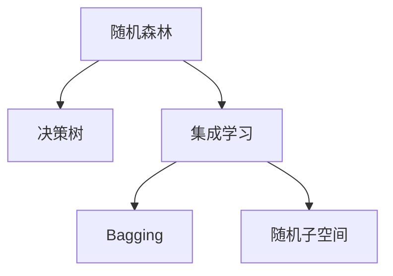
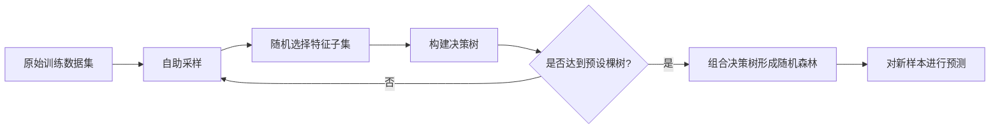
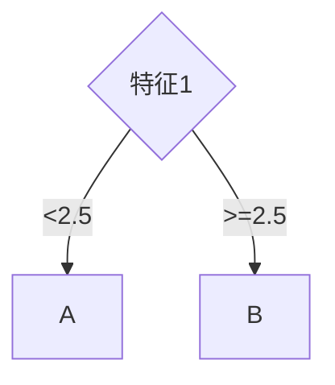
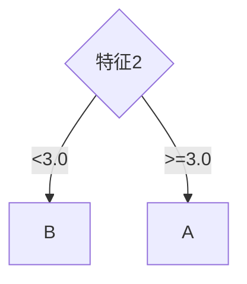
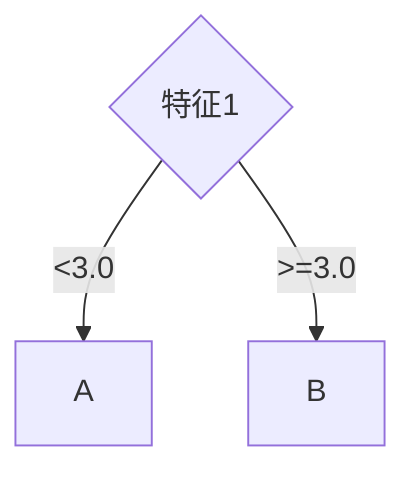

# 随机森林(RandomForests)-原理与代码实例讲解

## 1.背景介绍
随机森林(Random Forests)是一种基于集成学习(Ensemble Learning)的机器学习算法,由多个决策树组成。它通过在数据集的不同子样本上构建多个决策树,并将它们的预测结果进行组合,从而获得比单个决策树更好的预测性能。随机森林算法广泛应用于分类、回归、特征选择等任务中,在许多领域如金融、医疗、生物信息学等都取得了很好的效果。

### 1.1 随机森林的起源与发展
随机森林最早由Tin Kam Ho在1995年提出,当时称为"随机决策森林"。2001年,Leo Breiman进一步发展了这一概念,提出了现在广泛使用的随机森林算法。Breiman的随机森林算法引入了"自助聚合"(bootstrap aggregating,简称bagging)和"随机子空间"(random subspace)等技术,大大提高了模型的泛化能力和鲁棒性。

### 1.2 随机森林的优缺点
随机森林相比其他机器学习算法有以下优点:
1. 具有很高的准确率,在许多数据集上表现优异
2. 能够有效处理高维数据和大规模数据集
3. 对异常值和噪声数据有很强的鲁棒性
4. 可以评估各个特征的重要性
5. 训练速度快,可以并行化实现

但随机森林也存在一些缺点:
1. 对于回归问题,在预测值的准确性上略逊于支持向量机等算法
2. 相比单个决策树,随机森林的模型可解释性较差
3. 对于高度不平衡的数据,随机森林的性能可能会降低

## 2.核心概念与联系
要理解随机森林算法,需要先了解几个核心概念:
### 2.1 决策树(Decision Tree) 
决策树是一种树形结构的分类器,由结点(node)和有向边(edge)组成。内部结点表示一个特征或属性,叶结点表示一个类别。决策树通过从根结点开始,递归地划分数据的特征空间,直到每个叶结点都是尽可能纯的类别。

### 2.2 集成学习(Ensemble Learning)
集成学习通过构建并结合多个学习器来完成学习任务,通常可以获得比单一学习器显著优越的泛化性能。常见的集成学习方法包括Bagging、Boosting和Stacking。随机森林就是一种Bagging的集成学习方法。

### 2.3 Bagging
Bagging,全称Bootstrap Aggregating,是一种通过自助采样法(bootstrap)生成不同训练集,再利用这些训练集训练多个基分类器,最后将这些分类器的预测结果结合起来的集成学习算法。Bagging通过降低基分类器的方差,可以有效地提高集成的泛化能力。

### 2.4 随机子空间(Random Subspace)
随机子空间方法是指在训练每个基分类器时,不仅随机选择训练样本,还随机选择特征的一个子集。这样可以使得不同的基分类器更加多样化,从而提高集成的性能。

下图展示了随机森林算法的核心概念以及它们之间的关系:



## 3.核心算法原理与具体操作步骤
随机森林的训练过程可以分为以下几个步骤:

### 3.1 数据采样
从原始训练集中采用有放回的方式随机选取n个样本,构成新的训练集。这一过程称为自助采样(bootstrap)。通常,会重复进行k次采样,得到k个不同的训练集。未被选中的样本可以作为验证集用于估计模型的泛化误差。

### 3.2 构建决策树
对于每个训练集,使用决策树算法构建一棵决策树。在构建决策树的过程中,每次分裂时不是在所有特征中选择最优特征,而是随机选取一个特征子集,然后在这个子集中选择最优特征进行分裂。这一过程称为随机子空间(random subspace)。决策树的生长一直持续到每个叶结点达到预设的最小样本数或最大深度。

### 3.3 组合决策树
重复步骤1和2,构建k棵决策树,形成一个决策树的集合,即为随机森林。

### 3.4 模型预测
对于分类问题,新样本的预测结果由k棵决策树的多数投票(majority voting)决定。即选择得到票数最多的类别作为最终的分类结果。
对于回归问题,新样本的预测结果是k棵决策树预测值的平均值。

随机森林算法的核心步骤如下图所示:



## 4.数学模型和公式详细讲解举例说明
### 4.1 Bagging的数学模型
设训练集为$D=\{(x_1,y_1),(x_2,y_2),\cdots,(x_m,y_m)\}$,其中$x_i$为输入特征向量,$y_i$为对应的输出标记。Bagging算法从训练集D中随机取出可重复的样本构建训练集$D_k$,然后基于$D_k$训练第k个基学习器$h_k$。这一过程重复进行,最终得到K个基学习器$h_1,h_2,\cdots,h_K$。

对于分类问题,Bagging的集成预测结果为:

$$H(x)=\mathop{\arg\max}_{y\in\mathcal{Y}}\sum_{k=1}^K\mathbb{I}(h_k(x)=y)$$

其中,$\mathbb{I}(\cdot)$为指示函数,当括号内条件成立时取值为1,否则为0。$\mathcal{Y}$为所有可能的类别集合。即集成的预测结果是K个基学习器预测结果中出现次数最多的类别。

对于回归问题,Bagging的集成预测结果为:

$$H(x)=\frac{1}{K}\sum_{k=1}^Kh_k(x)$$

即集成的预测结果是K个基学习器预测结果的算术平均值。

### 4.2 随机森林的数学模型
随机森林在Bagging的基础上引入了随机子空间的思想。设有d个输入特征,在每次构建决策树时,先从d个特征中随机选择一个大小为$m(m\ll d)$的特征子集,然后再从这m个特征中选择最优的特征用于划分。m的大小通常取$\log_2d$或$\sqrt{d}$。

假设训练集为$D=\{(x_1,y_1),(x_2,y_2),\cdots,(x_N,y_N)\}$,随机森林算法的数学模型可以表示为:

对$k=1,2,\cdots,K$:
1. 从D中采用自助采样的方式随机选取N个训练样本,得到第k棵决策树的训练集$D_k$。
2. 从所有d个特征中随机选取m个特征,构成特征子集$F_k$。 
3. 利用$D_k$和$F_k$,通过决策树算法构建第k棵决策树$T_k$。

最终得到由K棵决策树组成的随机森林$\{T_1,T_2,\cdots,T_K\}$。

对于新样本$x$,随机森林的预测结果为:
- 分类问题:$H(x)=\mathop{\arg\max}\limits_{y\in\mathcal{Y}}\sum_{k=1}^K\mathbb{I}(T_k(x)=y)$
- 回归问题:$H(x)=\frac{1}{K}\sum_{k=1}^KT_k(x)$

### 4.3 举例说明
下面以一个简单的二分类问题为例,说明随机森林的构建和预测过程。

假设训练集如下:

| 样本编号 | 特征1 | 特征2 | 类别 |
|:---:|:---:|:---:|:---:|
| 1 | 2.0 | 3.0 | A |
| 2 | 3.1 | 1.8 | B |
| 3 | 1.5 | 4.2 | A |
| 4 | 4.5 | 2.3 | B |
| 5 | 2.8 | 3.6 | A |

设决策树的数量K=3,每棵决策树随机选择的特征数m=1。

构建第一棵决策树:
1. 从训练集中随机选取3个样本{1,2,4},得到决策树1的训练集。
2. 随机选择一个特征,假设选中特征1。
3. 根据特征1的取值,构建如下决策树:


构建第二棵决策树:
1. 从训练集中随机选取3个样本{2,3,5},得到决策树2的训练集。
2. 随机选择一个特征,假设选中特征2。
3. 根据特征2的取值,构建如下决策树:


构建第三棵决策树:
1. 从训练集中随机选取3个样本{1,3,4},得到决策树3的训练集。
2. 随机选择一个特征,假设选中特征1。
3. 根据特征1的取值,构建如下决策树:


现在,对于一个新样本(特征1=3.5,特征2=2.8),三棵决策树的预测结果分别为:B、B、B。
因此,随机森林的最终预测结果为B。

## 5.项目实践:代码实例和详细解释说明
下面使用Python中的Scikit-learn库实现随机森林算法,并应用于乳腺癌数据集的分类任务。

### 5.1 数据准备
首先加载乳腺癌数据集,并将其划分为训练集和测试集。

```python
from sklearn.datasets import load_breast_cancer
from sklearn.model_selection import train_test_split

# 加载数据集
data = load_breast_cancer()
X, y = data.data, data.target

# 划分训练集和测试集
X_train, X_test, y_train, y_test = train_test_split(X, y, test_size=0.2, random_state=42)
```

### 5.2 模型训练
使用Scikit-learn中的RandomForestClassifier类构建随机森林模型,并在训练集上进行拟合。

```python
from sklearn.ensemble import RandomForestClassifier

# 构建随机森林分类器
rf = RandomForestClassifier(n_estimators=100, max_depth=5, random_state=42)

# 在训练集上拟合模型
rf.fit(X_train, y_train)
```

这里设置随机森林的决策树数量为100,每棵决策树的最大深度为5。random_state参数设置随机种子,以保证结果的可重复性。

### 5.3 模型评估
在测试集上评估随机森林模型的性能。

```python
from sklearn.metrics import accuracy_score, precision_score, recall_score, f1_score

# 在测试集上进行预测
y_pred = rf.predict(X_test)

# 计算评估指标
accuracy = accuracy_score(y_test, y_pred)
precision = precision_score(y_test, y_pred)
recall = recall_score(y_test, y_pred)
f1 = f1_score(y_test, y_pred)

print("Accuracy: {:.4f}".format(accuracy))
print("Precision: {:.4f}".format(precision)) 
print("Recall: {:.4f}".format(recall))
print("F1-score: {:.4f}".format(f1))
```

输出结果如下:
```
Accuracy: 0.9649
Precision: 0.9697
Recall: 0.9552
F1-score: 0.9624
```

可以看到,随机森林在乳腺癌数据集上取得了很高的分类准确率,达到了96.49%。精确率、召回率和F1值也都在95%以上,表明模型的性能非常优异。

### 5.4 特征重要性评估
随机森林可以评估每个特征对于预测结果的