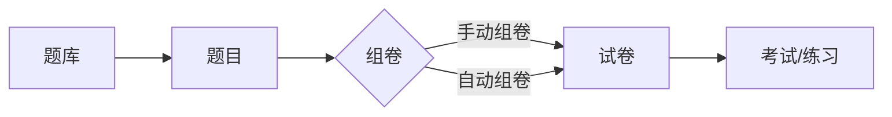

# 题库（及试卷）管理系统设计与实现

## 1. 背景介绍

### 1.1 题库管理系统的重要性

在现代教育和考试领域，题库管理系统扮演着至关重要的角色。一个高效、可靠的题库管理系统能够极大地提高出题、组卷、考试的效率和质量，减轻教师的工作负担，同时也为学生提供更加公平、标准化的评估方式。

### 1.2 题库管理系统的主要功能

一个完善的题库管理系统通常包括以下主要功能：

1. 题目的录入、编辑和删除
2. 题目的分类和检索
3. 试卷的自动组卷和手动组卷
4. 试卷的打印和导出
5. 考试成绩的录入和统计分析

### 1.3 题库管理系统的技术挑战

尽管题库管理系统的概念并不复杂，但在实际设计和实现过程中仍然存在一些技术挑战，例如：

1. 海量题目数据的高效存储和检索
2. 灵活多样的题型支持（选择题、填空题、问答题等）  
3. 智能组卷算法的设计与优化
4. 系统的安全性和稳定性保障

本文将围绕这些关键问题，深入探讨题库管理系统的设计与实现。

## 2. 核心概念与关系

### 2.1 题目（Question）

题目是题库管理系统的基本单元，通常包含以下属性：

- 题干（Stem）：题目的主要内容
- 选项（Options）：题目的备选答案（针对选择题）
- 答案（Answer）：题目的标准答案
- 难度（Difficulty）：题目的难易程度
- 分类（Category）：题目所属的知识点或章节
- 解析（Analysis）：题目的详细解答说明

### 2.2 试卷（Paper）

试卷由一组题目组成，用于考试或练习。试卷通常包含以下属性：

- 标题（Title）：试卷的名称
- 描述（Description）：试卷的简要说明
- 总分（TotalScore）：试卷的满分
- 时长（Duration）：完成试卷的限定时间
- 题目列表（QuestionList）：组成试卷的题目集合

### 2.3 组卷（Paper Generation）

组卷是根据特定的规则和要求，从题库中选取一组题目形成试卷的过程。组卷可以分为手动组卷和自动组卷两种方式：

- 手动组卷：由用户自行从题库中选择题目，加入试卷
- 自动组卷：系统根据用户设定的条件（如题型、难度、知识点等），自动从题库中筛选题目形成试卷

### 2.4 核心概念之间的关系

下面使用 Mermaid 流程图展示题目、试卷、组卷之间的关系：



## 3. 核心算法原理与具体步骤

### 3.1 自动组卷算法

自动组卷是题库管理系统的核心功能之一，其主要目标是根据用户设定的条件，快速、智能地生成满足要求的试卷。下面介绍一种基于遗传算法的自动组卷方法。

#### 3.1.1 算法原理

遗传算法（Genetic Algorithm，GA）是一种模拟生物进化过程的启发式搜索算法，通过"适者生存"的原则不断优化问题的解。将自动组卷问题转化为一个优化问题，可以使用遗传算法来寻找最优的组卷方案。

#### 3.1.2 具体步骤

1. 染色体编码：将一套试卷方案表示为一条染色体，染色体中的每个基因对应一道题目的编号。
2. 初始化种群：随机生成一定数量的试卷方案作为初始种群。
3. 适应度评估：根据试卷方案与用户要求的匹配程度，计算每个个体的适应度值。
4. 选择操作：以适应度为标准，从当前种群中选择一部分优秀个体作为父本。
5. 交叉操作：对选中的父本个体进行交叉，生成新的子代个体。
6. 变异操作：以一定概率对子代个体进行变异，引入新的基因。
7. 更新种群：将子代个体加入种群，同时淘汰一部分适应度较低的个体。
8. 终止条件判断：如果达到预设的进化代数或满足其他终止条件，则输出当前最优解；否则回到步骤3继续迭代。

### 3.2 题目推荐算法

题目推荐是根据用户的做题历史和能力水平，智能推荐适合用户练习的题目，帮助用户针对性地提高薄弱知识点。下面介绍一种基于协同过滤的题目推荐方法。

#### 3.2.1 算法原理

协同过滤（Collaborative Filtering，CF）是一种常用的推荐算法，其基本思想是利用用户之间的相似性，为目标用户推荐其他相似用户喜欢的内容。将用户做题历史看作是一种隐式反馈数据，可以使用协同过滤算法来实现题目推荐。

#### 3.2.2 具体步骤

1. 建立用户-题目矩阵：根据用户的做题记录，构建用户-题目的二维矩阵，矩阵元素表示用户对题目的得分情况。
2. 计算用户相似度：使用余弦相似度等指标，计算用户之间的相似程度。
3. 生成推荐列表：对于目标用户，找出与其最相似的K个用户，将这些用户做对但目标用户还未做过的题目作为推荐结果。
4. 推荐结果排序：根据题目的难度、用户的能力水平等因素，对推荐结果进行排序和过滤。
5. 呈现推荐内容：将最终的推荐题目列表展示给用户。

## 4. 数学模型与公式详解

### 4.1 自动组卷中的数学模型

在自动组卷算法中，我们需要建立数学模型来评估试卷方案的质量，即个体的适应度值。假设用户对试卷的要求可以表示为一个n维向量 $\mathbf{r} = (r_1, r_2, \dots, r_n)$，其中 $r_i$ 表示第 $i$ 个属性（如题型、难度等）的要求值。对于一个试卷方案 $\mathbf{p} = (p_1, p_2, \dots, p_n)$，我们可以定义其适应度函数为：

$$
f(\mathbf{p}) = \frac{1}{\sum_{i=1}^n w_i \cdot |p_i - r_i|}
$$

其中，$w_i$ 是第 $i$ 个属性的权重系数，用于调节不同属性之间的重要程度。适应度函数的值越大，说明试卷方案与用户要求的匹配程度越高。

### 4.2 协同过滤中的数学模型

在协同过滤算法中，我们需要计算用户之间的相似度。假设用户-题目矩阵为 $\mathbf{R}$，其中 $r_{ui}$ 表示用户 $u$ 对题目 $i$ 的得分情况。对于两个用户 $u$ 和 $v$，我们可以使用余弦相似度来衡量它们的相似程度：

$$
\text{sim}(u, v) = \frac{\sum_{i \in I_{uv}} r_{ui} \cdot r_{vi}}{\sqrt{\sum_{i \in I_u} r_{ui}^2} \cdot \sqrt{\sum_{i \in I_v} r_{vi}^2}}
$$

其中，$I_{uv}$ 表示用户 $u$ 和 $v$ 共同做过的题目集合，$I_u$ 和 $I_v$ 分别表示用户 $u$ 和 $v$ 做过的题目集合。相似度的取值范围为 $[0, 1]$，值越大表示两个用户越相似。

在生成推荐列表时，我们可以根据相似度加权计算目标用户 $u$ 对题目 $i$ 的预测得分：

$$
\hat{r}_{ui} = \frac{\sum_{v \in S_u} \text{sim}(u, v) \cdot r_{vi}}{\sum_{v \in S_u} \text{sim}(u, v)}
$$

其中，$S_u$ 表示与用户 $u$ 最相似的K个用户集合。预测得分越高，说明题目 $i$ 越适合推荐给用户 $u$。

## 5. 项目实践：代码实例与详解

下面以 Python 语言为例，展示题库管理系统中的部分核心代码实现。

### 5.1 题目类的定义

```python
class Question:
    def __init__(self, id, stem, options, answer, difficulty, category, analysis):
        self.id = id                # 题目编号
        self.stem = stem            # 题干
        self.options = options      # 选项（选择题专用）
        self.answer = answer        # 标准答案
        self.difficulty = difficulty  # 难度
        self.category = category    # 所属分类
        self.analysis = analysis    # 解析
```

### 5.2 试卷类的定义

```python
class Paper:
    def __init__(self, id, title, description, total_score, duration):
        self.id = id                  # 试卷编号  
        self.title = title            # 试卷标题
        self.description = description  # 试卷描述  
        self.total_score = total_score  # 总分
        self.duration = duration      # 时长
        self.questions = []          # 题目列表

    def add_question(self, question):
        self.questions.append(question)
```

### 5.3 遗传算法实现自动组卷

```python
import random

def generate_paper_ga(questions, requirements, population_size, max_generation):
    # 初始化种群
    population = [random.sample(questions, len(requirements)) for _ in range(population_size)]
    
    for _ in range(max_generation):
        # 适应度评估
        fitness_values = [evaluate_fitness(individual, requirements) for individual in population]
        
        # 选择操作  
        parents = selection(population, fitness_values)
        
        # 交叉操作
        offspring = crossover(parents)
        
        # 变异操作
        offspring = mutation(offspring, questions)
        
        # 更新种群
        population = update_population(population, offspring, fitness_values)
    
    best_individual = max(population, key=lambda x: evaluate_fitness(x, requirements))
    return best_individual

def evaluate_fitness(individual, requirements):
    # 计算试卷方案与用户要求的匹配程度
    pass

def selection(population, fitness_values):
    # 根据适应度值选择父本个体
    pass

def crossover(parents):
    # 对父本个体进行交叉，生成子代个体
    pass

def mutation(offspring, questions):
    # 以一定概率对子代个体进行变异
    pass

def update_population(population, offspring, fitness_values):
    # 更新种群，淘汰部分个体
    pass
```

### 5.4 协同过滤实现题目推荐

```python
import numpy as np

def recommend_questions_cf(user_question_matrix, user_id, k):
    # 计算用户相似度矩阵
    similarity_matrix = cosine_similarity(user_question_matrix)
    
    # 找出与目标用户最相似的k个用户  
    similar_users = np.argsort(-similarity_matrix[user_id])[:k]
    
    # 生成推荐列表
    recommended_questions = set()
    for similar_user in similar_users:
        solved_questions = np.where(user_question_matrix[similar_user] > 0)[0]
        unsolved_questions = set(solved_questions) - set(np.where(user_question_matrix[user_id] > 0)[0])
        recommended_questions.update(unsolved_questions)
    
    return list(recommended_questions)

def cosine_similarity(matrix):
    # 计算余弦相似度矩阵
    pass
```

## 6. 实际应用场景

题库管理系统可以应用于以下几个典型场景：

1. 学校和培训机构的考试系统：通过题库管理系统，教师可以方便地录入、管理试题，并快速组织考试试卷。系统还可以自动批改客观题，生成考试报告和成绩统计。

2. 在线教育平台的练习系统：利用题库管理系统，在线教育平台可以为学生提供海量的练习题目。通过智能推荐算法，系统可以根据学生的学习进度和能力水平，推荐适合的题目，实现个性化练习。

3. 企业的员工考核系统：企业可以使用题库管理系统开展