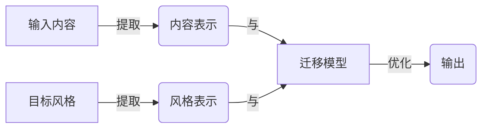

# 风格迁移 (Style Transfer) 原理与代码实例讲解

## 1.背景介绍

风格迁移(Style Transfer)是一种机器学习技术,它可以将一种风格应用到另一种内容上。这种技术最初是在计算机视觉领域发展起来的,用于将一种艺术风格迁移到图像上。近年来,风格迁移也被应用于自然语言处理(NLP)领域,用于改变文本的语气、风格或情感色彩。

在视觉领域,风格迁移可以将梵高的画风应用到照片上,创造出具有独特艺术风格的图像。在NLP领域,风格迁移可以将正式的语气转换为非正式的,或将积极的情感转换为消极的,等等。这种技术在各种应用场景下都有潜在的用途,如数据增强、内容个性化、情感分析等。

## 2.核心概念与联系

风格迁移技术涉及以下几个核心概念:

1. **内容表示(Content Representation)**: 描述输入内容(如图像或文本)的主要特征。
2. **风格表示(Style Representation)**: 描述目标风格的特征。
3. **损失函数(Loss Function)**: 衡量生成的输出与目标内容和风格之间的差异。
4. **迁移模型(Transfer Model)**: 根据损失函数优化内容和风格表示,生成具有目标风格的输出。

这些概念之间的关系如下:



迁移模型将内容表示和风格表示作为输入,通过优化损失函数来生成同时保留原内容特征和目标风格特征的输出。

## 3.核心算法原理具体操作步骤

风格迁移算法的核心步骤如下:

1. **提取内容和风格表示**
   - 对于图像,常用卷积神经网络(CNN)提取特征图作为内容和风格表示
   - 对于文本,常用词嵌入或语言模型提取词向量或隐层状态作为表示

2. **定义损失函数**
   - 内容损失:衡量输出与原内容表示的差异
   - 风格损失:衡量输出与目标风格表示的差异
   - 总损失 = 内容损失 + 风格损失 * 权重

3. **优化损失函数**
   - 对于图像,通常使用梯度下降等优化算法直接优化输入图像的像素值
   - 对于文本,通常训练序列生成模型(如自回归模型)最小化损失函数

4. **生成风格迁移后的输出**
   - 图像输出即优化后的图像
   - 文本输出为序列生成模型生成的文本序列

总的来说,风格迁移算法通过定义合适的内容表示、风格表示和损失函数,并使用优化算法最小化损失函数,从而生成同时保留原内容主要特征和目标风格特征的输出。

## 4.数学模型和公式详细讲解举例说明

风格迁移算法中的数学模型和公式主要涉及内容损失和风格损失的计算。我们将以图像风格迁移为例进行详细讲解。

### 4.1 内容损失(Content Loss)

内容损失用于保留输出图像的内容,确保其与原始内容图像的内容表示相似。常用的内容损失是均方误差(Mean Squared Error, MSE):

$$J_{\text{content}}(C, G) = \frac{1}{2} \sum_{i,j} (C_{ij} - G_{ij})^2$$

其中 $C$ 是原始内容图像的特征图, $G$ 是生成图像的特征图, $i,j$ 是特征图的空间位置索引。通过最小化内容损失,生成图像的特征图将与原始内容图像的特征图相似,从而保留了原始内容。

### 4.2 风格损失(Style Loss)

风格损失用于将目标风格迁移到输出图像。常用的风格损失是格拉姆矩阵(Gram Matrix)的均方误差:

$$J_{\text{style}}(A, G) = \frac{1}{4n_ln_m} \sum_{i,j} (G_{ij} - A_{ij})^2$$

其中 $A$ 是目标风格图像的格拉姆矩阵, $G$ 是生成图像的格拉姆矩阵, $n_l$ 是特征图的通道数, $n_m$ 是特征图的元素个数。

格拉姆矩阵用于捕获特征图之间的相关性,定义如下:

$$G_{ij} = \sum_k F_{ik}F_{jk}$$

其中 $F$ 是特征图的矩阵表示, $i,j$ 是通道索引, $k$ 是空间位置索引。通过最小化风格损失,生成图像的格拉姆矩阵将与目标风格图像的格拉姆矩阵相似,从而迁移了目标风格。

### 4.3 总损失函数

总损失函数是内容损失和风格损失的加权和:

$$J(G, C, A) = \alpha J_{\text{content}}(C, G) + \beta J_{\text{style}}(A, G)$$

其中 $\alpha$ 和 $\beta$ 是权重系数,用于平衡内容保留和风格迁移的重要性。通过最小化总损失函数,可以生成同时保留原始内容和目标风格的图像。

以下是一个简单的示例,展示了如何使用PyTorch计算风格迁移的损失函数:

```python
import torch
import torch.nn as nn

# 定义内容损失
def content_loss(content_weight, content_current, content_original):
    l = torch.mean((content_current - content_original)**2)
    return content_weight * l

# 定义风格损失
def gram_matrix(input_tensor):
    _, d, h, w = input_tensor.size()
    input_tensor = input_tensor.view(d, h*w)
    gram = torch.mm(input_tensor, input_tensor.t())
    return gram

def style_loss(style_weight, style_current, style_original):
    gram_current = gram_matrix(style_current)
    gram_original = gram_matrix(style_original).detach()
    l = torch.mean((gram_current - gram_original)**2)
    return style_weight * l

# 定义总损失函数
def total_loss(output, content_original, style_original, 
               content_weight, style_weight):
    content_current = output[:, :, 16:240, 16:240]
    style_current = output[:, :, 16:240, 16:240]
    
    content_loss_val = content_loss(content_weight, content_current, content_original)
    style_loss_val = style_loss(style_weight, style_current, style_original)
    
    loss = content_loss_val + style_loss_val
    return loss
```

在这个示例中,我们定义了内容损失、风格损失和总损失函数。`content_loss`函数计算内容损失,`style_loss`函数计算风格损失,`total_loss`函数计算总损失。`gram_matrix`函数用于计算格拉姆矩阵。通过调整`content_weight`和`style_weight`可以控制内容保留和风格迁移的重要性。

## 5.项目实践:代码实例和详细解释说明

在这一部分,我们将提供一个基于PyTorch的图像风格迁移项目实践,并详细解释代码的实现细节。

### 5.1 准备数据

首先,我们需要准备内容图像和风格图像。内容图像是我们希望保留其内容的图像,而风格图像是我们希望迁移到内容图像上的艺术风格。

```python
import torch
from torchvision import transforms
from PIL import Image

# 加载内容图像
content_image = Image.open('path/to/content/image.jpg')
# 加载风格图像
style_image = Image.open('path/to/style/image.jpg')

# 定义预处理转换
preprocess = transforms.Compose([
    transforms.Resize(256),
    transforms.ToTensor(),
    transforms.Normalize(mean=[0.485, 0.456, 0.406], std=[0.229, 0.224, 0.225])
])

# 预处理图像
content_tensor = preprocess(content_image).unsqueeze(0)
style_tensor = preprocess(style_image).unsqueeze(0)
```

在这个示例中,我们使用`PIL`库加载内容图像和风格图像,并使用`torchvision.transforms`模块对图像进行预处理,包括调整大小、转换为张量和归一化。

### 5.2 定义风格迁移模型

接下来,我们定义风格迁移模型。在这个示例中,我们使用预训练的VGG-19模型作为特征提取器。

```python
import torchvision.models as models

# 加载预训练的VGG-19模型
vgg = models.vgg19(pretrained=True).features

# 冻结模型参数
for param in vgg.parameters():
    param.requires_grad_(False)

# 定义内容层和风格层
content_layers = ['conv_4']
style_layers = ['conv_1', 'conv_2', 'conv_3', 'conv_4', 'conv_5']

# 获取内容层和风格层的输出
content_outputs = {}
style_outputs = {}

def get_outputs(module, input, output):
    layer_name = module.__class__.__name__
    if layer_name == 'Conv2d':
        layer_name = f'conv_{module.weight.data.shape[0]}'
    
    if layer_name in content_layers:
        content_outputs[layer_name] = output
    if layer_name in style_layers:
        style_outputs[layer_name] = output
        
# 注册钩子函数
for module in vgg.modules():
    module.register_forward_hook(get_outputs)
```

在这个示例中,我们使用`torchvision.models`模块加载预训练的VGG-19模型,并冻结模型参数。我们定义了内容层和风格层,分别用于提取内容表示和风格表示。`get_outputs`函数是一个钩子函数,用于在模型前向传播时获取内容层和风格层的输出。

### 5.3 计算损失函数

接下来,我们定义损失函数,包括内容损失、风格损失和总损失。

```python
import torch.nn.functional as F

# 内容损失
def content_loss(content_weight, content_current, content_target):
    _, c, h, w = content_current.size()
    al = torch.tensor(1. / (c * h * w))
    content_current = content_current.view(c, -1)
    content_target = content_target.view(c, -1)
    loss = al * F.mse_loss(content_current, content_target)
    return content_weight * loss

# 风格损失
def gram_matrix(input_tensor):
    _, c, h, w = input_tensor.size()
    input_tensor = input_tensor.view(c, h*w)
    gram = torch.mm(input_tensor, input_tensor.t())
    return gram

def style_loss(style_weight, style_current, style_target):
    batch_size, channel, height, width = style_current.size()
    style_current = gram_matrix(style_current)
    style_target = gram_matrix(style_target).detach()
    al = torch.tensor(1. / (channel * height * width)**2)
    loss = al * F.mse_loss(style_current, style_target)
    return style_weight * loss

# 总损失
def total_loss(outputs, content_weight, style_weight):
    content_loss_val = 0
    style_loss_val = 0
    
    for layer_name, output in outputs.items():
        if layer_name in content_layers:
            target = content_outputs[layer_name]
            content_loss_val += content_loss(content_weight, output, target)
        if layer_name in style_layers:
            target = style_outputs[layer_name]
            style_loss_val += style_loss(style_weight, output, target)
            
    loss = content_loss_val + style_loss_val
    return loss
```

在这个示例中,我们定义了`content_loss`函数计算内容损失,`style_loss`函数计算风格损失,`total_loss`函数计算总损失。内容损失使用均方误差(MSE)计算,风格损失使用格拉姆矩阵的均方误差计算。`content_weight`和`style_weight`分别控制内容损失和风格损失的权重。

### 5.4 优化输入图像

最后,我们定义优化器和优化循环,用于优化输入图像以最小化总损失。

```python
import torch.optim as optim

# 初始化输入图像
input_image = content_tensor.clone().requires_grad_(True)

# 定义优化器
optimizer = optim.LBFGS([input_image])

# 优化循环
num_epochs = 300
content_weight = 1
style_weight = 1e6

for epoch in range(num_epochs):
    def closure():
        optimizer.zero_grad()
        outputs = vgg(input_image)
        loss = total_loss(outputs, content_weight, style_weight)
        loss.backward()
        return loss
    
    optimizer.step(closure)
    
    # 每隔50个epoch打印一次损失值
    if epoch % 