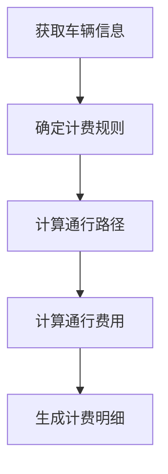

# 高速公路票据管理系统详细设计与具体代码实现

## 1.背景介绍

随着汽车保有量的不断增长和高速公路网络的日益完善,高速公路已经成为现代社会中不可或缺的交通基础设施。为了有效管理车辆在高速公路上的通行,并合理收取通行费用,需要建立一套高效、准确的票据管理系统。

高速公路票据管理系统是一种专门用于管理车辆在高速公路上通行的计算机系统,它能够自动识别车辆信息、计算通行费用、出具票据、记录通行记录等。该系统的主要目标是提高通行效率、减少人工干预、确保费用准确计算和数据的完整性。

## 2.核心概念与联系

高速公路票据管理系统涉及以下几个核心概念:

1. **车辆识别**:通过自动车牌识别技术或无线射频识别(RFID)技术,准确获取车辆的相关信息,如车牌号、车型等。

2. **计费规则**:根据车辆类型、通行路径、时间等因素,按照预定义的计费标准计算应缴纳的通行费用。

3. **票据生成**:将计费结果生成相应的票据,可以是纸质票据或电子票据。

4. **数据存储**:将车辆通行记录、计费明细等数据存储在数据库中,以备后续查询和审计。

5. **系统集成**:将多个子系统(如车辆识别、计费、票据打印等)集成到统一的管理平台中,实现数据共享和业务协同。

这些核心概念相互关联、相互作用,构成了完整的票据管理系统。其中,车辆识别是前置条件,计费规则是核心算法,票据生成是最终输出,而数据存储和系统集成则贯穿整个流程。

## 3.核心算法原理具体操作步骤

高速公路票据管理系统的核心算法是计费算法,它根据预定义的计费规则,结合车辆实际通行情况,计算出应缴纳的通行费用。具体操作步骤如下:

1. **获取车辆信息**:从车辆识别子系统获取车辆的相关信息,如车牌号、车型等。

2. **确定计费规则**:根据车辆信息(如车型)和其他因素(如节假日、时间段等),查询对应的计费规则。

3. **计算通行路径**:根据车辆的入口和出口信息,计算出实际的通行路径及里程数。

4. **计算通行费用**:将通行路径里程数代入计费规则公式,结合其他因素(如车型系数、优惠政策等),计算出应缴纳的通行费用。

5. **生成计费明细**:将计费过程中的中间结果和最终费用汇总成计费明细,以备存档和审计。

该算法的核心在于准确计算通行路径,并正确应用计费规则。为了提高效率,可以预先将常用的计费规则存储在数据库中,并对常见路径进行里程预计算,从而加快运算速度。



## 4.数学模型和公式详细讲解举例说明

在高速公路票据管理系统中,计费算法通常采用分段计费模型,即将通行路径分为多个里程段,每个里程段对应不同的计费标准。数学表达式如下:

$$
总费用 = \sum_{i=1}^{n}费用_i(里程段_i)
$$

其中,n 表示通行路径被分为 n 个里程段,费用$_i$表示第 i 个里程段的计费函数。

常见的计费函数有:

1. **固定费率**:$费用_i(里程段_i) = 单价 \times 里程段_i$

2. **阶梯费率**:
   $$
   费用_i(里程段_i) = \begin{cases}
   价格_1, &\text{如果 } 里程段_i \leq 阈值_1\\
   价格_2, &\text{如果 } 阈值_1 < 里程段_i \leq 阈值_2\\
   \vdots\\
   价格_n, &\text{如果 } 里程段_i > 阈值_{n-1}
   \end{cases}
   $$

3. **车型系数**:$费用_i(里程段_i) = 基础费用_i \times 车型系数$

例如,某高速公路的计费规则为:前 50 公里按 0.5 元/公里计费,超过 50 公里的部分按 0.8 元/公里计费,货车需乘以 1.5 的车型系数。一辆小型车行驶了 80 公里,则总费用计算如下:

$$
\begin{aligned}
费用_1(50) &= 0.5 \times 50 = 25 \text{(元)}\\
费用_2(30) &= 0.8 \times 30 = 24 \text{(元)}\\
总费用 &= 费用_1 + 费用_2 = 25 + 24 = 49 \text{(元)}
\end{aligned}
$$

如果是一辆货车,则需乘以 1.5 的车型系数:

$$
总费用(货车) = 49 \times 1.5 = 73.5 \text{(元)}
$$

通过将计费规则数学化,可以更加准确、高效地计算通行费用。

## 5.项目实践:代码实例和详细解释说明

以下是一个使用 Python 实现的高速公路票据管理系统的简化版本代码示例,包括车辆识别、计费规则、计费算法和票据生成等核心功能。

```python
# 车辆类型及对应车型系数
VEHICLE_TYPES = {
    'PASSENGER': 1.0,
    'TRUCK': 1.5,
    'BUS': 1.2
}

# 计费规则,里程阈值及对应单价
TOLL_RULES = [
    (0, 50, 0.5),
    (50, 100, 0.8),
    (100, float('inf'), 1.0)
]

class Vehicle:
    def __init__(self, plate, vehicle_type):
        self.plate = plate
        self.vehicle_type = vehicle_type
        self.type_factor = VEHICLE_TYPES[vehicle_type]

    def __repr__(self):
        return f'Vehicle(plate={self.plate}, type={self.vehicle_type})'

def calculate_toll(vehicle, distance):
    toll = 0
    for dist_range, rate in TOLL_RULES:
        if distance <= dist_range[1]:
            toll += max(distance - dist_range[0], 0) * rate
            distance = 0
        else:
            toll += (dist_range[1] - dist_range[0]) * rate
            distance -= dist_range[1] - dist_range[0]
    return toll * vehicle.type_factor

def generate_ticket(vehicle, entry, exit, distance, toll):
    return (
        f'Vehicle: {vehicle}\n'
        f'Entry: {entry}\n'
        f'Exit: {exit}\n'
        f'Distance: {distance} km\n'
        f'Toll: {toll:.2f} RMB'
    )

# 使用示例
vehicle = Vehicle('京A12345', 'TRUCK')
entry = '北京'
exit = '上海'
distance = 1200

toll = calculate_toll(vehicle, distance)
ticket = generate_ticket(vehicle, entry, exit, distance, toll)
print(ticket)
```

**代码解释:**

1. 首先定义了车辆类型及对应的车型系数,以及计费规则(里程阈值和单价)。

2. `Vehicle`类用于表示车辆信息,包括车牌号和车型。

3. `calculate_toll`函数实现了计费算法的核心逻辑。它根据车辆类型系数和里程阈值计费规则,计算出应缴纳的通行费用。

4. `generate_ticket`函数根据车辆信息、通行路径和计费结果,生成最终的票据字符串。

5. 在使用示例中,创建了一辆货车实例,并模拟了从北京到上海 1200 公里的通行情况,最后打印出生成的票据。

该代码示例展示了高速公路票据管理系统的基本流程和核心功能,包括车辆识别、计费规则应用、费用计算和票据生成等。在实际项目中,还需要考虑数据持久化、系统集成、异常处理等方面的需求。

## 6.实际应用场景

高速公路票据管理系统在现实生活中有广泛的应用场景,主要包括:

1. **高速公路收费站**: 这是最典型的应用场景。在高速公路的入口和出口处,通过车辆识别和计费系统,自动计算车辆的通行费用并出具票据。

2. **城市道路收费**: 一些城市为缓解交通拥堵,在特定区域或时段对车辆通行收取费用,票据管理系统可以用于自动计费和管理。

3. **停车场收费**: 停车场的计费通常根据停车时长计算,票据管理系统可以自动记录车辆的进出时间,并准确计算应缴纳的停车费用。

4. **物流运输**: 物流公司可以使用票据管理系统来跟踪货车的行驶路线,并根据实际里程计算运输费用。

5. **租车公司**: 租车公司可以利用票据管理系统来记录租车行驶的里程数,并根据里程数计算租金。

6. **智能交通系统**: 票据管理系统可以与其他智能交通系统(如交通信号控制、路况监测等)集成,为整体交通管理提供数据支持。

无论是收费场景还是里程计费,票据管理系统都可以提高效率、减少人工干预,并确保计费的准确性和数据的完整性。

## 7.工具和资源推荐

在开发和部署高速公路票据管理系统时,可以利用以下工具和资源:

1. **编程语言和框架**: 常用的编程语言包括 Python、Java、C++等,可以选择合适的框架(如 Django、Spring 等)来加快开发进度。

2. **数据库**: 根据系统规模和需求,可以选择关系型数据库(如 MySQL、PostgreSQL)或 NoSQL 数据库(如 MongoDB、Cassandra)来存储车辆、计费和票据数据。

3. **车牌识别技术**: 可以使用开源或商业的车牌识别库和 API,如 OpenALPR、EasyPR 等,实现自动车牌识别功能。

4. **RFID 技术**: 无线射频识别(RFID)技术可以用于快速识别车辆,提高通行效率。相关的 RFID 读写器和中间件是必需的。

5. **计费规则管理工具**: 开发一个用户友好的计费规则管理界面,方便运营人员维护和调整计费标准。

6. **报表和数据分析工具**: 使用 BI 工具(如 Power BI、Tableau)对通行数据进行分析和可视化,为决策提供支持。

7. **云服务**: 可以考虑将系统部署在云平台上(如 AWS、Azure、阿里云),以获得更好的可扩展性和高可用性。

8. **开源项目和社区**: 关注相关的开源项目和技术社区,了解最新动态,获取帮助和灵感。

选择合适的工具和资源,可以极大地提高开发效率和系统质量。同时,也要注意工具的成本、可维护性和安全性等因素。

## 8.总结:未来发展趋势与挑战

高速公路票据管理系统在未来将面临以下发展趋势和挑战:

1. **智能化发展**: 利用人工智能、机器学习等技术,实现更加智能化的车辆识别、计费优化和异常检测,提高系统的准确性和效率。

2. **多模态支付**: 除了现金和银行卡支付,未来可能会支持更多的支付方式,如移动支付、数字货币等,为用户提供更多选择。

3. **物联网集成**: 将票据管理系统与车载设备、路侧设施等物联网设备集成,实现实时监控和信息共享,提升管理水平。

4. **大数据分析**: 利用大数据技术对海量的通行数据进行深入分析,发现交通模式,优化收费策略,改善交通运营。

5. **隐私和安全**: 随着个人信息保护法规的不断完善,票据管理系统需要加强对车主隐私的保护,并防范黑客攻击和数据泄露。

6. **可持续发展**: 在系统设计和运营中,需要考虑环境影响和能源消耗,采取绿色环保的措施,实现可持