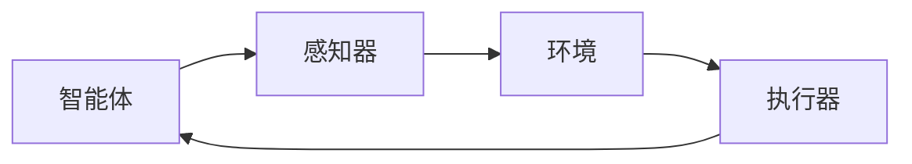
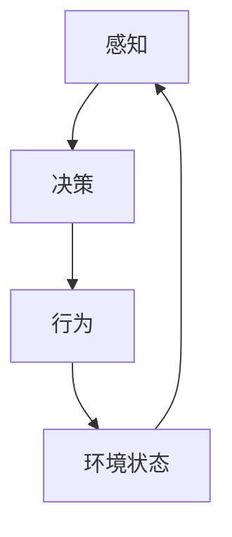

# AI Agent: AI的下一个风口 具身智能研究的挑战与机遇

## 1. 背景介绍

### 1.1 人工智能的发展历程

人工智能(Artificial Intelligence, AI)是当代科技发展的核心领域之一,自20世纪50年代问世以来,已经经历了几个重要的发展阶段。最初的人工智能系统主要集中在专家系统、机器学习等领域,旨在模拟人类的智能行为。随着计算能力和数据量的不断增长,机器学习算法取得了长足进展,尤其是深度学习技术在计算机视觉、自然语言处理等领域取得了突破性进展。

### 1.2 具身智能的兴起

然而,传统的人工智能系统存在一个重大缺陷,即缺乏与现实世界的紧密交互和融合。它们通常被视为一个封闭的系统,无法真正理解和感知外部环境的复杂性。为了克服这一限制,具身智能(Embodied AI)的概念应运而生。具身智能旨在将智能系统与物理实体(如机器人、虚拟助手等)紧密结合,使其能够通过感知器和执行器与现实世界进行直接交互。

### 1.3 具身智能的重要性

具身智能代表了人工智能发展的一个全新阶段,它将智能系统从封闭环境中解放出来,使其能够真正理解和适应复杂的现实世界。这不仅有助于提高人工智能系统的泛化能力和鲁棒性,还为人工智能在各个领域的应用开辟了新的可能性。例如,具身智能可以应用于服务机器人、智能家居、虚拟现实等领域,为人类提供更加智能化和人性化的服务和体验。

## 2. 核心概念与联系

### 2.1 智能体与环境

在具身智能中,智能体(Agent)是指具有感知和行为能力的实体,通常是一个机器人或虚拟助手。环境(Environment)则是指智能体所处的物理或虚拟空间,包括各种物体、障碍物、任务目标等。智能体通过感知器(如摄像头、雷达等)获取环境信息,并通过执行器(如机械臂、显示器等)与环境进行交互。



### 2.2 感知-决策-行为循环

具身智能系统的核心是感知-决策-行为循环(Perception-Decision-Action Loop)。智能体首先通过感知器获取环境信息,然后基于这些信息做出决策,最后通过执行器执行相应的行为,从而影响环境的状态。这个循环不断重复,形成了智能体与环境之间的闭环交互。



### 2.3 奖赏函数与强化学习

在具身智能中,智能体的目标通常是最大化一个奖赏函数(Reward Function)。奖赏函数定义了智能体在不同状态下获得的奖赏或惩罚,从而引导智能体朝着期望的方向发展。强化学习(Reinforcement Learning)是一种常用的训练具身智能系统的方法,它通过不断尝试和调整策略,逐步优化智能体的行为,使其获得最大化的累积奖赏。

## 3. 核心算法原理具体操作步骤

### 3.1 马尔可夫决策过程

具身智能系统通常可以建模为马尔可夫决策过程(Markov Decision Process, MDP)。MDP由以下几个要素组成:

- 状态集合 $\mathcal{S}$: 环境可能处于的所有状态
- 行为集合 $\mathcal{A}$: 智能体可以执行的所有行为
- 转移概率 $\mathcal{P}_{ss'}^a$: 在状态 $s$ 下执行行为 $a$ 后,转移到状态 $s'$ 的概率
- 奖赏函数 $\mathcal{R}^a(s, s')$: 在状态 $s$ 下执行行为 $a$ 后,转移到状态 $s'$ 时获得的奖赏

智能体的目标是找到一个策略 $\pi: \mathcal{S} \rightarrow \mathcal{A}$,使得在该策略下的期望累积奖赏最大化。

### 3.2 Q-Learning算法

Q-Learning是一种常用的强化学习算法,用于求解MDP问题。它通过不断更新一个Q函数 $Q(s, a)$,来估计在状态 $s$ 下执行行为 $a$ 后的期望累积奖赏。Q函数的更新规则如下:

$$Q(s_t, a_t) \leftarrow Q(s_t, a_t) + \alpha \left[ r_t + \gamma \max_{a} Q(s_{t+1}, a) - Q(s_t, a_t) \right]$$

其中:

- $\alpha$ 是学习率,控制更新幅度
- $\gamma$ 是折扣因子,控制对未来奖赏的权重
- $r_t$ 是在状态 $s_t$ 下执行行为 $a_t$ 后获得的即时奖赏
- $\max_{a} Q(s_{t+1}, a)$ 是在下一状态 $s_{t+1}$ 下,所有可能行为的最大期望累积奖赏

通过不断更新Q函数,智能体可以逐步优化其策略,最终收敛到一个近似最优的策略。

### 3.3 深度强化学习

传统的强化学习算法存在一些局限性,例如难以处理高维观测数据和连续动作空间。深度强化学习(Deep Reinforcement Learning)通过将深度神经网络引入强化学习框架,克服了这些限制。

在深度强化学习中,Q函数通常由一个深度神经网络来近似,即 $Q(s, a) \approx Q(s, a; \theta)$,其中 $\theta$ 是神经网络的参数。通过反向传播算法,可以优化神经网络参数 $\theta$,使得Q函数近似值与真实值之间的误差最小化。

一些典型的深度强化学习算法包括深度Q网络(Deep Q-Network, DQN)、策略梯度(Policy Gradient)等。这些算法已经在多个领域取得了卓越的成绩,如AlphaGo在围棋领域战胜人类顶尖高手。

## 4. 数学模型和公式详细讲解举例说明

### 4.1 马尔可夫决策过程数学模型

马尔可夫决策过程可以用一个五元组 $(\mathcal{S}, \mathcal{A}, \mathcal{P}, \mathcal{R}, \gamma)$ 来表示,其中:

- $\mathcal{S}$ 是状态集合
- $\mathcal{A}$ 是行为集合
- $\mathcal{P}_{ss'}^a = \Pr(s_{t+1}=s' | s_t=s, a_t=a)$ 是状态转移概率
- $\mathcal{R}^a(s, s')$ 是在状态 $s$ 下执行行为 $a$ 后,转移到状态 $s'$ 时获得的奖赏
- $\gamma \in [0, 1)$ 是折扣因子,用于权衡即时奖赏和未来奖赏的重要性

在MDP中,智能体的目标是找到一个策略 $\pi: \mathcal{S} \rightarrow \mathcal{A}$,使得在该策略下的期望累积奖赏最大化。期望累积奖赏可以用状态值函数 $V^\pi(s)$ 来表示:

$$V^\pi(s) = \mathbb{E}_\pi \left[ \sum_{t=0}^\infty \gamma^t r_{t+1} | s_0 = s \right]$$

其中 $r_{t+1}$ 是在时间步 $t+1$ 获得的奖赏。

对于给定的策略 $\pi$,状态值函数 $V^\pi(s)$ 满足贝尔曼方程:

$$V^\pi(s) = \sum_{a \in \mathcal{A}} \pi(a|s) \sum_{s' \in \mathcal{S}} \mathcal{P}_{ss'}^a \left[ \mathcal{R}^a(s, s') + \gamma V^\pi(s') \right]$$

解析解出最优状态值函数 $V^*(s)$ 是一个复杂的过程,因此我们通常采用迭代方法来近似求解,例如值迭代(Value Iteration)和策略迭代(Policy Iteration)等算法。

### 4.2 Q-Learning算法推导

Q-Learning算法是一种常用的强化学习算法,它直接学习状态-行为值函数 $Q^\pi(s, a)$,而不是先学习状态值函数 $V^\pi(s)$。$Q^\pi(s, a)$ 表示在状态 $s$ 下执行行为 $a$,之后按照策略 $\pi$ 行动所能获得的期望累积奖赏。

$$Q^\pi(s, a) = \mathbb{E}_\pi \left[ \sum_{t=0}^\infty \gamma^t r_{t+1} | s_0 = s, a_0 = a \right]$$

$Q^\pi(s, a)$ 满足以下贝尔曼方程:

$$Q^\pi(s, a) = \sum_{s' \in \mathcal{S}} \mathcal{P}_{ss'}^a \left[ \mathcal{R}^a(s, s') + \gamma \sum_{a' \in \mathcal{A}} \pi(a'|s') Q^\pi(s', a') \right]$$

Q-Learning算法通过不断更新Q函数,使其逼近最优Q函数 $Q^*(s, a)$。最优Q函数满足:

$$Q^*(s, a) = \mathbb{E} \left[ r_t + \gamma \max_{a'} Q^*(s_{t+1}, a') | s_t = s, a_t = a \right]$$

其更新规则为:

$$Q(s_t, a_t) \leftarrow Q(s_t, a_t) + \alpha \left[ r_t + \gamma \max_{a} Q(s_{t+1}, a) - Q(s_t, a_t) \right]$$

通过不断迭代更新,Q函数将逐渐收敛到最优Q函数 $Q^*(s, a)$,从而得到最优策略 $\pi^*(s) = \arg\max_a Q^*(s, a)$。

### 4.3 深度Q网络算法

深度Q网络(Deep Q-Network, DQN)是一种结合深度学习和Q-Learning的强化学习算法。它使用一个深度神经网络来近似Q函数,即 $Q(s, a; \theta) \approx Q^*(s, a)$,其中 $\theta$ 是神经网络的参数。

在DQN算法中,智能体维护两个Q网络:

1. 在线网络 $Q(s, a; \theta)$: 用于选择行为和更新参数
2. 目标网络 $Q(s, a; \theta^-)$: 用于计算目标值,参数 $\theta^-$ 是在线网络参数 $\theta$ 的滞后值

目标网络的引入是为了增加算法的稳定性,避免Q值的过度估计。

DQN算法的更新规则为:

$$\theta \leftarrow \theta + \alpha \left[ r_t + \gamma \max_{a'} Q(s_{t+1}, a'; \theta^-) - Q(s_t, a_t; \theta) \right] \nabla_\theta Q(s_t, a_t; \theta)$$

其中 $\alpha$ 是学习率,梯度 $\nabla_\theta Q(s_t, a_t; \theta)$ 可以通过反向传播算法计算。

为了提高算法的性能,DQN还引入了经验回放(Experience Replay)和目标值固定(Fixed Target)等技术。经验回放通过维护一个经验池,从中随机采样过去的经验进行训练,可以提高数据利用率和算法稳定性。目标值固定则是通过定期更新目标网络参数 $\theta^-$,使其保持相对稳定,避免Q值的过度估计。

## 5. 项目实践: 代码实例和详细解释说明

以下是一个使用Python和PyTorch实现的简单DQN算法示例,用于解决经典的CartPole问题。

### 5.1 环境设置

```python
import gym
import torch
import torch.nn as nn
import torch.optim as optim
import numpy as np

# 创建CartPole环境
env = gym.make('CartPole-v1')

# 定义状态和动作空间大小
state_size = env.observation_space.shape[0]
action_size = env.action_space.n
```

### 5.2 深度Q网络

```python
class DQN(nn.Module):
    def __init__(self