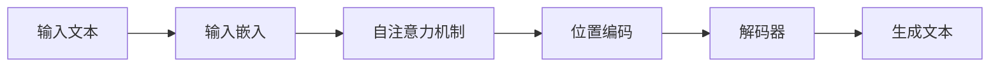

# AIGC从入门到实战：测试：ChatGPT 能扮演什么角色？

## 1.背景介绍
随着人工智能技术的飞速发展，自然语言处理（NLP）领域的进步尤为显著。特别是在生成式预训练变换器（GPT）的推动下，机器生成的文本越来越难以与人类写作区分。ChatGPT作为GPT系列模型的一员，已经在多个领域展现出了惊人的适应性和能力。本文将深入探讨ChatGPT的核心概念、算法原理、数学模型，并通过项目实践和实际应用场景，全面分析ChatGPT能扮演的角色。

## 2.核心概念与联系
ChatGPT是基于GPT-3模型的聊天机器人，它通过深度学习的方法，训练大量的文本数据，从而能够生成连贯、自然的语言。核心概念包括：

- **变换器模型（Transformer Model）**：一种注意力机制（Attention Mechanism）的架构，用于处理序列数据。
- **预训练与微调（Pre-training and Fine-tuning）**：模型先在大规模数据集上进行预训练，再在特定任务上进行微调。
- **上下文理解（Contextual Understanding）**：模型能够理解并生成与上下文相关的文本。

这些概念之间的联系在于，变换器模型提供了处理语言的强大框架，预训练使模型具备广泛的语言理解能力，微调则让模型在特定任务上表现更佳，上下文理解是确保生成文本质量的关键。

## 3.核心算法原理具体操作步骤
ChatGPT的核心算法原理基于以下步骤：

1. **输入嵌入（Input Embedding）**：将输入文本转换为向量表示。
2. **自注意力机制（Self-Attention Mechanism）**：模型通过权衡不同词之间的关系，来理解文本的上下文。
3. **位置编码（Positional Encoding）**：给予模型理解单词顺序的能力。
4. **解码器（Decoder）**：根据上下文生成响应的文本。



## 4.数学模型和公式详细讲解举例说明
ChatGPT的数学模型核心是自注意力机制，其公式可以表示为：

$$
\text{Attention}(Q, K, V) = \text{softmax}\left(\frac{QK^T}{\sqrt{d_k}}\right)V
$$

其中，$Q, K, V$ 分别代表查询（Query）、键（Key）、值（Value），$d_k$ 是键的维度。通过这个公式，模型能够计算出每个词对其他词的关注程度，并据此生成响应。

## 5.项目实践：代码实例和详细解释说明
以一个简单的ChatGPT对话系统为例，我们可以使用Python和transformers库来实现：

```python
from transformers import GPT2LMHeadModel, GPT2Tokenizer

# 加载预训练模型和分词器
tokenizer = GPT2Tokenizer.from_pretrained('gpt2')
model = GPT2LMHeadModel.from_pretrained('gpt2')

# 编写一个函数来生成回复
def generate_response(input_text):
    # 编码输入文本
    input_ids = tokenizer.encode(input_text, return_tensors='pt')
    # 生成文本
    output = model.generate(input_ids, max_length=50, num_return_sequences=1)
    # 解码生成的文本
    return tokenizer.decode(output[0], skip_special_tokens=True)

# 测试函数
print(generate_response("Hello, how are you?"))
```

这段代码首先加载了GPT-2模型和分词器，然后定义了一个函数`generate_response`，它接受输入文本，生成并返回模型的回复。

## 6.实际应用场景
ChatGPT可以在多个场景中扮演不同的角色：

- **客服机器人**：自动回答用户咨询。
- **内容创作**：辅助生成文章、故事或诗歌。
- **教育辅助**：提供个性化的学习资源和辅导。
- **娱乐互动**：在游戏或社交平台中与用户互动。

## 7.工具和资源推荐
- **transformers库**：提供了多种预训练模型的简易接口。
- **Hugging Face Model Hub**：可以找到各种预训练模型和相关资源。
- **TensorFlow和PyTorch**：两个主流的深度学习框架，适用于模型训练和部署。

## 8.总结：未来发展趋势与挑战
ChatGPT的未来发展趋势包括更加精细的上下文理解、多模态输入处理能力（如结合图像和语音）以及更强的逻辑推理能力。面临的挑战包括提高模型的可解释性、处理偏见和不准确信息以及保护用户隐私。

## 9.附录：常见问题与解答
- **Q: ChatGPT如何处理不同语言？**
- **A:** ChatGPT可以通过预训练在多语言数据集上来支持不同语言。

- **Q: 如何避免生成有偏见的文本？**
- **A:** 通过仔细筛选训练数据和使用去偏见技术可以减少这一问题。

- **Q: ChatGPT能否完全取代人类写作？**
- **A:** 尽管ChatGPT在文本生成方面表现出色，但它仍然缺乏人类的创造力和情感深度。

作者：禅与计算机程序设计艺术 / Zen and the Art of Computer Programming