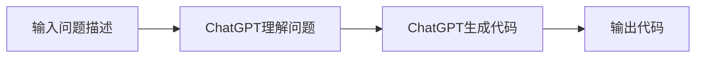

## 1.背景介绍

在当今这个信息化和数字化的时代，人工智能（AI）已经深入到我们生活的每个角落。其中，AI生成的代码（AIGC）是近年来AI领域的热门趋势之一。它借助先进的深度学习技术，可以自动生成代码，从而帮助程序员提高开发效率，降低编程难度。而ChatGPT，作为一种先进的自然语言处理（NLP）模型，已经在文本生成、机器翻译、问答系统等多个领域展现出了强大的能力。本文将向您详细介绍如何利用ChatGPT来进行快速编程，以赋予您更高级的技能。

## 2.核心概念与联系

### 2.1 人工智能生成的代码

AI生成的代码，简称AIGC，是指通过AI技术自动生成的代码。AIGC的出现，使得我们可以通过描述问题的方式来编程，而不再需要一行行地写代码。这种方式可以大大提高编程效率，减少编程错误，降低编程的难度。

### 2.2 ChatGPT

ChatGPT是OpenAI开发的一种基于GPT（生成预训练转换器）的自然语言处理模型。它可以理解和生成人类的自然语言，从而在聊天、写作、编程等多个领域发挥作用。

### 2.3 AIGC与ChatGPT的联系

AIGC和ChatGPT是紧密相关的。我们可以利用ChatGPT的语言理解和生成能力，通过描述问题的方式来生成代码，即实现AIGC。

## 3.核心算法原理具体操作步骤

### 3.1 利用ChatGPT生成代码的流程

### 3.2 具体操作步骤

1. 输入问题描述：首先，我们需要用自然语言描述我们要解决的问题。
2. ChatGPT理解问题：然后，ChatGPT会对我们的问题描述进行理解，把它转化为机器可以理解的形式。
3. ChatGPT生成代码：接着，ChatGPT会根据理解的问题，自动生成解决问题的代码。
4. 输出代码：最后，我们可以得到ChatGPT生成的代码，用来解决我们的问题。

## 4.数学模型和公式详细讲解举例说明

在ChatGPT中，我们主要使用了两个数学模型：Transformer模型和Attention机制。

### 4.1 Transformer模型

Transformer模型是一种基于自注意力机制（Self-Attention）的深度学习模型，它没有使用传统的卷积神经网络（CNN）和循环神经网络（RNN），而是完全依赖自注意力机制来捕捉输入之间的依赖关系。

Transformer模型的主要组成部分是编码器（Encoder）和解码器（Decoder）。编码器负责