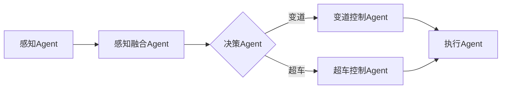

# AI人工智能代理工作流 AI Agent WorkFlow：在无人驾驶中的应用

## 1. 背景介绍
### 1.1 无人驾驶技术的发展现状
无人驾驶技术近年来取得了突飞猛进的发展。各大科技公司和传统车企都在积极布局无人驾驶领域，谷歌Waymo、特斯拉、百度Apollo等无人驾驶项目已经开始在部分城市进行无人驾驶出租车的运营测试。无人驾驶技术的快速发展得益于人工智能、传感器、高精度地图等技术的进步。

### 1.2 人工智能在无人驾驶中的应用
人工智能是无人驾驶技术的核心。无人驾驶系统需要通过深度学习等人工智能算法来理解复杂的驾驶环境，实现自动驾驶。目前主流的无人驾驶系统主要采用深度学习、强化学习、计算机视觉等人工智能技术，通过海量的数据训练，让无人车具备感知、决策、控制等驾驶能力。

### 1.3 AI Agent工作流的提出
尽管目前无人驾驶取得了长足进展，但要实现大规模商业化落地仍面临诸多技术挑战。其中一个关键问题是，如何设计一套高效、可靠、安全的无人驾驶系统架构。本文提出了一种名为"AI Agent工作流"的架构，旨在为无人驾驶系统的感知、决策、控制等核心模块提供一套标准化的工作流程，提高系统的鲁棒性和可扩展性。

## 2. 核心概念与联系
### 2.1 Agent
Agent是AI系统的基本组成单元，可以看作一个具有感知、决策、执行能力的智能体。一个复杂的AI系统通常由多个Agent组成，每个Agent负责不同的子任务。在无人驾驶场景下，感知、决策、控制等模块都可以设计为一个个Agent。

### 2.2 工作流
工作流是一系列有序的、相互关联的活动，用于完成某个特定任务。将复杂的任务划分为一系列高内聚、低耦合的子任务，并定义子任务之间的依赖关系和数据流向，可以提高系统的模块化程度，降低开发和维护难度。

### 2.3 AI Agent工作流
AI Agent工作流是将Agent和工作流两个概念结合起来，设计出一套标准化的无人驾驶系统架构。每个Agent作为工作流中的一个节点，通过订阅其他Agent的输出，并将自身的输出发布给下游的Agent，实现数据在Agent之间的流转。工作流定义了Agent之间的拓扑关系和调用顺序。

下图是一个简化的AI Agent工作流示意图：



## 3. 核心算法原理与具体步骤
### 3.1 感知Agent
感知Agent负责从传感器中获取环境信息，主要包括图像、激光雷达点云、GPS等数据。感知Agent通常采用深度学习算法，如CNN、YOLO等，对原始传感器数据进行特征提取和目标检测，输出感知结果，如障碍物列表、车道线、交通标志等。

感知Agent的主要步骤如下：
1. 订阅原始传感器数据
2. 对原始数据进行预处理，如图像缩放、点云滤波等  
3. 将预处理后的数据输入深度学习模型进行推理
4. 对推理结果进行后处理，如非极大值抑制、置信度过滤等
5. 发布感知结果

### 3.2 感知融合Agent
由于单一传感器难以应对所有场景，因此需要融合多传感器信息以提高感知的准确性和鲁棒性。感知融合Agent订阅来自不同感知Agent的感知结果，综合考虑多个传感器的特点，生成统一的环境表征。常见的感知融合算法有卡尔曼滤波、粒子滤波、贝叶斯融合等。

感知融合Agent的主要步骤如下：
1. 订阅多个感知Agent的感知结果
2. 对不同传感器的感知结果进行时空对齐
3. 根据融合算法，如卡尔曼滤波，对对齐后的感知结果进行融合
4. 发布融合后的环境表征

### 3.3 决策Agent
决策Agent是无人驾驶系统的大脑，负责根据当前的环境状态和行为意图，生成驾驶决策，如换道、超车、停车等。决策算法主要包括基于规则的决策、强化学习、逆强化学习等。决策Agent需要权衡多个目标，如安全性、舒适性、效率等，同时满足交通规则等约束条件。

决策Agent的主要步骤如下：
1. 订阅感知融合Agent的环境表征
2. 根据环境表征和行为意图，生成可行的行为决策方案
3. 对不同决策方案进行评分，选择最优决策
4. 发布行为决策结果

### 3.4 控制Agent
控制Agent负责将决策Agent生成的行为决策转化为具体的控制指令，如油门、刹车、转向等。控制算法主要包括PID控制、MPC控制、深度强化学习等。控制Agent需要考虑车辆动力学特性，实现平稳、精准的车辆控制。

控制Agent的主要步骤如下：
1. 订阅决策Agent的行为决策结果
2. 根据行为决策和车辆状态，生成控制指令
3. 对控制指令进行平滑处理，如加速度限制、转角速度限制等
4. 发布控制指令

## 4. 数学模型和公式详细讲解举例说明
本节以感知融合中的卡尔曼滤波算法为例，详细讲解其数学模型和公式。

卡尔曼滤波是一种递归的贝叶斯估计方法，常用于对动态系统状态进行估计。其基本思想是，在给定观测值和先验估计的情况下，求后验估计的条件期望，作为当前时刻状态的最优估计。

设系统状态为$x$，观测值为$z$，则卡尔曼滤波可以描述为：

预测步骤：
$$
\begin{aligned}
\hat{x}_{k|k-1} &= F_k \hat{x}_{k-1|k-1} + B_k u_k \\
P_{k|k-1} &= F_k P_{k-1|k-1} F_k^T + Q_k
\end{aligned}
$$

更新步骤：
$$
\begin{aligned}
K_k &= P_{k|k-1} H_k^T (H_k P_{k|k-1} H_k^T + R_k)^{-1} \\
\hat{x}_{k|k} &= \hat{x}_{k|k-1} + K_k (z_k - H_k \hat{x}_{k|k-1}) \\ 
P_{k|k} &= (I - K_k H_k) P_{k|k-1}
\end{aligned}
$$

其中，$F_k$为状态转移矩阵，$B_k$为控制矩阵，$u_k$为控制量，$Q_k$为过程噪声协方差矩阵，$H_k$为观测矩阵，$R_k$为观测噪声协方差矩阵，$K_k$为卡尔曼增益。

举例来说，假设我们要估计一个小车的位置和速度，状态向量为$x=[p, v]^T$，观测值为GPS位置$z=[p]$。假设小车做匀速直线运动，采样间隔为$\Delta t$，则状态转移矩阵和观测矩阵为：

$$
F=\begin{bmatrix}
1 & \Delta t \\ 
0 & 1
\end{bmatrix}, \quad
H=\begin{bmatrix}
1 & 0
\end{bmatrix}
$$

假设过程噪声和观测噪声均为高斯白噪声，协方差阵为：

$$
Q=\begin{bmatrix}
\frac{\Delta t^3}{3} & \frac{\Delta t^2}{2} \\
\frac{\Delta t^2}{2} & \Delta t
\end{bmatrix}\sigma_a^2, \quad
R=\sigma_p^2
$$

其中，$\sigma_a$为加速度标准差，$\sigma_p$为位置测量标准差。

根据以上模型，我们可以递归地估计小车的位置和速度。在感知融合中，我们可以将不同传感器的位置、速度估计值作为观测值，输入到卡尔曼滤波中，得到融合后的位置、速度估计值。

## 5. 项目实践：代码实例和详细解释说明
下面是一个简化版的卡尔曼滤波感知融合的Python代码示例：

```python
import numpy as np

class KalmanFilter:
    def __init__(self, F, B, H, Q, R, P, x):
        self.F = F
        self.B = B
        self.H = H
        self.Q = Q
        self.R = R
        self.P = P
        self.x = x

    def predict(self, u):
        self.x = np.dot(self.F, self.x) + np.dot(self.B, u)
        self.P = np.dot(np.dot(self.F, self.P), self.F.T) + self.Q
        return self.x

    def update(self, z):
        y = z - np.dot(self.H, self.x)
        S = np.dot(self.H, np.dot(self.P, self.H.T)) + self.R
        K = np.dot(np.dot(self.P, self.H.T), np.linalg.inv(S))
        self.x = self.x + np.dot(K, y)
        I = np.eye(self.P.shape[0])
        self.P = np.dot(I - np.dot(K, self.H), self.P)
        return self.x

# 初始化卡尔曼滤波器
dt = 0.1
F = np.array([[1, dt], [0, 1]])
B = np.array([[0.5*dt**2], [dt]])
H = np.array([[1, 0]])
Q = np.array([[0.1, 0], [0, 0.1]])
R = np.array([[1]])
P = np.array([[1, 0], [0, 1]])
x = np.array([[0], [1]])
kf = KalmanFilter(F, B, H, Q, R, P, x)

# 模拟传感器数据
gps_data = [0.9, 2.1, 2.9, 4.2, 5.1]
speedometer_data = [1.1, 1.9, 3.2, 3.9, 5.3]

# 感知融合
fused_data = []
for i in range(len(gps_data)):
    z = np.array([[gps_data[i]], [speedometer_data[i]]])
    kf.predict(u=0)
    x = kf.update(z)
    fused_data.append(float(x[0]))

print(fused_data)
```

代码详细解释：

1. 首先定义了一个`KalmanFilter`类，实现了卡尔曼滤波的预测和更新步骤。
2. 在`__init__`方法中初始化了卡尔曼滤波器的各个矩阵和向量，包括状态转移矩阵`F`、控制矩阵`B`、观测矩阵`H`、过程噪声协方差矩阵`Q`、观测噪声协方差矩阵`R`、状态协方差矩阵`P`和初始状态估计`x`。
3. `predict`方法实现了卡尔曼滤波的预测步骤，根据上一时刻的状态估计和控制量，预测当前时刻的状态估计和状态协方差矩阵。
4. `update`方法实现了卡尔曼滤波的更新步骤，根据当前时刻的观测值，计算卡尔曼增益，并更新状态估计和状态协方差矩阵。
5. 接着初始化了卡尔曼滤波器的各个参数，包括采样间隔`dt`、状态转移矩阵`F`、控制矩阵`B`、观测矩阵`H`、过程噪声协方差矩阵`Q`、观测噪声协方差矩阵`R`、状态协方差矩阵`P`和初始状态估计`x`。
6. 然后模拟了GPS和速度计两个传感器的观测数据。
7. 最后进行感知融合，对每个时刻的GPS和速度计观测值，首先进行预测步骤，然后进行更新步骤，得到融合后的位置估计值，并存储在`fused_data`列表中。
8. 打印出