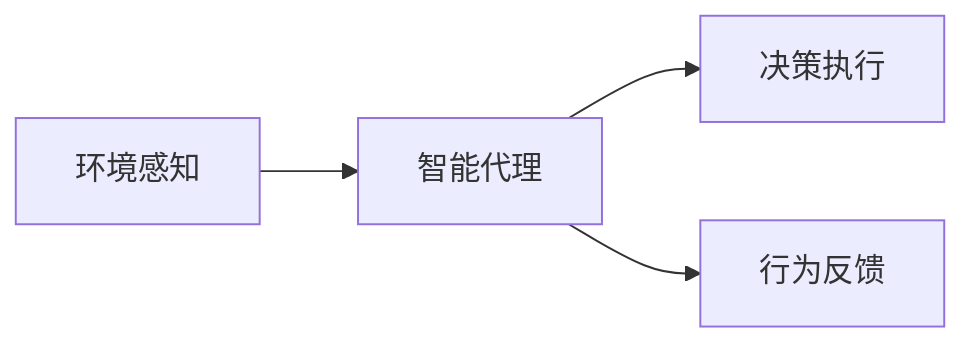
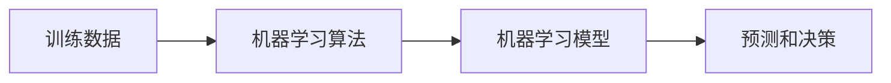
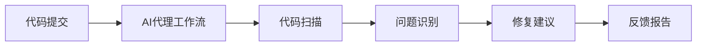
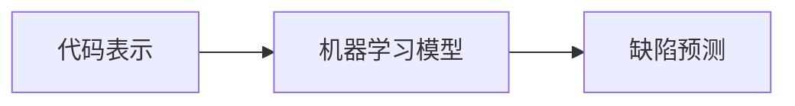
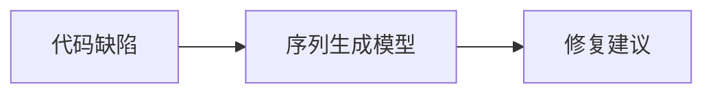
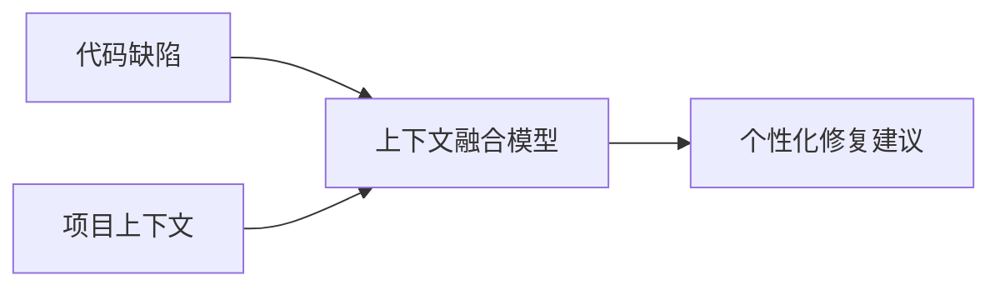
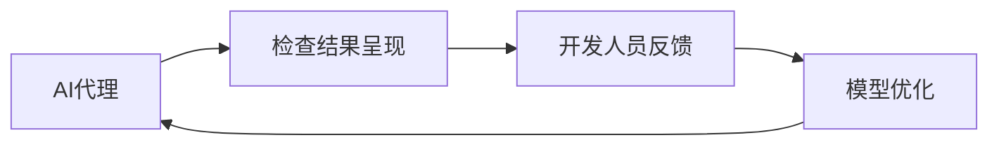

# AI人工智能代理工作流 AI Agent WorkFlow：在自动化检查中的应用

## 1.背景介绍

### 1.1 自动化检查的重要性

在当今快节奏的软件开发环境中,自动化检查已经成为确保代码质量和可维护性的关键环节。手动代码审查不仅耗时耗力,而且容易出现疏漏。因此,引入自动化检查工具来持续监控代码质量,及时发现潜在问题,已经成为软件开发的最佳实践。

### 1.2 AI在自动化检查中的作用

人工智能(AI)技术的快速发展为自动化检查带来了新的机遇。传统的检查工具主要依赖于预定义的规则和模式,但AI可以通过机器学习算法自主发现更复杂、更隐蔽的代码缺陷。此外,AI还可以根据项目上下文和历史数据,为开发人员提供更加个性化和高效的检查建议。

### 1.3 AI代理工作流概述

AI代理工作流(AI Agent Workflow)是一种将AI技术与自动化检查无缝集成的创新方法。它基于智能代理的概念,使用AI模型作为代码分析和决策的核心引擎。通过构建端到端的AI驱动流程,AI代理工作流可以自动执行代码扫描、问题识别、修复建议生成等关键步骤,大幅提高自动化检查的效率和准确性。

## 2.核心概念与联系

### 2.1 智能代理(Intelligent Agent)

智能代理是AI领域的一个核心概念,指能够感知环境、作出决策并执行行为的自治系统。在AI代理工作流中,智能代理扮演着分析代码、发现问题、提出建议的关键角色。

### 2.2 机器学习模型

机器学习模型是AI代理工作流的大脑和核心。根据不同的任务,可以使用监督学习、无监督学习或者强化学习等多种机器学习方法来训练模型,使其能够从海量代码数据中学习模式,并对新的代码样本做出智能分析和决策。

### 2.3 工作流自动化

AI代理工作流的另一个关键是将AI模型与自动化流程无缝集成。通过构建端到端的自动化管道,AI代理可以自主执行代码扫描、问题识别、修复建议生成等步骤,最大限度减少人工干预。

## 3.核心算法原理具体操作步骤

AI代理工作流的核心算法原理可以概括为以下几个关键步骤:

### 3.1 代码表示学习

第一步是将代码转换为机器可以理解的数值表示形式。常见的方法包括:

1. **Token Embedding**: 将代码分解为Token序列,并使用预训练的Embedding模型(如Word2Vec、BERT等)将每个Token映射为向量。
2. **抽象语法树(AST)编码**: 将代码解析为AST,并将AST的节点和边缘信息编码为结构化的数值表示。
3. **图神经网络(GNN)编码**: 将代码表示为代码元素之间的关系图,并使用GNN模型学习图的表示。

### 3.2 代码缺陷检测

基于代码的数值表示,AI代理可以使用各种机器学习模型(如CNN、RNN、Transformer等)来检测代码中的潜在缺陷。这通常被建模为一个二分类或多分类问题,模型需要根据代码片段的特征预测是否存在某种类型的缺陷。

### 3.3 代码修复建议生成

对于检测到的缺陷,AI代理需要生成相应的修复建议。这可以通过序列生成模型(如LSTM、Transformer等)来实现,将代码缺陷及其上下文作为输入,生成自然语言的修复描述。

### 3.4 上下文理解与个性化

为了提高修复建议的质量和相关性,AI代理还需要综合考虑项目上下文信息,如编码风格、框架约束、历史修复记录等。这可以通过注意力机制、记忆增强网络等方法来实现上下文融合。

### 3.5 人机交互与反馈

最后,AI代理需要与开发人员进行交互,呈现检查结果并获取反馈。根据开发人员的反馈,AI代理可以持续优化和改进模型,提高未来的检查准确性。这种人机协作有助于构建更加智能和人性化的自动化检查系统。

## 4.数学模型和公式详细讲解举例说明

在AI代理工作流中,数学模型和公式扮演着至关重要的角色。下面将详细讲解一些常用的模型和公式:

### 4.1 Token Embedding

Token Embedding是将代码Token映射为向量表示的常用技术。最常见的方法是Word2Vec,它通过学习Token在代码语料库中的上下文,将每个Token映射为固定长度的向量。

Word2Vec包含两种主要模型:Skip-gram和CBOW(Continuous Bag-of-Words)。Skip-gram模型的目标是根据中心Token预测上下文Token,而CBOW则是根据上下文Token预测中心Token。

Skip-gram模型的目标函数为:

$$J_\text{skip-gram} = \frac{1}{T}\sum_{t=1}^{T}\sum_{-c \leq j \leq c, j \neq 0} \log p(w_{t+j}|w_t)$$

其中 $T$ 是语料库中Token的总数, $c$ 是上下文窗口大小, $w_t$ 是中心Token, $w_{t+j}$ 是上下文Token。

$p(w_{t+j}|w_t)$ 通过 Softmax 函数计算:

$$p(w_O|w_I) = \frac{\exp(v_{w_O}^{\top}v_{w_I})}{\sum_{w=1}^{V}\exp(v_w^{\top}v_{w_I})}$$

其中 $v_w$ 和 $v_{w_I}$ 分别是 Token $w$ 和 $w_I$ 的向量表示, $V$ 是词汇表的大小。

通过最小化目标函数,可以学习到每个Token的Embedding向量,这些向量能够很好地捕捉Token之间的语义和结构关系。

### 4.2 图神经网络(GNN)

图神经网络是一种处理图结构数据的有效模型,在代码表示学习中也有广泛应用。GNN可以同时捕捉代码元素的节点特征和元素之间的结构关系。

常见的GNN模型包括图卷积网络(GCN)和图注意力网络(GAT)等。以GCN为例,其核心思想是通过信息传播机制在图中传递和聚合节点特征。在第 $k$ 层,节点 $v$ 的特征向量 $h_v^{(k)}$ 由其邻居节点的特征向量以及自身特征向量决定:

$$h_v^{(k)} = \sigma\left(\sum_{u \in \mathcal{N}(v)} \frac{1}{c_v c_u} h_u^{(k-1)} W^{(k)}\right)$$

其中 $\mathcal{N}(v)$ 表示节点 $v$ 的邻居集合, $c_v$ 和 $c_u$ 分别是节点 $v$ 和 $u$ 的度数, $W^{(k)}$ 是第 $k$ 层的可训练权重矩阵, $\sigma$ 是非线性激活函数(如ReLU)。

通过多层的信息传播和聚合,GNN可以学习到节点的高阶结构特征,从而更好地表示代码的语义和结构信息。

### 4.3 Transformer

Transformer是一种基于注意力机制的序列建模架构,在自然语言处理和代码表示学习中都有广泛应用。它可以有效地捕捉序列中元素之间的长程依赖关系。

Transformer的核心组件是多头自注意力(Multi-Head Attention),它允许每个Token同时关注其他Token,并根据不同的注意力头学习不同的关系模式。

给定一个输入序列 $X = (x_1, x_2, \dots, x_n)$,多头自注意力的计算过程如下:

1. 将每个Token $x_i$ 线性映射为查询向量 $q_i$、键向量 $k_i$ 和值向量 $v_i$。
2. 计算每个Token对其他Token的注意力权重:

$$\text{Attention}(q_i, k_j, v_j) = \text{softmax}\left(\frac{q_i k_j^T}{\sqrt{d_k}}\right)v_j$$

其中 $d_k$ 是缩放因子,用于防止内积值过大导致梯度饱和。

3. 对所有注意力头的结果进行拼接和线性变换,得到最终的注意力输出:

$$\text{MultiHead}(Q, K, V) = \text{Concat}(head_1, \dots, head_h)W^O$$

其中 $head_i = \text{Attention}(QW_i^Q, KW_i^K, VW_i^V)$, $W_i^Q$、$W_i^K$、$W_i^V$ 和 $W^O$ 是可训练的权重矩阵。

通过自注意力机制,Transformer能够有效地建模Token之间的长程依赖关系,从而更好地捕捉代码的语义和结构信息。

### 4.4 序列生成模型

在生成代码修复建议时,常用的模型是基于RNN或Transformer的序列生成模型。这些模型将代码缺陷及其上下文作为输入,生成自然语言的修复描述。

以基于LSTM的序列生成模型为例,其目标是最大化生成序列 $Y = (y_1, y_2, \dots, y_m)$ 的条件概率 $P(Y|X)$,其中 $X$ 是输入序列。

在时间步 $t$,LSTM单元的计算过程如下:

$$\begin{aligned}
f_t &= \sigma(W_f \cdot [h_{t-1}, x_t] + b_f) \\
i_t &= \sigma(W_i \cdot [h_{t-1}, x_t] + b_i) \\
\tilde{C}_t &= \tanh(W_C \cdot [h_{t-1}, x_t] + b_C) \\
C_t &= f_t \odot C_{t-1} + i_t \odot \tilde{C}_t \\
o_t &= \sigma(W_o \cdot [h_{t-1}, x_t] + b_o) \\
h_t &= o_t \odot \tanh(C_t)
\end{aligned}$$

其中 $f_t$、$i_t$ 和 $o_t$ 分别是遗忘门、输入门和输出门, $C_t$ 是细胞状态向量, $h_t$ 是隐藏状态向量, $W$ 和 $b$ 是可训练的权重和偏置。

在每个时间步,LSTM根据当前输入 $x_t$ 和前一个隐藏状态 $h_{t-1}$ 计算新的隐藏状态 $h_t$,并通过 Softmax 层预测下一个Token的概率分布:

$$P(y_t|y_1, \dots, y_{t-1}, X) = \text{softmax}(W_o h_t + b_o)$$

通过最大化生成序列的条件概率,序列生成模型可以学习到如何根据代码缺陷及其上下文生成合适的修复建议。

以上是AI代理工作流中一些常用的数学模型和公式。通过这些模型和公式,AI代理能够有效地表示代码、检测缺陷并生成修复建议,