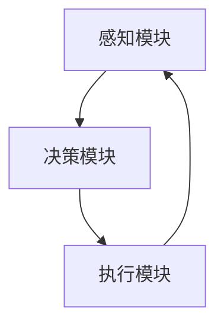

# AI人工智能代理工作流AI Agent WorkFlow：理解决策制定与推理机制

## 1.背景介绍

人工智能（AI）代理是现代计算机科学和工程中的一个重要领域。AI代理通过模拟人类的决策过程，能够在复杂环境中执行任务、解决问题和做出决策。随着技术的进步，AI代理在各个领域的应用越来越广泛，从自动驾驶汽车到智能家居，从金融分析到医疗诊断，AI代理的潜力无穷。

在这篇文章中，我们将深入探讨AI代理的工作流，特别是其决策制定与推理机制。我们将从核心概念、算法原理、数学模型、项目实践、实际应用场景、工具和资源推荐等多个方面进行详细讲解，帮助读者全面理解和掌握AI代理的工作流。

## 2.核心概念与联系

### 2.1 AI代理的定义

AI代理是一个能够感知环境并采取行动以实现特定目标的计算机系统。它通常由感知模块、决策模块和执行模块组成。

### 2.2 决策制定与推理机制

决策制定是AI代理根据感知到的信息和预设的目标，选择最优行动的过程。推理机制是AI代理通过逻辑推理和知识库，得出结论和决策的过程。

### 2.3 核心概念之间的联系

感知模块获取环境信息，决策模块通过推理机制分析信息并制定行动计划，执行模块执行决策。三者之间的联系如下图所示：



## 3.核心算法原理具体操作步骤

### 3.1 感知模块

感知模块负责从环境中获取信息，常用的技术包括传感器、摄像头、麦克风等。感知模块的主要任务是将物理信号转换为计算机可以处理的数据。

### 3.2 决策模块

决策模块是AI代理的核心部分，主要包括以下几个步骤：

1. **状态表示**：将感知到的信息转换为内部状态表示。
2. **目标设定**：根据预设的目标和当前状态，确定需要实现的目标。
3. **策略选择**：根据目标和状态，选择最优的行动策略。
4. **行动计划**：制定具体的行动计划。

### 3.3 推理机制

推理机制是决策模块的重要组成部分，常用的推理方法包括：

1. **规则推理**：基于预设的规则进行推理。
2. **概率推理**：基于概率模型进行推理。
3. **机器学习**：通过训练模型进行推理。

## 4.数学模型和公式详细讲解举例说明

### 4.1 马尔可夫决策过程（MDP）

马尔可夫决策过程是AI代理决策制定的常用数学模型。MDP由状态集 $S$、动作集 $A$、状态转移概率 $P$ 和奖励函数 $R$ 组成。

$$
P(s'|s, a) = \mathbb{P}(S_{t+1} = s' | S_t = s, A_t = a)
$$

$$
R(s, a) = \mathbb{E}[R_{t+1} | S_t = s, A_t = a]
$$

### 4.2 贝叶斯推理

贝叶斯推理是概率推理的一种方法，通过贝叶斯定理进行推理：

$$
\mathbb{P}(A|B) = \frac{\mathbb{P}(B|A) \cdot \mathbb{P}(A)}{\mathbb{P}(B)}
$$

### 4.3 强化学习

强化学习是通过与环境的交互，学习最优策略的过程。常用的算法包括Q学习和深度Q网络（DQN）。

$$
Q(s, a) = Q(s, a) + \alpha [R + \gamma \max_{a'} Q(s', a') - Q(s, a)]
$$

## 5.项目实践：代码实例和详细解释说明

### 5.1 环境搭建

首先，我们需要搭建一个AI代理的开发环境。常用的工具包括Python、TensorFlow、PyTorch等。

### 5.2 感知模块代码示例

以下是一个简单的感知模块代码示例，使用OpenCV获取摄像头图像：

```python
import cv2

def capture_image():
    cap = cv2.VideoCapture(0)
    ret, frame = cap.read()
    cap.release()
    return frame

image = capture_image()
cv2.imshow('Captured Image', image)
cv2.waitKey(0)
cv2.destroyAllWindows()
```

### 5.3 决策模块代码示例

以下是一个简单的决策模块代码示例，使用Q学习算法：

```python
import numpy as np

class QLearningAgent:
    def __init__(self, state_size, action_size, learning_rate=0.1, discount_factor=0.99, exploration_rate=1.0):
        self.state_size = state_size
        self.action_size = action_size
        self.learning_rate = learning_rate
        self.discount_factor = discount_factor
        self.exploration_rate = exploration_rate
        self.q_table = np.zeros((state_size, action_size))

    def choose_action(self, state):
        if np.random.rand() < self.exploration_rate:
            return np.random.choice(self.action_size)
        return np.argmax(self.q_table[state])

    def update_q_table(self, state, action, reward, next_state):
        best_next_action = np.argmax(self.q_table[next_state])
        td_target = reward + self.discount_factor * self.q_table[next_state, best_next_action]
        td_error = td_target - self.q_table[state, action]
        self.q_table[state, action] += self.learning_rate * td_error

# 示例使用
agent = QLearningAgent(state_size=10, action_size=4)
state = 0
action = agent.choose_action(state)
reward = 1
next_state = 1
agent.update_q_table(state, action, reward, next_state)
```

### 5.4 推理机制代码示例

以下是一个简单的贝叶斯推理代码示例：

```python
from scipy.stats import norm

# 先验概率
prior = 0.5

# 似然函数
def likelihood(data, mean, std):
    return norm.pdf(data, mean, std)

# 贝叶斯推理
def bayesian_inference(data, mean, std):
    posterior = prior * likelihood(data, mean, std)
    return posterior / sum(posterior)

data = [1.0, 2.0, 3.0]
mean = 2.0
std = 1.0
posterior = bayesian_inference(data, mean, std)
print(posterior)
```

## 6.实际应用场景

### 6.1 自动驾驶

自动驾驶汽车需要通过感知模块获取道路信息，通过决策模块制定行驶策略，通过执行模块控制车辆行驶。

### 6.2 智能家居

智能家居系统通过感知模块获取家庭环境信息，通过决策模块制定家电控制策略，通过执行模块控制家电运行。

### 6.3 金融分析

金融分析系统通过感知模块获取市场数据，通过决策模块制定投资策略，通过执行模块进行交易操作。

### 6.4 医疗诊断

医疗诊断系统通过感知模块获取患者信息，通过决策模块制定诊断方案，通过执行模块进行治疗操作。

## 7.工具和资源推荐

### 7.1 开发工具

- **Python**：广泛使用的编程语言，适用于AI代理开发。
- **TensorFlow**：强大的深度学习框架，适用于复杂的AI模型开发。
- **PyTorch**：灵活的深度学习框架，适用于研究和开发。

### 7.2 学习资源

- **《人工智能：一种现代方法》**：经典的AI教材，涵盖了AI代理的基本概念和算法。
- **Coursera上的AI课程**：提供了丰富的AI课程，适合初学者和进阶学习者。
- **GitHub上的开源项目**：可以参考和学习其他开发者的AI代理项目。

## 8.总结：未来发展趋势与挑战

AI代理在未来的发展中将面临许多机遇和挑战。随着技术的进步，AI代理将变得更加智能和自主，能够在更复杂的环境中执行任务。然而，AI代理的发展也面临着数据隐私、安全性和伦理问题等挑战。未来的研究将需要在技术创新和社会责任之间找到平衡。

## 9.附录：常见问题与解答

### 9.1 什么是AI代理？

AI代理是一个能够感知环境并采取行动以实现特定目标的计算机系统。

### 9.2 AI代理的决策制定过程是怎样的？

AI代理的决策制定过程包括状态表示、目标设