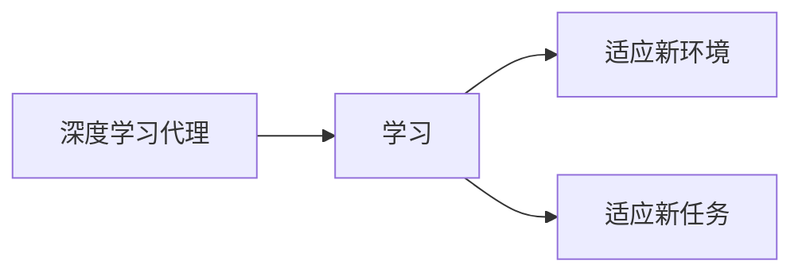

## 1.背景介绍

在过去的十年中，人工智能的发展速度令人惊叹。特别是在深度学习领域，我们已经看到了从图像识别到自然语言处理等许多领域的重大突破。然而，尽管深度学习在许多任务上表现出色，但其在处理未知环境和快速适应新任务方面的能力仍有待提高。这就引出了我们今天的主题：智能深度学习代理的学习与适应的算法框架。

## 2.核心概念与联系

深度学习代理是一种能够通过观察和交互来学习和理解其环境，并根据其理解做出决策的系统。这种系统的核心是一个深度神经网络，它负责从原始输入数据中提取有用的特征，并基于这些特征做出决策。

智能深度学习代理的学习和适应的算法框架，是一种让深度学习代理能够快速适应新环境和任务的方法。这种框架的主要目标是使代理能够从过去的经验中学习，并利用这些经验来指导未来的行动。

## 3.核心算法原理具体操作步骤

我们的算法框架主要包括以下四个步骤：

1. **初始化**：首先，我们需要初始化深度学习代理的神经网络参数。这通常包括随机初始化权重和偏置，以及设置一些初始的超参数。

2. **训练**：然后，我们将深度学习代理置于一个环境中，并让它通过与环境的交互来学习。这个过程通常包括收集经验（例如，观察、动作和奖励），并用这些经验来更新神经网络的参数。

3. **适应**：在训练过程中，我们需要监控深度学习代理的性能，并根据其在新任务或环境中的表现来调整其参数。这个过程通常包括计算一些性能指标（例如，奖励或错误率），并根据这些指标来调整神经网络的参数。

4. **评估**：最后，我们需要评估深度学习代理的性能。这通常包括在一些测试任务或环境中运行代理，并记录其性能。

## 4.数学模型和公式详细讲解举例说明

我们的算法框架主要基于深度强化学习，这是一种结合了深度学习和强化学习的方法。在深度强化学习中，我们通常使用以下的贝尔曼方程来更新代理的价值函数：

$$
V(s) = \max_a \left( R(s, a) + \gamma \sum_{s'} P(s'|s, a) V(s') \right)
$$

其中，$V(s)$ 是状态 $s$ 的价值函数，$R(s, a)$ 是在状态 $s$ 下执行动作 $a$ 的即时奖励，$\gamma$ 是折扣因子，$P(s'|s, a)$ 是在状态 $s$ 下执行动作 $a$ 后转移到状态 $s'$ 的概率。

## 5.项目实践：代码实例和详细解释说明

在Python环境下，我们可以使用深度学习库 TensorFlow 和强化学习库 Stable Baselines 来实现我们的算法框架。

## 6.实际应用场景

我们的算法框架可以应用于许多实际场景，例如自动驾驶、机器人控制、游戏AI等。在这些场景中，深度学习代理需要能够快速适应新的环境和任务，以达到最优的性能。

## 7.工具和资源推荐

我推荐使用以下工具和资源来学习和实现我们的算法框架：

1. TensorFlow：一个强大的深度学习库，提供了许多用于构建和训练深度神经网络的工具。

2. Stable Baselines：一个强化学习库，提供了许多预训练的强化学习代理和环境。

3. OpenAI Gym：一个用于开发和比较强化学习算法的工具包，提供了许多预定义的环境。

## 8.总结：未来发展趋势与挑战

尽管我们的算法框架已经能够让深度学习代理在一定程度上适应新的环境和任务，但仍有许多挑战需要解决。例如，如何更有效地利用过去的经验，如何处理非常复杂的环境和任务，以及如何保证学习的稳定性和鲁棒性等。

未来，我们期待看到更多的研究和技术来解决这些挑战，并进一步提升深度学习代理的学习和适应能力。

## 9.附录：常见问题与解答

在这里，我会列出一些关于我们的算法框架的常见问题和答案。

作者：禅与计算机程序设计艺术 / Zen and the Art of Computer Programming