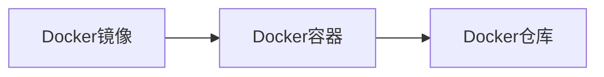

## 1.背景介绍

随着云计算和微服务的兴起，容器技术应运而生，并在IT领域中占据了一席之地。Docker作为开源的应用容器引擎，以其轻量级和高效的特点，改变了传统的软件开发和部署方式，为AI系统的开发和部署提供了新的可能。

## 2.核心概念与联系

Docker是基于Go语言实现的开源容器项目，它包含了多个核心概念，如镜像、容器和仓库等。Docker镜像是一个轻量级、可执行的独立软件包，包含了运行一个软件所需要的所有内容。Docker容器是镜像的运行实例，它可以被启动、开始、停止、移动和删除。Docker仓库则是用来保存镜像的地方。

这些概念之间的关系可以用下面的Mermaid流程图表示：



## 3.核心算法原理具体操作步骤

Docker的工作原理主要基于Linux的cgroups和namespaces技术。

cgroups（Control Groups）是Linux内核的一个特性，用来限制、控制与分离一个进程组的资源使用（如CPU、内存、磁盘I/O等）。namespaces则是Linux内核的另一个特性，用来隔离进程的运行环境（如PID、用户、网络等）。

Docker通过cgroups和namespaces，实现了容器的资源隔离和环境隔离，使得每个容器都在自己的环境中运行，互不干扰，就像在独立的系统中运行一样。

## 4.数学模型和公式详细讲解举例说明

在Docker中，资源分配和控制是一个重要的问题。这主要通过cgroups来实现，其背后的数学模型可以用公式来描述。

假设我们有n个容器，每个容器i的CPU使用权重为$w_i$，则容器i的CPU使用率$u_i$可以用下面的公式计算：

$$ u_i = \frac{w_i}{\sum_{j=1}^{n} w_j} $$

这个公式保证了每个容器的CPU使用率与其权重成正比，实现了公平的资源分配。

## 5.项目实践：代码实例和详细解释说明

我们以一个简单的例子来说明如何使用Docker部署AI系统。

首先，我们需要编写一个Dockerfile，这是一个文本文件，包含了一系列的指令，用来定义我们的镜像。下面是一个简单的Dockerfile示例：

```dockerfile
# 基于Python3.7的官方镜像
FROM python:3.7

# 将工作目录设置为/app
WORKDIR /app

# 将当前目录的内容复制到容器的/app目录下
ADD . /app

# 安装requirements.txt中指定的依赖
RUN pip install -r requirements.txt

# 声明服务运行在8080端口
EXPOSE 8080

# 启动服务
CMD ["python", "app.py"]
```

然后，我们可以使用`docker build`命令来构建我们的镜像，使用`docker run`命令来运行我们的容器。

## 6.实际应用场景

Docker在AI系统的开发和部署中有广泛的应用。例如，我们可以使用Docker来部署机器学习模型，使得模型的部署和运行环境一致，避免了"在我机器上可以运行"的问题。我们也可以使用Docker来部署分布式的深度学习训练任务，使得资源管理和任务调度更加方便。

## 7.工具和资源推荐

- Docker官方文档：https://docs.docker.com
- Docker Hub：https://hub.docker.com
- Kubernetes：一个开源的容器编排平台，可以管理和调度Docker容器。

## 8.总结：未来发展趋势与挑战

随着云原生技术的发展，Docker已经成为了云计算和微服务的重要基础设施。然而，Docker也面临着一些挑战，如安全问题、网络问题和存储问题等。未来，我们需要进一步优化Docker的性能，提高其安全性，以适应更复杂、更大规模的应用场景。

## 9.附录：常见问题与解答

Q: Docker和虚拟机有什么区别？
A: Docker是容器技术，它直接运行在宿主机的内核上，资源隔离和环境隔离是通过cgroups和namespaces实现的。而虚拟机是通过模拟硬件来运行完整的操作系统。因此，Docker比虚拟机更轻量级，启动更快，资源利用率更高。

Q: 如何管理和调度大量的Docker容器？
A: 我们可以使用Kubernetes等容器编排平台来管理和调度Docker容器。这些平台提供了服务发现、负载均衡、自动扩缩容、滚动更新等功能。

作者：禅与计算机程序设计艺术 / Zen and the Art of Computer Programming
