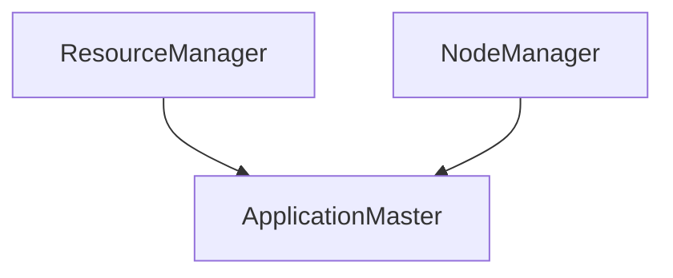

## 1. 背景介绍

在Hadoop 2.x版本中，引入了YARN（Yet Another Resource Negotiator）作为资源管理器，它将资源管理和任务调度分离开来，使得Hadoop可以支持更多的计算框架。而ApplicationMaster（AM）则是YARN中的一个重要组件，它负责管理一个应用程序的资源和任务调度。

## 2. 核心概念与联系

ApplicationMaster是YARN中的一个重要组件，它负责管理一个应用程序的资源和任务调度。在YARN中，每个应用程序都有一个对应的ApplicationMaster，它负责向ResourceManager申请资源，并将任务分配给NodeManager执行。ApplicationMaster与ResourceManager和NodeManager之间的关系如下图所示：



## 3. 核心算法原理具体操作步骤

ApplicationMaster的核心算法原理是资源管理和任务调度。它通过向ResourceManager申请资源，并将任务分配给NodeManager执行，来管理一个应用程序的资源和任务调度。

具体操作步骤如下：

1. ApplicationMaster向ResourceManager申请资源。
2. ResourceManager根据当前集群资源情况，决定是否分配资源给ApplicationMaster。
3. 如果ResourceManager分配资源给ApplicationMaster，则ApplicationMaster将任务分配给NodeManager执行。
4. NodeManager执行任务，并将执行结果返回给ApplicationMaster。
5. ApplicationMaster根据任务执行结果，决定是否需要重新分配任务或释放资源。

## 4. 数学模型和公式详细讲解举例说明

ApplicationMaster的算法原理并不涉及数学模型和公式。

## 5. 项目实践：代码实例和详细解释说明

下面是一个简单的ApplicationMaster代码示例：

```java
public class MyApplicationMaster {
    public static void main(String[] args) throws Exception {
        // 创建一个YarnClient实例
        YarnClient yarnClient = YarnClient.createYarnClient();
        // 初始化YarnClient
        yarnClient.init(new Configuration());
        // 启动YarnClient
        yarnClient.start();
        // 创建一个ApplicationSubmissionContext实例
        ApplicationSubmissionContext appContext = yarnClient.createApplication().getApplicationSubmissionContext();
        // 设置应用程序名称
        appContext.setApplicationName("My Application");
        // 设置ApplicationMaster的类名
        appContext.setApplicationMasterClassName(MyApplicationMaster.class.getName());
        // 设置ApplicationMaster需要的资源
        Resource capability = Resource.newInstance(1024, 1);
        appContext.setResource(capability);
        // 设置ApplicationMaster需要的命令
        List<String> commands = new ArrayList<String>();
        commands.add("java");
        commands.add("-Xmx1024m");
        commands.add(MyApplicationMaster.class.getName());
        appContext.setCommands(commands);
        // 提交应用程序
        yarnClient.submitApplication(appContext);
    }
}
```

上述代码中，我们创建了一个YarnClient实例，并初始化和启动它。然后，我们创建了一个ApplicationSubmissionContext实例，并设置应用程序名称、ApplicationMaster的类名、需要的资源和命令。最后，我们通过YarnClient提交应用程序。

## 6. 实际应用场景

ApplicationMaster可以应用于各种计算框架，如Hadoop、Spark、Flink等。它可以管理一个应用程序的资源和任务调度，使得应用程序可以更加高效地利用集群资源。

## 7. 工具和资源推荐

- Apache Hadoop官网：http://hadoop.apache.org/
- Apache Spark官网：http://spark.apache.org/
- Apache Flink官网：http://flink.apache.org/

## 8. 总结：未来发展趋势与挑战

随着大数据技术的不断发展，ApplicationMaster在资源管理和任务调度方面的作用越来越重要。未来，我们可以预见，ApplicationMaster将会更加智能化和自动化，能够更好地适应不同的应用场景和需求。

同时，随着大数据技术的不断发展，ApplicationMaster也面临着一些挑战，如如何更好地管理和调度大规模的任务、如何更好地适应不同的计算框架等。

## 9. 附录：常见问题与解答

暂无。

作者：禅与计算机程序设计艺术 / Zen and the Art of Computer Programming