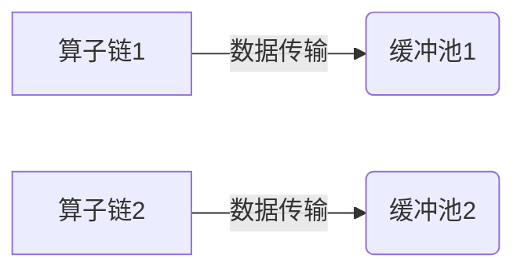

## 1.背景介绍

在大数据处理领域，Apache Flink作为一款开源的流处理框架，因其高效、准确、灵活的特性，逐渐受到了业界的广泛应用和认可。然而，要充分发挥Flink的性能，对其内部的内存管理机制有深入的理解是至关重要的。本文将重点介绍Flink的缓冲池内存管理机制，包括其原理、配置和监控方法。

## 2.核心概念与联系

在Flink中，缓冲池内存管理是数据传输和计算的关键。Flink的任务由多个算子组成，算子间的数据传输需要通过网络和磁盘IO，这就涉及到缓冲池的使用。缓冲池是Flink用于存储数据的内存区域，每个算子链都有自己的缓冲池。缓冲池的大小和配置直接影响了Flink任务的性能。



## 3.核心算法原理具体操作步骤

Flink的缓冲池内存管理主要包含以下几个步骤：

1. **初始化**：在任务启动时，Flink会根据配置文件中的参数，为每个算子链初始化一个缓冲池。
2. **写入**：算子链在处理数据时，会将数据写入到自己的缓冲池中。
3. **读取**：当算子链需要将数据发送到下游算子时，会从缓冲池中读取数据。
4. **回收**：当数据被成功发送到下游算子后，Flink会回收缓冲池中的数据，释放内存。


## 4.数学模型和公式详细讲解举例说明

在Flink中，缓冲池的大小是可以配置的，其配置参数为`taskmanager.network.memory.buffers-per-channel`和`taskmanager.network.memory.floating-buffers-per-gate`。缓冲池的总大小（T）可以通过以下公式计算：

$$
T = P \times (B + F)
$$

其中，P是并行度，B是每个通道的缓冲区数量，F是每个门的浮动缓冲区数量。通常，我们需要根据实际的数据量和并行度来合理设置这两个参数，以确保Flink任务的性能。

## 5.项目实践：代码实例和详细解释说明

以下是一个简单的Flink任务配置示例，展示了如何配置缓冲池的大小：

```java
Configuration config = new Configuration();
config.setString("taskmanager.network.memory.buffers-per-channel", "32");
config.setString("taskmanager.network.memory.floating-buffers-per-gate", "64");
StreamExecutionEnvironment env = StreamExecutionEnvironment.getExecutionEnvironment(config);
```

在这个示例中，我们为每个通道配置了32个缓冲区，为每个门配置了64个浮动缓冲区。这样，如果我们的任务的并行度为4，那么缓冲池的总大小就为：

$$
T = 4 \times (32 + 64) = 384
$$

## 6.实际应用场景

在实际的大数据处理场景中，如实时日志分析、实时推荐系统等，Flink的缓冲池内存管理机制起着至关重要的作用。通过合理配置和监控缓冲池，我们可以有效地提高Flink任务的性能，满足实时处理的需求。

## 7.工具和资源推荐

为了更好地配置和监控Flink的缓冲池，我们推荐以下工具和资源：

1. **Flink官方文档**：Flink的官方文档详细介绍了缓冲池的配置方法和原理，是学习和理解Flink内存管理的重要资源。
2. **Flink Web UI**：Flink的Web UI提供了任务的实时监控功能，包括缓冲池的使用情况，可以帮助我们在运行时发现和解决问题。

## 8.总结：未来发展趋势与挑战

随着大数据处理需求的增加，Flink的缓冲池内存管理将面临更大的挑战，例如如何提高内存利用率，如何应对大数据量的处理等。同时，Flink也在不断发展和优化其内存管理机制，以满足未来的需求。

## 9.附录：常见问题与解答

1. **Q: 如何配置Flink的缓冲池大小？**
   
   A: 可以通过`taskmanager.network.memory.buffers-per-channel`和`taskmanager.network.memory.floating-buffers-per-gate`两个参数来配置缓冲池的大小。

2. **Q: Flink的缓冲池满了会怎么样？**
   
   A: 当缓冲池满了，Flink会阻塞数据的写入，直到有空闲的缓冲区。

3. **Q: 如何监控Flink的缓冲池使用情况？**
   
   A: 可以通过Flink的Web UI来监控缓冲池的使用情况。

作者：禅与计算机程序设计艺术 / Zen and the Art of Computer Programming